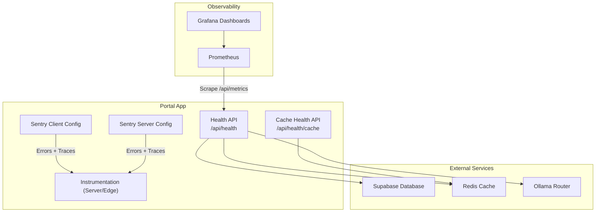
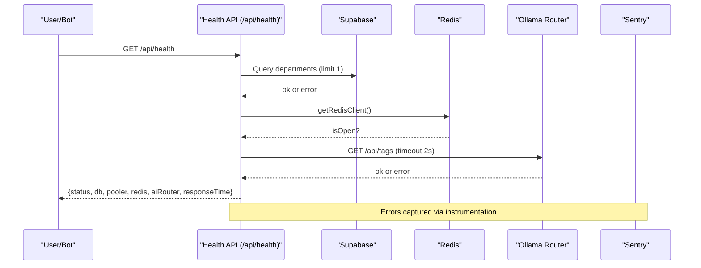
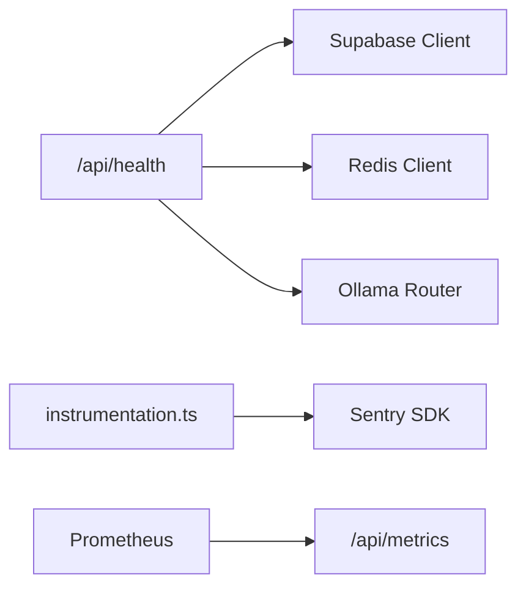
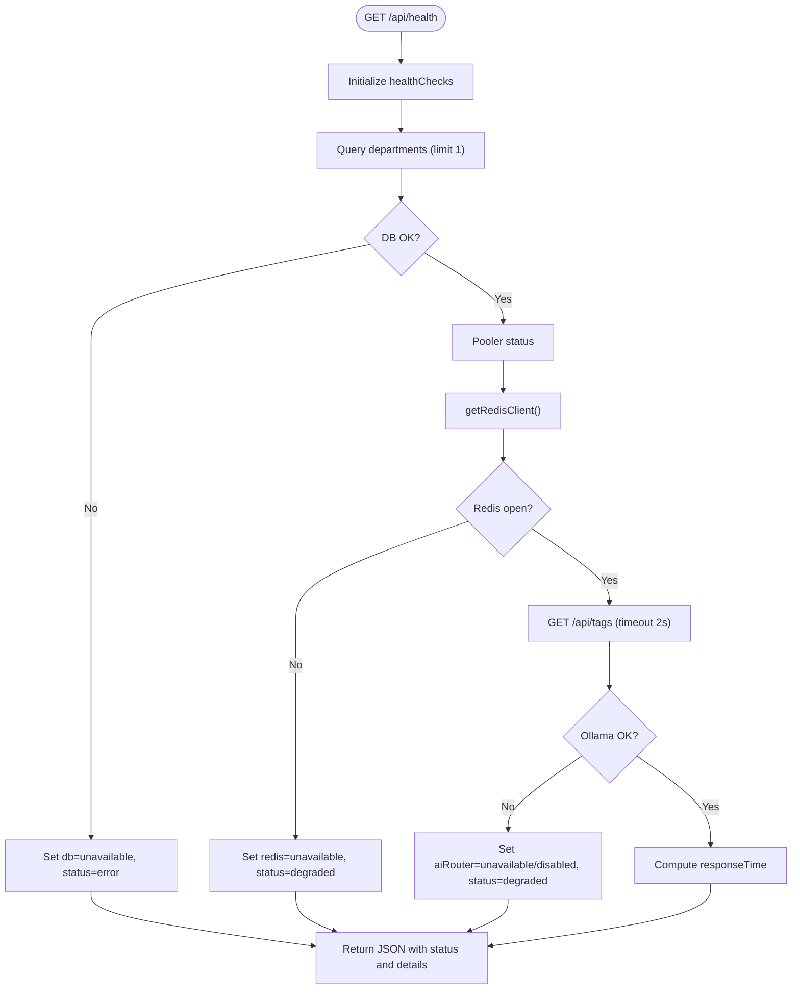

# Troubleshooting & FAQ

<cite>
**Referenced Files in This Document**
- [apps/portal/app/api/health/route.ts](file://apps/portal/app/api/health/route.ts)
- [apps/portal/app/api/health/cache/route.ts](file://apps/portal/app/api/health/cache/route.ts)
- [apps/portal/instrumentation.ts](file://apps/portal/instrumentation.ts)
- [apps/portal/sentry.client.config.ts](file://apps/portal/sentry.client.config.ts)
- [apps/portal/sentry.server.config.ts](file://apps/portal/sentry.server.config.ts)
- [config/logrotate.arch-systems](file://config/logrotate.arch-systems)
- [docs/runbooks/auth-unavailable.md](file://docs/runbooks/auth-unavailable.md)
- [docs/AMCA-RUNBOOK.md](file://docs/AMCA-RUNBOOK.md)
- [wiki/concepts/troubleshooting.md](file://wiki/concepts/troubleshooting.md)
- [wiki/concepts/incident-response.md](file://wiki/concepts/incident-response.md)
- [wiki/concepts/monitoring-error-tracking.md](file://wiki/concepts/monitoring-error-tracking.md)
- [wiki/error-migration-tracking.md](file://wiki/error-migration-tracking.md)
</cite>

## Table of Contents

1. Introduction
2. Project Structure
3. Core Components
4. Architecture Overview
5. Detailed Component Analysis
6. Dependency Analysis
7. Performance Considerations
8. Troubleshooting Guide
9. Conclusion
10. Appendices

## Introduction

This document provides comprehensive troubleshooting and FAQ guidance for the Arch-Systems portal, including systematic diagnosis strategies, log analysis techniques, performance profiling methods, runbooks for common operational scenarios, error resolution guides, escalation procedures, development environment issues, deployment problems, production troubleshooting, diagnostic tools usage, monitoring dashboard interpretation, alert response procedures, community resources, support channels, and contribution guidelines.

## Project Structure

The project is a Next.js-based portal with integrated observability (Sentry), health endpoints, Redis caching, Supabase database access, and Prometheus/Grafana dashboards. Operational documentation includes runbooks and an incident response playbook.

**Diagram sources**

- [apps/portal/app/api/health/route.ts:1-83](file://apps/portal/app/api/health/route.ts#L1-L83)
- [apps/portal/app/api/health/cache/route.ts:1-27](file://apps/portal/app/api/health/cache/route.ts#L1-L27)
- [apps/portal/instrumentation.ts:42-60](file://apps/portal/instrumentation.ts#L42-L60)
- [apps/portal/sentry.client.config.ts:1-23](file://apps/portal/sentry.client.config.ts#L1-L23)
- [apps/portal/sentry.server.config.ts:1-25](file://apps/portal/sentry.server.config.ts#L1-L25)
- [wiki/concepts/monitoring-error-tracking.md:189-229](file://wiki/concepts/monitoring-error-tracking.md#L189-L229)

**Section sources**

- [wiki/concepts/monitoring-error-tracking.md:1-84](file://wiki/concepts/monitoring-error-tracking.md#L1-L84)
- [wiki/concepts/monitoring-error-tracking.md:189-229](file://wiki/concepts/monitoring-error-tracking.md#L189-L229)

## Core Components

- Health Endpoints: Provide service readiness and dependency status for database, pooler, Redis, and AI router.
- Sentry Integration: Captures errors and traces across client, server, and edge runtimes with PII scrubbing.
- Logging and Rotation: Systemd-managed application logs rotated via logrotate with process reload signals.
- Runbooks and Incident Response: Playbooks for auth unavailability and AMCA operations; structured incident lifecycle.

Key responsibilities:

- Health checks expose actionable status to orchestrators and monitoring systems.
- Sentry centralizes error tracking and debugging context.
- Log rotation ensures disk hygiene and consistent log handling.
- Runbooks standardize operational responses.

**Section sources**

- [apps/portal/app/api/health/route.ts:1-83](file://apps/portal/app/api/health/route.ts#L1-L83)
- [apps/portal/app/api/health/cache/route.ts:1-27](file://apps/portal/app/api/health/cache/route.ts#L1-L27)
- [apps/portal/instrumentation.ts:42-60](file://apps/portal/instrumentation.ts#L42-L60)
- [apps/portal/sentry.client.config.ts:1-23](file://apps/portal/sentry.client.config.ts#L1-L23)
- [apps/portal/sentry.server.config.ts:1-25](file://apps/portal/sentry.server.config.ts#L1-L25)
- [config/logrotate.arch-systems:1-17](file://config/logrotate.arch-systems#L1-L17)
- [docs/runbooks/auth-unavailable.md:1-41](file://docs/runbooks/auth-unavailable.md#L1-L41)
- [docs/AMCA-RUNBOOK.md:1-40](file://docs/AMCA-RUNBOOK.md#L1-L40)
- [wiki/concepts/incident-response.md:1-298](file://wiki/concepts/incident-response.md#L1-L298)

## Architecture Overview

The portal exposes health endpoints that probe downstream dependencies and report aggregated status. Observability is implemented via Sentry for error tracking and Prometheus/Grafana for metrics and dashboards. Logs are managed by logrotate with process reload signals.

**Diagram sources**

- [apps/portal/app/api/health/route.ts:1-83](file://apps/portal/app/api/health/route.ts#L1-L83)
- [apps/portal/instrumentation.ts:42-60](file://apps/portal/instrumentation.ts#L42-L60)

## Detailed Component Analysis

### Health Endpoint Diagnostics

- Purpose: Validate core services and return a composite status.
- Behavior:
  - Database: Attempts a minimal query; marks unavailable if relation errors occur.
  - Pooler: Reports disabled if no pooler URL configured.
  - Redis: Checks client open state; degrades if not connected.
  - AI Router: Probes Ollama with timeout; marks unavailable/disabled based on config.
  - Status: Returns 503 when critical failures exist; otherwise 200.

Operational tips:

- Use /api/health for liveness/readiness probes.
- Use /api/health/cache for cache hit rate and Redis connectivity.

**Section sources**

- [apps/portal/app/api/health/route.ts:1-83](file://apps/portal/app/api/health/route.ts#L1-L83)
- [apps/portal/app/api/health/cache/route.ts:1-27](file://apps/portal/app/api/health/cache/route.ts#L1-L27)

### Error Tracking and Privacy Controls

- Client-side Sentry filters sensitive strings from exception values.
- Server-side Sentry redacts specific headers (authorization, cookie, internal secrets).
- Instrumentation initializes Sentry for Node and Edge runtimes with sampling rates appropriate to environment.

Best practices:

- Ensure DSN and environment variables are set per runtime.
- Keep sample rates low in production to reduce noise.
- Review beforeSend hooks to avoid leaking PII.

**Section sources**

- [apps/portal/sentry.client.config.ts:1-23](file://apps/portal/sentry.client.config.ts#L1-L23)
- [apps/portal/sentry.server.config.ts:1-25](file://apps/portal/sentry.server.config.ts#L1-L25)
- [apps/portal/instrumentation.ts:42-60](file://apps/portal/instrumentation.ts#L42-L60)

### Logging and Log Rotation

- Log files are rotated daily with retention and compression.
- After rotation, the process receives USR1 to reopen file handles.

Operational notes:

- Verify systemd service name matches your deployment.
- Confirm log paths match your deployment layout.

**Section sources**

- [config/logrotate.arch-systems:1-17](file://config/logrotate.arch-systems#L1-L17)

### Auth Unavailability Runbook

- Quick checks include Sentry spikes, Redis/Supabase health, and middleware logs.
- Immediate mitigations: fail-open read-only where possible, flush stale keys, rollback recent releases.
- Browser-side guidance: hard-refresh, clear cache, unregister service workers after deploy.
- Root-cause analysis: correlate with release tags, check package exports causing Turbopack instantiation errors, verify Cache-Control and PWA strategy.
- Post-incident: add alerts and automated smoke tests.

**Section sources**

- [docs/runbooks/auth-unavailable.md:1-41](file://docs/runbooks/auth-unavailable.md#L1-L41)

### AMCA Production Runbook

- Rebuild corrupt namespaces using policy-engine heal endpoint.
- Manual rollback via CI script.
- Scale L1 nodes manually if needed.
- Troubleshoot miss rate spikes and out-of-memory conditions.

**Section sources**

- [docs/AMCA-RUNBOOK.md:1-40](file://docs/AMCA-RUNBOOK.md#L1-L40)

### Incident Response Playbook

- Severity levels and response times.
- Lifecycle: Detect, Respond, Assess, Mitigate, Resolve, Post-Incident.
- Common incidents: portal down, database connection issues, AI service down, real-time updates broken.
- Emergency contacts and quick fixes.

**Section sources**

- [wiki/concepts/incident-response.md:1-298](file://wiki/concepts/incident-response.md#L1-L298)

### Monitoring and Error Tracking

- Sentry initialization across client/server/edge with environment-specific settings.
- Prometheus scrape targets for portal, Redis, and PostgreSQL exporters.
- Key metrics tracked include HTTP latency, AI provider stats, DB query duration, and WebSocket connections.
- Grafana dashboards available at local port for overview, AI service, database, and Redis.

**Section sources**

- [wiki/concepts/monitoring-error-tracking.md:1-84](file://wiki/concepts/monitoring-error-tracking.md#L1-L84)
- [wiki/concepts/monitoring-error-tracking.md:189-229](file://wiki/concepts/monitoring-error-tracking.md#L189-L229)

### Error Migration Strategy

- Migrate generic throws to domain-specific error classes from @repo/errors.
- Prioritized completion matrix tracks progress and remaining items.
- Testing patterns validate error types, codes, and context fields.

**Section sources**

- [wiki/error-migration-tracking.md:1-372](file://wiki/error-migration-tracking.md#L1-372)

## Dependency Analysis

The health endpoint depends on Supabase client, Redis client, and optional Ollama router. Sentry integration spans multiple runtimes and is initialized via instrumentation. Prometheus scrapes metrics exposed by the portal.

**Diagram sources**

- [apps/portal/app/api/health/route.ts:1-83](file://apps/portal/app/api/health/route.ts#L1-L83)
- [apps/portal/instrumentation.ts:42-60](file://apps/portal/instrumentation.ts#L42-L60)
- [wiki/concepts/monitoring-error-tracking.md:189-229](file://wiki/concepts/monitoring-error-tracking.md#L189-L229)

**Section sources**

- [apps/portal/app/api/health/route.ts:1-83](file://apps/portal/app/api/health/route.ts#L1-L83)
- [apps/portal/instrumentation.ts:42-60](file://apps/portal/instrumentation.ts#L42-L60)
- [wiki/concepts/monitoring-error-tracking.md:189-229](file://wiki/concepts/monitoring-error-tracking.md#L189-L229)

## Performance Considerations

- Health endpoint timeouts: The AI router probe uses a short timeout to prevent blocking health checks.
- Metrics sampling: Sentry tracing sample rate is reduced in production to minimize overhead.
- Cache hit rate: Monitor /api/health/cache for Redis effectiveness; low hit rates may indicate cache misses or key churn.
- Database queries: Use slow query metrics and connection pool utilization to identify bottlenecks.

[No sources needed since this section provides general guidance]

## Troubleshooting Guide

### Development Environment Issues

- React version conflicts between apps: Avoid cross-app imports; use shared UI packages.
- Tailwind CSS violations: Follow design system rules; run lint to catch disallowed classes.
- Supabase RLS returns empty results: Verify user department mapping and accessible departments; test with service role only for debugging.
- Middleware auth loops: Clear proxy cache, verify employee roles, ensure triggers exist.
- Migration sync failures: Edit migrations in source directory; reset and redeploy locally.
- Univer CSS import issues: Import once in component; avoid global imports.
- Build failures: Clean build artifacts; build shared packages before app.
- External tools offline: Check tool status endpoints and Docker containers; verify environment variables.
- AI service failures: Validate API keys and provider status pages; confirm failover behavior.
- Playwright E2E failures: Ensure dev server and Supabase are running and seeded.

For detailed steps and commands, see the troubleshooting guide.

**Section sources**

- [wiki/concepts/troubleshooting.md:1-326](file://wiki/concepts/troubleshooting.md#L1-L326)

### Deployment Problems

- Health endpoint misconfiguration: Verify environment variables for pooler and Ollama URLs.
- Sentry not reporting: Ensure DSN and environment variables are set per runtime; review beforeSend filters.
- Log rotation issues: Confirm log paths and systemd service names; send USR1 to reopen handles.

**Section sources**

- [apps/portal/app/api/health/route.ts:1-83](file://apps/portal/app/api/health/route.ts#L1-L83)
- [apps/portal/sentry.client.config.ts:1-23](file://apps/portal/sentry.client.config.ts#L1-L23)
- [apps/portal/sentry.server.config.ts:1-25](file://apps/portal/sentry.server.config.ts#L1-L25)
- [config/logrotate.arch-systems:1-17](file://config/logrotate.arch-systems#L1-L17)

### Production Troubleshooting

- Use health endpoints to triage service status.
- Inspect Sentry for error spikes and trace context.
- Review Prometheus metrics and Grafana dashboards for anomalies.
- Follow incident response playbook for severity classification and mitigation steps.

**Section sources**

- [apps/portal/app/api/health/route.ts:1-83](file://apps/portal/app/api/health/route.ts#L1-L83)
- [wiki/concepts/monitoring-error-tracking.md:189-229](file://wiki/concepts/monitoring-error-tracking.md#L189-L229)
- [wiki/concepts/incident-response.md:1-298](file://wiki/concepts/incident-response.md#L1-L298)

### Diagnostic Tools Usage

- Health checks:
  - GET /api/health: Overall service health and dependency status.
  - GET /api/health/cache: Cache statistics and Redis connectivity.
- Sentry:
  - Client and server configs define DSN, environment, and privacy filters.
  - Instrumentation initializes Sentry for Node and Edge runtimes.
- Prometheus/Grafana:
  - Scrape targets include portal, Redis exporter, and PostgreSQL exporter.
  - Dashboards provide overview, AI service, database, and Redis insights.

**Section sources**

- [apps/portal/app/api/health/route.ts:1-83](file://apps/portal/app/api/health/route.ts#L1-L83)
- [apps/portal/app/api/health/cache/route.ts:1-27](file://apps/portal/app/api/health/cache/route.ts#L1-L27)
- [apps/portal/sentry.client.config.ts:1-23](file://apps/portal/sentry.client.config.ts#L1-L23)
- [apps/portal/sentry.server.config.ts:1-25](file://apps/portal/sentry.server.config.ts#L1-L25)
- [apps/portal/instrumentation.ts:42-60](file://apps/portal/instrumentation.ts#L42-L60)
- [wiki/concepts/monitoring-error-tracking.md:189-229](file://wiki/concepts/monitoring-error-tracking.md#L189-L229)

### Monitoring Dashboard Interpretation

- Portal Overview: Request rates, error rates, response time percentiles.
- AI Service: Provider usage, failover frequency, cache hit rate.
- Database: Query latency, connection pool usage, slow queries.
- Redis: Hit rate, memory usage, evictions.

**Section sources**

- [wiki/concepts/monitoring-error-tracking.md:189-229](file://wiki/concepts/monitoring-error-tracking.md#L189-L229)

### Alert Response Procedures

- High error rate, slow API response, AI provider failover, DB slow queries, and Redis cache miss thresholds are defined.
- On detection, follow incident response playbook: acknowledge, assess, mitigate, resolve, post-incident.

**Section sources**

- [wiki/concepts/monitoring-error-tracking.md:231-243](file://wiki/concepts/monitoring-error-tracking.md#L231-L243)
- [wiki/concepts/incident-response.md:1-298](file://wiki/concepts/incident-response.md#L1-L298)

### Community Resources and Support Channels

- Refer to the incident response playbook for communication channels and emergency contacts.
- Use runbooks for standardized operational procedures.

**Section sources**

- [wiki/concepts/incident-response.md:1-298](file://wiki/concepts/incident-response.md#L1-L298)
- [docs/runbooks/auth-unavailable.md:1-41](file://docs/runbooks/auth-unavailable.md#L1-L41)
- [docs/AMCA-RUNBOOK.md:1-40](file://docs/AMCA-RUNBOOK.md#L1-L40)

### Contribution Guidelines for Documentation

- Update runbooks and playbooks when new incidents or procedures emerge.
- Maintain alignment with monitoring configurations and health endpoints.
- Ensure error migration tracking remains current as code evolves.

**Section sources**

- [wiki/error-migration-tracking.md:1-372](file://wiki/error-migration-tracking.md#L1-372)
- [docs/runbooks/auth-unavailable.md:1-41](file://docs/runbooks/auth-unavailable.md#L1-L41)
- [docs/AMCA-RUNBOOK.md:1-40](file://docs/AMCA-RUNBOOK.md#L1-L40)

## Conclusion

This troubleshooting and FAQ document consolidates operational knowledge for diagnosing and resolving issues across development, deployment, and production environments. It leverages health endpoints, Sentry, Prometheus/Grafana, and structured runbooks to streamline incident response and continuous improvement.

[No sources needed since this section summarizes without analyzing specific files]

## Appendices

### Health Endpoint Flowchart

**Diagram sources**

- [apps/portal/app/api/health/route.ts:1-83](file://apps/portal/app/api/health/route.ts#L1-L83)
