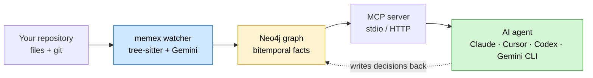
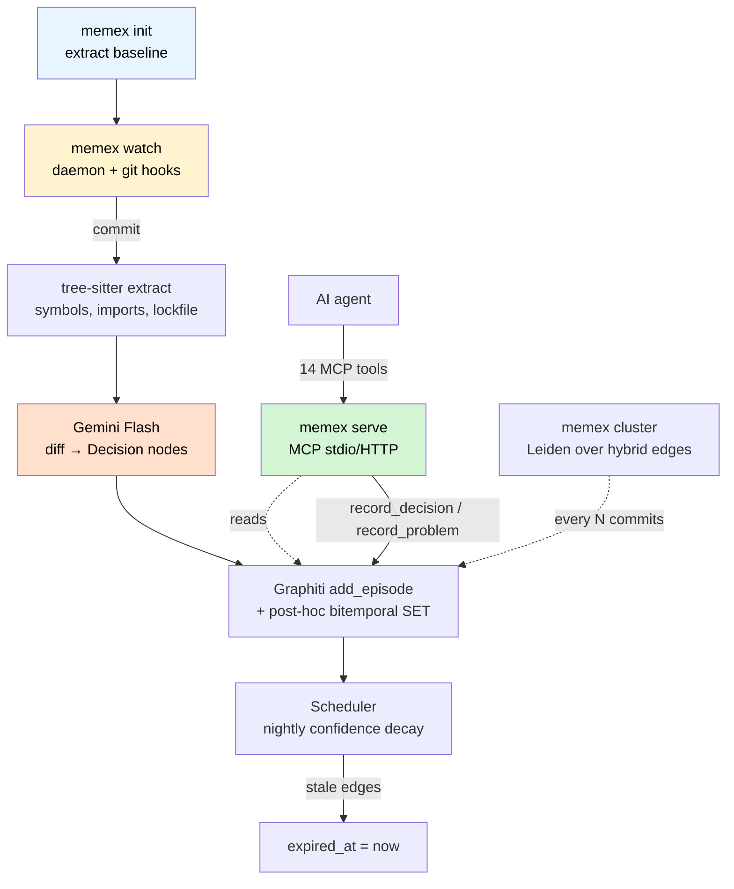
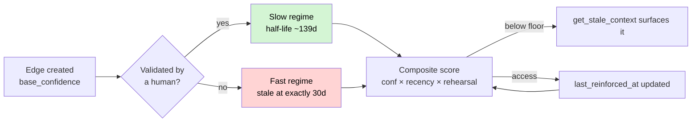

# memex — temporal knowledge graph memory for AI coding agents

<!-- mcp-name: io.github.stifler7/memex -->

> Persistent memory and codebase context for AI coding agents, served over MCP. A bitemporal knowledge graph of your repository — modules, symbols, decisions, problems — for Claude Code, Cursor, Codex, Gemini CLI, and any MCP-compatible agent.

A daemon and MCP server that turns every commit and every file change into structured graph state: modules, symbols, decisions, problems, lockfile facts. Sessions stop starting blind. Agents stop re-discovering the same refactor every time you `/clear`.

[](https://pypi.org/project/memex-mcp/)
[](https://pypistats.org/packages/memex-mcp)
[](https://www.npmjs.com/package/stifler-memex-mcp)
[](https://www.npmjs.com/package/stifler-memex-mcp)
[](https://github.com/STiFLeR7/claude-plugins)
[](https://github.com/STiFLeR7/memex/stargazers)
[](https://github.com/STiFLeR7/memex/actions)
[](LICENSE)




## Install

### Via Claude Code marketplace

```
/plugin marketplace add STiFLeR7/claude-plugins
/plugin install memex-mcp@stifler-marketplace
```

Restart your Claude Code session.

### Manual

```bash
docker compose -f docker/docker-compose.yml up -d
cat > .env <<EOF
NEO4J_URI=bolt://localhost:7687
NEO4J_USER=neo4j
NEO4J_PASSWORD=memex-local
GEMINI_API_KEY=your-key-here
EOF
npx stifler-memex-mcp init --repo .
npx stifler-memex-mcp watch --repo .
npx stifler-memex-mcp serve --repo .
```

| Channel | Command |
|---|---|
| Claude Code marketplace | `/plugin install memex-mcp@stifler-marketplace` |
| npx (no install) | `npx stifler-memex-mcp <cmd>` |
| uv | `uv add memex-mcp` |
| pip | `pip install memex-mcp` |
| source | `git clone github.com/STiFLeR7/memex && uv sync` |

## At a glance

| Property | Value |
|---|---|
| Output | A Neo4j graph populated continuously from your repo |
| Storage | Neo4j via [Graphiti](https://github.com/getzep/graphiti). Bitemporal — every edge has `created_at` and optional `expired_at` |
| Survives | `/clear`, terminal crashes, machine restarts, teammate handoffs |
| Hands off to | Claude Code, Cursor, Codex, Gemini CLI, any MCP client |
| Granularity | Scales from 50 to 5000+ modules via hierarchical Leiden clusters |
| Synthesis | Gemini Flash distills commits into `Decision` nodes; Pro for grounded synthesis |
| Confidence | Computed at query time. Two-regime decay (validated half-life ~139d, unvalidated stale at 30d) |
| Write governance | Per-node-type ACL, intent-confirmation on agent writes, explicit `corroborates` / `supersedes` semantics |
| Tests | 333 passing, ~93% coverage |

## The lifecycle



## MCP tools

14 tools — eight read, four write, two analytic.

### Read

| Tool | When |
|---|---|
| `get_project_context` | Session start. Returns a cluster-level briefing under 1500 tokens regardless of repo size |
| `get_symbol_context` | Before editing a function or class. Returns callers, callees, linked decisions |
| `get_recent_decisions` | Last N days of architectural decisions, optionally module-scoped |
| `get_open_problems` | Active bugs and tech debt, sorted by severity |
| `search_context` | Hybrid search: semantic × keyword × graph traversal × RRF merge |
| `get_stale_context` | Edges whose composite confidence dropped below threshold |
| `explain_change` | Given a commit SHA, cross-references the diff with linked Decision/Problem nodes and asks Gemini Pro for a grounded explanation |
| `predict_impact` | Given a file path, returns a ranked list of modules likely affected based on graph coupling (no LLM call) |

### Write

| Tool | When |
|---|---|
| `record_decision` | After making a technical choice. Supports `corroborates` (reinforce) and `supersedes` (replace) |
| `record_problem` | When discovering a bug or piece of tech debt |
| `resolve_problem` | When a tracked problem is fixed |
| `invalidate_edge` | When a stored fact is no longer true |

## Bitemporal confidence

Confidence is **not** a stored number that mutates. It is computed at query time from `base_confidence`, validation status, time since last reinforcement, and access count.



| Property | Value |
|---|---|
| Validated half-life | ~139 days |
| Unvalidated stale threshold | 30 days (composite < 0.3) |
| Recency τ | 90 days (exponential decay) |
| Composite formula | `conf × recency × (1 + rehearsal_w × log(1 + access_count))` |
| Conflict similarity threshold | 0.4 (below this + overlapping validity = conflict) |
| Intent-confirmation threshold | 0.85 (MCP write similarity check) |

## Hierarchical clusters

`memex cluster` runs hierarchical Leiden over a hybrid edge graph:

| Edge type | Weight |
|---|---|
| Directory co-location | 1.0 |
| Module imports | 2.0 |
| Symbol calls | `log(1 + calls)` |

| Property | Value |
|---|---|
| Algorithm | `graspologic.partition.hierarchical_leiden` with fixed seed |
| Naming | TF-IDF top-3 over module docstrings + symbol names, parent-dir fallback |
| ID pinning | Jaccard ≥ 0.5 across reruns (cluster names stay stable through renames) |
| User overrides | `.memex/clusters.yaml` — any assignment can be locked |
| Context budget | `get_project_context` stays under 1500 tokens whether your repo has 50 or 5000 modules |

## Measure Your Savings

memex tracks token reduction metrics and human review actions locally in a SQLite database (`~/.config/memex/telemetry.db`). 

You can query your savings at any time using the CLI:
```bash
memex stats
```

Or view the raw JSON payload:
```bash
memex stats --json
```

Or target a specific repository scope:
```bash
memex stats --repo /path/to/repo
```

This returns an aggregation of:
- **Period Summaries**: Calls, tokens returned, naive tokens (size of files requested), tokens saved, and token reduction percentage across `today`, `last 7 days`, `last 30 days`, and `lifetime`.
- **Top Tools**: The most valuable tools sorted by total tokens saved.
- **Agent Clients**: Active agents (Claude Code, Gemini CLI, Cursor, Codex) and their token saving distribution.
- **Validation Health**: Total validated, unvalidated, and corroborated nodes, along with the elapsed days since the last review.

The same statistics are exposed via the HTTP MCP transport:
```http
GET /stats?repo=/path/to/repo
Authorization: Bearer <your-key>
```

## Connect your agent

<details>
<summary><b>Claude Code</b></summary>

Marketplace install above does this for you. Manual wiring in `.claude/settings.json`:

```json
{
  "mcpServers": {
    "memex": {
      "type": "stdio",
      "command": "npx",
      "args": ["-y", "stifler-memex-mcp", "serve", "--repo", "."]
    }
  }
}
```
</details>

<details>
<summary><b>Cursor</b></summary>

Add to `~/.cursor/mcp.json`:

```json
{
  "mcpServers": {
    "memex": {
      "command": "npx",
      "args": ["-y", "stifler-memex-mcp", "serve", "--repo", "."]
    }
  }
}
```
</details>

<details>
<summary><b>Gemini CLI</b></summary>

Add to `~/.gemini/settings.json`:

```json
{
  "mcpServers": {
    "memex": {
      "command": "npx",
      "args": ["-y", "stifler-memex-mcp", "serve", "--repo", "."]
    }
  }
}
```
</details>

<details>
<summary><b>Codex</b></summary>

Add to `~/.codex/config.toml`:

```toml
[mcp_servers.memex]
command = "npx"
args = ["-y", "stifler-memex-mcp", "serve", "--repo", "."]
```
</details>

<details>
<summary><b>Anthropic memory tool (memory_20250818)</b></summary>

memex can back Claude's native memory tool — agents read from a per-session graph projection plus a writable scratch zone.

```bash
memex memory-tool serve --repo .                     # in-process
memex memory-tool serve --repo . --transport http    # FastAPI on :7464
```

```python
from memex.memory_tool import MemexAsyncMemoryTool
memory_tool = MemexAsyncMemoryTool(repo_root=".")
client.beta.messages.run_tools(..., tools=[memory_tool])
```
</details>

## Operating principles

| # | Principle | The bet |
|---|---|---|
| 1 | Bitemporal, never destructive | Edges are expired, not deleted. `WHERE r.expired_at IS NULL` filters live state |
| 2 | Confidence is computed, not stored | Mutating a number invites silent drift. Recompute every read |
| 3 | Two regimes for decay | Validated facts decay slowly; unvalidated facts must earn their place by being accessed |
| 4 | Human in the loop | `memex review` queues lowest-confidence Decision nodes for explicit validation |
| 5 | Write governance | Per-node-type ACL. `Decision.policy = open`, `Module.policy = locked`. Intent-confirmation on similar-content writes |
| 6 | Tokens are budgeted | `get_project_context` stays under 1500 tokens at any repo size via Leiden clusters |
| 7 | Synthesis only on commits | The watcher batches by debounce window. Gemini Flash is not in the hot path of a tool call |
| 8 | Pro for synthesis, Flash for extraction | `explain_change` uses Pro because grounding matters. Everything else uses Flash |
| 9 | Multi-repo aware | One watcher + one MCP server can manage hundreds of repos. `--repo` switches scope |
| 10 | Local-first | Neo4j runs in your Docker. Gemini is the only outbound call, and only on commits |

## When to use memex

| Use it when | Skip it when |
|---|---|
| Multi-week or multi-month project | One-shot script, throwaway prototype |
| You work across multiple agents (Claude, Cursor, Codex) and want shared context | You only ever pair with one agent on one task |
| Architectural decisions are made over time and need to be remembered | The whole project fits in a single 200k-token context window |
| You want to query "what did we decide about X" from any session | Your repo is already small enough to paste into the prompt |
| Multiple developers using AI agents on the same codebase | Solo work where you never `/clear` |

## Project structure

```
memex/
├── memex/
│   ├── extractor/        tree-sitter + lockfile parsers
│   ├── graph/            Neo4j writes, confidence, archive, cluster engine
│   ├── synthesizer/      Gemini Flash → Decision nodes
│   ├── mcp_server/       14 MCP tools (read + write + analytic)
│   ├── memory_tool/      Anthropic memory_20250818 adapter
│   ├── watcher/          daemon + git hooks
│   └── cli.py            init / watch / serve / review / graph / cluster
├── tests/                333 passing, ~93% coverage
├── docker/               Neo4j compose
├── npm/                  npx wrapper (publishes as stifler-memex-mcp)
└── Dockerfile            introspection-only image for MCP directory sandboxes
```

## Commands

| Command | What it does |
|---|---|
| `memex init` | Extract baseline graph state, run first cluster pass |
| `memex watch` | Daemon that listens for file + git events and writes to Neo4j |
| `memex serve` | Run the MCP server (stdio, HTTP, or both) |
| `memex review` | TUI that walks lowest-confidence decisions for human validation |
| `memex graph --output graph.html` | Self-contained D3 force layout with cluster overlays |
| `memex cluster [--rerun] [--dry-run]` | Run Leiden over the hybrid edge graph; pin cluster IDs by Jaccard ≥ 0.5 |
| `memex memory-tool serve` | Back Anthropic's `memory_20250818` tool with a graph projection |
| `memex stats [--json] [--repo <path>]` | Show context token savings and telemetry stats |

## License

MIT. See [LICENSE](./LICENSE).

## Author

Hill Patel ([@STiFLeR7](https://github.com/STiFLeR7))

## Core Contributors & Maintainers

- Hill Patel ([@STiFLeR7](https://github.com/STiFLeR7)) — architect, maintainer
- Nirvaan Lagishetty ([@Nirvaan05](https://github.com/Nirvaan05)) — lead contributor, maintainer

## Contributing

Open an issue or PR. `uv sync --all-extras && uv run pytest tests/` is all the setup you need to run the suite. Version bumps must update **both** `pyproject.toml` and `npm/package.json` and they must agree.

> *Vannevar Bush, 1945:* "Consider a future device for individual use, which is a sort of mechanized private file and library. It needs a name, and to coin one at random, **memex** will do."
