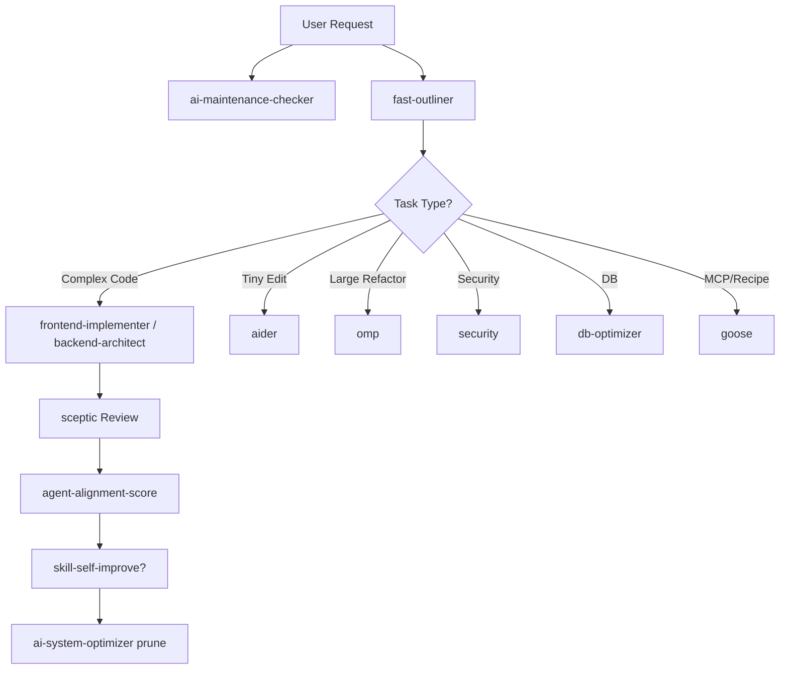

# Orchestrator Patterns — Detail (load on demand)

Canonical always-on summary: `.cursor/rules/10-orchestrator-patterns.mdc`.

## Agentic model router

| Task Complexity                                  | Recommended Model                          | Why                                 |
| ------------------------------------------------ | ------------------------------------------ | ----------------------------------- |
| Complex coding, multi-step agentic, architecture | Claude / Opus-class (OpenRouter/Anthropic) | Long-horizon, instruction following |
| Generalist daily work, chat                      | GPT-class generalist                       | Reliable tool use                   |
| High-volume, cheap, fast                         | Gemini Flash-class                         | Price-performance                   |
| Heavy reasoning, huge context                    | Gemini Pro-class                           | Large context windows               |
| Budget/private, open-weight                      | DeepSeek-class                             | Cost / privacy                      |
| Rapid code gen, simple audits                    | Groq / Cerebras free tier                  | Latency + zero cost                 |

Routing order: complex coding → generalist chat → high-volume cheap → deep analysis → budget/private → free fast.

Live provider status: `pnpm provider:route --check` (skill: `provider-router`).

## Token caching

**Stable prefix (cached):** system instructions, tool defs, `AGENTS.md`, MCP schemas, skill catalogs.  
**Dynamic suffix (not cached):** task context, history, file contents, tool results.

**Cache killers:** timestamps/request IDs at prompt start; reordering stable prefix; per-request metadata before system instructions.

**Semantic cache candidates:** `pnpm provider:route --check`, `pnpm agency:run` analyze, `pnpm mcp:status`, structurally similar gap reports.

**MCP tool order:** stable-first in `.cursor/mcp-servers.json` (filesystem/memory/serena before network servers).

## Self-learning loop

1. Log tool/model/error usage
2. After 3+ pattern repeats → refine via `skill-self-improve`
3. Version skills under `.cursor/skills/<name>/`
4. `ai-system-optimizer` prunes zero-usage skills (30+ days)

## Fleet command chain

## Sources

- Anthropic orchestrator-worker pattern
- MCP tool-definition stability for KV cache reuse
- Project routing: `04-subagent-auto-routing.mdc`
