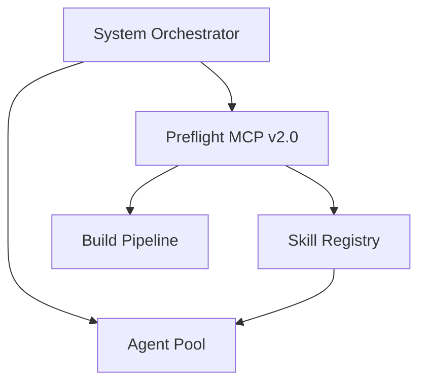

# System Orchestrator Agent

Orchestrates the Arch-Mk2 AI ecosystem. Responsible for:

1. **MPC Build Coordination**: Runs `mpc_full_quality_gate` on PRs and commits
2. **Skill Graph Mapping**: Uses `mpc_dependency_graph` to visualize skill interdependencies
3. **Integrity Checks**: Runs `mpc_checksum_verify` on `.agentic-tools-mcp/memories/` and skills
4. **Performance Tuning**: Uses FFT analysis to optimize parallel build concurrency
5. **Agent Lifecycle**: Spawns and monitors sub-agents for specialized tasks

## Integration

## Usage

Invoke via MCP tool `system_orchestrate` with one of:

- `"action": "quality-gate"` - Run full quality pipeline
- `"action": "analyze-dependencies"` - Parse skill dependency graph
- `"action": "verify-integrity"` - Checksum verification across workspace
- `"action": "optimize-build"` - Collect timing data and run FFT analysis
