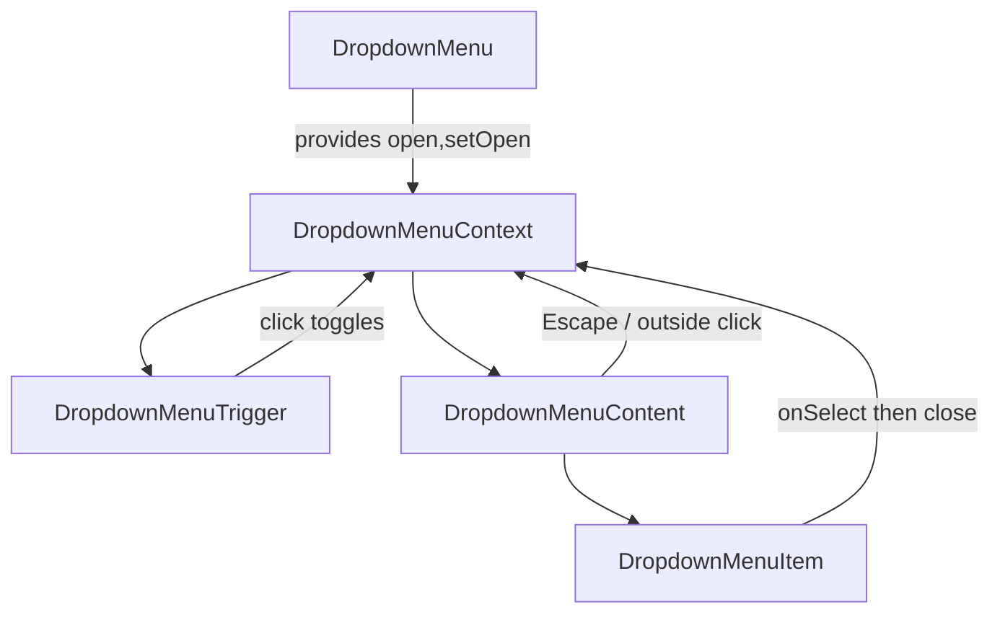

# Compact System Dropdown — Design

## Files changed

- [`packages/ui/src/components/ui/dropdown-menu.tsx`](../../../packages/ui/src/components/ui/dropdown-menu.tsx) — add controlled open/close, context, keyboard/outside-click handling.
- [`apps/portal/src/components/nav/ServicesDropdown.tsx`](../../../apps/portal/src/components/nav/ServicesDropdown.tsx) — compact rectangular grid redesign.
- [`apps/portal/src/components/nav/ServicesDropdown.test.tsx`](../../../apps/portal/src/components/nav/ServicesDropdown.test.tsx) — test against the real primitive.

All are client components; no server/client boundary change. No new env vars. No new packages.

## Primitive architecture

Introduce a small React context to share `open` + `setOpen` between `DropdownMenu`, `DropdownMenuTrigger`, and `DropdownMenuContent`.

- `DropdownMenu({ children, open, onOpenChange })`: supports controlled (`open` provided) and uncontrolled (internal state) usage. Wraps children in a `relative inline-block` container and provides context `{ open, setOpen }` where `setOpen` calls `onOpenChange` when controlled.
- `DropdownMenuTrigger({ children, asChild })`: attaches an `onClick` that toggles `open`. With `asChild`, clones the child to inject `onClick` (merging any existing handler); otherwise wraps in a `<button>`. Does not overwrite the child's `aria-expanded` already set by the caller.
- `DropdownMenuContent({ children, className, align, sideOffset })`: returns `null` when closed. When open, renders an absolutely-positioned container with `role="menu"`, honoring `align="end"` (right-aligned) and `sideOffset` (top margin). Registers `keydown` (Escape) and `mousedown` (outside click) listeners that close via context; cleans them up on unmount/close.
- `DropdownMenuItem({ children, onSelect, className, asChild })`: on click, calls `onSelect` then closes the menu. `asChild` clones child injecting a merged `onClick`.
- `DropdownMenuSeparator({ className })`: thin rule, accepts `className`.
- `DropdownMenuSub`/`SubTrigger`/`SubContent`/`Portal`: retained as passthrough wrappers (the redesign no longer relies on flyout submenus, but exports stay to avoid breaking the API and other importers).

Accepted-but-unused props (`align`, `sideOffset`, `asChild` where not applicable) are destructured so they never leak to the DOM.

## ServicesDropdown layout

Single compact panel, `w-80`, `rounded-lg`, dark-mode-aware surface, `role="menu"` on content:

1. Status grid — `grid grid-cols-2 gap-2 p-2`:
   - Weather card (icon, temp, description)
   - Shift card (sun/moon, label, hours remaining)
   - Wind/visibility card (`col-span-2`)
   - Safety alerts card (`col-span-2`, count + severity badge)
2. Quick actions — `grid grid-cols-2 gap-1.5 p-2` of uniform action tiles (semantic `<button>` / `<a>`): Reload, Toggle Fullscreen, Daily Safety Log, Safety Dashboard, Emergency Line (spans 2, red accent).
3. Footer — compact list of power actions with aligned icon + label + right-aligned shortcut: Lock Screen, Sleep, Log Out (form submit), Restart, Shut Down (red accent).

Overlays (lock/sleep/shutdown) and the weather/safety/shift hooks are unchanged. Alt+S continues to toggle `open`. Nested `DropdownMenuSub*` usages are removed in favor of flat action tiles.

## Accessibility

- Trigger keeps `aria-haspopup="menu"`, `aria-expanded`.
- Content has `role="menu"`; actions are focusable buttons/links with `focus-visible:ring`.
- Escape and outside-click close the menu and return focus to the trigger where feasible.

## Verification

- Jest: `ServicesDropdown.test.tsx` against the real primitive.
- Scoped lint + type-check for `@repo/ui` and `portal`.
- Runtime visual check at desktop and narrow widths if the portal is running.
- `pnpm quality` and alignment score.
