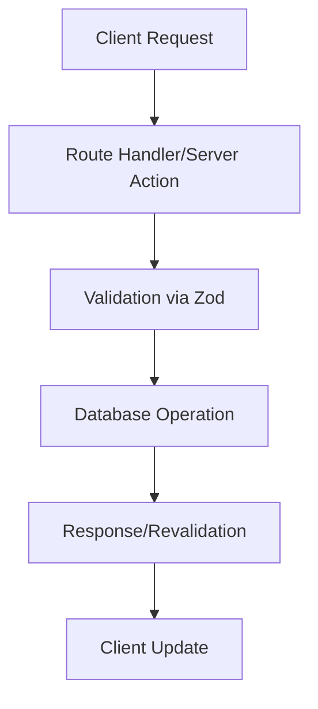

# {feature-name} — Design

## Architecture Overview

### High-Level Design

{Describe the overall architecture and data flow}

### Server vs Client Boundaries

| Component/Layer | Server | Client | Justification   |
| --------------- | ------ | ------ | --------------- |
| {Component 1}   | ✓      |        | {Justification} |
| {Component 2}   |        | ✓      | {Justification} |
| {Component 3}   | ✓      | ✓      | {Justification} |

## Files to Create

### `apps/portal/src/`

- `{path/to/new/file}.tsx` — {description}
- `{path/to/new/file}.ts` — {description}
- `{path/to/new/file}.test.ts` — {description}

### `packages/`

- `{package-name}/src/{new-file}.ts` — {description}
- `{package-name}/src/{new-file}.test.ts` — {description}

## Files to Modify

### `apps/portal/src/`

- `{path/to/existing/file}.tsx` — {changes}
- `{path/to/existing/file}.ts` — {changes}

### `packages/`

- `{package-name}/src/{existing-file}.ts` — {changes}

## Data Flow



## Environment Variables Required

| Variable                | Used By     | Visibility | Default   | Required |
| ----------------------- | ----------- | ---------- | --------- | -------- |
| `{NEW_ENV_VAR}`         | {Component} | Server     | {default} | Yes/No   |
| `{NEXT_PUBLIC_NEW_VAR}` | {Component} | Client     | {default} | Yes/No   |

## New Packages Needed

| Package        | Version   | Justification   | Alternative Considered |
| -------------- | --------- | --------------- | ---------------------- |
| {package-name} | {version} | {justification} | {alternative}          |

## API Contracts

### Request Schema

```typescript
{
  // Define request payload schema
}
```

### Response Schema

```typescript
{
  // Define response payload schema
}
```

## Error Handling

### Error Types

- `{ErrorClass}` — {description}
- `{ErrorClass}` — {description}

### Error Recovery

- {Recovery strategy 1}
- {Recovery strategy 2}

## Performance Considerations

- {Performance consideration 1}
- {Performance consideration 2}
- {Performance consideration 3}

## Security Considerations

- {Security consideration 1}
- {Security consideration 2}
- {Security consideration 3}

## Accessibility Considerations

- {Accessibility consideration 1}
- {Accessibility consideration 2}
- {Accessibility consideration 3}

## Testing Strategy

### Unit Tests

- `{test-file}.test.ts` — {coverage target}

### Integration Tests

- `__tests__/{test-suite}/` — {coverage target}

### E2E Tests

- {E2E testing approach}

## Approval Checklist

- [ ] Architecture reviewed
- [ ] Server/client boundaries mapped
- [ ] Environment variables documented
- [ ] New packages justified
- [ ] Error handling planned
- [ ] Performance considered
- [ ] Security reviewed
- [ ] Accessibility addressed
- [ ] Testing strategy defined
