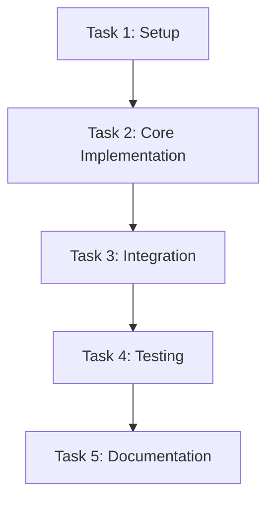

# {feature-name} — Tasks

## Task Order & Dependencies

## Task List

### Phase 1: Setup & Foundation
- [ ] **Task 1.1:** Create directory structure
  - Files: `{path/to/dir}/`
  - Validation: Directory exists, empty state
  - Prerequisites: None

- [ ] **Task 1.2:** Set up environment variables
  - Files: `apps/portal/.env.example`
  - Validation: Variables added with defaults
  - Prerequisites: Task 1.1

- [ ] **Task 1.3:** Add package dependencies (if needed)
  - Files: `apps/portal/package.json`, `pnpm-lock.yaml`
  - Validation: `pnpm install` succeeds, no conflicts
  - Prerequisites: Task 1.2

### Phase 2: Core Implementation
- [ ] **Task 2.1:** Implement data models/contracts
  - Files: `{path/to/schema}.ts`
  - Validation: `pnpm type-check` passes, Zod schemas validate
  - Prerequisites: Task 1.3

- [ ] **Task 2.2:** Create Server Actions/Route Handlers
  - Files: `{path/to/action}.ts`
  - Validation: TypeScript compiles, Zod validation works
  - Prerequisites: Task 2.1

- [ ] **Task 2.3:** Implement database operations
  - Files: `{path/to/db}.ts`
  - Validation: No raw SQL, parameterized queries
  - Prerequisites: Task 2.2

- [ ] **Task 2.4:** Create Server Components
  - Files: `{path/to/server-component}.tsx`
  - Validation: No "use client", imports server-only packages
  - Prerequisites: Task 2.3

### Phase 3: Client Implementation
- [ ] **Task 3.1:** Create Client Components
  - Files: `{path/to/client-component}.tsx`
  - Validation: Has "use client", no server-only imports
  - Prerequisites: Task 2.4

- [ ] **Task 3.2:** Implement forms and interactivity
  - Files: `{path/to/form}.tsx`
  - Validation: Form validation works, accessibility compliant
  - Prerequisites: Task 3.1

- [ ] **Task 3.3:** Add state management (if needed)
  - Files: `{path/to/store}.ts`
  - Validation: Zustand store works, proper typing
  - Prerequisites: Task 3.2

### Phase 4: Integration & Testing
- [ ] **Task 4.1:** Integrate with existing routes
  - Files: `{path/to/route}/page.tsx`, `layout.tsx`
  - Validation: Routes render without errors
  - Prerequisites: Task 3.3

- [ ] **Task 4.2:** Write unit tests
  - Files: `{path/to/test}.test.ts`
  - Validation: Tests pass, coverage meets thresholds
  - Prerequisites: Task 4.1

- [ ] **Task 4.3:** Write integration tests
  - Files: `__tests__/{test-suite}/`
  - Validation: Integration tests pass
  - Prerequisites: Task 4.2

- [ ] **Task 4.4:** Run full quality check
  - Command: `pnpm quality`
  - Validation: All checks pass (lint, type-check, test, format)
  - Prerequisites: Task 4.3

### Phase 5: Polish & Documentation
- [ ] **Task 5.1:** Add JSDoc comments
  - Files: All implemented files
  - Validation: Documentation exists for public APIs
  - Prerequisites: Task 4.4

- [ ] **Task 5.2:** Update README/usage docs
  - Files: `README.md`, `docs/`
  - Validation: Documentation accurate and complete
  - Prerequisites: Task 5.1

- [ ] **Task 5.3:** Final verification
  - Command: `pnpm dev` + manual testing
  - Validation: Feature works end-to-end
  - Prerequisites: Task 5.2

## Quality Gates

### Before Each Task
- [ ] Run `pnpm type-check` (no errors)
- [ ] Verify no server-only code in client components
- [ ] Check for any `any` types

### After Each Task
- [ ] Run `pnpm lint` (no warnings)
- [ ] Run task-specific tests
- [ ] Verify accessibility (semantic HTML, labels, focus)

### Before Marking Complete
- [ ] All acceptance criteria from requirements met
- [ ] `pnpm quality` passes completely
- [ ] No secrets committed or exposed
- [ ] Server/client boundaries respected
- [ ] All new environment variables in `.env.example`
- [ ] Error handling using `@repo/errors`
- [ ] Accessibility requirements met
- [ ] Performance targets achieved

## Rollback Plan

If any task fails:
1. Revert to last successful task commit
2. Document failure reason
3. Update design if fundamental issue
4. Create new task to address issue
5. Continue from successful baseline

## Completion Criteria

The feature is complete when:
1. All tasks marked complete
2. All quality gates passed
3. Feature works in development (`pnpm dev`)
4. Build succeeds (`pnpm build`)
5. All tests pass (`pnpm test`)
6. Documentation complete