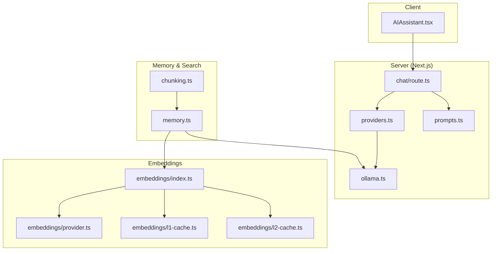
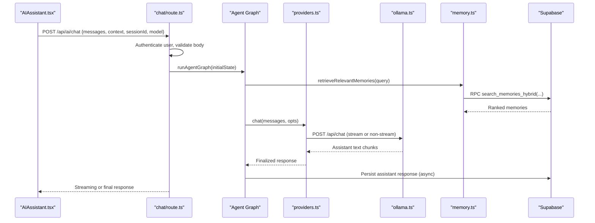
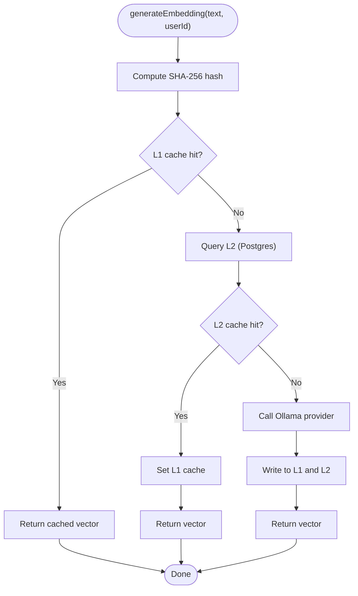
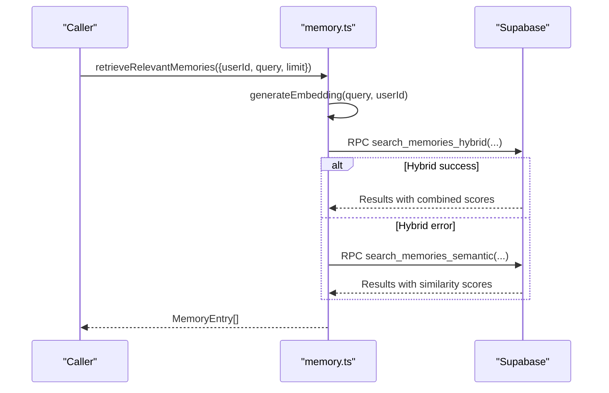
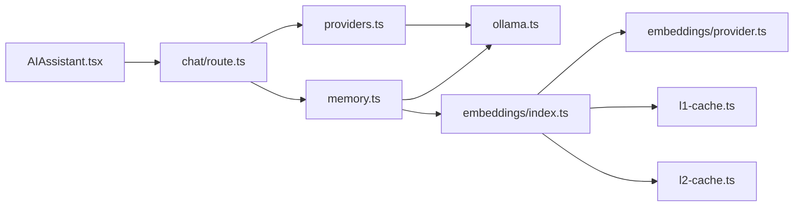

# AI & Machine Learning

<cite>
**Referenced Files in This Document**
- [apps/portal/lib/ai/providers.ts](file://apps/portal/lib/ai/providers.ts)
- [apps/portal/lib/ai/ollama.ts](file://apps/portal/lib/ai/ollama.ts)
- [apps/portal/app/api/ai/chat/route.ts](file://apps/portal/app/api/ai/chat/route.ts)
- [apps/portal/components/ai/AIAssistant.tsx](file://apps/portal/components/ai/AIAssistant.tsx)
- [apps/portal/lib/ai/prompts.ts](file://apps/portal/lib/ai/prompts.ts)
- [apps/portal/lib/ai/embeddings/index.ts](file://apps/portal/lib/ai/embeddings/index.ts)
- [apps/portal/lib/ai/embeddings/provider.ts](file://apps/portal/lib/ai/embeddings/provider.ts)
- [apps/portal/lib/ai/embeddings/l1-cache.ts](file://apps/portal/lib/ai/embeddings/l1-cache.ts)
- [apps/portal/lib/ai/embeddings/l2-cache.ts](file://apps/portal/lib/ai/embeddings/l2-cache.ts)
- [apps/portal/lib/ai/memory.ts](file://apps/portal/lib/ai/memory.ts)
- [apps/portal/lib/ai/chunking.ts](file://apps/portal/lib/ai/chunking.ts)
</cite>

## Table of Contents
1. [Introduction](#introduction)
2. [Project Structure](#project-structure)
3. [Core Components](#core-components)
4. [Architecture Overview](#architecture-overview)
5. [Detailed Component Analysis](#detailed-component-analysis)
6. [Dependency Analysis](#dependency-analysis)
7. [Performance Considerations](#performance-considerations)
8. [Troubleshooting Guide](#troubleshooting-guide)
9. [Conclusion](#conclusion)
10. [Appendices](#appendices)

## Introduction
This document explains the AI and machine learning capabilities integrated into the Arch-Mk2 platform, focusing on:
- AI assistant architecture and streaming chat
- Embedding generation with multi-tier caching
- Vector search and memory retrieval for semantic context
- Prompt engineering patterns and response formatting
- Configuration options for local Ollama-based providers
- Performance optimization, caching strategies, and fallback mechanisms
- Extensibility patterns for custom AI features

The system is designed around a local-first approach using an Ollama-compatible HTTP client, with robust caching and database-backed vector storage to deliver fast, reliable AI experiences.

## Project Structure
AI-related functionality is primarily implemented under apps/portal/lib/ai and exposed via Next.js API routes and React components:
- Provider layer: Ollama-compatible HTTP client for chat and embeddings
- API route: Orchestrates authentication, validation, agent graph execution, and persistence
- UI component: Client-side chat interface with model selection and tool output rendering
- Embeddings: Multi-tier cache (in-memory + Postgres) and provider abstraction
- Memory service: Episodic and semantic memory with hybrid and semantic search
- Chunking utilities: Content-aware chunking for documents, code, and conversations

**Diagram sources**
- [apps/portal/components/ai/AIAssistant.tsx:1-389](file://apps/portal/components/ai/AIAssistant.tsx#L1-L389)
- [apps/portal/app/api/ai/chat/route.ts:1-119](file://apps/portal/app/api/ai/chat/route.ts#L1-L119)
- [apps/portal/lib/ai/providers.ts:1-91](file://apps/portal/lib/ai/providers.ts#L1-L91)
- [apps/portal/lib/ai/ollama.ts:1-262](file://apps/portal/lib/ai/ollama.ts#L1-L262)
- [apps/portal/lib/ai/prompts.ts:1-67](file://apps/portal/lib/ai/prompts.ts#L1-L67)
- [apps/portal/lib/ai/embeddings/index.ts:1-54](file://apps/portal/lib/ai/embeddings/index.ts#L1-L54)
- [apps/portal/lib/ai/embeddings/provider.ts:1-37](file://apps/portal/lib/ai/embeddings/provider.ts#L1-L37)
- [apps/portal/lib/ai/embeddings/l1-cache.ts:1-50](file://apps/portal/lib/ai/embeddings/l1-cache.ts#L1-L50)
- [apps/portal/lib/ai/embeddings/l2-cache.ts:1-143](file://apps/portal/lib/ai/embeddings/l2-cache.ts#L1-L143)
- [apps/portal/lib/ai/memory.ts:1-402](file://apps/portal/lib/ai/memory.ts#L1-L402)
- [apps/portal/lib/ai/chunking.ts:1-369](file://apps/portal/lib/ai/chunking.ts#L1-L369)

**Section sources**
- [apps/portal/components/ai/AIAssistant.tsx:1-389](file://apps/portal/components/ai/AIAssistant.tsx#L1-L389)
- [apps/portal/app/api/ai/chat/route.ts:1-119](file://apps/portal/app/api/ai/chat/route.ts#L1-L119)
- [apps/portal/lib/ai/providers.ts:1-91](file://apps/portal/lib/ai/providers.ts#L1-L91)
- [apps/portal/lib/ai/ollama.ts:1-262](file://apps/portal/lib/ai/ollama.ts#L1-L262)
- [apps/portal/lib/ai/prompts.ts:1-67](file://apps/portal/lib/ai/prompts.ts#L1-L67)
- [apps/portal/lib/ai/embeddings/index.ts:1-54](file://apps/portal/lib/ai/embeddings/index.ts#L1-L54)
- [apps/portal/lib/ai/embeddings/provider.ts:1-37](file://apps/portal/lib/ai/embeddings/provider.ts#L1-L37)
- [apps/portal/lib/ai/embeddings/l1-cache.ts:1-50](file://apps/portal/lib/ai/embeddings/l1-cache.ts#L1-L50)
- [apps/portal/lib/ai/embeddings/l2-cache.ts:1-143](file://apps/portal/lib/ai/embeddings/l2-cache.ts#L1-L143)
- [apps/portal/lib/ai/memory.ts:1-402](file://apps/portal/lib/ai/memory.ts#L1-L402)
- [apps/portal/lib/ai/chunking.ts:1-369](file://apps/portal/lib/ai/chunking.ts#L1-L369)

## Core Components
- Ollama-compatible provider: Encapsulates chat (non-streaming and streaming) and embedding calls with timeouts and error handling.
- Chat API route: Authenticates users, validates input, runs the agent graph, and persists memory asynchronously.
- Embedding service: Multi-tier cache (in-process Map and Postgres) over a primary provider that calls Ollama.
- Memory service: Stores episodic and semantic memories with embeddings; supports hybrid and semantic search via Supabase RPCs.
- Chunking utilities: Content-aware chunking for documents, code, and conversations to optimize embedding and retrieval.
- Prompts: System prompts and tool dispatch instructions guiding model behavior and structured outputs.

**Section sources**
- [apps/portal/lib/ai/providers.ts:1-91](file://apps/portal/lib/ai/providers.ts#L1-L91)
- [apps/portal/lib/ai/ollama.ts:1-262](file://apps/portal/lib/ai/ollama.ts#L1-L262)
- [apps/portal/app/api/ai/chat/route.ts:1-119](file://apps/portal/app/api/ai/chat/route.ts#L1-L119)
- [apps/portal/lib/ai/embeddings/index.ts:1-54](file://apps/portal/lib/ai/embeddings/index.ts#L1-L54)
- [apps/portal/lib/ai/embeddings/provider.ts:1-37](file://apps/portal/lib/ai/embeddings/provider.ts#L1-L37)
- [apps/portal/lib/ai/embeddings/l1-cache.ts:1-50](file://apps/portal/lib/ai/embeddings/l1-cache.ts#L1-L50)
- [apps/portal/lib/ai/embeddings/l2-cache.ts:1-143](file://apps/portal/lib/ai/embeddings/l2-cache.ts#L1-L143)
- [apps/portal/lib/ai/memory.ts:1-402](file://apps/portal/lib/ai/memory.ts#L1-L402)
- [apps/portal/lib/ai/chunking.ts:1-369](file://apps/portal/lib/ai/chunking.ts#L1-L369)
- [apps/portal/lib/ai/prompts.ts:1-67](file://apps/portal/lib/ai/prompts.ts#L1-L67)

## Architecture Overview
The AI assistant uses a layered architecture:
- Client UI sends messages to the chat API route with session context and selected model.
- The route authenticates, validates, initializes agent state, and executes the agent graph.
- The provider layer calls Ollama for chat completions and embeddings.
- Embeddings are cached at two levels before calling the provider.
- Memory service stores and retrieves relevant context using hybrid or semantic search.

**Diagram sources**
- [apps/portal/components/ai/AIAssistant.tsx:1-389](file://apps/portal/components/ai/AIAssistant.tsx#L1-L389)
- [apps/portal/app/api/ai/chat/route.ts:1-119](file://apps/portal/app/api/ai/chat/route.ts#L1-L119)
- [apps/portal/lib/ai/providers.ts:1-91](file://apps/portal/lib/ai/providers.ts#L1-L91)
- [apps/portal/lib/ai/ollama.ts:1-262](file://apps/portal/lib/ai/ollama.ts#L1-L262)
- [apps/portal/lib/ai/memory.ts:1-402](file://apps/portal/lib/ai/memory.ts#L1-L402)

## Detailed Component Analysis

### AI Assistant UI
- Provides a floating chat panel with model selection and quick actions.
- Uses a client hook to stream responses from the server endpoint.
- Renders tool invocations and results inline within messages.

Key behaviors:
- Model selection passed to the server request body.
- Session ID persisted across reloads for continuity.
- Graceful error display and stop-generation control.

**Section sources**
- [apps/portal/components/ai/AIAssistant.tsx:1-389](file://apps/portal/components/ai/AIAssistant.tsx#L1-L389)

### Chat API Route
- Enforces rate limits, body size limits, and CORS.
- Authenticates users via Supabase and validates request schema.
- Initializes agent state and runs the agent graph.
- Persists assistant responses asynchronously when needed.

Error handling:
- Returns standardized JSON errors for unauthorized or invalid requests.
- Logs unhandled exceptions and returns generic failure responses.

**Section sources**
- [apps/portal/app/api/ai/chat/route.ts:1-119](file://apps/portal/app/api/ai/chat/route.ts#L1-L119)

### Provider Layer (Chat and Embeddings)
- Exposes chat (non-streaming), streaming chat, and embedding functions.
- Wraps Ollama HTTP calls with timeouts and structured error propagation.
- Re-exports default model and base URL for configuration.

Timeout strategy:
- Hard timeout aborts underlying fetch to prevent resource leaks in serverless environments.

**Section sources**
- [apps/portal/lib/ai/providers.ts:1-91](file://apps/portal/lib/ai/providers.ts#L1-L91)
- [apps/portal/lib/ai/ollama.ts:1-262](file://apps/portal/lib/ai/ollama.ts#L1-L262)

### Embedding Generation and Caching
- Primary provider uses Ollama embeddings with a fixed dimensionality.
- Multi-tier caching:
  - L1: In-process Map with LRU eviction per user.
  - L2: Postgres table storing vectors keyed by text hash and user.
- Batch operations supported for efficiency.

Flow:
- Compute content hash.
- Check L1 cache.
- If miss, check L2 cache and warm L1.
- If still miss, call provider and write back to both caches.

**Diagram sources**
- [apps/portal/lib/ai/embeddings/index.ts:1-54](file://apps/portal/lib/ai/embeddings/index.ts#L1-L54)
- [apps/portal/lib/ai/embeddings/l1-cache.ts:1-50](file://apps/portal/lib/ai/embeddings/l1-cache.ts#L1-L50)
- [apps/portal/lib/ai/embeddings/l2-cache.ts:1-143](file://apps/portal/lib/ai/embeddings/l2-cache.ts#L1-L143)
- [apps/portal/lib/ai/embeddings/provider.ts:1-37](file://apps/portal/lib/ai/embeddings/provider.ts#L1-L37)

**Section sources**
- [apps/portal/lib/ai/embeddings/index.ts:1-54](file://apps/portal/lib/ai/embeddings/index.ts#L1-L54)
- [apps/portal/lib/ai/embeddings/l1-cache.ts:1-50](file://apps/portal/lib/ai/embeddings/l1-cache.ts#L1-L50)
- [apps/portal/lib/ai/embeddings/l2-cache.ts:1-143](file://apps/portal/lib/ai/embeddings/l2-cache.ts#L1-L143)
- [apps/portal/lib/ai/embeddings/provider.ts:1-37](file://apps/portal/lib/ai/embeddings/provider.ts#L1-L37)

### Memory Service (Episodic and Semantic)
- Stores memories with embeddings for later retrieval.
- Supports hybrid search (semantic + keyword + temporal) and pure semantic search.
- Conversation history retrieval with Redis-backed caching.
- Semantic fact store for long-term knowledge with key-value semantics.

Search flow:
- Generate query embedding.
- Attempt hybrid search via Supabase RPC.
- Fallback to semantic search if hybrid fails.
- Map rows to typed entries and return ranked results.

**Diagram sources**
- [apps/portal/lib/ai/memory.ts:145-215](file://apps/portal/lib/ai/memory.ts#L145-L215)

**Section sources**
- [apps/portal/lib/ai/memory.ts:1-402](file://apps/portal/lib/ai/memory.ts#L1-L402)

### Chunking Utilities
- Auto-detects content type (conversation, document, code).
- Applies appropriate chunking strategies with overlap and boundary preservation.
- Merges small chunks to reduce embedding API calls.
- Estimates token counts conservatively.

Use cases:
- Preparing large documents for embedding.
- Splitting code blocks by function/class boundaries.
- Maintaining conversational message integrity.

**Section sources**
- [apps/portal/lib/ai/chunking.ts:1-369](file://apps/portal/lib/ai/chunking.ts#L1-L369)

### Prompt Engineering Patterns
- System prompts define assistant role, tool usage guidelines, and operational focus.
- Tool dispatch prompt instructs the model to output structured JSON with confidence scoring.
- Specialized prompts for predictive maintenance, safety compliance, and shift handoff summaries.

Best practices:
- Keep prompts concise and domain-specific.
- Use confidence thresholds to avoid incorrect tool calls.
- Inject retrieved memory context to personalize responses.

**Section sources**
- [apps/portal/lib/ai/prompts.ts:1-67](file://apps/portal/lib/ai/prompts.ts#L1-L67)

## Dependency Analysis
High-level dependencies:
- UI depends on the chat API route.
- Chat route depends on provider layer and memory service.
- Provider layer depends on Ollama HTTP client.
- Memory service depends on embeddings and Supabase RPCs.
- Embeddings depend on provider and caches.

**Diagram sources**
- [apps/portal/components/ai/AIAssistant.tsx:1-389](file://apps/portal/components/ai/AIAssistant.tsx#L1-L389)
- [apps/portal/app/api/ai/chat/route.ts:1-119](file://apps/portal/app/api/ai/chat/route.ts#L1-L119)
- [apps/portal/lib/ai/providers.ts:1-91](file://apps/portal/lib/ai/providers.ts#L1-L91)
- [apps/portal/lib/ai/ollama.ts:1-262](file://apps/portal/lib/ai/ollama.ts#L1-L262)
- [apps/portal/lib/ai/memory.ts:1-402](file://apps/portal/lib/ai/memory.ts#L1-L402)
- [apps/portal/lib/ai/embeddings/index.ts:1-54](file://apps/portal/lib/ai/embeddings/index.ts#L1-L54)
- [apps/portal/lib/ai/embeddings/provider.ts:1-37](file://apps/portal/lib/ai/embeddings/provider.ts#L1-L37)
- [apps/portal/lib/ai/embeddings/l1-cache.ts:1-50](file://apps/portal/lib/ai/embeddings/l1-cache.ts#L1-L50)
- [apps/portal/lib/ai/embeddings/l2-cache.ts:1-143](file://apps/portal/lib/ai/embeddings/l2-cache.ts#L1-L143)

**Section sources**
- [apps/portal/components/ai/AIAssistant.tsx:1-389](file://apps/portal/components/ai/AIAssistant.tsx#L1-L389)
- [apps/portal/app/api/ai/chat/route.ts:1-119](file://apps/portal/app/api/ai/chat/route.ts#L1-L119)
- [apps/portal/lib/ai/providers.ts:1-91](file://apps/portal/lib/ai/providers.ts#L1-L91)
- [apps/portal/lib/ai/ollama.ts:1-262](file://apps/portal/lib/ai/ollama.ts#L1-L262)
- [apps/portal/lib/ai/memory.ts:1-402](file://apps/portal/lib/ai/memory.ts#L1-L402)
- [apps/portal/lib/ai/embeddings/index.ts:1-54](file://apps/portal/lib/ai/embeddings/index.ts#L1-L54)
- [apps/portal/lib/ai/embeddings/provider.ts:1-37](file://apps/portal/lib/ai/embeddings/provider.ts#L1-L37)
- [apps/portal/lib/ai/embeddings/l1-cache.ts:1-50](file://apps/portal/lib/ai/embeddings/l1-cache.ts#L1-L50)
- [apps/portal/lib/ai/embeddings/l2-cache.ts:1-143](file://apps/portal/lib/ai/embeddings/l2-cache.ts#L1-L143)

## Performance Considerations
- Timeouts: All outbound Ollama requests use hard timeouts to prevent connection leaks in serverless environments.
- Caching:
  - L1 in-process Map reduces repeated calls within a process.
  - L2 Postgres cache persists across processes and restarts.
  - Redis-backed caching for conversation history retrieval.
- Streaming: Server-side streaming minimizes latency and improves UX.
- Batch operations: Embedding batch APIs reduce round-trips for multiple texts.
- Chunk merging: Reduces number of embedding calls by combining small chunks.

[No sources needed since this section provides general guidance]

## Troubleshooting Guide
Common issues and mitigations:
- Unauthorized access: Ensure Supabase auth cookie/token is present; route returns 401 otherwise.
- Invalid request body: Schema validation failures return detailed issues; verify payload shape.
- Ollama connectivity: Check OLLAMA_URL and network reachability; timeouts produce structured errors.
- Empty embeddings: Provider throws APIError on empty responses; inspect logs and model availability.
- Database errors: Embedding cache insert/lookup errors are logged; unique violations are ignored gracefully.
- Hybrid search failures: Falls back to semantic search automatically; monitor logs for degradation.

Operational tips:
- Monitor rate limits and body size limits enforced by middleware.
- Use clearEmbeddingCache to reset L1 cache during development.
- Inspect error contexts logged for precise diagnostics.

**Section sources**
- [apps/portal/app/api/ai/chat/route.ts:1-119](file://apps/portal/app/api/ai/chat/route.ts#L1-L119)
- [apps/portal/lib/ai/ollama.ts:1-262](file://apps/portal/lib/ai/ollama.ts#L1-L262)
- [apps/portal/lib/ai/embeddings/l2-cache.ts:1-143](file://apps/portal/lib/ai/embeddings/l2-cache.ts#L1-L143)
- [apps/portal/lib/ai/memory.ts:1-402](file://apps/portal/lib/ai/memory.ts#L1-L402)

## Conclusion
The Arch-Mk2 AI stack combines a local-first Ollama provider with robust caching, memory-driven retrieval, and structured prompting to deliver responsive and context-aware assistance. The design emphasizes reliability through timeouts, graceful fallbacks, and comprehensive logging. Extensibility points include adding new providers, integrating additional tools, and refining prompts for domain-specific tasks.

[No sources needed since this section summarizes without analyzing specific files]

## Appendices

### Configuration Options
- Ollama base URL and timeout:
  - OLLAMA_URL: Base URL for the Ollama server.
  - OLLAMA_TIMEOUT_MS: Hard timeout for all Ollama requests.
- Default model:
  - DEFAULT_MODEL: Used for chat and embeddings unless overridden.
- Embedding model and dimensions:
  - EMBED_MODEL: Specific embedding model name.
  - EMBEDDING_DIMENSIONS: Expected vector length.

Where to configure:
- Environment variables consumed by ollama.ts and embeddings/provider.ts.
- Provider re-exports for routes and services.

**Section sources**
- [apps/portal/lib/ai/ollama.ts:1-262](file://apps/portal/lib/ai/ollama.ts#L1-L262)
- [apps/portal/lib/ai/embeddings/provider.ts:1-37](file://apps/portal/lib/ai/embeddings/provider.ts#L1-L37)
- [apps/portal/lib/ai/providers.ts:1-91](file://apps/portal/lib/ai/providers.ts#L1-L91)

### Response Formatting and Structured Outputs
- Tool dispatch prompt instructs the model to return JSON with fields for tool selection, arguments, confidence, and reasoning.
- Confidence thresholds guide whether to execute a tool or ask clarifying questions.
- Specialized prompts enforce strict schemas for maintenance, safety, and shift handoff outputs.

**Section sources**
- [apps/portal/lib/ai/prompts.ts:1-67](file://apps/portal/lib/ai/prompts.ts#L1-L67)

### Extending AI Capabilities
- Add new tools:
  - Extend tool dispatch prompt with new tool definitions and argument schemas.
  - Implement tool handlers and integrate them into the agent graph.
- Integrate alternative providers:
  - Implement a new provider class similar to the existing embedding provider.
  - Wire it into the primary provider selection logic.
- Enhance memory retrieval:
  - Adjust hybrid search weights or add new ranking signals.
  - Introduce additional metadata fields for richer context.

[No sources needed since this section provides general guidance]