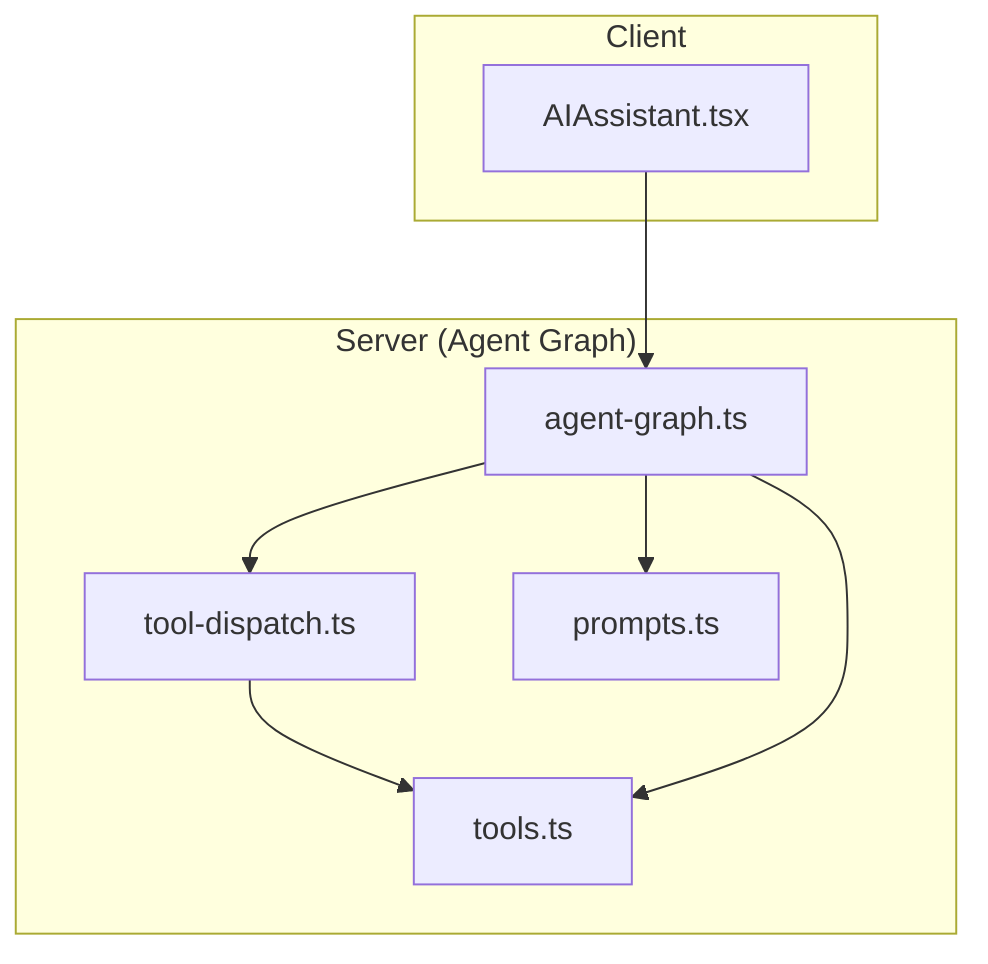
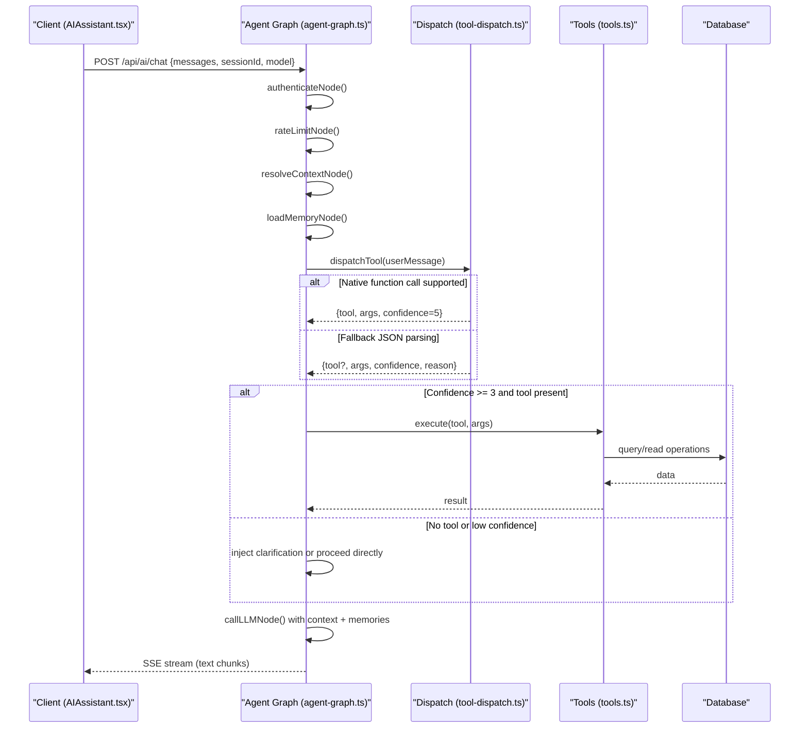
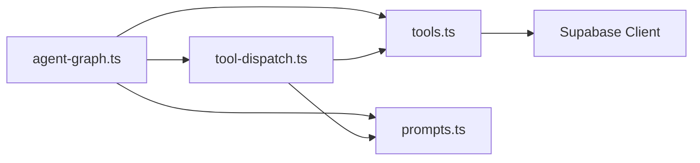

# AI Tools & Function Calling

<cite>
**Referenced Files in This Document**
- [tools.ts](file://apps/portal/lib/ai/tools.ts)
- [tool-dispatch.ts](file://apps/portal/lib/ai/tool-dispatch.ts)
- [agent-graph.ts](file://apps/portal/lib/ai/agent-graph.ts)
- [prompts.ts](file://apps/portal/lib/ai/prompts.ts)
- [AIAssistant.tsx](file://apps/portal/components/ai/AIAssistant.tsx)
</cite>

## Table of Contents
1. [Introduction](#introduction)
2. [Project Structure](#project-structure)
3. [Core Components](#core-components)
4. [Architecture Overview](#architecture-overview)
5. [Detailed Component Analysis](#detailed-component-analysis)
6. [Dependency Analysis](#dependency-analysis)
7. [Performance Considerations](#performance-considerations)
8. [Troubleshooting Guide](#troubleshooting-guide)
9. [Conclusion](#conclusion)
10. [Appendices](#appendices)

## Introduction
This document explains the AI tools and function calling system used by the portal’s AI assistant. It covers how tools are registered, validated, dispatched, executed, cached, and observed. It also documents built-in tools for data analysis and reporting, the dispatch pipeline with confidence-based routing, caching strategies, error handling patterns, and guidance for creating custom tools and integrating external APIs. Security considerations, input sanitization, and performance optimization recommendations are included to help you extend and operate the system safely and efficiently.

## Project Structure
The AI tooling is implemented primarily in the portal application under a dedicated AI library and integrated into the chat UI:
- Tool definitions and schemas live in a single module that exports a registry of tools.
- A dispatch layer decides whether and how to call a tool using an LLM-driven router with native function-calling support and a JSON fallback.
- An agent graph orchestrates authentication, rate limiting, context resolution, memory retrieval, tool dispatch, execution, LLM streaming, and output formatting.
- The React chat component integrates with the server-side agent graph via a streaming API.

**Diagram sources**
- [AIAssistant.tsx:1-389](file://apps/portal/components/ai/AIAssistant.tsx#L1-L389)
- [agent-graph.ts:1-625](file://apps/portal/lib/ai/agent-graph.ts#L1-L625)
- [tool-dispatch.ts:1-264](file://apps/portal/lib/ai/tool-dispatch.ts#L1-L264)
- [tools.ts:1-154](file://apps/portal/lib/ai/tools.ts#L1-L154)
- [prompts.ts:1-67](file://apps/portal/lib/ai/prompts.ts#L1-L67)

**Section sources**
- [tools.ts:1-154](file://apps/portal/lib/ai/tools.ts#L1-L154)
- [tool-dispatch.ts:1-264](file://apps/portal/lib/ai/tool-dispatch.ts#L1-L264)
- [agent-graph.ts:1-625](file://apps/portal/lib/ai/agent-graph.ts#L1-L625)
- [prompts.ts:1-67](file://apps/portal/lib/ai/prompts.ts#L1-L67)
- [AIAssistant.tsx:1-389](file://apps/portal/components/ai/AIAssistant.tsx#L1-L389)

## Core Components
- Tool Registry: Centralized export of tool definitions with descriptions, Zod input schemas, and execute functions.
- Dispatch Router: LLM-driven decision layer that selects a tool and arguments with confidence scoring; supports native function calls and a JSON fallback.
- Agent Graph: State machine that orchestrates the full request lifecycle, including auth, rate limits, memory, tool dispatch, execution, LLM streaming, and output.
- Prompts: System prompts guiding both conversational behavior and tool selection logic.
- Client UI: Chat interface that streams responses and renders tool invocations and results.

Key responsibilities:
- Registration: Define tools with clear descriptions and strict input schemas.
- Validation: Enforce parameter types and constraints at runtime via Zod schemas.
- Execution: Run tool handlers with per-tool rate limiting and caching.
- Routing: Use LLM reasoning to choose tools and determine confidence thresholds.
- Streaming: Return SSE responses for real-time user feedback.

**Section sources**
- [tools.ts:1-154](file://apps/portal/lib/ai/tools.ts#L1-L154)
- [tool-dispatch.ts:1-264](file://apps/portal/lib/ai/tool-dispatch.ts#L1-L264)
- [agent-graph.ts:1-625](file://apps/portal/lib/ai/agent-graph.ts#L1-L625)
- [prompts.ts:1-67](file://apps/portal/lib/ai/prompts.ts#L1-L67)
- [AIAssistant.tsx:1-389](file://apps/portal/components/ai/AIAssistant.tsx#L1-L389)

## Architecture Overview
The system follows a layered architecture:
- Client Layer: React chat component sends messages and receives streamed text events.
- Orchestration Layer: Agent graph nodes manage state transitions and side effects.
- Dispatch Layer: Determines whether to call a tool and with what parameters.
- Tool Layer: Executes business logic and returns structured results.
- External Integrations: Database queries and optional external APIs invoked within tools.

**Diagram sources**
- [AIAssistant.tsx:1-389](file://apps/portal/components/ai/AIAssistant.tsx#L1-L389)
- [agent-graph.ts:1-625](file://apps/portal/lib/ai/agent-graph.ts#L1-L625)
- [tool-dispatch.ts:1-264](file://apps/portal/lib/ai/tool-dispatch.ts#L1-L264)
- [tools.ts:1-154](file://apps/portal/lib/ai/tools.ts#L1-L154)

## Detailed Component Analysis

### Tool Definitions and Registration
- Each tool exposes:
  - description: Human-readable purpose.
  - inputSchema: Zod schema defining required and optional parameters.
  - execute: Async function receiving validated arguments and returning a result object.
- The registry aggregates tools for discovery and dispatch.

Built-in tools:
- machineStatus: Retrieves machines for a department.
- fleetStatus: Returns fleet overview with active breakdowns.
- shiftLogs: Fetches recent shift logs for a department on a given date.
- delays: Retrieves operational delays for a department on a given date.

Parameter validation:
- Zod schemas enforce types and optionality.
- Dispatch builds Ollama-compatible function definitions from schemas, including required fields and descriptions.

Execution pattern:
- Tools perform database reads via a server client and return normalized results.
- Errors are returned as structured objects for downstream handling.

**Section sources**
- [tools.ts:1-154](file://apps/portal/lib/ai/tools.ts#L1-L154)
- [tool-dispatch.ts:47-78](file://apps/portal/lib/ai/tool-dispatch.ts#L47-L78)

### Dispatch System and Confidence Scoring
Two-tier dispatch strategy:
- Primary: Native function calling via Ollama when supported.
- Fallback: JSON block parsing with confidence scoring.

Confidence semantics:
- 1–2: Ambiguous; do not fire tool; prompt clarifying question.
- 3+: Reasonable to high certainty; execute tool if specified.
- null tool with high confidence: Answer directly without tool use.

Error handling:
- Network failures, timeouts, and malformed responses fall through tiers.
- Unknown tool names are rejected with low confidence.

**Section sources**
- [tool-dispatch.ts:84-211](file://apps/portal/lib/ai/tool-dispatch.ts#L84-L211)
- [tool-dispatch.ts:229-247](file://apps/portal/lib/ai/tool-dispatch.ts#L229-L247)

### Agent Graph Orchestration
Nodes:
- authenticate: Validates user session.
- rateLimit: Applies global and per-tool rate limits.
- resolveContext: Resolves department context from message.
- loadMemory: Stores user message and retrieves relevant memories.
- gatherContext: Uses dispatchTool to decide tool usage and confidence.
- executeTools: Runs selected tools with cache checks and per-tool TTLs.
- callLLM: Streams LLM response with retry/backoff for transient errors.
- output: Wraps stream with headers and finalizes flow.
- saveMemory: Persists assistant response post-stream.

State management:
- Pure node functions update partial state.
- Router reduces state and advances to next node until END or error.

Streaming:
- SSE format with chunked text delivery.
- Session ID header for traceability and post-stream memory persistence.

**Section sources**
- [agent-graph.ts:110-175](file://apps/portal/lib/ai/agent-graph.ts#L110-L175)
- [agent-graph.ts:247-292](file://apps/portal/lib/ai/agent-graph.ts#L247-L292)
- [agent-graph.ts:294-353](file://apps/portal/lib/ai/agent-graph.ts#L294-L353)
- [agent-graph.ts:363-462](file://apps/portal/lib/ai/agent-graph.ts#L363-L462)
- [agent-graph.ts:496-534](file://apps/portal/lib/ai/agent-graph.ts#L496-L534)
- [agent-graph.ts:571-625](file://apps/portal/lib/ai/agent-graph.ts#L571-L625)

### Client Integration and Rendering
- Chat UI uses a hook to send messages and receive streaming responses.
- Tool invocations are rendered with labels and results.
- Model selection allows switching between local models.

**Section sources**
- [AIAssistant.tsx:115-119](file://apps/portal/components/ai/AIAssistant.tsx#L115-L119)
- [AIAssistant.tsx:285-324](file://apps/portal/components/ai/AIAssistant.tsx#L285-L324)

### Built-in Tools Reference
- machineStatus
  - Purpose: Get current status and details of machines in a department.
  - Parameters: departmentName (string).
  - Output: List of machines with basic attributes.
- fleetStatus
  - Purpose: Real-time operational status of the vehicle fleet including active breakdowns.
  - Parameters: fleetCode (optional string).
  - Output: Fleet overview with breakdown overlays and counts.
- shiftLogs
  - Purpose: Recent shift logs for a department on a specific date.
  - Parameters: departmentName (string), date (optional ISO date).
  - Output: Log entries for the requested day.
- delays
  - Purpose: Operational delays for a department on a given date.
  - Parameters: departmentName (string), date (optional ISO date).
  - Output: Delay records with minutes, status, and reasons.

**Section sources**
- [tools.ts:12-146](file://apps/portal/lib/ai/tools.ts#L12-L146)

### Prompting Strategy
- Conversational prompt guides tool usage rules and domain focus.
- Tool dispatch prompt instructs the model to output a JSON structure with tool, args, confidence, and reason.

**Section sources**
- [prompts.ts:1-67](file://apps/portal/lib/ai/prompts.ts#L1-L67)

## Dependency Analysis
High-level dependencies:
- Agent graph depends on prompts, memory utilities, rate limiter, Ollama client, tool registry, and dispatch.
- Dispatch depends on tool registry and prompts.
- Tools depend on database client.

**Diagram sources**
- [agent-graph.ts:16-36](file://apps/portal/lib/ai/agent-graph.ts#L16-L36)
- [tool-dispatch.ts:14-17](file://apps/portal/lib/ai/tool-dispatch.ts#L14-L17)
- [tools.ts:1-3](file://apps/portal/lib/ai/tools.ts#L1-L3)

**Section sources**
- [agent-graph.ts:16-36](file://apps/portal/lib/ai/agent-graph.ts#L16-L36)
- [tool-dispatch.ts:14-17](file://apps/portal/lib/ai/tool-dispatch.ts#L14-L17)
- [tools.ts:1-3](file://apps/portal/lib/ai/tools.ts#L1-L3)

## Performance Considerations
- Per-tool caching with TTL:
  - Short TTLs for fast-changing data (e.g., machine status).
  - Longer TTLs for slower-changing data (e.g., fleet overview, logs).
- Rate limiting:
  - Global and per-tool categories protect backend resources.
- Retry with jittered backoff:
  - Transient network or server errors trigger one retry with randomized delay.
- Streaming:
  - SSE reduces perceived latency and improves UX.
- Memory retrieval:
  - Parallel retrieval of episodic and semantic memories minimizes latency.

[No sources needed since this section provides general guidance]

## Troubleshooting Guide
Common issues and resolutions:
- Dispatch fails both tiers:
  - Check Ollama availability and endpoint configuration.
  - Validate JSON fallback parsing and content extraction.
- Low confidence routing:
  - Ensure prompts clearly describe tool capabilities and expected inputs.
  - Refine user messages to include explicit keywords.
- Tool execution errors:
  - Inspect tool-specific logs and database connectivity.
  - Verify rate limit settings and quotas.
- Streaming interruptions:
  - Confirm SSE headers and client event handling.
  - Review transient error detection and retry behavior.

**Section sources**
- [tool-dispatch.ts:229-247](file://apps/portal/lib/ai/tool-dispatch.ts#L229-L247)
- [agent-graph.ts:363-462](file://apps/portal/lib/ai/agent-graph.ts#L363-L462)

## Conclusion
The AI tools system combines robust registration, strict parameter validation, LLM-driven dispatch with confidence scoring, and resilient orchestration via an agent graph. Built-in tools cover common operational queries, while the design enables easy extension with custom tools and external integrations. Caching, rate limiting, retries, and streaming ensure responsive and reliable performance. Following the security and sanitization guidelines will keep the system safe and maintainable as it scales.

[No sources needed since this section summarizes without analyzing specific files]

## Appendices

### Creating Custom Tools
Steps:
- Define a new tool object with description, Zod inputSchema, and async execute function.
- Add the tool to the registry export so dispatch can discover it.
- Update prompts to mention the new tool and its intended use cases.
- Optionally set a per-tool cache TTL in the agent graph configuration.

Security and input sanitization:
- Always validate inputs with Zod before executing.
- Escape or sanitize any user-provided values passed to external systems.
- Avoid executing destructive operations without explicit confirmation and authorization checks.

Complex workflows:
- Compose multiple tools by chaining calls in a higher-level tool or orchestrator node.
- Use the agent graph’s context accumulation to pass intermediate results.

Integrating external APIs:
- Implement HTTP calls inside tool.execute with proper timeouts and error handling.
- Cache sensitive or expensive results with appropriate TTLs.
- Respect rate limits and implement exponential backoff for retries.

**Section sources**
- [tools.ts:1-154](file://apps/portal/lib/ai/tools.ts#L1-L154)
- [agent-graph.ts:52-57](file://apps/portal/lib/ai/agent-graph.ts#L52-L57)
- [prompts.ts:1-67](file://apps/portal/lib/ai/prompts.ts#L1-L67)