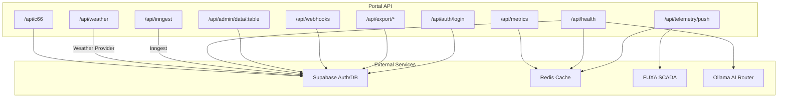
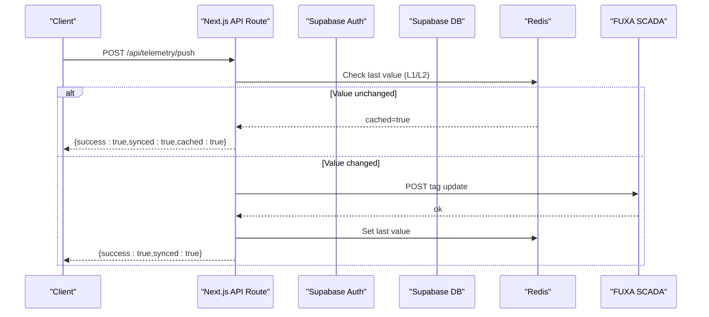
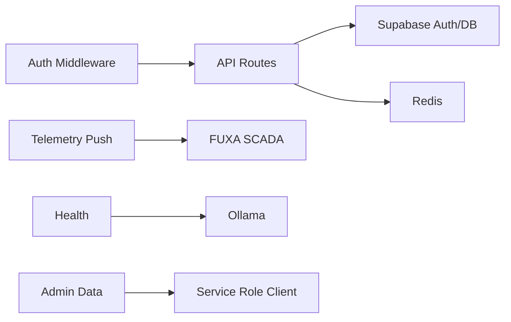

# API Reference

<cite>
**Referenced Files in This Document**
- [middleware.ts](file://apps/portal/middleware.ts)
- [route.ts (auth/login)](file://apps/portal/app/api/auth/login/route.ts)
- [route.ts (telemetry/push)](file://apps/portal/app/api/telemetry/push/route.ts)
- [route.ts (export/fuel-logs)](file://apps/portal/app/api/export/fuel-logs/route.ts)
- [route.ts (export/machines)](file://apps/portal/app/api/export/machines/route.ts)
- [route.ts (export/production)](file://apps/portal/app/api/export/production/route.ts)
- [route.ts (export/safety-incidents)](file://apps/portal/app/api/export/safety-incidents/route.ts)
- [route.ts (webhooks)](file://apps/portal/app/api/webhooks/route.ts)
- [route.ts (webhooks/[id])](file://apps/portal/app/api/webhooks/[id]/route.ts)
- [route.ts (admin/data/[table])](file://apps/portal/app/api/admin/data/[table]/route.ts)
- [route.ts (health)](file://apps/portal/app/api/health/route.ts)
- [route.ts (metrics)](file://apps/portal/app/api/metrics/route.ts)
- [route.ts (inngest)](file://apps/portal/app/api/inngest/route.ts)
- [route.ts (weather)](file://apps/portal/app/api/weather/route.ts)
- [route.ts (c66)](file://apps/portal/app/api/c66/route.ts)
</cite>

## Table of Contents
1. Introduction
2. Project Structure
3. Core Components
4. Architecture Overview
5. Detailed Component Analysis
6. Dependency Analysis
7. Performance Considerations
8. Troubleshooting Guide
9. Conclusion
10. Appendices

## Introduction
This document provides comprehensive API documentation for the Arch-Mk2 platform’s REST endpoints. It covers authentication, telemetry ingestion, export services, webhooks, administrative APIs, health and metrics, background jobs, weather data, and scanner integration. For each endpoint group, you will find HTTP methods, URL patterns, request/response schemas, authentication requirements, rate limiting notes, error codes, versioning strategy, examples, client implementation patterns, and security considerations. Real-time capabilities are provided via Supabase real-time subscriptions rather than custom WebSocket routes.

## Project Structure
The API surface is implemented using Next.js App Router route handlers under apps/portal/app/api. Authentication and authorization are enforced by a global middleware that protects UI routes; most API routes perform their own auth checks or use service-role clients where appropriate.

**Diagram sources**
- [route.ts (auth/login):1-75](file://apps/portal/app/api/auth/login/route.ts#L1-L75)
- [route.ts (telemetry/push):1-215](file://apps/portal/app/api/telemetry/push/route.ts#L1-L215)
- [route.ts (export/fuel-logs):1-143](file://apps/portal/app/api/export/fuel-logs/route.ts#L1-L143)
- [route.ts (export/machines):1-111](file://apps/portal/app/api/export/machines/route.ts#L1-L111)
- [route.ts (export/production):1-138](file://apps/portal/app/api/export/production/route.ts#L1-L138)
- [route.ts (export/safety-incidents):1-126](file://apps/portal/app/api/export/safety-incidents/route.ts#L1-L126)
- [route.ts (webhooks):1-167](file://apps/portal/app/api/webhooks/route.ts#L1-L167)
- [route.ts (webhooks/[id])](file://apps/portal/app/api/webhooks/[id]/route.ts#L1-L173)
- [route.ts (admin/data/[table])](file://apps/portal/app/api/admin/data/[table]/route.ts#L1-L228)
- [route.ts (health):1-83](file://apps/portal/app/api/health/route.ts#L1-L83)
- [route.ts (metrics):1-92](file://apps/portal/app/api/metrics/route.ts#L1-L92)
- [route.ts (inngest):1-17](file://apps/portal/app/api/inngest/route.ts#L1-L17)
- [route.ts (weather):1-23](file://apps/portal/app/api/weather/route.ts#L1-L23)
- [route.ts (c66):1-187](file://apps/portal/app/api/c66/route.ts#L1-L187)

**Section sources**
- [middleware.ts:1-371](file://apps/portal/middleware.ts#L1-L371)

## Core Components
- Authentication: POST /api/auth/login with server-side rate limiting and generic error messages to prevent enumeration.
- Telemetry Ingestion: POST /api/telemetry/push supports both direct tag updates and Supabase database webhook payloads, with L1/L2 caching and optional CORS.
- Export Services: GET /api/export/* endpoints support JSON and CSV responses with pagination and department filtering.
- Webhooks Management: CRUD for webhook endpoints with role-based access control and path revalidation.
- Administrative Data API: Admin-only read/update/delete against an allowlist of operational tables with audit logging.
- Health and Metrics: GET /api/health probes DB, Redis, and Ollama; GET /api/metrics exposes Prometheus-style metrics.
- Background Jobs: /api/inngest serves Inngest functions for sync, reporting, embeddings, and memory persistence.
- Weather: GET /api/weather proxies external weather data.
- Scanner Integration: POST /api/c66 validates scanner tokens and sources, resolves badge identity, and logs access events.

**Section sources**
- [route.ts (auth/login):1-75](file://apps/portal/app/api/auth/login/route.ts#L1-L75)
- [route.ts (telemetry/push):1-215](file://apps/portal/app/api/telemetry/push/route.ts#L1-L215)
- [route.ts (export/fuel-logs):1-143](file://apps/portal/app/api/export/fuel-logs/route.ts#L1-L143)
- [route.ts (export/machines):1-111](file://apps/portal/app/api/export/machines/route.ts#L1-L111)
- [route.ts (export/production):1-138](file://apps/portal/app/api/export/production/route.ts#L1-L138)
- [route.ts (export/safety-incidents):1-126](file://apps/portal/app/api/export/safety-incidents/route.ts#L1-L126)
- [route.ts (webhooks):1-167](file://apps/portal/app/api/webhooks/route.ts#L1-L167)
- [route.ts (webhooks/[id]):1-L173](file://apps/portal/app/api/webhooks/[id]/route.ts#L1-L173)
- [route.ts (admin/data/[table]):1-L228](file://apps/portal/app/api/admin/data/[table]/route.ts#L1-L228)
- [route.ts (health):1-83](file://apps/portal/app/api/health/route.ts#L1-L83)
- [route.ts (metrics):1-92](file://apps/portal/app/api/metrics/route.ts#L1-L92)
- [route.ts (inngest):1-17](file://apps/portal/app/api/inngest/route.ts#L1-L17)
- [route.ts (weather):1-23](file://apps/portal/app/api/weather/route.ts#L1-L23)
- [route.ts (c66):1-187](file://apps/portal/app/api/c66/route.ts#L1-L187)

## Architecture Overview
The API layer uses Next.js route handlers with shared utilities for validation, rate limiting, body limits, and CORS. Authentication is handled per-route using Supabase server clients, while admin operations use service-role clients. Telemetry ingestion includes change detection via in-memory and Redis caches before forwarding to FUXA SCADA. Export endpoints return either JSON or CSV based on Accept header. Webhook management enforces department scoping and triggers Next.js cache revalidation.

**Diagram sources**
- [route.ts (telemetry/push):1-215](file://apps/portal/app/api/telemetry/push/route.ts#L1-L215)

## Detailed Component Analysis

### Authentication
- Endpoint: POST /api/auth/login
- Purpose: Authenticate users and return session data.
- Authentication: None required to call; returns session for subsequent authenticated requests.
- Rate Limiting: Server-side IP-based sliding window (e.g., 5 attempts per 15 minutes).
- Request Body:
  - email: string (required)
  - password: string (required)
- Response:
  - 200: { user, session }
  - 400: Validation error if fields missing
  - 401: Invalid credentials or rate limit exceeded
  - 500: Internal error
- Error Handling: Generic messages to avoid account enumeration; rate-limit errors surfaced safely.
- Example Call:
  - curl -X POST https://your-domain/api/auth/login -H "Content-Type: application/json" -d '{"email":"user@example.com","password":"secret"}'
- Client Pattern: Store returned session securely and include cookies or tokens as configured by your Supabase setup for subsequent calls.

**Section sources**
- [route.ts (auth/login):1-75](file://apps/portal/app/api/auth/login/route.ts#L1-L75)

### Telemetry Ingestion
- Endpoint: POST /api/telemetry/push
- Purpose: Forward machine telemetry values to FUXA SCADA with change detection and caching.
- Authentication: Not enforced at route level; consider adding token-based auth in production.
- Rate Limiting: Body size limited; no explicit request rate limiter applied here.
- Request Body (Direct Tag Update):
  - name: string (required)
  - value: number (required)
  - department_id: string (optional)
- Request Body (Supabase Database Webhook):
  - table: string ("machine_telemetry")
  - record: object with fields such as machine_id, department_id, engine_rpm, engine_temp, hydraulic_pressure, vibration_level, fuel_level, bit_depth
- Response:
  - 200: { success, synced, cached? } or { webhook, processed, results[] }
  - 400: Missing required fields
  - 500: Processing error
- Behavior:
  - L1 cache (in-process Map) and L2 cache (Redis) skip redundant updates.
  - Optional Authorization header forwarded to FUXA if configured.
- Example Call:
  - curl -X POST https://your-domain/api/telemetry/push -H "Content-Type: application/json" -d '{"name":"machine_1_engine_rpm","value":1200,"department_id":"dept-uuid"}'
- Security Considerations:
  - Add bearer token or HMAC verification for unauthenticated ingestion in production.
  - Validate and sanitize field names and numeric ranges.

**Section sources**
- [route.ts (telemetry/push):1-215](file://apps/portal/app/api/telemetry/push/route.ts#L1-L215)

### Export Services
All export endpoints share common behaviors:
- Authentication: Requires authenticated user via Supabase server client.
- Pagination: limit and offset query parameters.
- Department Filtering: dept parameter filters by department name.
- Date Ranges: from/to parameters for time-bounded exports.
- Format Selection: JSON default; set Accept: text/csv for CSV download.
- Rate Limiting: Applied via shared middleware wrapper.

#### Fuel Logs Export
- Endpoint: GET /api/export/fuel-logs
- Query Parameters:
  - from: string (YYYY-MM-DD, defaults to 30 days ago)
  - to: string (YYYY-MM-DD, defaults to today)
  - dept: string (optional)
  - limit: number (default page size)
  - offset: number (default 0)
- Response (JSON):
  - data: array of rows with id, log_date, shift, department_id, machine_id, machine_name, machine_type, diesel_litres
  - from, to, count, limit, offset
- Response (CSV):
  - Content-Type: text/csv
  - Content-Disposition: attachment; filename="fuel-logs-{from}-{to}.csv"
- Errors:
  - 401 Unauthorized
  - 400 Invalid query parameters
  - 500 Database query failed

**Section sources**
- [route.ts (export/fuel-logs):1-143](file://apps/portal/app/api/export/fuel-logs/route.ts#L1-L143)

#### Machines Export
- Endpoint: GET /api/export/machines
- Query Parameters:
  - dept: string (optional)
  - limit: number
  - offset: number
- Response (JSON):
  - data: array of machines with id, name, machine_type, serial_number, bin_factor, active, department_id, site_id, created_at
  - count, limit, offset
- Response (CSV):
  - Content-Type: text/csv
  - Content-Disposition: attachment; filename="machines.csv"
- Errors:
  - 401 Unauthorized
  - 400 Invalid query parameters
  - 500 Database query failed

**Section sources**
- [route.ts (export/machines):1-111](file://apps/portal/app/api/export/machines/route.ts#L1-L111)

#### Production Export
- Endpoint: GET /api/export/production
- Query Parameters:
  - from: string (YYYY-MM-DD, defaults to 30 days ago)
  - to: string (YYYY-MM-DD, defaults to today)
  - dept: string (optional)
  - limit: number
  - offset: number
- Response (JSON):
  - data: aggregated rows with log_date, shift, department_id, coal_tonnes, waste_tonnes, total_tonnes
  - from, to, count, limit, offset
- Response (CSV):
  - Content-Type: text/csv
  - Content-Disposition: attachment; filename="production-{from}-{to}.csv"
- Errors:
  - 401 Unauthorized
  - 400 Invalid query parameters
  - 500 Database query failed

**Section sources**
- [route.ts (export/production):1-138](file://apps/portal/app/api/export/production/route.ts#L1-L138)

#### Safety Incidents Export
- Endpoint: GET /api/export/safety-incidents
- Query Parameters:
  - month: string (YYYY-MM, optional; if provided, sets date range to month boundaries)
  - dept: string (optional)
  - limit: number
  - offset: number
- Response (JSON):
  - data: array of safety_incidents with id, incident_date, incident_type, severity, status, department_id, description
  - from, to, count, limit, offset
- Response (CSV):
  - Content-Type: text/csv
  - Content-Disposition: attachment; filename="safety-incidents-{from}-{to}.csv"
- Errors:
  - 401 Unauthorized
  - 400 Invalid query parameters
  - 500 Database query failed

**Section sources**
- [route.ts (export/safety-incidents):1-126](file://apps/portal/app/api/export/safety-incidents/route.ts#L1-L126)

### Webhooks Management
- Endpoints:
  - GET /api/webhooks
  - POST /api/webhooks
  - PUT /api/webhooks/:id
  - DELETE /api/webhooks/:id
- Authentication: Requires authenticated user; role-based scoping applies.
- Permissions:
  - Admins can view all webhooks.
  - Non-admins can only manage webhooks within their department or accessible departments.
- Request Bodies:
  - Create: url (string), description (string|null), event_types (array), department_id (string|null)
  - Update: url (string|null), description (string|null), event_types (array|null), active (boolean|null)
- Responses:
  - 200/201: Created/updated webhook(s)
  - 401 Unauthorized
  - 403 Forbidden (insufficient permissions)
  - 404 Not Found (webhook not found)
  - 500 Database error
- Side Effects: Revalidates paths "/admin/tools" and "/[department]/tools" after mutations.
- Example Calls:
  - List: curl -X GET https://your-domain/api/webhooks
  - Create: curl -X POST https://your-domain/api/webhooks -H "Content-Type: application/json" -d '{"url":"https://example.com/hook","event_types":["daily_log.created"],"department_id":"dept-uuid"}'
  - Update: curl -X PUT https://your-domain/api/webhooks/{id} -H "Content-Type: application/json" -d '{"active":false}'
  - Delete: curl -X DELETE https://your-domain/api/webhooks/{id}

**Section sources**
- [route.ts (webhooks):1-167](file://apps/portal/app/api/webhooks/route.ts#L1-L167)
- [route.ts (webhooks/[id]):1-L173](file://apps/portal/app/api/webhooks/[id]/route.ts#L1-L173)

### Administrative Data API
- Endpoint: /api/admin/data/:table
- Methods:
  - GET :table: list records with pagination and ordering
  - PUT :table: update a single record by id
  - DELETE :table?id=:id: delete a single record by id
- Authentication: Requires admin role; verified via Supabase server client and employees table.
- Allowed Tables: Operational tables allowlist (e.g., machines, daily_logs, fuel_logs, production_logs, etc.).
- Query Parameters (GET):
  - limit: number (max 200)
  - offset: number
  - order_by: string (default created_at)
  - order_dir: asc|desc (default desc)
- Request Body (PUT):
  - id: string (required)
  - data: object (fields to update)
- Responses:
  - 200: { data, count, limit, offset } for GET; { success: true } for PUT/DELETE
  - 401 Unauthorized
  - 403 Forbidden (non-admin)
  - 404 Unknown table or missing id
  - 400 Validation failure or missing id
  - 500 Database operation failed
- Audit Logging: Updates and deletes write to audit_logs with old/new data and performed_by.

**Section sources**
- [route.ts (admin/data/[table]):1-L228](file://apps/portal/app/api/admin/data/[table]/route.ts#L1-L228)

### Health and Metrics
- Health:
  - GET /api/health
  - Returns status, db, pooler, redis, aiRouter, responseTime, timestamp
  - Status mapping: healthy, degraded, error; 200 for healthy/degraded, 503 for error
- Metrics:
  - GET /api/metrics
  - Prometheus exposition format including cache stats, Inngest job metrics, and DB query metrics
  - Headers: text/plain; version=0.0.4; charset=utf-8; no-store cache policy

**Section sources**
- [route.ts (health):1-83](file://apps/portal/app/api/health/route.ts#L1-L83)
- [route.ts (metrics):1-92](file://apps/portal/app/api/metrics/route.ts#L1-L92)

### Background Jobs (Inngest)
- Endpoint: /api/inngest
- Methods: GET, POST, PUT served by Inngest Next.js adapter
- Functions: syncPlaybackFn, generateReportFn, generateEmbeddingFn, memoryPersistFn
- Usage: Trigger jobs via Inngest SDK or schedule them; this route handles delivery.

**Section sources**
- [route.ts (inngest):1-17](file://apps/portal/app/api/inngest/route.ts#L1-L17)

### Weather Data
- Endpoint: GET /api/weather
- Purpose: Proxy external weather data with error logging
- Response: JSON payload from provider or null on error
- Caching: No-store headers to ensure fresh data

**Section sources**
- [route.ts (weather):1-23](file://apps/portal/app/api/weather/route.ts#L1-L23)

### Scanner Integration (C66)
- Endpoint: POST /api/c66
- Authentication: Token-based via x-scanner-token header; source validated via x-scanner-source header against allowed list.
- Request Body: Supports multiple code fields (code, barcode, barcodeData, data, qr_code); one must be present.
- Logic:
  - Validates token and source
  - Resolves badge and entity (personnel or visitor)
  - Checks entity status for authorization
  - Logs access event to access_logs
- Responses:
  - 200: { success, name, message }
  - 400: Empty code payload
  - 401: Unauthorized scanner token
  - 403: Revoked badge or unauthorized source
  - 404: Unrecognized badge
  - 500: Internal server error

**Section sources**
- [route.ts (c66):1-187](file://apps/portal/app/api/c66/route.ts#L1-L187)

## Dependency Analysis
- Authentication and Authorization:
  - Global middleware protects UI routes; API routes enforce auth independently.
  - Admin endpoints use service-role client for elevated privileges.
- External Integrations:
  - Supabase Auth/DB used across endpoints.
  - Redis used for caching and metrics.
  - FUXA SCADA used for telemetry forwarding.
  - Ollama AI router probed by health endpoint.
- Background Jobs:
  - Inngest route wires job functions for async processing.

**Diagram sources**
- [middleware.ts:1-371](file://apps/portal/middleware.ts#L1-L371)
- [route.ts (telemetry/push):1-215](file://apps/portal/app/api/telemetry/push/route.ts#L1-L215)
- [route.ts (health):1-83](file://apps/portal/app/api/health/route.ts#L1-L83)
- [route.ts (admin/data/[table]):1-L228](file://apps/portal/app/api/admin/data/[table]/route.ts#L1-L228)

**Section sources**
- [middleware.ts:1-371](file://apps/portal/middleware.ts#L1-L371)

## Performance Considerations
- Telemetry Deduplication:
  - L1 in-process Map and L2 Redis cache avoid redundant writes to FUXA.
  - TTL of 24 hours for last values ensures eventual consistency.
- Export Efficiency:
  - Use pagination (limit/offset) and department filters to reduce payload sizes.
  - Prefer CSV for large datasets when downloading.
- Health Probes:
  - Short timeouts for external checks (e.g., Ollama) to avoid blocking.
- Metrics:
  - Prometheus scraping should target /api/metrics with no-cache headers.

[No sources needed since this section provides general guidance]

## Troubleshooting Guide
- Authentication Failures:
  - Ensure valid credentials and check for rate-limit errors during login.
  - Verify session cookies/tokens are correctly propagated for subsequent requests.
- Telemetry Issues:
  - Confirm FUXA_URL and optional FUXA_API_KEY environment variables.
  - Inspect cache keys and last-value comparisons for deduplication behavior.
- Export Errors:
  - Validate query parameters (dates, dept names) and Accept header for CSV.
  - Check database connectivity and permissions.
- Webhook Management:
  - Confirm user has permission to create/update/delete webhooks in the specified department.
  - After mutations, verify path revalidation for affected pages.
- Admin Operations:
  - Ensure caller has admin role; otherwise, expect 403.
  - Review audit_logs for update/delete actions.
- Health/Metrics:
  - If health shows degraded/error, inspect DB, Redis, and Ollama availability.
  - Use /api/metrics to identify bottlenecks in cache and DB queries.

**Section sources**
- [route.ts (auth/login):1-75](file://apps/portal/app/api/auth/login/route.ts#L1-L75)
- [route.ts (telemetry/push):1-215](file://apps/portal/app/api/telemetry/push/route.ts#L1-L215)
- [route.ts (export/fuel-logs):1-143](file://apps/portal/app/api/export/fuel-logs/route.ts#L1-L143)
- [route.ts (webhooks):1-167](file://apps/portal/app/api/webhooks/route.ts#L1-L167)
- [route.ts (admin/data/[table]):1-L228](file://apps/portal/app/api/admin/data/[table]/route.ts#L1-L228)
- [route.ts (health):1-83](file://apps/portal/app/api/health/route.ts#L1-L83)
- [route.ts (metrics):1-92](file://apps/portal/app/api/metrics/route.ts#L1-L92)

## Conclusion
The Arch-Mk2 API provides a robust set of endpoints for authentication, telemetry ingestion, data exports, webhook management, administrative operations, health monitoring, metrics, background jobs, weather data, and scanner integration. Security is enforced through per-route authentication and role-based access controls, with additional protections like rate limiting and input validation. Performance is optimized via caching and efficient querying. Real-time features are achieved through Supabase real-time subscriptions rather than custom WebSocket routes.

[No sources needed since this section summarizes without analyzing specific files]

## Appendices

### Versioning Strategy
- No explicit API version prefix is used in the current routes.
- Maintain backward compatibility by avoiding breaking changes to request/response schemas.
- Introduce deprecation notices and gradual migration paths when evolving schemas.

[No sources needed since this section provides general guidance]

### Security Considerations
- Enforce HTTPS for all endpoints.
- Use bearer tokens or HMAC signatures for unauthenticated ingestion endpoints (e.g., telemetry, scanner).
- Apply strict input validation and sanitization.
- Restrict admin endpoints to trusted networks or require multi-factor authentication.
- Regularly rotate secrets (e.g., SCANNER_API_KEY, FUXA_API_KEY).

[No sources needed since this section provides general guidance]

### Input Validation and Error Codes
- Common validation errors: 400 Bad Request with details.
- Authentication failures: 401 Unauthorized.
- Authorization failures: 403 Forbidden.
- Resource not found: 404 Not Found.
- Server errors: 500 Internal Server Error.

[No sources needed since this section provides general guidance]

### Real-Time Features (Supabase)
- Use Supabase client channels for real-time updates (e.g., postgres_changes on tables).
- Subscribe to filtered events by department or other attributes.
- Clean up channels on component unmount to avoid leaks.

**Section sources**
- [how-to-fetch-data.md:144-199](file://wiki/queries/how-to-fetch-data.md#L144-L199)

### SDK Usage Patterns
- Initialize Supabase client in server and browser contexts appropriately.
- Use service-role client only for privileged operations (admin endpoints).
- Implement retry logic and exponential backoff for external calls (e.g., FUXA, weather providers).

[No sources needed since this section provides general guidance]