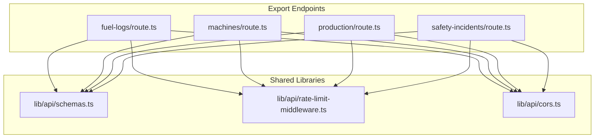
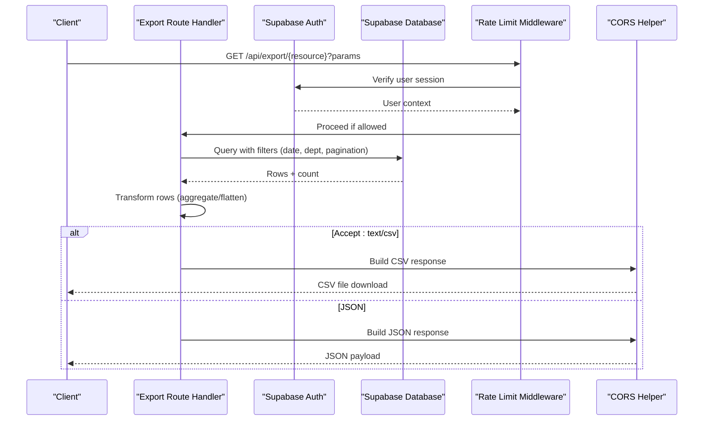
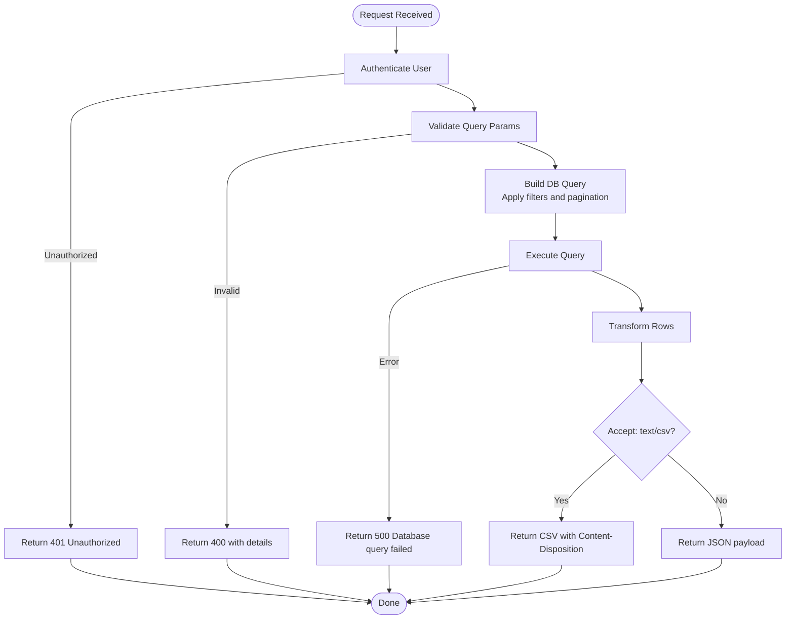
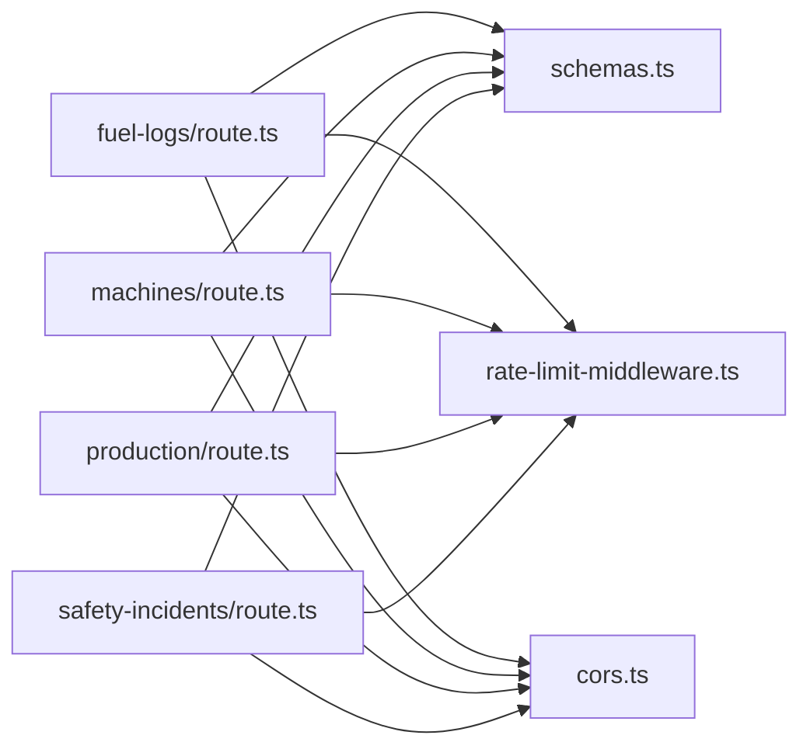

# Export Services API

<cite>
**Referenced Files in This Document**
- [apps/portal/app/api/export/fuel-logs/route.ts](file://apps/portal/app/api/export/fuel-logs/route.ts)
- [apps/portal/app/api/export/machines/route.ts](file://apps/portal/app/api/export/machines/route.ts)
- [apps/portal/app/api/export/production/route.ts](file://apps/portal/app/api/export/production/route.ts)
- [apps/portal/app/api/export/safety-incidents/route.ts](file://apps/portal/app/api/export/safety-incidents/route.ts)
- [apps/portal/lib/api/schemas.ts](file://apps/portal/lib/api/schemas.ts)
- [apps/portal/lib/api/rate-limit-middleware.ts](file://apps/portal/lib/api/rate-limit-middleware.ts)
- [apps/portal/lib/api/cors.ts](file://apps/portal/lib/api/cors.ts)
</cite>

## Table of Contents
1. Introduction
2. Project Structure
3. Core Components
4. Architecture Overview
5. Detailed Component Analysis
6. Dependency Analysis
7. Performance Considerations
8. Troubleshooting Guide
9. Conclusion

## Introduction
This document provides comprehensive API documentation for the export services endpoints that support exporting operational data as CSV or JSON. The current implementation covers:
- Fuel logs export
- Machines export
- Production export
- Safety incidents export

All endpoints are synchronous, authenticated via Supabase, rate-limited, and return either CSV (when Accept: text/csv is provided) or JSON. There is no built-in async job queue or PDF/Excel generation in these routes; clients should handle large dataset processing by paginating with limit and offset.

## Project Structure
The export endpoints are implemented as Next.js App Router route handlers under apps/portal/app/api/export. Each resource has its own directory and route file. Shared validation schemas and middleware are reused across endpoints.

**Diagram sources**
- [apps/portal/app/api/export/fuel-logs/route.ts](file://apps/portal/app/api/export/fuel-logs/route.ts)
- [apps/portal/app/api/export/machines/route.ts](file://apps/portal/app/api/export/machines/route.ts)
- [apps/portal/app/api/export/production/route.ts](file://apps/portal/app/api/export/production/route.ts)
- [apps/portal/app/api/export/safety-incidents/route.ts](file://apps/portal/app/api/export/safety-incidents/route.ts)
- [apps/portal/lib/api/schemas.ts](file://apps/portal/lib/api/schemas.ts)
- [apps/portal/lib/api/rate-limit-middleware.ts](file://apps/portal/lib/api/rate-limit-middleware.ts)
- [apps/portal/lib/api/cors.ts](file://apps/portal/lib/api/cors.ts)

**Section sources**
- [apps/portal/app/api/export/fuel-logs/route.ts](file://apps/portal/app/api/export/fuel-logs/route.ts)
- [apps/portal/app/api/export/machines/route.ts](file://apps/portal/app/api/export/machines/route.ts)
- [apps/portal/app/api/export/production/route.ts](file://apps/portal/app/api/export/production/route.ts)
- [apps/portal/app/api/export/safety-incidents/route.ts](file://apps/portal/app/api/export/safety-incidents/route.ts)
- [apps/portal/lib/api/schemas.ts](file://apps/portal/lib/api/schemas.ts)
- [apps/portal/lib/api/rate-limit-middleware.ts](file://apps/portal/lib/api/rate-limit-middleware.ts)
- [apps/portal/lib/api/cors.ts](file://apps/portal/lib/api/cors.ts)

## Core Components
- Authentication: All endpoints require an authenticated user via Supabase. Unauthenticated requests receive a 401 response.
- Parameter validation: Query parameters are validated using Zod schemas. Invalid parameters return a 400 error with details.
- Rate limiting: Requests are wrapped with a rate limiter that uses Redis-backed sliding window or token bucket strategies with in-memory fallback.
- CORS: Responses include appropriate CORS headers based on the request origin.
- Data access: Queries use Supabase client to fetch from database tables with optional department filtering and date range constraints.
- Response formats:
  - CSV when Accept header includes text/csv.
  - JSON otherwise.

Key shared behaviors:
- Default date ranges: If not provided, some endpoints default to the last 30 days.
- Pagination: Supported via limit and offset parameters.
- Department filter: Optional dept parameter filters by department name.

**Section sources**
- [apps/portal/lib/api/schemas.ts](file://apps/portal/lib/api/schemas.ts)
- [apps/portal/lib/api/rate-limit-middleware.ts](file://apps/portal/lib/api/rate-limit-middleware.ts)
- [apps/portal/lib/api/cors.ts](file://apps/portal/lib/api/cors.ts)

## Architecture Overview
The export endpoints follow a consistent flow: authenticate, validate query parameters, build and execute a database query, transform results, and return CSV or JSON.

**Diagram sources**
- [apps/portal/app/api/export/fuel-logs/route.ts](file://apps/portal/app/api/export/fuel-logs/route.ts)
- [apps/portal/app/api/export/machines/route.ts](file://apps/portal/app/api/export/machines/route.ts)
- [apps/portal/app/api/export/production/route.ts](file://apps/portal/app/api/export/production/route.ts)
- [apps/portal/app/api/export/safety-incidents/route.ts](file://apps/portal/app/api/export/safety-incidents/route.ts)
- [apps/portal/lib/api/rate-limit-middleware.ts](file://apps/portal/lib/api/rate-limit-middleware.ts)
- [apps/portal/lib/api/cors.ts](file://apps/portal/lib/api/cors.ts)

## Detailed Component Analysis

### Common Parameters and Validation
- Date range parameters:
  - from: YYYY-MM-DD (optional)
  - to: YYYY-MM-DD (optional)
- Department filter:
  - dept: string (optional), matches department name
- Pagination:
  - limit: integer, 1–1000, default 100
  - offset: integer, >= 0, default 0
- Safety-specific:
  - month: YYYY-MM (optional), used to derive from/to dates

Validation schemas enforce types, ranges, and formats. Invalid inputs return 400 with details.

**Section sources**
- [apps/portal/lib/api/schemas.ts](file://apps/portal/lib/api/schemas.ts)

### Fuel Logs Export
- Endpoint: GET /api/export/fuel-logs
- Authentication: Required
- Query parameters:
  - from: YYYY-MM-DD (defaults to 30 days ago if omitted)
  - to: YYYY-MM-DD (defaults to today if omitted)
  - dept: string (optional)
  - limit: integer (default 100)
  - offset: integer (default 0)
- Content negotiation:
  - Accept: text/csv returns CSV
  - Otherwise returns JSON
- CSV columns:
  - id, log_date, shift, department_id, machine_id, machine_name, machine_type, diesel_litres
- JSON response fields:
  - data: array of flattened fuel log rows
  - from: effective start date
  - to: effective end date
  - count: estimated total matching records
  - limit, offset

Notes:
- Flattens nested fuel_logs per daily_log row.
- Sanitizes CSV cells to prevent formula injection.

Example request (CSV):
- GET /api/export/fuel-logs?from=2025-01-01&to=2025-01-31&dept=Drilling&limit=500
- Headers: Accept: text/csv

Example request (JSON):
- GET /api/export/fuel-logs?from=2025-01-01&to=2025-01-31&dept=Drilling&limit=500

**Section sources**
- [apps/portal/app/api/export/fuel-logs/route.ts](file://apps/portal/app/api/export/fuel-logs/route.ts)

### Machines Export
- Endpoint: GET /api/export/machines
- Authentication: Required
- Query parameters:
  - dept: string (optional)
  - limit: integer (default 100)
  - offset: integer (default 0)
- Content negotiation:
  - Accept: text/csv returns CSV
  - Otherwise returns JSON
- CSV columns:
  - id, name, machine_type, serial_number, bin_factor, active, department_id, site_id, created_at
- JSON response fields:
  - data: array of machine records
  - count: estimated total matching records
  - limit, offset

Example request (CSV):
- GET /api/export/machines?dept=Engineering&limit=1000
- Headers: Accept: text/csv

**Section sources**
- [apps/portal/app/api/export/machines/route.ts](file://apps/portal/app/api/export/machines/route.ts)

### Production Export
- Endpoint: GET /api/export/production
- Authentication: Required
- Query parameters:
  - from: YYYY-MM-DD (defaults to 30 days ago if omitted)
  - to: YYYY-MM-DD (defaults to today if omitted)
  - dept: string (optional)
  - limit: integer (default 100)
  - offset: integer (default 0)
- Content negotiation:
  - Accept: text/csv returns CSV
  - Otherwise returns JSON
- CSV columns:
  - log_date, shift, department_id, coal_tonnes, waste_tonnes, total_tonnes
- JSON response fields:
  - data: aggregated production rows per daily log
  - from: effective start date
  - to: effective end date
  - count: estimated total matching records
  - limit, offset

Notes:
- Aggregates production_logs per daily_log row into totals.

Example request (CSV):
- GET /api/export/production?from=2025-01-01&to=2025-01-31&dept=Safety&limit=200
- Headers: Accept: text/csv

**Section sources**
- [apps/portal/app/api/export/production/route.ts](file://apps/portal/app/api/export/production/route.ts)

### Safety Incidents Export
- Endpoint: GET /api/export/safety-incidents
- Authentication: Required
- Query parameters:
  - month: YYYY-MM (optional). If provided, from/to are derived to cover the full month.
  - dept: string (optional)
  - limit: integer (default 100)
  - offset: integer (default 0)
- Content negotiation:
  - Accept: text/csv returns CSV
  - Otherwise returns JSON
- CSV columns:
  - id, incident_date, incident_type, severity, status, department_id, description
- JSON response fields:
  - data: array of safety incident records
  - from: effective start date
  - to: effective end date
  - count: estimated total matching records
  - limit, offset

Example request (CSV):
- GET /api/export/safety-incidents?month=2025-01&dept=Operations&limit=500
- Headers: Accept: text/csv

**Section sources**
- [apps/portal/app/api/export/safety-incidents/route.ts](file://apps/portal/app/api/export/safety-incidents/route.ts)

### Request Flow and Error Handling

**Diagram sources**
- [apps/portal/app/api/export/fuel-logs/route.ts](file://apps/portal/app/api/export/fuel-logs/route.ts)
- [apps/portal/app/api/export/machines/route.ts](file://apps/portal/app/api/export/machines/route.ts)
- [apps/portal/app/api/export/production/route.ts](file://apps/portal/app/api/export/production/route.ts)
- [apps/portal/app/api/export/safety-incidents/route.ts](file://apps/portal/app/api/export/safety-incidents/route.ts)

## Dependency Analysis
- Each export route depends on:
  - Supabase server client for authentication and queries
  - Shared Zod schemas for parameter validation
  - Rate limit middleware for throttling
  - CORS helper for cross-origin responses

**Diagram sources**
- [apps/portal/app/api/export/fuel-logs/route.ts](file://apps/portal/app/api/export/fuel-logs/route.ts)
- [apps/portal/app/api/export/machines/route.ts](file://apps/portal/app/api/export/machines/route.ts)
- [apps/portal/app/api/export/production/route.ts](file://apps/portal/app/api/export/production/route.ts)
- [apps/portal/app/api/export/safety-incidents/route.ts](file://apps/portal/app/api/export/safety-incidents/route.ts)
- [apps/portal/lib/api/schemas.ts](file://apps/portal/lib/api/schemas.ts)
- [apps/portal/lib/api/rate-limit-middleware.ts](file://apps/portal/lib/api/rate-limit-middleware.ts)
- [apps/portal/lib/api/cors.ts](file://apps/portal/lib/api/cors.ts)

**Section sources**
- [apps/portal/lib/api/schemas.ts](file://apps/portal/lib/api/schemas.ts)
- [apps/portal/lib/api/rate-limit-middleware.ts](file://apps/portal/lib/api/rate-limit-middleware.ts)
- [apps/portal/lib/api/cors.ts](file://apps/portal/lib/api/cors.ts)

## Performance Considerations
- Pagination: Use limit and offset to avoid loading entire datasets at once. Defaults are conservative; increase limit cautiously up to the maximum allowed.
- Date ranges: Narrow from/to ranges to reduce result set size.
- Department filter: Apply dept to scope results where possible.
- CSV vs JSON: CSV avoids JSON serialization overhead but still requires building the entire output in memory. For very large exports, prefer chunked downloads or server-side streaming (not currently implemented).
- Rate limiting: Excessive requests may be throttled. Respect Retry-After headers and implement backoff.
- Memory usage: Current implementations assemble full CSV strings in memory. For large exports, consider client-side paging or server-side improvements such as streaming responses.
- Timeouts: Long-running queries can hit platform timeouts. Keep ranges small and indexes optimized on filtered columns.

[No sources needed since this section provides general guidance]

## Troubleshooting Guide
Common issues and resolutions:
- 401 Unauthorized: Ensure the request includes a valid authenticated session. The endpoints verify the user via Supabase before processing.
- 400 Invalid query parameters: Check parameter formats and ranges. Dates must be YYYY-MM-DD; month must be YYYY-MM; limit must be between 1 and 1000; offset must be non-negative.
- 429 Rate limit exceeded: Implement exponential backoff and respect Retry-After. Reduce request frequency or adjust limits.
- 500 Database query failed: Indicates a backend error during query execution. Retry with smaller ranges or fewer filters.

Response headers:
- X-RateLimit-Limit, X-RateLimit-Remaining, X-RateLimit-Reset: Provided by the rate limiter.
- Access-Control-Allow-Origin, Access-Control-Allow-Methods, Access-Control-Allow-Headers: Provided by the CORS helper.

**Section sources**
- [apps/portal/lib/api/rate-limit-middleware.ts](file://apps/portal/lib/api/rate-limit-middleware.ts)
- [apps/portal/lib/api/cors.ts](file://apps/portal/lib/api/cors.ts)

## Conclusion
The export services provide straightforward, authenticated endpoints for retrieving operational data as CSV or JSON. They support filtering by date ranges and departments, and pagination via limit and offset. While robust for moderate-sized exports, large dataset handling should rely on careful pagination and potentially future enhancements like streaming or asynchronous jobs. There is no built-in PDF or Excel generation; clients should convert CSV to other formats locally if needed.

[No sources needed since this section summarizes without analyzing specific files]