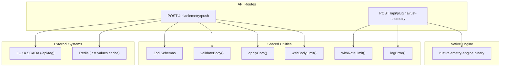
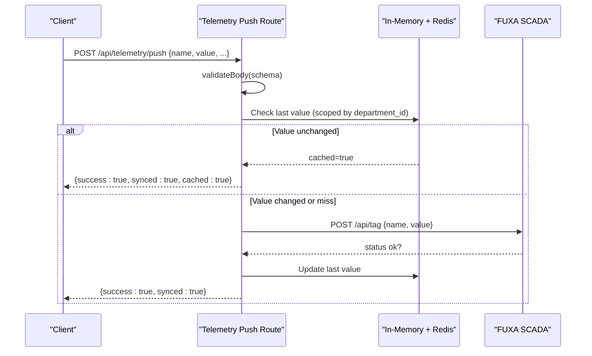
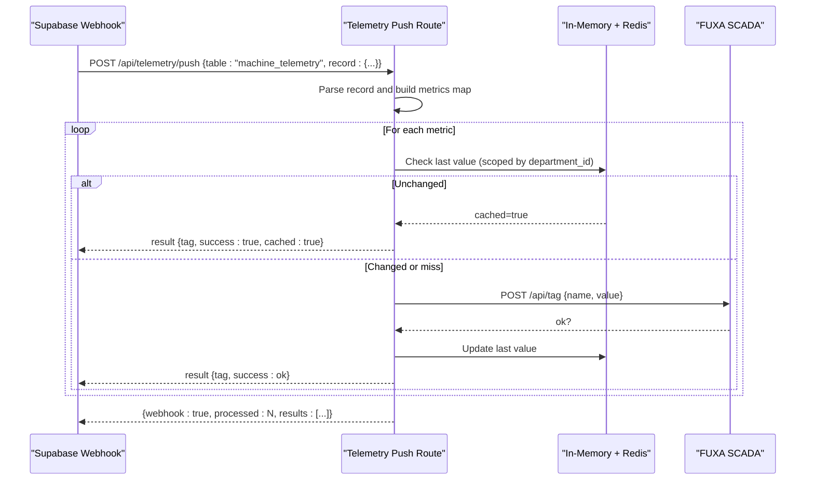
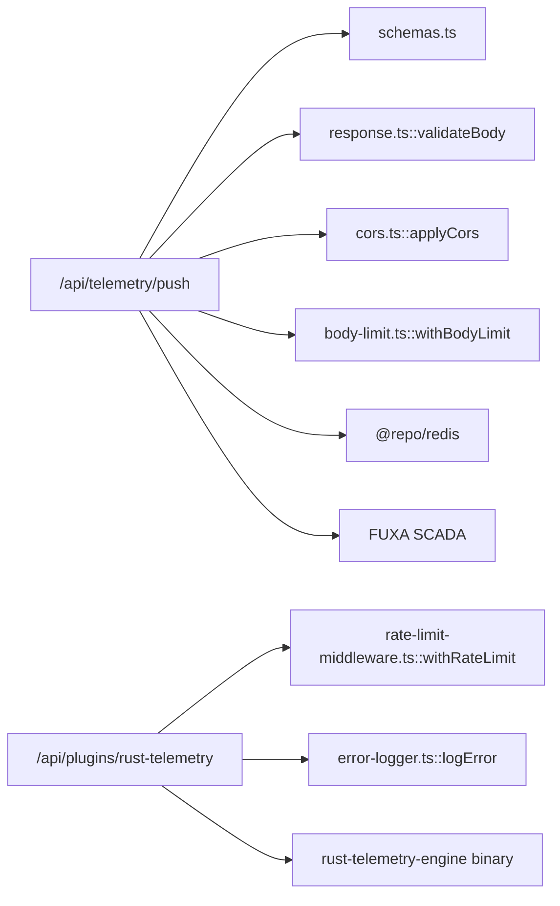

# Telemetry Ingestion API

<cite>
**Referenced Files in This Document**
- [route.ts](file://apps/portal/app/api/telemetry/push/route.ts)
- [schemas.ts](file://apps/portal/lib/api/schemas.ts)
- [response.ts](file://apps/portal/lib/api/response.ts)
- [cors.ts](file://apps/portal/lib/api/cors.ts)
- [body-limit.ts](file://apps/portal/lib/api/body-limit.ts)
- [rate-limit-middleware.ts](file://apps/portal/lib/api/rate-limit-middleware.ts)
- [error-logger.ts](file://apps/portal/lib/errors/error-logger.ts)
- [route.ts](file://apps/portal/app/api/plugins/rust-telemetry/route.ts)
- [main.rs](file://apps/portal/plugins/rust-telemetry-engine/src/main.rs)
- [Cargo.toml](file://apps/portal/plugins/rust-telemetry-engine/Cargo.toml)
</cite>

## Table of Contents
1. [Introduction](#introduction)
2. [Project Structure](#project-structure)
3. [Core Components](#core-components)
4. [Architecture Overview](#architecture-overview)
5. [Detailed Component Analysis](#detailed-component-analysis)
6. [Dependency Analysis](#dependency-analysis)
7. [Performance Considerations](#performance-considerations)
8. [Troubleshooting Guide](#troubleshooting-guide)
9. [Conclusion](#conclusion)

## Introduction
This document provides detailed API documentation for telemetry ingestion endpoints, including:
- The HTTP telemetry push endpoint for machine metrics, sensor readings, and operational data
- Batch processing via Supabase database webhook payloads
- Real-time streaming considerations
- The Rust telemetry plugin endpoint for high-performance analysis
- Request body specifications, validation, caching strategies, rate limiting, error handling, and performance guidance

## Project Structure
The telemetry ingestion features are implemented as Next.js App Router API routes with shared utilities for validation, CORS, body size limits, and rate limiting. A native Rust engine is invoked for advanced analytics when available.



**Diagram sources**
- [route.ts:1-49](file://apps/portal/app/api/telemetry/push/route.ts#L1-L49)
- [schemas.ts:88-95](file://apps/portal/lib/api/schemas.ts#L88-L95)
- [response.ts:4-31](file://apps/portal/lib/api/response.ts#L4-L31)
- [cors.ts:3-18](file://apps/portal/lib/api/cors.ts#L3-L18)
- [body-limit.ts:3-17](file://apps/portal/lib/api/body-limit.ts#L3-L17)
- [rate-limit-middleware.ts:225-290](file://apps/portal/lib/api/rate-limit-middleware.ts#L225-L290)
- [error-logger.ts:158-174](file://apps/portal/lib/errors/error-logger.ts#L158-L174)
- [route.ts:14-92](file://apps/portal/app/api/plugins/rust-telemetry/route.ts#L14-L92)
- [main.rs:1-69](file://apps/portal/plugins/rust-telemetry-engine/src/main.rs#L1-L69)

**Section sources**
- [route.ts:1-49](file://apps/portal/app/api/telemetry/push/route.ts#L1-L49)
- [schemas.ts:88-95](file://apps/portal/lib/api/schemas.ts#L88-L95)
- [response.ts:4-31](file://apps/portal/lib/api/response.ts#L4-L31)
- [cors.ts:3-18](file://apps/portal/lib/api/cors.ts#L3-L18)
- [body-limit.ts:3-17](file://apps/portal/lib/api/body-limit.ts#L3-L17)
- [rate-limit-middleware.ts:225-290](file://apps/portal/lib/api/rate-limit-middleware.ts#L225-L290)
- [error-logger.ts:158-174](file://apps/portal/lib/errors/error-logger.ts#L158-L174)
- [route.ts:14-92](file://apps/portal/app/api/plugins/rust-telemetry/route.ts#L14-L92)
- [main.rs:1-69](file://apps/portal/plugins/rust-telemetry-engine/src/main.rs#L1-L69)

## Core Components
- Telemetry Push Endpoint: Accepts single tag updates or batched webhook payloads; validates input; caches last values to avoid redundant writes; forwards changes to FUXA SCADA.
- Rust Telemetry Plugin Endpoint: Authenticates requests, invokes a native Rust binary for wear/failure probability analysis, and falls back to a JavaScript emulator if the binary is unavailable.
- Shared Validation and Middleware: Zod schemas, request validation, CORS headers, body size limits, distributed rate limiting, and structured error logging.

Key responsibilities:
- Input validation and sanitization
- Change detection and caching (in-memory L1 + Redis L2)
- External integration to FUXA SCADA
- High-performance analytics via native Rust
- Rate limiting and robust error handling

**Section sources**
- [route.ts:40-214](file://apps/portal/app/api/telemetry/push/route.ts#L40-L214)
- [schemas.ts:88-95](file://apps/portal/lib/api/schemas.ts#L88-L95)
- [response.ts:4-31](file://apps/portal/lib/api/response.ts#L4-L31)
- [cors.ts:3-18](file://apps/portal/lib/api/cors.ts#L3-L18)
- [body-limit.ts:3-17](file://apps/portal/lib/api/body-limit.ts#L3-L17)
- [rate-limit-middleware.ts:225-290](file://apps/portal/lib/api/rate-limit-middleware.ts#L225-L290)
- [error-logger.ts:158-174](file://apps/portal/lib/errors/error-logger.ts#L158-L174)
- [route.ts:14-92](file://apps/portal/app/api/plugins/rust-telemetry/route.ts#L14-L92)
- [main.rs:1-69](file://apps/portal/plugins/rust-telemetry-engine/src/main.rs#L1-L69)

## Architecture Overview
The telemetry ingestion pipeline supports two primary flows:
- Direct tag update flow: Client sends a single metric; the service validates, checks cache, and forwards only changed values to FUXA.
- Webhook batch flow: Supabase database webhook triggers multiple metrics; each is validated and forwarded individually after change detection.



**Diagram sources**
- [route.ts:51-214](file://apps/portal/app/api/telemetry/push/route.ts#L51-L214)
- [schemas.ts:88-95](file://apps/portal/lib/api/schemas.ts#L88-L95)
- [response.ts:4-31](file://apps/portal/lib/api/response.ts#L4-L31)

## Detailed Component Analysis

### Telemetry Push Endpoint: POST /api/telemetry/push
- Purpose: Accept telemetry data for real-time ingestion into FUXA SCADA with change detection and caching.
- HTTP Method: POST
- Content-Type: application/json
- Body Limit: Enforced up to 10 MB per request.
- Authentication: Not required for this endpoint.
- CORS: Applied automatically.

Request Body (Direct Single Tag):
- name: string, required, max length 200
- value: number or string, required
- timestamp: optional ISO datetime string
- machine_id: optional UUID
- department_id: optional UUID
- tags: optional key-value map

Response:
- On success: { success: true, synced: true } or { success: true, synced: true, cached: true }
- On validation failure: 400 with error details
- On upstream errors: 200 with warning and synced: false
- On server error: 500 with error message

Batch Processing (Supabase Database Webhook):
- Detects payload shape with table === "machine_telemetry" and record fields.
- Maps numeric fields to tag names using machine_id and field keys.
- For each non-null metric, performs change detection and forwards to FUXA.
- Returns { webhook: true, processed: N, results: [...] }.

Real-Time Streaming Support:
- Designed for high-frequency point-in-time updates.
- Change detection minimizes network calls and downstream writes.
- For continuous streams, clients should send frequent small payloads; batching at the client side can reduce overhead.

Examples of Data Formats:
- Direct single tag:
  - { "name": "machine_1_engine_rpm", "value": 1200, "department_id": "<uuid>" }
- Webhook batch:
  - { "table": "machine_telemetry", "record": { "machine_id": "<uuid>", "department_id": "<uuid>", "engine_rpm": 1500, "engine_temp": 92.4, "hydraulic_pressure": 210.5, "vibration_level": 0.12, "fuel_level": 82.5, "bit_depth": 14.2 } }

Timestamp Handling:
- Optional timestamp field accepted; not used for ordering in this implementation.
- Clients may include timestamps for external correlation.

Device Identification:
- Use machine_id and department_id to scope cache keys and downstream tags.
- Tag naming convention derived from machine_id and metric key.

Validation and Error Handling:
- Schema validation enforces types and formats.
- Missing required fields return 400 with descriptive errors.
- Upstream failures return 200 with warnings to keep ingestion resilient.

Caching Strategy:
- L1: In-process Map keyed by department_id:name for fast deduplication.
- L2: Redis store with 24-hour TTL for cross-process persistence.
- Only changed values are forwarded to FUXA.

Rate Limiting:
- Not applied to this endpoint by default.
- If needed, wrap with withRateLimit middleware.

Security:
- No authentication required; ensure network-level access controls.
- CORS headers allow configured origins.

**Section sources**
- [route.ts:40-214](file://apps/portal/app/api/telemetry/push/route.ts#L40-L214)
- [schemas.ts:88-95](file://apps/portal/lib/api/schemas.ts#L88-L95)
- [response.ts:4-31](file://apps/portal/lib/api/response.ts#L4-L31)
- [cors.ts:3-18](file://apps/portal/lib/api/cors.ts#L3-L18)
- [body-limit.ts:3-17](file://apps/portal/lib/api/body-limit.ts#L3-L17)

#### Sequence Diagram: Webhook Batch Flow


**Diagram sources**
- [route.ts:51-139](file://apps/portal/app/api/telemetry/push/route.ts#L51-L139)

### Rust Telemetry Plugin Endpoint: POST /api/plugins/rust-telemetry
- Purpose: Compute wear index, failure probability, remaining useful life, and health status using a native Rust engine when available.
- HTTP Method: POST
- Authentication: Requires authenticated user via Supabase auth.
- Rate Limiting: Enforced via withRateLimit middleware.
- Fallback: JavaScript-based emulator if native binary is missing.

Request Body:
- hours: number, optional (default 150.0)
- temp: number, optional (default 55.0)
- rpm: number, optional (default 1000.0)

Response:
- Fields: wearIndex, probability, rulHours, status, isNative
- On error: includes error message and fallback values

Native Binary Invocation:
- Executes rust-telemetry-engine with CLI arguments --hours, --temp, --rpm.
- Parses JSON output from stdout.

JavaScript Emulator:
- Computes wear and probability using logistic regression-like formula.
- Provides deterministic fallback behavior.

Error Handling:
- Errors are logged with structured context and returned with safe defaults.

**Section sources**
- [route.ts:14-92](file://apps/portal/app/api/plugins/rust-telemetry/route.ts#L14-L92)
- [rate-limit-middleware.ts:225-290](file://apps/portal/lib/api/rate-limit-middleware.ts#L225-L290)
- [error-logger.ts:158-174](file://apps/portal/lib/errors/error-logger.ts#L158-L174)
- [main.rs:1-69](file://apps/portal/plugins/rust-telemetry-engine/src/main.rs#L1-L69)
- [Cargo.toml:1-15](file://apps/portal/plugins/rust-telemetry-engine/Cargo.toml#L1-L15)

#### Class Diagram: Rust Telemetry Pipeline
```mermaid
classDiagram
class RustTelemetryRoute {
+POST(req) NextResponse
-handleTelemetryRequest(req) NextResponse
}
class NativeEngine {
+CLI args : "--hours", "--temp", "--rpm"
+stdout : JSON {wearIndex, probability, rulHours, status}
}
class JSFallback {
+computeWear(hours, temp, rpm)
+computeProbability(wearIndex)
+classifyStatus(probability)
}
RustTelemetryRoute --> NativeEngine : "execFileAsync()"
RustTelemetryRoute --> JSFallback : "fallback if binary missing"
```

**Diagram sources**
- [route.ts:14-92](file://apps/portal/app/api/plugins/rust-telemetry/route.ts#L14-L92)
- [main.rs:1-69](file://apps/portal/plugins/rust-telemetry-engine/src/main.rs#L1-L69)

### Data Schemas and Validation
- Telemetry Push Schema:
  - name: string, required, max 200
  - value: number|string, required
  - timestamp: optional ISO datetime
  - machine_id: optional UUID
  - department_id: optional UUID
  - tags: optional object

- Validation Utility:
  - validateBody(request, schema) returns parsed data or 400 error with details.

**Section sources**
- [schemas.ts:88-95](file://apps/portal/lib/api/schemas.ts#L88-L95)
- [response.ts:4-31](file://apps/portal/lib/api/response.ts#L4-L31)

### Rate Limiting and Security
- Rate Limiting:
  - withRateLimit wraps handlers, applies sliding window or token bucket strategies, and sets standard headers.
  - Supports IP whitelisting and load-adaptive throttling.
- CORS:
  - applyCors adds Access-Control-Allow-Origin, Methods, and Headers.
- Body Size Limits:
  - withBodyLimit rejects oversized payloads with 413.

**Section sources**
- [rate-limit-middleware.ts:225-290](file://apps/portal/lib/api/rate-limit-middleware.ts#L225-L290)
- [cors.ts:3-18](file://apps/portal/lib/api/cors.ts#L3-L18)
- [body-limit.ts:3-17](file://apps/portal/lib/api/body-limit.ts#L3-L17)

## Dependency Analysis


**Diagram sources**
- [route.ts:1-49](file://apps/portal/app/api/telemetry/push/route.ts#L1-L49)
- [schemas.ts:88-95](file://apps/portal/lib/api/schemas.ts#L88-L95)
- [response.ts:4-31](file://apps/portal/lib/api/response.ts#L4-L31)
- [cors.ts:3-18](file://apps/portal/lib/api/cors.ts#L3-L18)
- [body-limit.ts:3-17](file://apps/portal/lib/api/body-limit.ts#L3-L17)
- [rate-limit-middleware.ts:225-290](file://apps/portal/lib/api/rate-limit-middleware.ts#L225-L290)
- [error-logger.ts:158-174](file://apps/portal/lib/errors/error-logger.ts#L158-L174)
- [route.ts:14-92](file://apps/portal/app/api/plugins/rust-telemetry/route.ts#L14-L92)

**Section sources**
- [route.ts:1-49](file://apps/portal/app/api/telemetry/push/route.ts#L1-L49)
- [schemas.ts:88-95](file://apps/portal/lib/api/schemas.ts#L88-L95)
- [response.ts:4-31](file://apps/portal/lib/api/response.ts#L4-L31)
- [cors.ts:3-18](file://apps/portal/lib/api/cors.ts#L3-L18)
- [body-limit.ts:3-17](file://apps/portal/lib/api/body-limit.ts#L3-L17)
- [rate-limit-middleware.ts:225-290](file://apps/portal/lib/api/rate-limit-middleware.ts#L225-L290)
- [error-logger.ts:158-174](file://apps/portal/lib/errors/error-logger.ts#L158-L174)
- [route.ts:14-92](file://apps/portal/app/api/plugins/rust-telemetry/route.ts#L14-L92)

## Performance Considerations
- Change Detection:
  - Avoid redundant writes by comparing against last known values in L1 and L2 caches.
- Caching Strategy:
  - Use in-memory Map for low-latency checks within a process.
  - Persist last values in Redis with TTL to survive process restarts and scale horizontally.
- Batching:
  - Prefer sending multiple metrics in a single webhook payload to reduce round trips.
- Rate Limiting:
  - Apply withRateLimit on high-throughput endpoints to protect resources.
- Native Engine:
  - Ensure rust-telemetry-engine binary is compiled and present for optimal performance.
- Monitoring:
  - Log errors with structured context for observability.
  - Track cache hit rates and upstream response times.

[No sources needed since this section provides general guidance]

## Troubleshooting Guide
Common issues and resolutions:
- Validation Errors:
  - 400 responses include details about invalid fields; verify schema compliance.
- Missing Required Fields:
  - Ensure name and value are provided for direct tag updates.
- Upstream Failures:
  - 200 responses with warnings indicate FUXA unreachable or error status; check FUXA availability and credentials.
- Rate Limit Exceeded:
  - 429 responses include Retry-After header; implement exponential backoff.
- Large Payloads:
  - 413 responses indicate body too large; split into smaller batches.
- Native Engine Issues:
  - If binary is missing, fallback emulator is used; compile and deploy rust-telemetry-engine for native performance.

**Section sources**
- [response.ts:4-31](file://apps/portal/lib/api/response.ts#L4-L31)
- [route.ts:141-214](file://apps/portal/app/api/telemetry/push/route.ts#L141-L214)
- [rate-limit-middleware.ts:263-290](file://apps/portal/lib/api/rate-limit-middleware.ts#L263-L290)
- [body-limit.ts:3-17](file://apps/portal/lib/api/body-limit.ts#L3-L17)
- [route.ts:55-92](file://apps/portal/app/api/plugins/rust-telemetry/route.ts#L55-L92)
- [error-logger.ts:158-174](file://apps/portal/lib/errors/error-logger.ts#L158-L174)

## Conclusion
The telemetry ingestion system provides robust, scalable endpoints for real-time data collection with efficient change detection, caching, and resilience to upstream failures. The Rust plugin offers high-performance analytics with graceful fallbacks. By adhering to the documented schemas, leveraging batching, and applying rate limiting and monitoring, teams can achieve reliable, high-volume telemetry ingestion.

[No sources needed since this section summarizes without analyzing specific files]