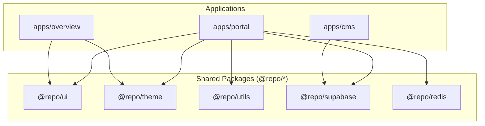
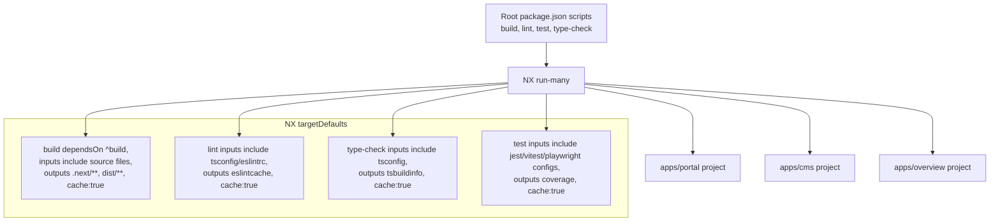
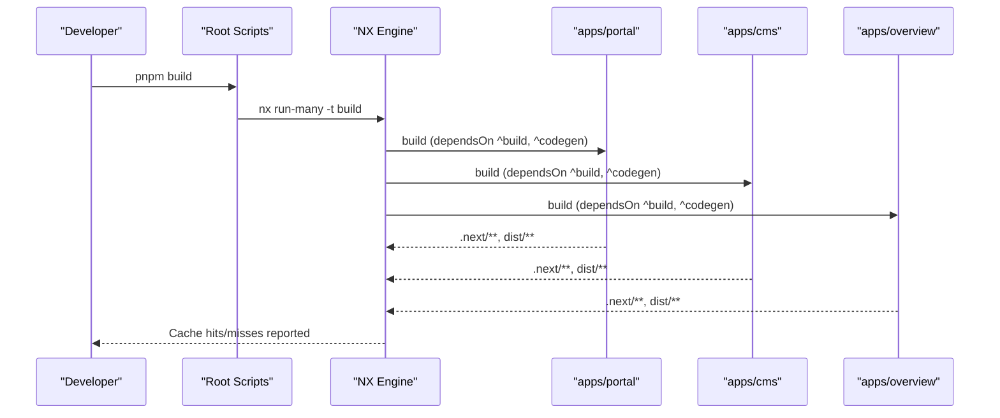
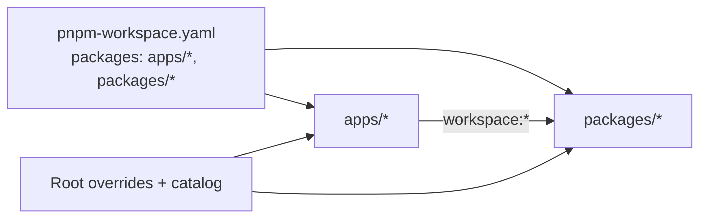
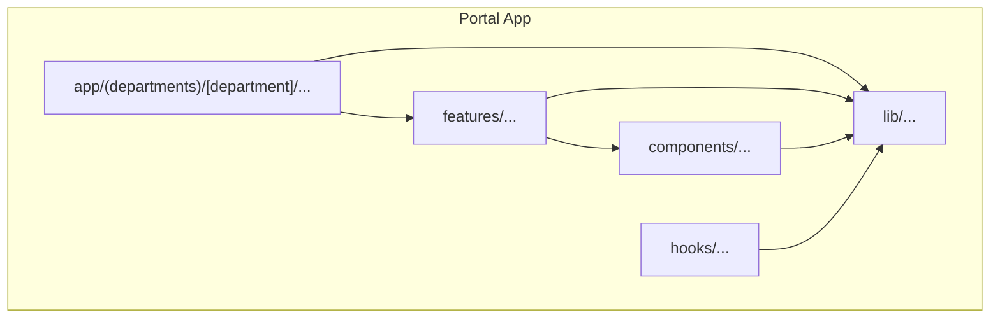
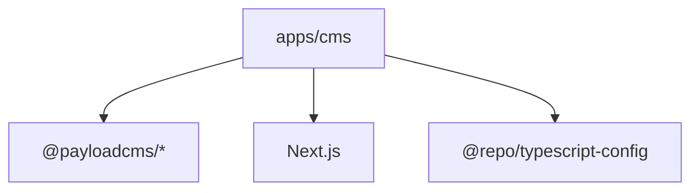
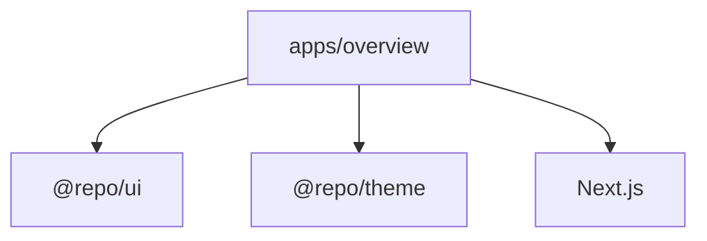
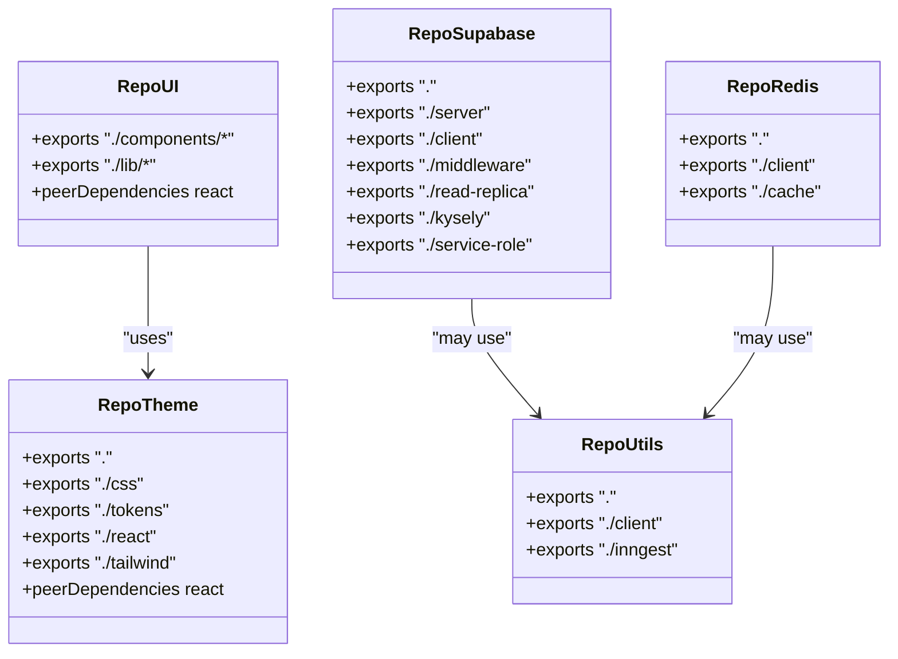
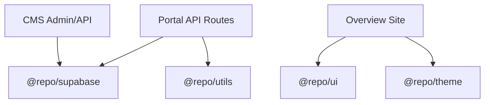
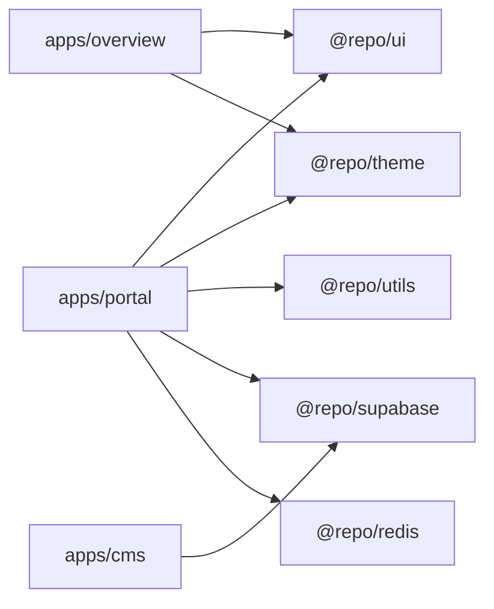

# Application Structure & Organization

<cite>
**Referenced Files in This Document**
- [package.json](file://package.json)
- [nx.json](file://nx.json)
- [pnpm-workspace.yaml](file://pnpm-workspace.yaml)
- [apps/portal/package.json](file://apps/portal/package.json)
- [apps/cms/package.json](file://apps/cms/package.json)
- [apps/overview/package.json](file://apps/overview/package.json)
- [apps/portal/project.json](file://apps/portal/project.json)
- [apps/cms/project.json](file://apps/cms/project.json)
- [apps/overview/project.json](file://apps/overview/project.json)
- [packages/ui/package.json](file://packages/ui/package.json)
- [packages/utils/package.json](file://packages/utils/package.json)
- [packages/theme/package.json](file://packages/theme/package.json)
- [packages/supabase/package.json](file://packages/supabase/package.json)
- [packages/redis/package.json](file://packages/redis/package.json)
</cite>

## Table of Contents
1. [Introduction](#introduction)
2. [Project Structure](#project-structure)
3. [Core Components](#core-components)
4. [Architecture Overview](#architecture-overview)
5. [Detailed Component Analysis](#detailed-component-analysis)
6. [Dependency Analysis](#dependency-analysis)
7. [Performance Considerations](#performance-considerations)
8. [Troubleshooting Guide](#troubleshooting-guide)
9. [Conclusion](#conclusion)

## Introduction
This document explains the monorepo layout and organization across applications, shared packages, and build orchestration. It focuses on:
- The apps/portal, apps/cms, and apps/overview structure
- NX-driven builds and caching across all applications
- Feature-based organization within the portal app (department routing, features/, lib/)
- Package sharing via @repo/* packages and how apps communicate through shared interfaces and APIs
- Build pipeline configuration, pnpm workspaces dependency management, and code sharing patterns

## Project Structure
The repository is a pnpm workspace with three Next.js applications and multiple shared packages:
- apps/portal: Main operational application with feature-based organization and department routes
- apps/cms: Content Management System built with Payload CMS
- apps/overview: A lightweight overview site showcasing architecture and system information

**Diagram sources**
- [apps/portal/package.json](file://apps/portal/package.json)
- [apps/cms/package.json](file://apps/cms/package.json)
- [apps/overview/package.json](file://apps/overview/package.json)
- [packages/ui/package.json](file://packages/ui/package.json)
- [packages/theme/package.json](file://packages/theme/package.json)
- [packages/utils/package.json](file://packages/utils/package.json)
- [packages/supabase/package.json](file://packages/supabase/package.json)
- [packages/redis/package.json](file://packages/redis/package.json)

**Section sources**
- [package.json](file://package.json)
- [pnpm-workspace.yaml](file://pnpm-workspace.yaml)
- [apps/portal/package.json](file://apps/portal/package.json)
- [apps/cms/package.json](file://apps/cms/package.json)
- [apps/overview/package.json](file://apps/overview/package.json)

## Core Components
- Applications
  - Portal: Full-featured Next.js app with App Router, API routes, and feature modules
  - CMS: Payload CMS Next.js app for content administration
  - Overview: Static overview site using shared theme and UI components
- Shared Packages
  - @repo/ui: Reusable UI components and design tokens integration
  - @repo/theme: Theme, tokens, Tailwind preset, and CSS exports
  - @repo/utils: Cross-cutting utilities and integrations (e.g., Inngest client)
  - @repo/supabase: Supabase client/server helpers, middleware, Kysely setup
  - @repo/redis: Redis client and cache utilities

Key responsibilities:
- Apps depend on @repo/* packages to share UI, theme, data access, and utilities
- Each app declares its own scripts for dev/build/lint/type-check
- Workspace-level scripts orchestrate tasks across all projects

**Section sources**
- [apps/portal/package.json](file://apps/portal/package.json)
- [apps/cms/package.json](file://apps/cms/package.json)
- [apps/overview/package.json](file://apps/overview/package.json)
- [packages/ui/package.json](file://packages/ui/package.json)
- [packages/theme/package.json](file://packages/theme/package.json)
- [packages/utils/package.json](file://packages/utils/package.json)
- [packages/supabase/package.json](file://packages/supabase/package.json)
- [packages/redis/package.json](file://packages/redis/package.json)

## Architecture Overview
NX orchestrates builds, linting, type checks, and tests across the workspace. Target defaults define inputs, outputs, and caching behavior. Workspace scripts delegate to NX to run targets across all projects.

**Diagram sources**
- [package.json](file://package.json)
- [nx.json](file://nx.json)

**Section sources**
- [package.json](file://package.json)
- [nx.json](file://nx.json)

## Detailed Component Analysis

### Monorepo Orchestration with NX
- Named inputs and target defaults configure caching and incremental builds
- Build target depends on upstream dependencies (^build) and codegen where applicable
- Lint, type-check, and test targets are cached based on well-defined inputs/outputs
- Default base branch and analytics are configured at the workspace level

**Diagram sources**
- [package.json](file://package.json)
- [nx.json](file://nx.json)

**Section sources**
- [nx.json](file://nx.json)
- [package.json](file://package.json)

### PNPM Workspaces and Dependency Management
- Workspace includes apps/* and packages/*
- Catalogs centralize versions for common dependencies (React, Tailwind, ESLint, etc.)
- Apps consume shared packages via workspace:* protocol
- Root overrides enforce security patches and version constraints

**Diagram sources**
- [pnpm-workspace.yaml](file://pnpm-workspace.yaml)
- [package.json](file://package.json)

**Section sources**
- [pnpm-workspace.yaml](file://pnpm-workspace.yaml)
- [package.json](file://package.json)

### Portal App: Feature-Based Organization
The portal app follows a feature-based pattern:
- Department-specific routes under (departments)/[department]
- Feature modules under features/ (e.g., departments, hub, admin, analytics, webhooks)
- Cross-cutting concerns in lib/ (API clients, environment, audit, shift logic, monitoring)
- Shared UI and system components in components/
- Hooks in hooks/ for reusable stateful logic

**Diagram sources**
- [apps/portal/package.json](file://apps/portal/package.json)

**Section sources**
- [apps/portal/package.json](file://apps/portal/package.json)

### CMS App: Payload CMS Integration
- Built on Payload CMS with Next.js adapter
- Provides admin interface and API endpoints
- Uses shared TypeScript config from workspace

**Diagram sources**
- [apps/cms/package.json](file://apps/cms/package.json)

**Section sources**
- [apps/cms/package.json](file://apps/cms/package.json)

### Overview App: Lightweight Showcase
- Minimal Next.js app leveraging shared theme and UI
- Displays architecture diagrams and system info
- Uses shared Tailwind and Radix UI primitives

**Diagram sources**
- [apps/overview/package.json](file://apps/overview/package.json)
- [packages/ui/package.json](file://packages/ui/package.json)
- [packages/theme/package.json](file://packages/theme/package.json)

**Section sources**
- [apps/overview/package.json](file://apps/overview/package.json)
- [packages/ui/package.json](file://packages/ui/package.json)
- [packages/theme/package.json](file://packages/theme/package.json)

### Shared Packages Strategy (@repo/*)
- @repo/ui: Exposes components, motion primitives, and design-system utilities
- @repo/theme: Exposes tokens, CSS, React context, and Tailwind preset
- @repo/utils: Exposes shared utilities and integrations (e.g., Inngest client)
- @repo/supabase: Exposes typed client/server helpers, middleware, read replicas, and Kysely setup
- @repo/redis: Exposes Redis client and cache abstractions

**Diagram sources**
- [packages/ui/package.json](file://packages/ui/package.json)
- [packages/theme/package.json](file://packages/theme/package.json)
- [packages/utils/package.json](file://packages/utils/package.json)
- [packages/supabase/package.json](file://packages/supabase/package.json)
- [packages/redis/package.json](file://packages/redis/package.json)

**Section sources**
- [packages/ui/package.json](file://packages/ui/package.json)
- [packages/theme/package.json](file://packages/theme/package.json)
- [packages/utils/package.json](file://packages/utils/package.json)
- [packages/supabase/package.json](file://packages/supabase/package.json)
- [packages/redis/package.json](file://packages/redis/package.json)

### Inter-Application Communication Patterns
- Through shared packages:
  - Data access and types via @repo/supabase and @repo/utils
  - UI consistency via @repo/ui and @repo/theme
- Through APIs:
  - Portal exposes internal API routes for services and integrations
  - CMS provides its own admin and API surface
  - Overview remains static and consumes shared assets/components

**Diagram sources**
- [apps/portal/package.json](file://apps/portal/package.json)
- [apps/cms/package.json](file://apps/cms/package.json)
- [apps/overview/package.json](file://apps/overview/package.json)
- [packages/supabase/package.json](file://packages/supabase/package.json)
- [packages/utils/package.json](file://packages/utils/package.json)
- [packages/ui/package.json](file://packages/ui/package.json)
- [packages/theme/package.json](file://packages/theme/package.json)

**Section sources**
- [apps/portal/package.json](file://apps/portal/package.json)
- [apps/cms/package.json](file://apps/cms/package.json)
- [apps/overview/package.json](file://apps/overview/package.json)
- [packages/supabase/package.json](file://packages/supabase/package.json)
- [packages/utils/package.json](file://packages/utils/package.json)
- [packages/ui/package.json](file://packages/ui/package.json)
- [packages/theme/package.json](file://packages/theme/package.json)

## Dependency Analysis
- Application-to-package coupling:
  - Portal depends on @repo/ui, @repo/theme, @repo/utils, @repo/supabase, @repo/redis
  - Overview depends on @repo/ui, @repo/theme
  - CMS depends on Payload ecosystem and shared TypeScript config
- NX tags define scope boundaries for policy enforcement and filtering

**Diagram sources**
- [apps/portal/package.json](file://apps/portal/package.json)
- [apps/overview/package.json](file://apps/overview/package.json)
- [apps/cms/package.json](file://apps/cms/package.json)
- [packages/ui/package.json](file://packages/ui/package.json)
- [packages/theme/package.json](file://packages/theme/package.json)
- [packages/utils/package.json](file://packages/utils/package.json)
- [packages/supabase/package.json](file://packages/supabase/package.json)
- [packages/redis/package.json](file://packages/redis/package.json)

**Section sources**
- [apps/portal/project.json](file://apps/portal/project.json)
- [apps/cms/project.json](file://apps/cms/project.json)
- [apps/overview/project.json](file://apps/overview/project.json)
- [apps/portal/package.json](file://apps/portal/package.json)
- [apps/overview/package.json](file://apps/overview/package.json)
- [apps/cms/package.json](file://apps/cms/package.json)

## Performance Considerations
- NX caching:
  - Build, lint, type-check, and test targets are cached based on defined inputs/outputs
  - Upstream dependency builds are automatically triggered before dependent builds
- Workspace catalogs:
  - Centralized dependency versions reduce duplication and improve install/build times
- Side effects:
  - CSS sideEffects declared in packages ensure proper bundling and tree-shaking

[No sources needed since this section provides general guidance]

## Troubleshooting Guide
- Build failures due to missing upstream builds:
  - Ensure NX target dependencies are respected; rebuild shared packages if necessary
- Type-check errors across apps:
  - Verify tsconfig inheritance and that shared packages expose correct types
- Lint inconsistencies:
  - Confirm eslintrc and shared configs are applied consistently across apps and packages
- Dependency mismatches:
  - Use workspace catalogs and root overrides to align versions; run dependency checks

**Section sources**
- [nx.json](file://nx.json)
- [package.json](file://package.json)
- [pnpm-workspace.yaml](file://pnpm-workspace.yaml)

## Conclusion
This monorepo uses NX and pnpm workspaces to coordinate builds, enforce consistent tooling, and share code across applications. The portal app’s feature-based structure scales departmental functionality while keeping cross-cutting concerns centralized. Shared @repo/* packages provide a clean contract for UI, theme, utilities, and data access, enabling consistent communication between applications and reducing duplication.