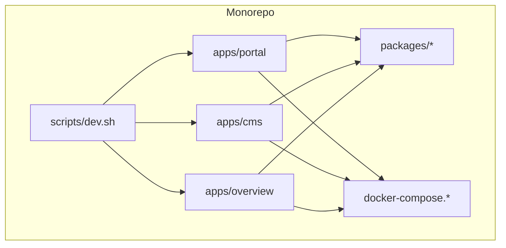
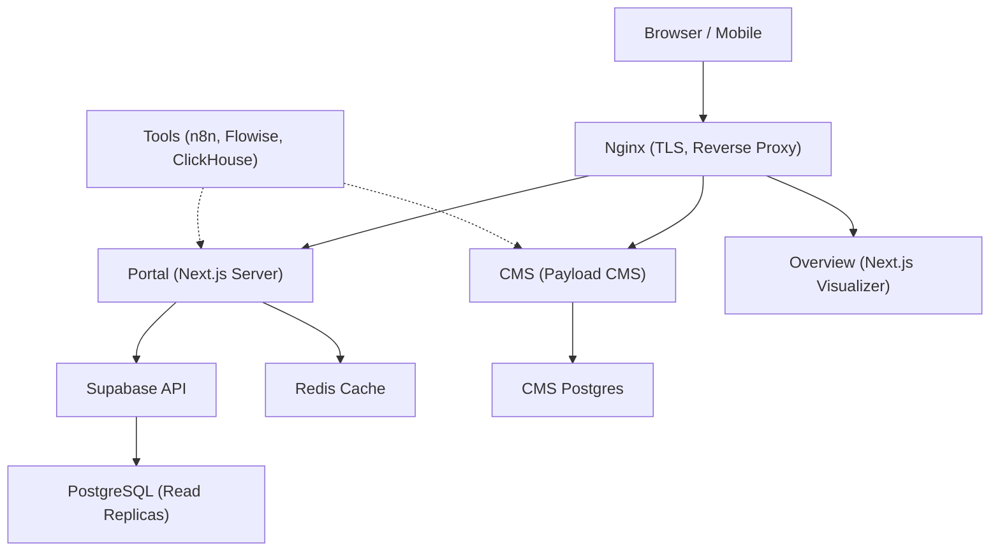
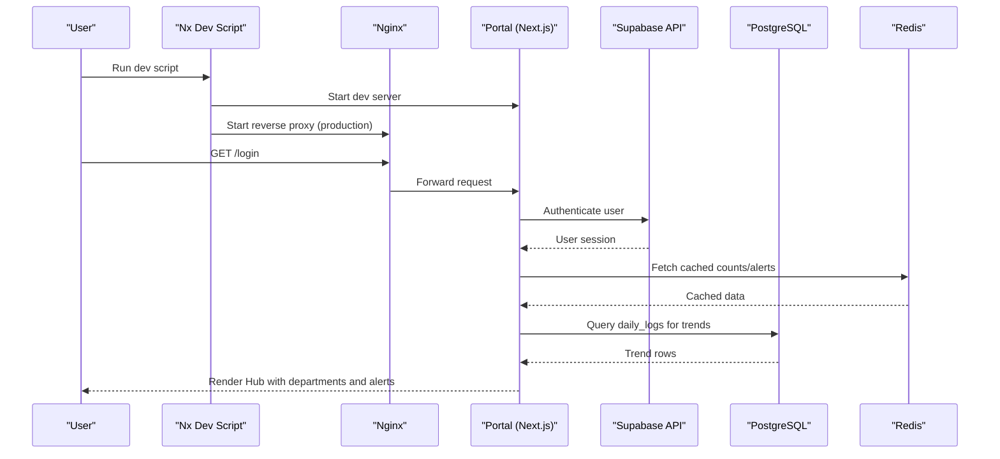
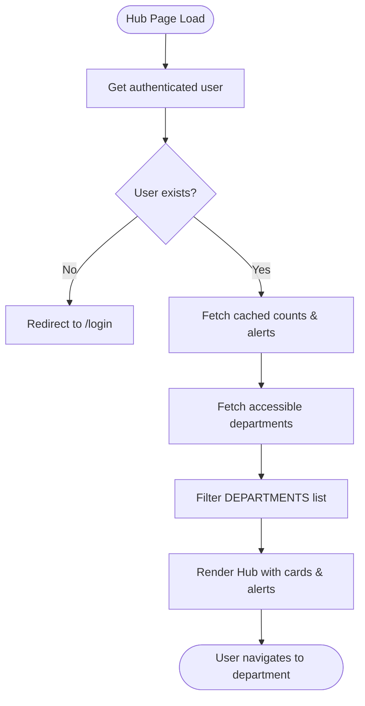
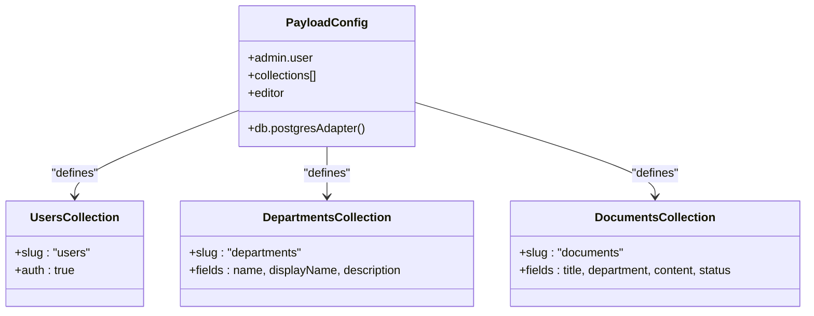
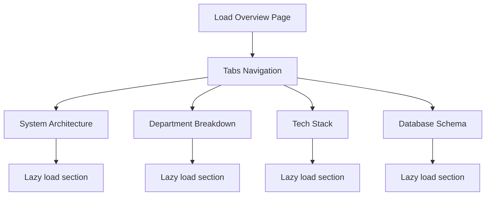
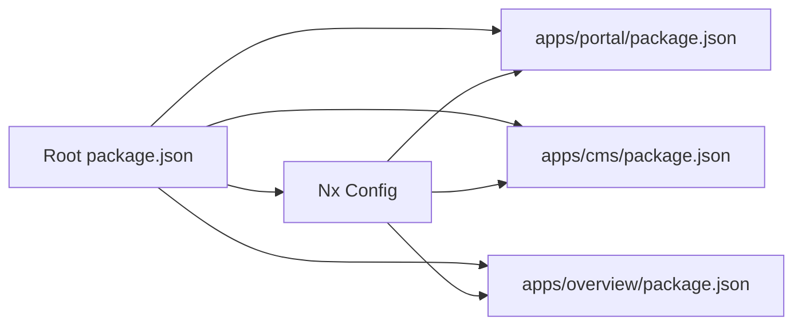

# System Overview

<cite>
**Referenced Files in This Document**
- [README.md](file://README.md)
- [package.json](file://package.json)
- [nx.json](file://nx.json)
- [apps/portal/package.json](file://apps/portal/package.json)
- [apps/cms/package.json](file://apps/cms/package.json)
- [apps/overview/package.json](file://apps/overview/package.json)
- [apps/cms/payload.config.ts](file://apps/cms/payload.config.ts)
- [apps/overview/app/page.tsx](file://apps/overview/app/page.tsx)
- [apps/portal/lib/departments.ts](file://apps/portal/lib/departments.ts)
- [apps/portal/app/(hub)/page.tsx](file://apps/portal/app/(hub)/page.tsx)
- [docker-compose.portal.yml](file://docker-compose.portal.yml)
- [docker-compose.production.yml](file://docker-compose.production.yml)
- [scripts/dev.sh](file://scripts/dev.sh)
- [wiki/entities/arch-systems.md](file://wiki/entities/arch-systems.md)
</cite>

## Table of Contents
1. [Introduction](#introduction)
2. [Project Structure](#project-structure)
3. [Core Components](#core-components)
4. [Architecture Overview](#architecture-overview)
5. [Detailed Component Analysis](#detailed-component-analysis)
6. [Dependency Analysis](#dependency-analysis)
7. [Performance Considerations](#performance-considerations)
8. [Troubleshooting Guide](#troubleshooting-guide)
9. [Conclusion](#conclusion)

## Introduction
Arch-Mk2 is an industrial operations platform for mining sites, delivered as a monorepo with three Next.js applications:
- Portal (Next.js): the primary operations dashboard and departmental workspace
- CMS (Payload CMS v3): headless content management backed by PostgreSQL
- Overview (Next.js): documentation and architecture visualizer

The system provides unified access to eight specialized departments, enabling operators, engineers, safety personnel, training staff, and administrators to collaborate on site operations, maintenance, compliance, and monitoring. The platform emphasizes secure role-based access, real-time operational insights, and consistent design across all user roles.

## Project Structure
At the top level, the repository organizes apps, shared packages, tooling, and deployment assets:
- apps/portal: main operations portal with App Router, authentication, department routes, and API endpoints
- apps/cms: Payload CMS application configured for Postgres-backed collections
- apps/overview: standalone visualization app for architecture, tech stack, and database schema
- packages/*: shared libraries (database migrations, Supabase client wrappers, UI primitives, theme, Redis, rate limiter, errors, utils)
- docker-compose.* files: containerized runtime definitions for production and tools
- scripts/dev.sh: developer orchestration script that boots Supabase, portal, optional CMS/Overview, and performs health checks

**Diagram sources**
- [README.md:1-58](file://README.md#L1-L58)
- [package.json:50-88](file://package.json#L50-L88)
- [nx.json:47-134](file://nx.json#L47-L134)
- [docker-compose.portal.yml:1-36](file://docker-compose.portal.yml#L1-L36)
- [docker-compose.production.yml:1-106](file://docker-compose.production.yml#L1-L106)
- [scripts/dev.sh:566-639](file://scripts/dev.sh#L566-L639)

**Section sources**
- [README.md:1-58](file://README.md#L1-L58)
- [package.json:1-96](file://package.json#L1-L96)
- [nx.json:1-139](file://nx.json#L1-L139)

## Core Components
- Portal (Next.js + React 19): Central hub and department workspaces; integrates Supabase Auth, read replicas, caching, AI assistant, telemetry, and maps. Provides dynamic routing per department and server-side data fetching with Suspense streaming.
- CMS (Payload CMS v3): Headless CMS with Postgres adapter and Lexical rich text editor; manages users, departments, and documents used by the portal and overview.
- Overview (Next.js): Visualization app showcasing system architecture, department breakdown, tech stack, and database schema with lazy-loaded sections.

Key technology highlights:
- Frontend: Next.js 16, React 19, Tailwind CSS, shadcn-style primitives
- Backend: Supabase (PostgreSQL, Auth, Storage), Redis for caching
- Build/Orchestration: Nx 22 + pnpm workspaces
- Observability: OpenTelemetry, Sentry, Highlight.io
- AI: Local Ollama integration for chat and embeddings

**Section sources**
- [apps/portal/package.json:1-76](file://apps/portal/package.json#L1-L76)
- [apps/cms/package.json:1-32](file://apps/cms/package.json#L1-L32)
- [apps/overview/package.json:1-36](file://apps/overview/package.json#L1-L36)
- [apps/cms/payload.config.ts:1-92](file://apps/cms/payload.config.ts#L1-L92)
- [wiki/entities/arch-systems.md:15-41](file://wiki/entities/arch-systems.md#L15-L41)

## Architecture Overview
High-level runtime topology:
- Nginx reverse proxy terminates TLS and forwards requests to the Portal service
- Portal runs as a Next.js server, authenticates via Supabase, reads from read replicas, and writes through RLS policies
- CMS runs independently with its own Postgres connection and admin interface
- Overview runs as a static/SSG-capable Next.js app for documentation visualization
- Optional tools (n8n, Flowise, Redis, ClickHouse) are orchestrated via Docker Compose overlays for production

**Diagram sources**
- [docker-compose.portal.yml:1-36](file://docker-compose.portal.yml#L1-L36)
- [docker-compose.production.yml:1-106](file://docker-compose.production.yml#L1-L106)
- [apps/cms/payload.config.ts:86-91](file://apps/cms/payload.config.ts#L86-L91)
- [apps/portal/app/(hub)/page.tsx:49-94](file://apps/portal/app/(hub)/page.tsx#L49-L94)

## Detailed Component Analysis

### Portal Application
Purpose:
- Central operations hub and departmental dashboards
- Authentication and authorization via Supabase with RLS
- Real-time metrics, alerts, and production trends
- Department-specific tabs and workflows

Key behaviors:
- Hub page aggregates counts, accessible departments, and recent alerts using cached server components
- Production trend data streams via Suspense after shell paints
- Department routing driven by configuration and employee permissions

**Diagram sources**
- [scripts/dev.sh:566-639](file://scripts/dev.sh#L566-L639)
- [docker-compose.portal.yml:1-36](file://docker-compose.portal.yml#L1-L36)
- [apps/portal/app/(hub)/page.tsx:347-381](file://apps/portal/app/(hub)/page.tsx#L347-L381)
- [apps/portal/app/(hub)/page.tsx:382-583](file://apps/portal/app/(hub)/page.tsx#L382-L583)

Department model and routing:
- Eight departments defined with metadata, quick actions, and specialized tab sets
- Control Room, Engineering, Satellite Monitoring, Drilling, Access Control, Training each have tailored tabs
- Dynamic route resolution under (departments)/[department]

**Diagram sources**
- [apps/portal/app/(hub)/page.tsx:347-381](file://apps/portal/app/(hub)/page.tsx#L347-L381)
- [apps/portal/lib/departments.ts:23-168](file://apps/portal/lib/departments.ts#L23-L168)

**Section sources**
- [apps/portal/app/(hub)/page.tsx:1-598](file://apps/portal/app/(hub)/page.tsx#L1-L598)
- [apps/portal/lib/departments.ts:1-310](file://apps/portal/lib/departments.ts#L1-L310)

### CMS Application (Payload CMS v3)
Purpose:
- Manage users, departments, and documents
- Provide structured content for portal and overview

Configuration highlights:
- Postgres adapter for persistence
- Lexical rich text editor
- Collections for users, departments, and documents with relationships and status fields

**Diagram sources**
- [apps/cms/payload.config.ts:10-91](file://apps/cms/payload.config.ts#L10-L91)

**Section sources**
- [apps/cms/payload.config.ts:1-92](file://apps/cms/payload.config.ts#L1-L92)
- [apps/cms/package.json:1-32](file://apps/cms/package.json#L1-L32)

### Overview Application (Documentation Visualizer)
Purpose:
- Present system architecture, department breakdown, tech stack, and database schema
- Lazy-load sections for performance

Structure:
- Tabbed interface with Suspense boundaries
- Sections include SystemArchitecture, DepartmentBreakdown, TechStack, DatabaseSchema

**Diagram sources**
- [apps/overview/app/page.tsx:1-140](file://apps/overview/app/page.tsx#L1-L140)

**Section sources**
- [apps/overview/app/page.tsx:1-140](file://apps/overview/app/page.tsx#L1-L140)
- [apps/overview/package.json:1-36](file://apps/overview/package.json#L1-L36)

## Dependency Analysis
Build and task orchestration:
- Nx defines target defaults for build, lint, type-check, test, and dev with caching and inputs/outputs
- Root package.json centralizes quality gates, deploy scripts, and workspace commands
- Apps declare dependencies on shared packages via workspace references

**Diagram sources**
- [package.json:50-88](file://package.json#L50-L88)
- [nx.json:47-134](file://nx.json#L47-L134)
- [apps/portal/package.json:1-76](file://apps/portal/package.json#L1-L76)
- [apps/cms/package.json:1-32](file://apps/cms/package.json#L1-L32)
- [apps/overview/package.json:1-36](file://apps/overview/package.json#L1-L36)

**Section sources**
- [package.json:1-96](file://package.json#L1-L96)
- [nx.json:1-139](file://nx.json#L1-L139)

## Performance Considerations
- Server-side caching: Hub page uses cachedRSC and Redis categories to reduce DB load and improve response times
- Streaming: Production trend data is hoisted into a Suspense boundary so the shell renders quickly
- Lazy loading: Overview app lazily loads heavy sections to minimize initial bundle size
- Read replicas: Portal queries use read replica clients to offload read traffic from primary DB
- Container resource limits: Production compose overlays set CPU/memory limits and health checks for services

[No sources needed since this section provides general guidance]

## Troubleshooting Guide
Common development issues and resolutions:
- Port conflicts: The dev script detects and prompts to clear occupied ports or kill conflicting processes
- Supabase boot: If not running, the script starts Supabase containers and waits for API readiness
- Health checks: Smoke tests verify /api/health, login page availability, HTML rendering, and static assets
- Environment setup: Ensures .env files exist and warns about placeholder secrets

Operational tips:
- Use --quick mode to skip Docker/Supabase when only testing the portal locally
- Use --cms and --overview flags to start additional apps alongside the portal
- Review logs at portal.log, cms.log, overview.log if startup times out

**Section sources**
- [scripts/dev.sh:392-456](file://scripts/dev.sh#L392-L456)
- [scripts/dev.sh:506-564](file://scripts/dev.sh#L506-L564)
- [scripts/dev.sh:645-683](file://scripts/dev.sh#L645-L683)
- [scripts/dev.sh:629-643](file://scripts/dev.sh#L629-L643)

## Conclusion
Arch-Mk2 unifies industrial operations across eight departments through a cohesive monorepo architecture. The Portal serves as the primary interface, the CMS manages structured content, and the Overview app provides architectural clarity. With strong emphasis on security (RLS), performance (caching, streaming, read replicas), and operational reliability (Docker Compose overlays, health checks), the platform supports both beginners exploring the system and experienced developers maintaining and extending it.