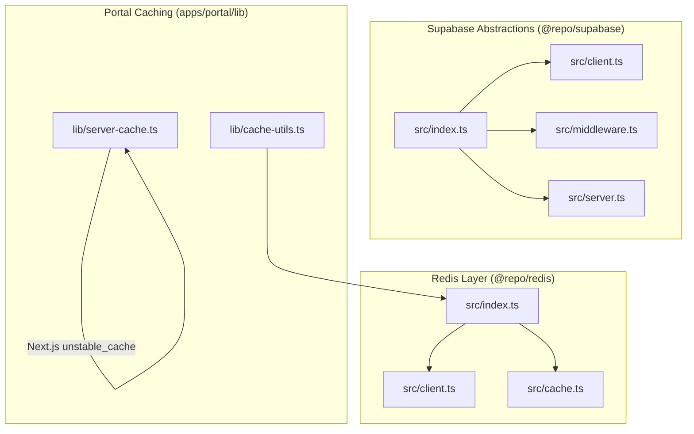
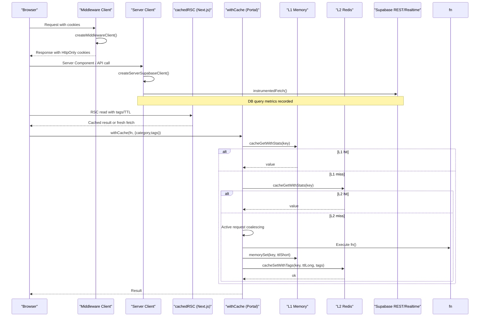
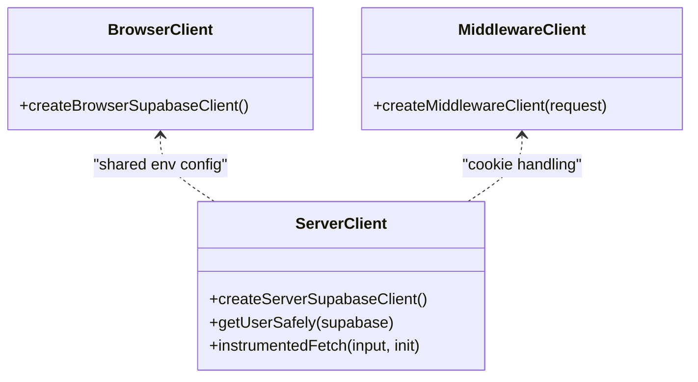
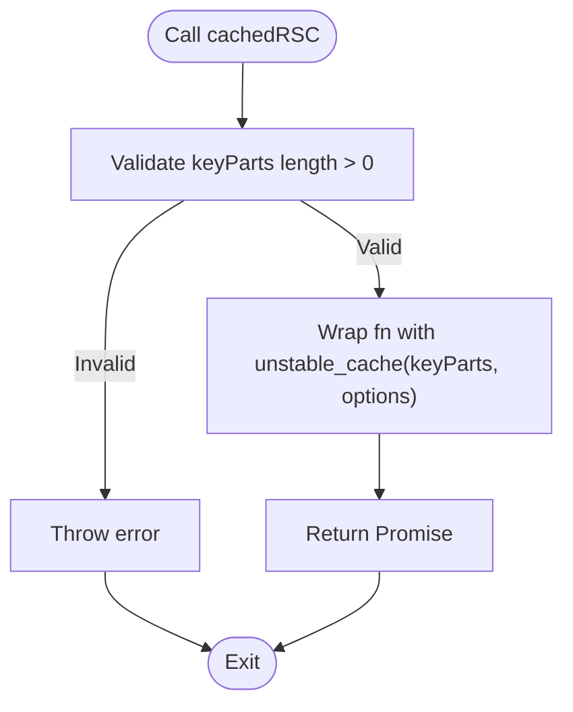
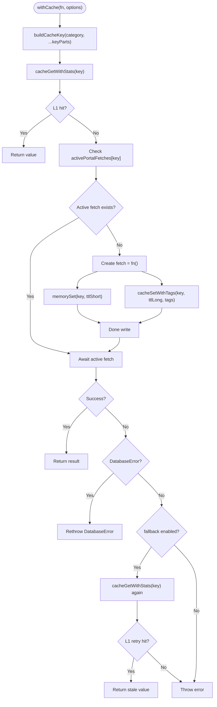
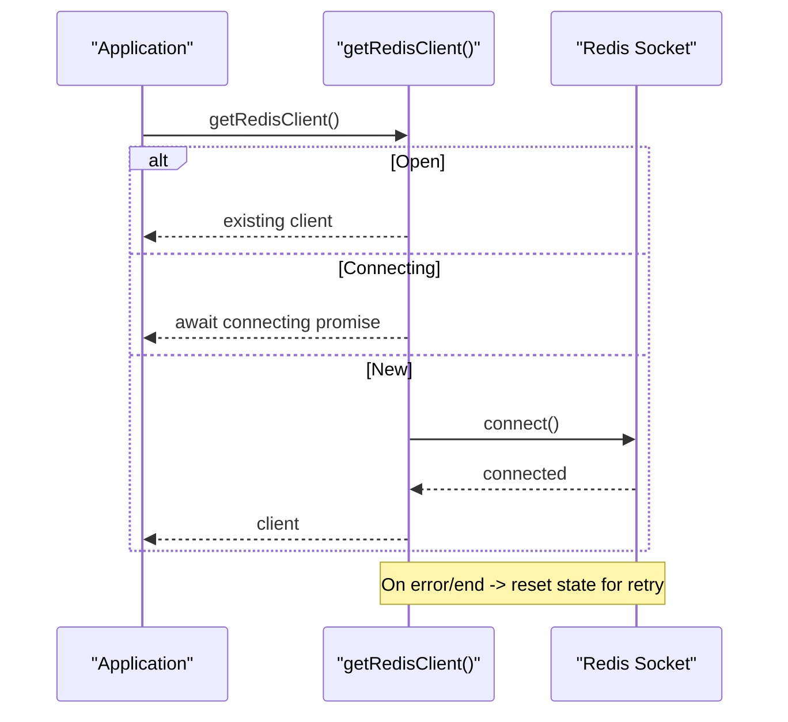
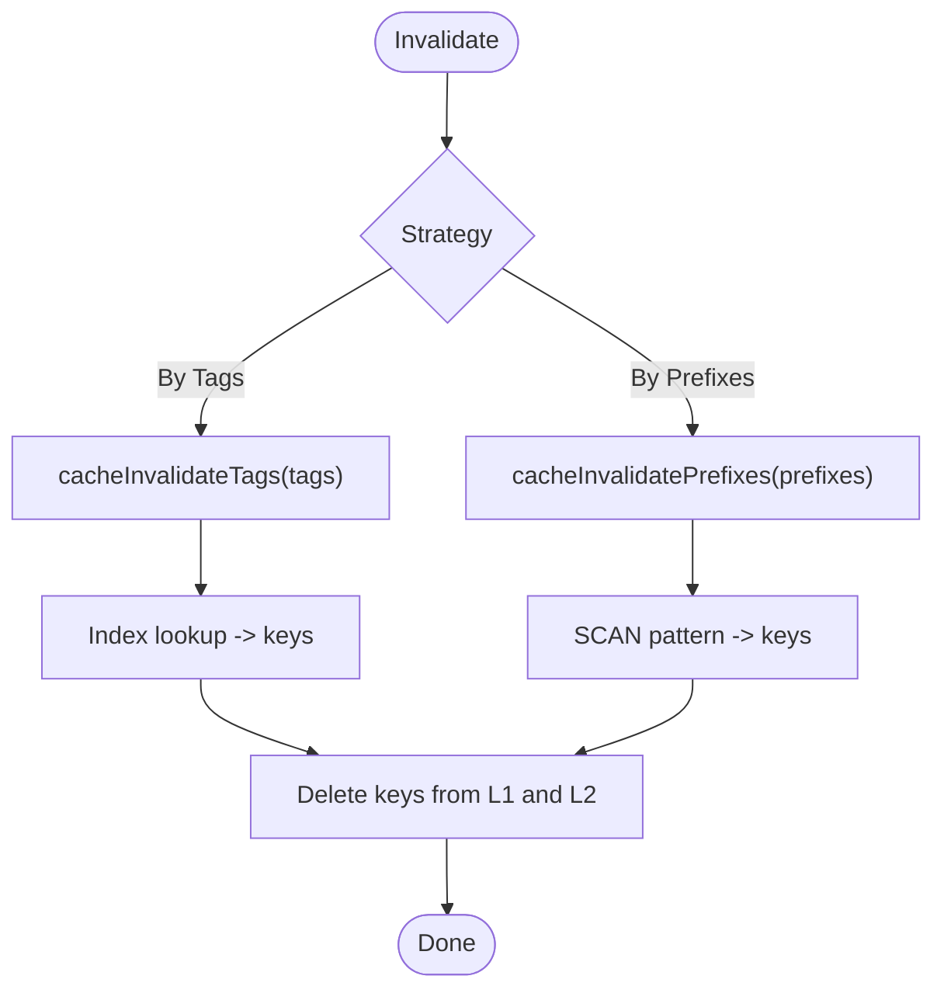
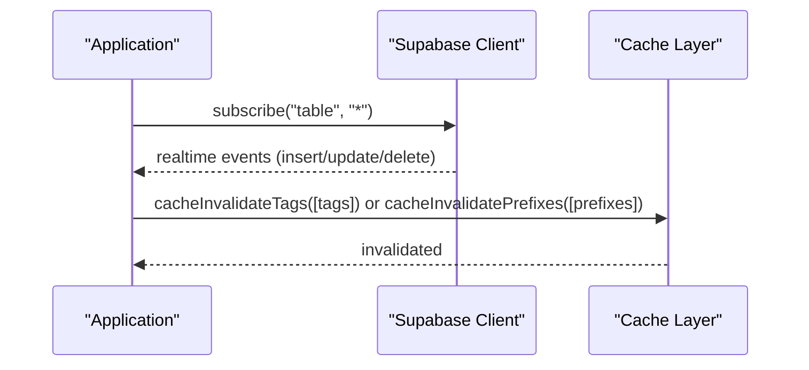
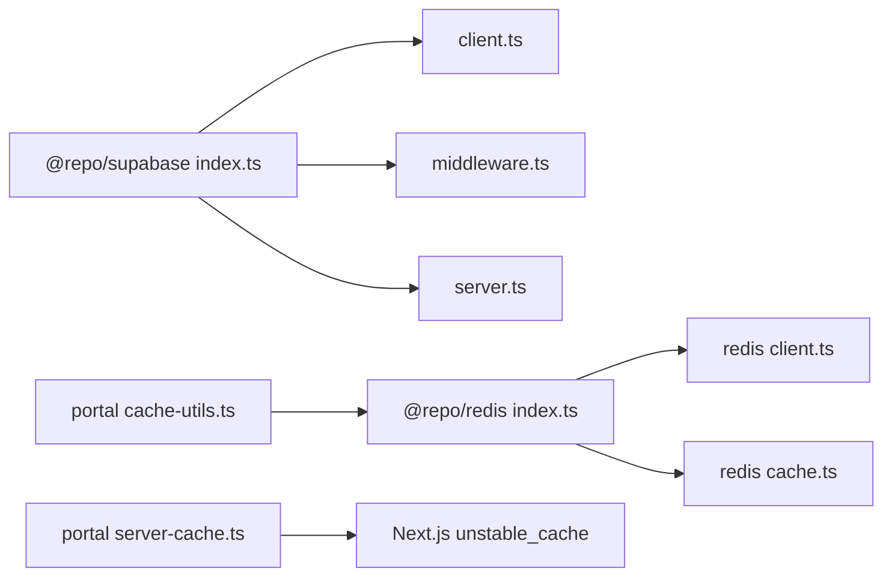

# Data Access Patterns & Caching

<cite>
**Referenced Files in This Document**
- [index.ts](file://packages/supabase/src/index.ts)
- [client.ts](file://packages/supabase/src/client.ts)
- [middleware.ts](file://packages/supabase/src/middleware.ts)
- [server.ts](file://packages/supabase/src/server.ts)
- [cache-utils.ts](file://apps/portal/lib/cache-utils.ts)
- [server-cache.ts](file://apps/portal/lib/server-cache.ts)
- [index.ts](file://packages/redis/src/index.ts)
- [client.ts](file://packages/redis/src/client.ts)
- [cache.ts](file://packages/redis/src/cache.ts)
</cite>

## Table of Contents
1. [Introduction](#introduction)
2. [Project Structure](#project-structure)
3. [Core Components](#core-components)
4. [Architecture Overview](#architecture-overview)
5. [Detailed Component Analysis](#detailed-component-analysis)
6. [Dependency Analysis](#dependency-analysis)
7. [Performance Considerations](#performance-considerations)
8. [Troubleshooting Guide](#troubleshooting-guide)
9. [Conclusion](#conclusion)
10. [Appendices](#appendices)

## Introduction
This document explains the data access patterns and caching strategies used across the Arch-Mk2 application, focusing on:
- The @repo/supabase package abstractions for browser, middleware, and server contexts
- Query patterns and client configuration
- Multi-level caching strategy with Redis integration, server-side caching via Next.js unstable_cache, and cache utilities
- Cache invalidation strategies, performance optimizations, and fallback mechanisms
- Efficient querying patterns, batch operations, and real-time synchronization through Supabase subscriptions
- Connection pooling considerations with pgbouncer and performance monitoring approaches

## Project Structure
The data access and caching layers are organized into shared packages and app-specific utilities:
- @repo/supabase: Client creation for browser, middleware, and server contexts; user retrieval helper; tracing export
- apps/portal/lib: Server-side caching wrapper and portal-specific cache orchestration
- @repo/redis: Redis client lifecycle, multi-level cache (L1 memory + L2 Redis), tagging/invalidation, and stats

**Diagram sources**
- [index.ts:1-7](file://packages/supabase/src/index.ts#L1-L7)
- [client.ts:1-41](file://packages/supabase/src/client.ts#L1-L41)
- [middleware.ts:1-44](file://packages/supabase/src/middleware.ts#L1-L44)
- [server.ts:1-100](file://packages/supabase/src/server.ts#L1-L100)
- [cache-utils.ts:1-79](file://apps/portal/lib/cache-utils.ts#L1-L79)
- [server-cache.ts:1-27](file://apps/portal/lib/server-cache.ts#L1-L27)
- [index.ts:1-28](file://packages/redis/src/index.ts#L1-L28)
- [client.ts:1-67](file://packages/redis/src/client.ts#L1-L67)
- [cache.ts:1-269](file://packages/redis/src/cache.ts#L1-L269)

**Section sources**
- [index.ts:1-7](file://packages/supabase/src/index.ts#L1-L7)
- [client.ts:1-41](file://packages/supabase/src/client.ts#L1-L41)
- [middleware.ts:1-44](file://packages/supabase/src/middleware.ts#L1-L44)
- [server.ts:1-100](file://packages/supabase/src/server.ts#L1-L100)
- [cache-utils.ts:1-79](file://apps/portal/lib/cache-utils.ts#L1-L79)
- [server-cache.ts:1-27](file://apps/portal/lib/server-cache.ts#L1-L27)
- [index.ts:1-28](file://packages/redis/src/index.ts#L1-L28)
- [client.ts:1-67](file://packages/redis/src/client.ts#L1-L67)
- [cache.ts:1-269](file://packages/redis/src/cache.ts#L1-L269)

## Core Components
- @repo/supabase client factories:
  - Browser client with cookie-based session persistence and hostname normalization
  - Middleware client that bridges request cookies to Supabase SSR and sets secure response cookies
  - Server client with instrumented fetch for DB query telemetry and safe user retrieval
- Portal caching:
  - cachedRSC: Next.js unstable_cache wrapper for React Server Components with tags and TTL
  - withCache: Portal wrapper integrating Redis L1/L2, tag-based writes, active-request coalescing, and fallback behavior
- @repo/redis:
  - Singleton client with reconnection handling
  - Two-level cache: L1 in-memory (LRU-cap, short TTL) and L2 Redis (longer TTL)
  - Tagging and prefix invalidation utilities
  - Stats recording for hits, misses, and errors

**Section sources**
- [client.ts:1-41](file://packages/supabase/src/client.ts#L1-L41)
- [middleware.ts:1-44](file://packages/supabase/src/middleware.ts#L1-L44)
- [server.ts:1-100](file://packages/supabase/src/server.ts#L1-L100)
- [server-cache.ts:1-27](file://apps/portal/lib/server-cache.ts#L1-L27)
- [cache-utils.ts:1-79](file://apps/portal/lib/cache-utils.ts#L1-L79)
- [client.ts:1-67](file://packages/redis/src/client.ts#L1-L67)
- [cache.ts:1-269](file://packages/redis/src/cache.ts#L1-L269)
- [index.ts:1-28](file://packages/redis/src/index.ts#L1-L28)

## Architecture Overview
The system combines three complementary layers:
- Supabase clients tailored per execution context (browser, middleware, server)
- Server-side caching via Next.js unstable_cache for RSC reads
- Multi-level application cache (L1 memory + L2 Redis) with tagging and invalidation

**Diagram sources**
- [middleware.ts:1-44](file://packages/supabase/src/middleware.ts#L1-L44)
- [server.ts:1-100](file://packages/supabase/src/server.ts#L1-L100)
- [server-cache.ts:1-27](file://apps/portal/lib/server-cache.ts#L1-L27)
- [cache-utils.ts:1-79](file://apps/portal/lib/cache-utils.ts#L1-L79)
- [cache.ts:1-269](file://packages/redis/src/cache.ts#L1-L269)

## Detailed Component Analysis

### Supabase Client Abstractions
- Browser client:
  - Normalizes URL hostnames for local vs production environments
  - Uses cookie-based session storage for security
- Middleware client:
  - Bridges request cookies to Supabase SSR
  - Sets HttpOnly, Secure, SameSite=Lax cookies on responses
- Server client:
  - Wraps fetch with instrumentation to record DB queries
  - Provides getUserSafely to handle refresh token errors gracefully

**Diagram sources**
- [client.ts:1-41](file://packages/supabase/src/client.ts#L1-L41)
- [middleware.ts:1-44](file://packages/supabase/src/middleware.ts#L1-L44)
- [server.ts:1-100](file://packages/supabase/src/server.ts#L1-L100)

**Section sources**
- [client.ts:1-41](file://packages/supabase/src/client.ts#L1-L41)
- [middleware.ts:1-44](file://packages/supabase/src/middleware.ts#L1-L44)
- [server.ts:1-100](file://packages/supabase/src/server.ts#L1-L100)

### Server-Side Caching with Next.js unstable_cache
- cachedRSC wraps unstable_cache to enable:
  - Key-partitioned caching
  - Revalidate TTL
  - Tag-based revalidation via revalidateTag()

**Diagram sources**
- [server-cache.ts:1-27](file://apps/portal/lib/server-cache.ts#L1-L27)

**Section sources**
- [server-cache.ts:1-27](file://apps/portal/lib/server-cache.ts#L1-L27)

### Multi-Level Caching Strategy (L1 + L2)
- L1: In-memory Map with TTL and simple LRU eviction at capacity
- L2: Redis-backed store with longer TTLs and tag indexing
- Writes are write-through to both layers; reads check L1 then L2
- Active request coalescing prevents thundering herds
- Graceful degradation when Redis is unreachable

**Diagram sources**
- [cache-utils.ts:1-79](file://apps/portal/lib/cache-utils.ts#L1-L79)
- [cache.ts:1-269](file://packages/redis/src/cache.ts#L1-L269)

**Section sources**
- [cache-utils.ts:1-79](file://apps/portal/lib/cache-utils.ts#L1-L79)
- [cache.ts:1-269](file://packages/redis/src/cache.ts#L1-L269)

### Redis Integration and Client Lifecycle
- Singleton client with reconnection strategy and error/end event handling
- Safe dynamic import to avoid hard failures if Redis is unavailable
- Exposed functions for cache operations, tagging, invalidation, and stats

**Diagram sources**
- [client.ts:1-67](file://packages/redis/src/client.ts#L1-L67)

**Section sources**
- [client.ts:1-67](file://packages/redis/src/client.ts#L1-L67)
- [index.ts:1-28](file://packages/redis/src/index.ts#L1-L28)

### Cache Invalidation Strategies
- Tag-based invalidation: associate keys with tags and invalidate by tag set
- Prefix-based invalidation: scan and delete matching prefixes safely
- L1-only eviction helpers for scenarios where Redis is not reachable

**Diagram sources**
- [cache.ts:1-269](file://packages/redis/src/cache.ts#L1-L269)

**Section sources**
- [cache.ts:1-269](file://packages/redis/src/cache.ts#L1-L269)

### Real-Time Data Synchronization with Supabase Subscriptions
- Use Supabase subscriptions to listen to database changes and update caches accordingly
- Invalidate relevant tags/prefixes upon mutations to keep caches consistent
- Combine with tagged writes to ensure precise invalidation scope

[No sources needed since this diagram shows conceptual workflow, not actual code structure]

## Dependency Analysis
High-level dependencies between components:

**Diagram sources**
- [index.ts:1-7](file://packages/supabase/src/index.ts#L1-L7)
- [client.ts:1-41](file://packages/supabase/src/client.ts#L1-L41)
- [middleware.ts:1-44](file://packages/supabase/src/middleware.ts#L1-L44)
- [server.ts:1-100](file://packages/supabase/src/server.ts#L1-L100)
- [cache-utils.ts:1-79](file://apps/portal/lib/cache-utils.ts#L1-L79)
- [server-cache.ts:1-27](file://apps/portal/lib/server-cache.ts#L1-L27)
- [index.ts:1-28](file://packages/redis/src/index.ts#L1-L28)
- [client.ts:1-67](file://packages/redis/src/client.ts#L1-L67)
- [cache.ts:1-269](file://packages/redis/src/cache.ts#L1-L269)

**Section sources**
- [index.ts:1-7](file://packages/supabase/src/index.ts#L1-L7)
- [client.ts:1-41](file://packages/supabase/src/client.ts#L1-L41)
- [middleware.ts:1-44](file://packages/supabase/src/middleware.ts#L1-L44)
- [server.ts:1-100](file://packages/supabase/src/server.ts#L1-L100)
- [cache-utils.ts:1-79](file://apps/portal/lib/cache-utils.ts#L1-L79)
- [server-cache.ts:1-27](file://apps/portal/lib/server-cache.ts#L1-L27)
- [index.ts:1-28](file://packages/redis/src/index.ts#L1-L28)
- [client.ts:1-67](file://packages/redis/src/client.ts#L1-L67)
- [cache.ts:1-269](file://packages/redis/src/cache.ts#L1-L269)

## Performance Considerations
- Multi-level caching:
  - L1 memory provides ultra-low latency for hot paths
  - L2 Redis provides distributed caching with longer TTLs
  - Active request coalescing reduces duplicate work under load
- Write-through consistency:
  - Both L1 and L2 updated on writes; L1 TTL capped to limit memory pressure
- Graceful degradation:
  - If Redis is unreachable, reads still attempt L1 and fall back to direct execution
- Server-side caching:
  - Next.js unstable_cache enables tag-based revalidation for RSC reads
- Instrumentation:
  - instrumentedFetch records DB query durations and success status for observability

[No sources needed since this section provides general guidance]

## Troubleshooting Guide
Common issues and mitigations:
- Redis connection failures:
  - Client resets state on error/end events; next caller retries automatically
  - Cache operations wrap Redis calls in try/catch and record errors
- Stale data after mutations:
  - Ensure tag-based or prefix-based invalidation is invoked after writes
- Refresh token errors on server:
  - getUserSafely returns null instead of throwing, preventing crashes
- Thundering herd on cache misses:
  - Active request coalescing ensures only one fetch runs per key

**Section sources**
- [client.ts:1-67](file://packages/redis/src/client.ts#L1-L67)
- [cache.ts:1-269](file://packages/redis/src/cache.ts#L1-L269)
- [server.ts:1-100](file://packages/supabase/src/server.ts#L1-L100)

## Conclusion
Arch-Mk2’s data access layer combines context-aware Supabase clients with a robust multi-level caching strategy. Server-side caching via Next.js unstable_cache complements application-level L1/L2 caching backed by Redis. Tag-based invalidation, active request coalescing, and graceful degradation provide resilience and performance. Instrumentation and safe user retrieval improve reliability and observability.

[No sources needed since this section summarizes without analyzing specific files]

## Appendices

### Efficient Querying Patterns
- Prefer tag-based invalidation to minimize blast radius
- Use category-scoped keys and meaningful key parts for clarity
- Batch invalidations using prefixes when appropriate

[No sources needed since this section provides general guidance]

### Connection Pooling with pgbouncer
- Configure Supabase backend to use pgbouncer for connection pooling
- Align pool sizes with expected concurrency and Redis availability
- Monitor connection reuse and timeouts in production

[No sources needed since this section provides general guidance]

### Performance Monitoring Approaches
- Leverage instrumentedFetch to capture DB query metrics
- Use cache stats (hits, misses, errors) to tune TTLs and invalidation policies
- Integrate with observability dashboards for cache and DB performance

[No sources needed since this section provides general guidance]