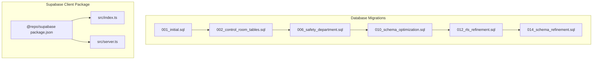
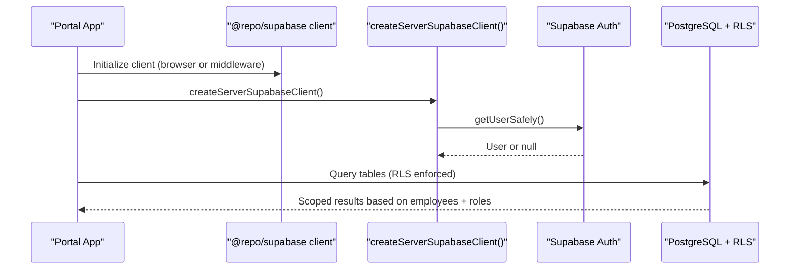
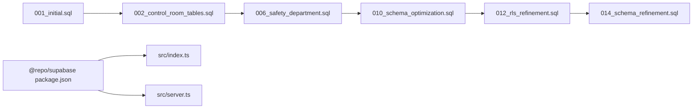

# Database & Data Models

<cite>
**Referenced Files in This Document**
- [001_initial.sql](file://packages/database/migrations/001_initial.sql)
- [002_control_room_tables.sql](file://packages/database/migrations/002_control_room_tables.sql)
- [006_safety_department.sql](file://packages/database/migrations/006_safety_department.sql)
- [010_schema_optimization.sql](file://packages/database/migrations/010_schema_optimization.sql)
- [012_rls_refinement.sql](file://packages/database/migrations/012_rls_refinement.sql)
- [014_schema_refinement.sql](file://packages/database/migrations/014_schema_refinement.sql)
- [package.json (supabase)](file://packages/supabase/package.json)
- [index.ts (supabase client exports)](file://packages/supabase/src/index.ts)
- [server.ts (supabase server client)](file://packages/supabase/src/server.ts)
- [SCHEMA.md](file://wiki/SCHEMA.md)
</cite>

## Table of Contents
1. [Introduction](#introduction)
2. [Project Structure](#project-structure)
3. [Core Components](#core-components)
4. [Architecture Overview](#architecture-overview)
5. [Detailed Component Analysis](#detailed-component-analysis)
6. [Dependency Analysis](#dependency-analysis)
7. [Performance Considerations](#performance-considerations)
8. [Troubleshooting Guide](#troubleshooting-guide)
9. [Conclusion](#conclusion)
10. [Appendices](#appendices)

## Introduction
This document provides comprehensive data model documentation for the Arch-Mk2 database schema built on Supabase/PostgreSQL. It covers entity relationships, field definitions, and data types across all operational domains; Row Level Security policies enforcing department isolation and role-based access control; migration management; data validation rules and business constraints; schema diagrams; sample queries; performance optimization strategies; data access patterns via the @repo/supabase package; caching strategies with Redis; backup/recovery procedures; data lifecycle management; archival policies; and compliance considerations.

## Project Structure
The database schema is defined through a series of SQL migrations under packages/database/migrations. The application uses the @repo/supabase package to interact with Supabase from both browser and server contexts.



**Diagram sources**
- [001_initial.sql:1-373](file://packages/database/migrations/001_initial.sql#L1-L373)
- [002_control_room_tables.sql:1-569](file://packages/database/migrations/002_control_room_tables.sql#L1-L569)
- [006_safety_department.sql:1-143](file://packages/database/migrations/006_safety_department.sql#L1-L143)
- [010_schema_optimization.sql:1-72](file://packages/database/migrations/010_schema_optimization.sql#L1-L72)
- [012_rls_refinement.sql:1-97](file://packages/database/migrations/012_rls_refinement.sql#L1-L97)
- [014_schema_refinement.sql:1-530](file://packages/database/migrations/014_schema_refinement.sql#L1-L530)
- [package.json (supabase):1-41](file://packages/supabase/package.json#L1-L41)
- [index.ts (supabase client exports):1-7](file://packages/supabase/src/index.ts#L1-L7)
- [server.ts (supabase server client):1-100](file://packages/supabase/src/server.ts#L1-L100)

**Section sources**
- [001_initial.sql:1-373](file://packages/database/migrations/001_initial.sql#L1-L373)
- [002_control_room_tables.sql:1-569](file://packages/database/migrations/002_control_room_tables.sql#L1-L569)
- [006_safety_department.sql:1-143](file://packages/database/migrations/006_safety_department.sql#L1-L143)
- [010_schema_optimization.sql:1-72](file://packages/database/migrations/010_schema_optimization.sql#L1-L72)
- [012_rls_refinement.sql:1-97](file://packages/database/migrations/012_rls_refinement.sql#L1-L97)
- [014_schema_refinement.sql:1-530](file://packages/database/migrations/014_schema_refinement.sql#L1-L530)
- [package.json (supabase):1-41](file://packages/supabase/package.json#L1-L41)
- [index.ts (supabase client exports):1-7](file://packages/supabase/src/index.ts#L1-L7)
- [server.ts (supabase server client):1-100](file://packages/supabase/src/server.ts#L1-L100)

## Core Components
This section summarizes core entities and their roles:

- Departments: Organizational units that scope data access and ownership.
- Employees: Application users linked to Supabase auth.users with role-based access and optional cross-department permissions.
- Machines: Equipment registry scoped by department.
- Daily Logs: Per-department, per-shift containers for operational metrics.
- Machine Hours, Fuel Logs, Production Logs: Child records tied to daily logs.
- Control Room tables: Operators, Sites, Machine Operations, Hourly Loads, Delay Categories, Shift Notes, Excavator Activity, Dozer Rolls, Report Templates, Generated Reports.
- Safety Department: Safety Severities, Safety Incident Categories, Safety Incidents.
- AI Memory: Memory Embeddings for semantic retrieval.

Key design principles:
- UUID primary keys and TIMESTAMPTZ timestamps.
- Soft deletes via deleted_at where applicable.
- CHECK constraints for categorical fields.
- RLS policies enforce department isolation and role-based access.
- Triggers maintain updated_at and derived values.

**Section sources**
- [001_initial.sql:1-373](file://packages/database/migrations/001_initial.sql#L1-L373)
- [002_control_room_tables.sql:1-569](file://packages/database/migrations/002_control_room_tables.sql#L1-L569)
- [006_safety_department.sql:1-143](file://packages/database/migrations/006_safety_department.sql#L1-L143)
- [010_schema_optimization.sql:1-72](file://packages/database/migrations/010_schema_optimization.sql#L1-L72)
- [012_rls_refinement.sql:1-97](file://packages/database/migrations/012_rls_refinement.sql#L1-L97)
- [014_schema_refinement.sql:1-530](file://packages/database/migrations/014_schema_refinement.sql#L1-L530)
- [SCHEMA.md:123-522](file://wiki/SCHEMA.md#L123-L522)

## Architecture Overview
The data layer is driven by migrations and enforced by RLS policies. The application interacts with Supabase using typed clients for browser and server contexts.



**Diagram sources**
- [index.ts (supabase client exports):1-7](file://packages/supabase/src/index.ts#L1-L7)
- [server.ts (supabase server client):1-100](file://packages/supabase/src/server.ts#L1-L100)
- [001_initial.sql:1-373](file://packages/database/migrations/001_initial.sql#L1-L373)

## Detailed Component Analysis

### Core Entities and Relationships
```mermaid
erDiagram
DEPARTMENTS {
uuid id PK
text name UK
text display_name
text icon
text description
text color
timestamptz created_at
timestamptz updated_at
timestamptz deleted_at
}
EMPLOYEES {
uuid id PK
uuid auth_id FK
uuid department_id FK
text full_name
text role
uuid[] accessible_departments
timestamptz created_at
timestamptz updated_at
timestamptz deleted_at
}
MACHINES {
uuid id PK
uuid department_id FK
text name
text machine_type
text serial_number
boolean active
numeric bin_factor
uuid site_id
timestamptz created_at
timestamptz updated_at
timestamptz deleted_at
}
DAILY_LOGS {
uuid id PK
uuid department_id FK
date log_date
text shift
text notes
timestamptz created_at
timestamptz updated_at
}
MACHINE_HOURS {
uuid id PK
uuid daily_log_id FK
uuid machine_id FK
numeric hours_worked
timestamptz created_at
timestamptz updated_at
}
FUEL_LOGS {
uuid id PK
uuid daily_log_id FK
uuid machine_id FK
numeric diesel_litres
timestamptz created_at
timestamptz updated_at
}
PRODUCTION_LOGS {
uuid id PK
uuid daily_log_id FK
numeric coal_tonnes
numeric waste_tonnes
timestamptz created_at
timestamptz updated_at
}
OPERATORS {
uuid id PK
text full_name
text employee_code UK
text role
boolean active
timestamptz created_at
timestamptz updated_at
timestamptz deleted_at
}
SITES {
uuid id PK
text name UK
text site_code UK
boolean active
timestamptz created_at
timestamptz updated_at
timestamptz deleted_at
}
MACHINE_OPERATIONS {
uuid id PK
uuid department_id FK
uuid machine_id FK
uuid operator_id FK
uuid site_id FK
date shift_date
text shift_type
time start_time
time end_time
numeric hours_worked
uuid created_by
timestamptz created_at
timestamptz updated_at
}
HOURLY_LOADS {
uuid id PK
uuid department_id FK
uuid machine_id FK
date load_date
int hour_00..hour_23
int total_loads
timestamptz created_at
timestamptz updated_at
}
DELAY_CATEGORIES {
uuid id PK
text name UK
text color
text icon
int sort_order
timestamptz created_at
timestamptz updated_at
timestamptz deleted_at
}
SHIFT_NOTES {
uuid id PK
uuid department_id FK
date note_date
text shift_type
uuid category_id FK
boolean is_delay
int delay_minutes
text note_text
boolean requires_supervisor_review
uuid created_by
timestamptz created_at
}
EXCAVATOR_ACTIVITY {
uuid id PK
uuid department_id FK
uuid machine_id FK
uuid operator_id FK
date activity_date
text shift_type
int passes
int loads
int avg_cycle_time_seconds
text material_type
numeric estimated_tonnes
text notes
timestamptz created_at
timestamptz updated_at
}
DOZER_ROLLS {
uuid id PK
uuid department_id FK
uuid machine_id FK
uuid operator_id FK
date roll_date
text shift_type
int blade_passes
int push_count
numeric area_covered_sqm
numeric material_moved_tonnes
numeric hours_operated
text notes
timestamptz created_at
timestamptz updated_at
}
REPORT_TEMPLATES {
uuid id PK
text name
text description
text report_type
boolean auto_generate
jsonb config
timestamptz created_at
timestamptz updated_at
}
GENERATED_REPORTS {
uuid id PK
uuid template_id FK
uuid department_id FK
date report_date
text shift_type
jsonb report_data
text pdf_url
uuid generated_by
timestamptz created_at
timestamptz updated_at
}
SAFETY_SEVERITIES {
uuid id PK
text level UK
int weight
text color
int sort_order
timestamptz created_at
timestamptz updated_at
}
SAFETY_INCIDENT_CATEGORIES {
uuid id PK
text name UK
text description
text color
text icon
int sort_order
timestamptz created_at
timestamptz updated_at
}
SAFETY_INCIDENTS {
uuid id PK
uuid department_id FK
date incident_date
text shift_type
uuid category_id FK
uuid severity_id FK
text incident_type
text description
text location
int injured_parties
uuid reported_by FK
uuid reviewed_by FK
text root_cause
text corrective_action
text status
timestamptz closed_at
timestamptz created_at
timestamptz updated_at
}
MEMORY_EMBEDDINGS {
uuid id PK
text session_id
uuid user_id FK
vector embedding
text memory_type
jsonb metadata
timestamptz created_at
timestamptz updated_at
}
DEPARTMENTS ||--o{ EMPLOYEES : "primary dept"
DEPARTMENTS ||--o{ MACHINES : "ownership"
DEPARTMENTS ||--o{ DAILY_LOGS : "ownership"
DAILY_LOGS ||--o{ MACHINE_HOURS : "child"
DAILY_LOGS ||--o{ FUEL_LOGS : "child"
DAILY_LOGS ||--o{ PRODUCTION_LOGS : "child"
MACHINES ||--o{ MACHINE_OPERATIONS : "operations"
MACHINES ||--o{ HOURLY_LOADS : "loads"
MACHINES ||--o{ EXCAVATOR_ACTIVITY : "activity"
MACHINES ||--o{ DOZER_ROLLS : "rolls"
OPERATORS ||--o{ MACHINE_OPERATIONS : "operator"
OPERATORS ||--o{ EXCAVATOR_ACTIVITY : "operator"
OPERATORS ||--o{ DOZER_ROLLS : "operator"
SITES ||--o{ MACHINES : "current site"
SITES ||--o{ MACHINE_OPERATIONS : "site"
DELAY_CATEGORIES ||--o{ SHIFT_NOTES : "category"
REPORT_TEMPLATES ||--o{ GENERATED_REPORTS : "templates"
SAFETY_SEVERITIES ||--o{ SAFETY_INCIDENTS : "severity"
SAFETY_INCIDENT_CATEGORIES ||--o{ SAFETY_INCIDENTS : "category"
EMPLOYEES ||--o{ SAFETY_INCIDENTS : "reported_by / reviewed_by"
```

**Diagram sources**
- [001_initial.sql:1-373](file://packages/database/migrations/001_initial.sql#L1-L373)
- [002_control_room_tables.sql:1-569](file://packages/database/migrations/002_control_room_tables.sql#L1-L569)
- [006_safety_department.sql:1-143](file://packages/database/migrations/006_safety_department.sql#L1-L143)
- [010_schema_optimization.sql:1-72](file://packages/database/migrations/010_schema_optimization.sql#L1-L72)
- [012_rls_refinement.sql:1-97](file://packages/database/migrations/012_rls_refinement.sql#L1-L97)
- [014_schema_refinement.sql:1-530](file://packages/database/migrations/014_schema_refinement.sql#L1-L530)

**Section sources**
- [001_initial.sql:1-373](file://packages/database/migrations/001_initial.sql#L1-L373)
- [002_control_room_tables.sql:1-569](file://packages/database/migrations/002_control_room_tables.sql#L1-L569)
- [006_safety_department.sql:1-143](file://packages/database/migrations/006_safety_department.sql#L1-L143)
- [010_schema_optimization.sql:1-72](file://packages/database/migrations/010_schema_optimization.sql#L1-L72)
- [012_rls_refinement.sql:1-97](file://packages/database/migrations/012_rls_refinement.sql#L1-L97)
- [014_schema_refinement.sql:1-530](file://packages/database/migrations/014_schema_refinement.sql#L1-L530)

### Row Level Security Policies and Role-Based Access Control
- Authentication context: All policies reference auth.uid() and correlate with employees to determine department and role.
- Roles: admin, supervisor, operator (and others such as maintenance/viewer).
- Department isolation: Policies check e.department_id or ANY(e.accessible_departments).
- Admin bypass: Many policies allow admin to read/write across departments.
- Soft delete filtering: Helper function is_active(record_deleted_at) used to exclude soft-deleted rows in select policies.

Key policy examples:
- departments_select_active: Only non-deleted departments visible.
- employees_select_active: Users can see themselves or admins; excludes deleted employees.
- machines_select_department_active: Access if admin or belongs to department or has cross-department access; excludes deleted machines.
- Audit logs: Admins get full view; department users get filtered view.

Helper functions:
- public.user_department_id(): Returns current user’s department_id.
- public.is_admin(): Boolean indicating admin role.
- public.has_department_access(dept_id): Checks admin or direct/cross-department access.
- public.is_active(record_deleted_at): Filters out soft-deleted records.

**Section sources**
- [001_initial.sql:1-373](file://packages/database/migrations/001_initial.sql#L1-L373)
- [012_rls_refinement.sql:1-97](file://packages/database/migrations/012_rls_refinement.sql#L1-L97)
- [014_schema_refinement.sql:224-367](file://packages/database/migrations/014_schema_refinement.sql#L224-L367)

### Migration Management System
- Sequential migrations define schema evolution: initial setup, control room tables, safety department, optimizations, RLS refinements, and schema refinements.
- Scripts and tooling:
  - Generate TypeScript types locally: supabase gen types.
  - Push migrations to local Supabase instance: supabase db push.
  - Reset local DB: supabase db reset.
  - Test rollback safety and security policies via scripts.

Operational notes:
- Use idempotent constructs (IF NOT EXISTS, DROP POLICY IF EXISTS) to ensure safe re-runs.
- Maintain consistent naming conventions for indexes, triggers, and policies.

**Section sources**
- [001_initial.sql:1-373](file://packages/database/migrations/001_initial.sql#L1-L373)
- [002_control_room_tables.sql:1-569](file://packages/database/migrations/002_control_room_tables.sql#L1-L569)
- [006_safety_department.sql:1-143](file://packages/database/migrations/006_safety_department.sql#L1-L143)
- [010_schema_optimization.sql:1-72](file://packages/database/migrations/010_schema_optimization.sql#L1-L72)
- [012_rls_refinement.sql:1-97](file://packages/database/migrations/012_rls_refinement.sql#L1-L97)
- [014_schema_refinement.sql:1-530](file://packages/database/migrations/014_schema_refinement.sql#L1-L530)

### Data Validation Rules and Business Constraints
- Enum-like CHECK constraints:
  - shifts: day/night across daily_logs and other tables.
  - machine_type: predefined equipment categories.
  - operators.role: operator/supervisor/trainer/relief.
  - safety_incident_type and safety_incidents.status: workflow states.
- Numeric precision: NUMERIC(p,s) applied to hours, litres, tonnes, areas, etc.
- Uniqueness: Unique constraints on names, codes, and composite keys (e.g., department_id, log_date, shift).
- Required fields: NOT NULL enforced for critical columns (e.g., names, locations, actions).
- Derived columns: hours_worked computed from start_time/end_time; total_loads sum of hourly counts.

**Section sources**
- [002_control_room_tables.sql:85-106](file://packages/database/migrations/002_control_room_tables.sql#L85-L106)
- [006_safety_department.sql:51-70](file://packages/database/migrations/006_safety_department.sql#L51-L70)
- [010_schema_optimization.sql:45-66](file://packages/database/migrations/010_schema_optimization.sql#L45-L66)
- [014_schema_refinement.sql:18-82](file://packages/database/migrations/014_schema_refinement.sql#L18-L82)

### Data Access Patterns via @repo/supabase
- Browser/Middleware client exports: createBrowserSupabaseClient, createMiddlewareClient.
- Server client: createServerSupabaseClient integrates with Next.js cookies and instrumented fetch for observability.
- Safe user retrieval: getUserSafely handles refresh token errors gracefully.

Typical usage pattern:
- Initialize client in middleware or server components.
- Call getUserSafely to obtain authenticated user context.
- Execute queries; RLS enforces department scoping automatically.

**Section sources**
- [index.ts (supabase client exports):1-7](file://packages/supabase/src/index.ts#L1-L7)
- [server.ts (supabase server client):1-100](file://packages/supabase/src/server.ts#L1-L100)
- [package.json (supabase):1-41](file://packages/supabase/package.json#L1-L41)

### Caching Strategies with Redis
- Health endpoint exposes cache stats and Redis connectivity status.
- Metrics include hit rate and connection state; used for monitoring and alerting.

Operational guidance:
- Cache frequently accessed reference data (departments, operators, sites).
- Invalidate caches on write operations to reference tables.
- Monitor hit rates and degrade gracefully when Redis is unavailable.

**Section sources**
- [apps/portal/app/api/health/cache/route.ts:1-27](file://apps/portal/app/api/health/cache/route.ts#L1-L27)

### Backup and Recovery Procedures
Recommended practices:
- Use Supabase native backups and point-in-time recovery features.
- Periodically export critical schemas and seed data via pg_dump or Supabase CLI.
- Validate restore processes in staging environments before production use.
- Ensure audit logs and generated reports are included in backups.

[No sources needed since this section provides general guidance]

### Data Lifecycle Management, Archival Policies, and Compliance
- Soft deletes: deleted_at columns enable logical removal while preserving history.
- Retention: Define retention periods for operational logs and audit trails.
- Archival: Move older daily logs and reports to cold storage or partitioned tables.
- Compliance: Enforce least privilege via RLS; maintain immutable audit logs; protect sensitive fields; ensure data residency requirements.

**Section sources**
- [010_schema_optimization.sql:5-12](file://packages/database/migrations/010_schema_optimization.sql#L5-L12)
- [012_rls_refinement.sql:1-97](file://packages/database/migrations/012_rls_refinement.sql#L1-L97)
- [014_schema_refinement.sql:498-504](file://packages/database/migrations/014_schema_refinement.sql#L498-L504)

## Dependency Analysis
Migrations build upon each other, introducing new tables, constraints, indexes, and policies over time. The Supabase client package depends on Supabase SDKs and Kysely for type-safe querying.



**Diagram sources**
- [001_initial.sql:1-373](file://packages/database/migrations/001_initial.sql#L1-L373)
- [002_control_room_tables.sql:1-569](file://packages/database/migrations/002_control_room_tables.sql#L1-L569)
- [006_safety_department.sql:1-143](file://packages/database/migrations/006_safety_department.sql#L1-L143)
- [010_schema_optimization.sql:1-72](file://packages/database/migrations/010_schema_optimization.sql#L1-L72)
- [012_rls_refinement.sql:1-97](file://packages/database/migrations/012_rls_refinement.sql#L1-L97)
- [014_schema_refinement.sql:1-530](file://packages/database/migrations/014_schema_refinement.sql#L1-L530)
- [package.json (supabase):1-41](file://packages/supabase/package.json#L1-L41)
- [index.ts (supabase client exports):1-7](file://packages/supabase/src/index.ts#L1-L7)
- [server.ts (supabase server client):1-100](file://packages/supabase/src/server.ts#L1-L100)

**Section sources**
- [001_initial.sql:1-373](file://packages/database/migrations/001_initial.sql#L1-L373)
- [002_control_room_tables.sql:1-569](file://packages/database/migrations/002_control_room_tables.sql#L1-L569)
- [006_safety_department.sql:1-143](file://packages/database/migrations/006_safety_department.sql#L1-L143)
- [010_schema_optimization.sql:1-72](file://packages/database/migrations/010_schema_optimization.sql#L1-L72)
- [012_rls_refinement.sql:1-97](file://packages/database/migrations/012_rls_refinement.sql#L1-L97)
- [014_schema_refinement.sql:1-530](file://packages/database/migrations/014_schema_refinement.sql#L1-L530)
- [package.json (supabase):1-41](file://packages/supabase/package.json#L1-L41)
- [index.ts (supabase client exports):1-7](file://packages/supabase/src/index.ts#L1-L7)
- [server.ts (supabase server client):1-100](file://packages/supabase/src/server.ts#L1-L100)

## Performance Considerations
- Index strategy:
  - Foreign key indexes on department_id, machine_id, operator_id, site_id.
  - Composite indexes for common query patterns (department + date + shift/status).
  - Date descending indexes for dashboard queries.
- Computed/generated columns reduce redundant calculations.
- Numeric precision constraints prevent overflow and improve storage efficiency.
- Partitioning: Time-series tables can be partitioned by date ranges for large datasets.
- Monitoring: Use health endpoints and observability hooks to track query performance and cache effectiveness.

**Section sources**
- [010_schema_optimization.sql:14-44](file://packages/database/migrations/010_schema_optimization.sql#L14-L44)
- [014_schema_refinement.sql:141-222](file://packages/database/migrations/014_schema_refinement.sql#L141-L222)
- [SCHEMA.md:486-522](file://wiki/SCHEMA.md#L486-L522)

## Troubleshooting Guide
Common issues and resolutions:
- Empty query results due to RLS:
  - Verify user’s department assignment and accessible_departments array.
  - Confirm policies allow access for the current role.
- Soft-deleted records not visible:
  - Check deleted_at filters in select policies.
- Refresh token errors in server components:
  - Use getUserSafely to handle invalid tokens gracefully.
- Cache degraded:
  - Inspect Redis connectivity and hit rate via health endpoint.

**Section sources**
- [001_initial.sql:1-373](file://packages/database/migrations/001_initial.sql#L1-L373)
- [012_rls_refinement.sql:1-97](file://packages/database/migrations/012_rls_refinement.sql#L1-L97)
- [server.ts (supabase server client):82-100](file://packages/supabase/src/server.ts#L82-L100)
- [apps/portal/app/api/health/cache/route.ts:1-27](file://apps/portal/app/api/health/cache/route.ts#L1-L27)

## Conclusion
The Arch-Mk2 database schema is designed around strong security and operational clarity. RLS policies enforce department isolation and role-based access, while migrations provide a robust evolution path. Comprehensive indexing and constraints support performance and integrity. The @repo/supabase package offers secure, typed access patterns, and Redis caching enhances responsiveness. Following the outlined best practices ensures scalability, reliability, and compliance.

[No sources needed since this section summarizes without analyzing specific files]

## Appendices

### Sample Queries
- List active departments visible to authenticated users:
  - SELECT * FROM departments WHERE deleted_at IS NULL;
- Get today’s daily logs for the user’s department:
  - SELECT * FROM daily_logs WHERE department_id = current_user_dept AND log_date = CURRENT_DATE;
- Retrieve machine operations for a machine within a date range:
  - SELECT * FROM machine_operations WHERE machine_id = ? AND shift_date BETWEEN ? AND ?;
- Safety incidents by status and department:
  - SELECT * FROM safety_incidents WHERE department_id = ? AND status = 'open' ORDER BY incident_date DESC;

[No sources needed since this section provides general guidance]