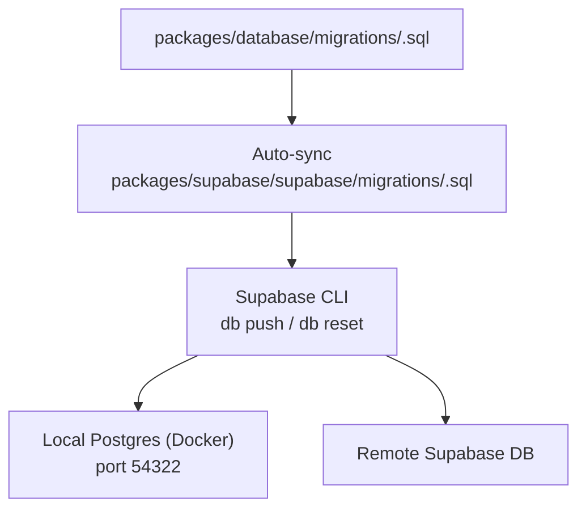
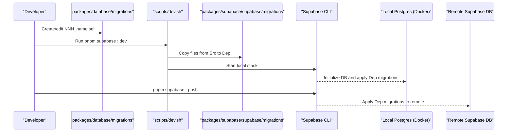
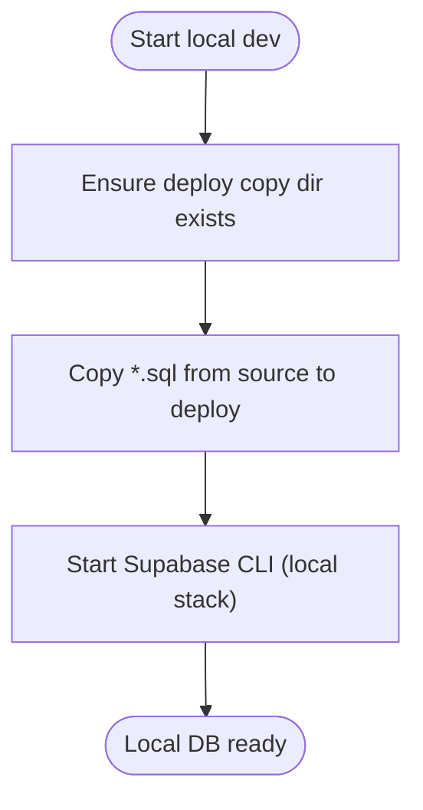
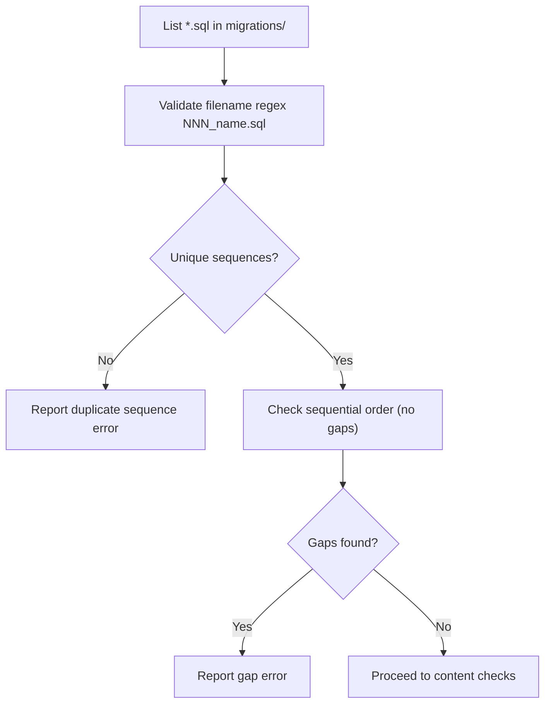
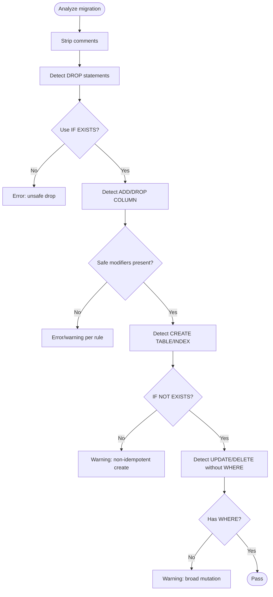
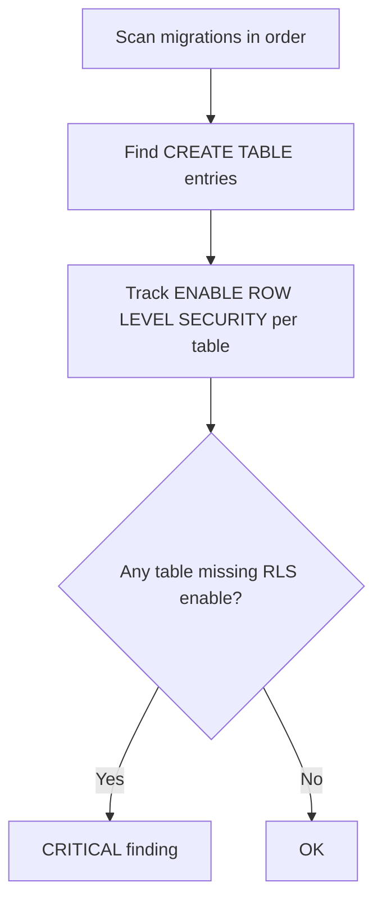
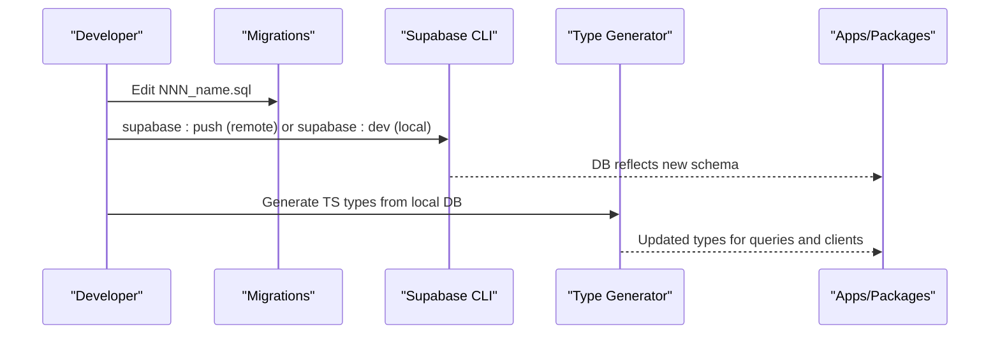
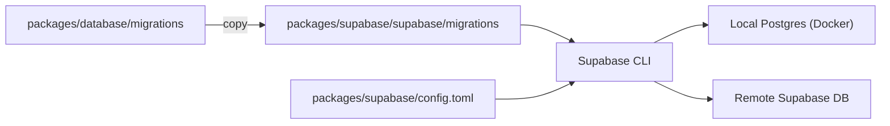

# Migration Management

<cite>
**Referenced Files in This Document**
- [CLAUDE.md](file://CLAUDE.md)
- [package.json](file://packages/database/package.json)
- [dev.sh](file://scripts/dev.sh)
- [config.toml](file://packages/supabase/config.toml)
- [migration-rollback-safety.mjs](file://packages/database/tests/migration-rollback-safety.mjs)
- [001_initial.sql](file://packages/database/migrations/001_initial.sql)
- [audit-rls.cjs](file://tools/audit-rls.cjs)
- [supabase-local-dev.md](file://wiki/concepts/supabase-local-dev.md)
- [SCHEMA.md](file://wiki/SCHEMA.md)
</cite>

## Table of Contents
1. Introduction
2. Project Structure
3. Core Components
4. Architecture Overview
5. Detailed Component Analysis
6. Dependency Analysis
7. Performance Considerations
8. Troubleshooting Guide
9. Conclusion

## Introduction
This document explains the database migration management system used across the monorepo. It focuses on the dual-migration strategy where source migrations live under packages/database/migrations/ and are automatically synchronized to packages/supabase/supabase/migrations/ for local development with Supabase CLI. It also documents the end-to-end workflow for local development, reset procedures, remote deployment, naming conventions, rollback strategies, and the relationship between schema changes and application code updates.

## Project Structure
The migration system is centered around two directories:
- Source of truth: packages/database/migrations/*.sql
- Deploy copy (auto-synced): packages/supabase/supabase/migrations/*.sql

Key configuration and scripts:
- Supabase CLI commands are exposed via package scripts in @repo/database.
- The local dev script copies migrations into the deploy directory before starting Supabase locally.
- Supabase local stack configuration (ports, pooler, seed) is defined in packages/supabase/config.toml.

**Diagram sources**
- [dev.sh:510-512](file://scripts/dev.sh#L510-L512)
- [package.json](file://packages/database/package.json)
- [config.toml:27-46](file://packages/supabase/config.toml#L27-L46)

**Section sources**
- [CLAUDE.md:60-61](file://CLAUDE.md#L60-L61)
- [package.json](file://packages/database/package.json)
- [dev.sh:510-512](file://scripts/dev.sh#L510-L512)
- [config.toml:27-46](file://packages/supabase/config.toml#L27-L46)

## Core Components
- Source migrations: packages/database/migrations/*.sql
  - Authoritative location for all schema changes.
  - Enforced by static audits and documentation.
- Deploy copy: packages/supabase/supabase/migrations/*.sql
  - Auto-generated from source; never hand-edited.
- Supabase CLI integration:
  - pnpm supabase:dev — starts local Supabase stack.
  - pnpm supabase:reset — resets local database using configured seeds.
  - pnpm supabase:push — pushes migrations to a linked remote project.
- Local stack configuration:
  - Ports, pooler, and seed behavior are defined in packages/supabase/config.toml.

Operational notes:
- The local dev script ensures the deploy copy exists and is up to date before booting Supabase containers.
- RLS policies must be enabled for tables created in migrations; static audit enforces this.

**Section sources**
- [CLAUDE.md:60-61](file://CLAUDE.md#L60-L61)
- [package.json](file://packages/database/package.json)
- [dev.sh:510-512](file://scripts/dev.sh#L510-L512)
- [config.toml:27-56](file://packages/supabase/config.toml#L27-L56)
- [audit-rls.cjs:48-57](file://tools/audit-rls.cjs#L48-L57)

## Architecture Overview
The migration architecture follows a single-source-of-trategy pattern with an auto-sync step and CLI-driven application to local or remote databases.

**Diagram sources**
- [dev.sh:510-512](file://scripts/dev.sh#L510-L512)
- [package.json](file://packages/database/package.json)
- [config.toml:27-46](file://packages/supabase/config.toml#L27-L46)

## Detailed Component Analysis

### Dual-Migration Strategy and Auto-Sync
- Source of truth: All SQL migrations are authored in packages/database/migrations/.
- Auto-sync: Before starting local Supabase, scripts/dev.sh copies all .sql files from the source directory into packages/supabase/supabase/migrations/.
- Implication: Never edit files directly under packages/supabase/supabase/migrations/; edits belong in the source directory.

**Diagram sources**
- [dev.sh:510-512](file://scripts/dev.sh#L510-L512)

**Section sources**
- [CLAUDE.md:60-61](file://CLAUDE.md#L60-L61)
- [dev.sh:510-512](file://scripts/dev.sh#L510-L512)

### Migration Workflow Commands
- Local development:
  - pnpm supabase:dev — starts local Supabase stack (DB, API, Studio).
- Reset procedure:
  - pnpm supabase:reset — resets local database using configured seed files.
- Remote deployment:
  - pnpm supabase:push — applies migrations to the linked remote project.

These commands are provided by the Supabase CLI and wrapped in package scripts.

**Section sources**
- [package.json](file://packages/database/package.json)
- [supabase-local-dev.md:44-52](file://wiki/concepts/supabase-local-dev.md#L44-L52)
- [SCHEMA.md:546-549](file://wiki/SCHEMA.md#L546-L549)

### Naming Conventions
- Filenames follow the convention NNN_name.sql (zero-padded three-digit sequence).
- The rollback safety checker validates:
  - Filename format and uniqueness.
  - Sequential numbering without gaps.
  - Idempotent patterns (IF EXISTS/IF NOT EXISTS) for destructive operations.

**Diagram sources**
- [migration-rollback-safety.mjs:30-82](file://packages/database/tests/migration-rollback-safety.mjs#L30-L82)

**Section sources**
- [migration-rollback-safety.mjs:30-82](file://packages/database/tests/migration-rollback-safety.mjs#L30-L82)

### Rollback Strategies and Safety Checks
- Static rollback safety analysis runs against all migrations and flags:
  - DROP TABLE/INDEX/VIEW without IF EXISTS.
  - ALTER TABLE DROP COLUMN without IF EXISTS.
  - CREATE TABLE/INDEX without IF NOT EXISTS (with exceptions for partitioned tables).
  - UPDATE/DELETE without WHERE clause.
  - Complex type renames requiring careful down migrations.
- Best practices:
  - Prefer idempotent DDL (IF EXISTS/IF NOT EXISTS).
  - Avoid unscoped data mutations.
  - For destructive changes, plan explicit down steps if needed.

**Diagram sources**
- [migration-rollback-safety.mjs:84-211](file://packages/database/tests/migration-rollback-safety.mjs#L84-L211)

**Section sources**
- [migration-rollback-safety.mjs:84-211](file://packages/database/tests/migration-rollback-safety.mjs#L84-L211)

### Row Level Security Enforcement
- Every table created in migrations should enable RLS.
- Static audit scans migrations to ensure:
  - Tables have ENABLE ROW LEVEL SECURITY applied somewhere in the migration chain.
  - Policies exist for access control.
- Reference tables may be exempted intentionally.

**Diagram sources**
- [audit-rls.cjs:124-187](file://tools/audit-rls.cjs#L124-L187)

**Section sources**
- [CLAUDE.md:73](file://CLAUDE.md#L73)
- [audit-rls.cjs:124-187](file://tools/audit-rls.cjs#L124-L187)

### Relationship Between Schema Changes and Application Code
- Data layer package (@repo/supabase) is the only allowed entry point for database access from apps and other packages.
- Generated TypeScript types reflect the current schema and are consumed by the data layer.
- After applying migrations, regenerate types to keep client/server code aligned.

**Diagram sources**
- [package.json](file://packages/database/package.json)
- [CLAUDE.md:60-61](file://CLAUDE.md#L60-L61)

**Section sources**
- [CLAUDE.md:60-61](file://CLAUDE.md#L60-L61)
- [package.json](file://packages/database/package.json)

## Dependency Analysis
- Source-to-deploy dependency:
  - scripts/dev.sh depends on packages/database/migrations/ and writes to packages/supabase/supabase/migrations/.
- CLI dependency:
  - Supabase CLI reads packages/supabase/supabase/migrations/ when pushing or resetting.
- Configuration dependency:
  - packages/supabase/config.toml defines local ports and seed behavior used during reset.

**Diagram sources**
- [dev.sh:510-512](file://scripts/dev.sh#L510-L512)
- [config.toml:27-56](file://packages/supabase/config.toml#L27-L56)
- [package.json](file://packages/database/package.json)

**Section sources**
- [dev.sh:510-512](file://scripts/dev.sh#L510-L512)
- [config.toml:27-56](file://packages/supabase/config.toml#L27-L56)
- [package.json](file://packages/database/package.json)

## Performance Considerations
- Use idempotent DDL (IF EXISTS/IF NOT EXISTS) to avoid unnecessary work and errors on repeated runs.
- Add indexes judiciously; prefer concurrent index creation in production environments to minimize lock contention.
- Partition large time-series tables and leverage pruning where appropriate.
- Keep migrations small and focused to reduce risk and improve reviewability.

[No sources needed since this section provides general guidance]

## Troubleshooting Guide
Common issues and resolutions:
- Mismatch between source and deploy directories:
  - Symptom: Local run fails due to missing or outdated migrations.
  - Cause: Manual edits in packages/supabase/supabase/migrations/ or incomplete sync.
  - Resolution: Re-run local dev to trigger auto-sync; always edit in packages/database/migrations/.
- Port conflicts:
  - Symptom: Local Supabase cannot start.
  - Resolution: Ensure ports 54321 (API), 54322 (DB), 54323 (Studio) are free.
- Seed not applied after reset:
  - Verify seed configuration in config.toml and that seed files exist.
- RLS policy failures:
  - Run the RLS audit to detect missing enables/policies.
- Type mismatches after schema change:
  - Regenerate TypeScript types from the local database.

**Section sources**
- [supabase-local-dev.md:63-78](file://wiki/concepts/supabase-local-dev.md#L63-L78)
- [config.toml:27-56](file://packages/supabase/config.toml#L27-L56)
- [audit-rls.cjs:48-57](file://tools/audit-rls.cjs#L48-L57)

## Conclusion
The migration system centers on a single source of truth with automatic synchronization to the Supabase deploy directory, ensuring consistency across local and remote environments. By following naming conventions, leveraging idempotent DDL, and adhering to RLS requirements, teams can evolve the schema safely and predictably. Use the documented commands for local development, reset, and remote deployment, and rely on static audits to catch issues early.