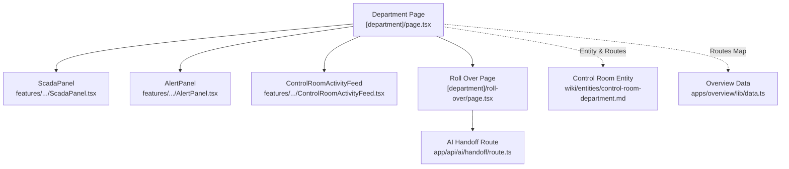
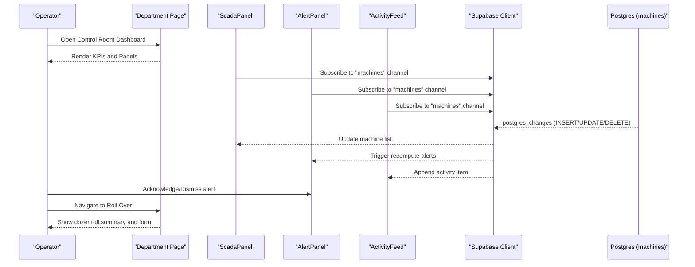
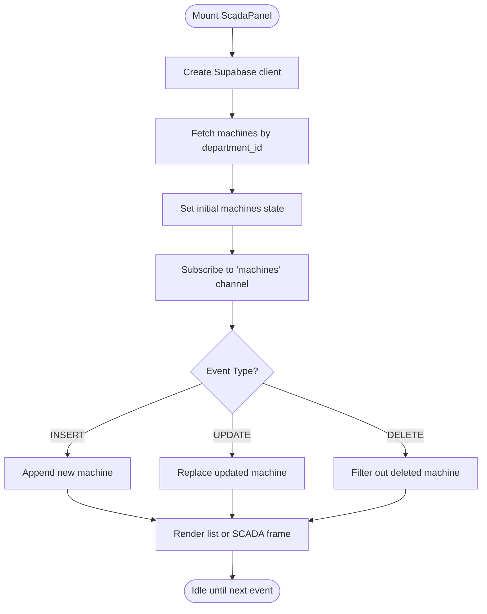
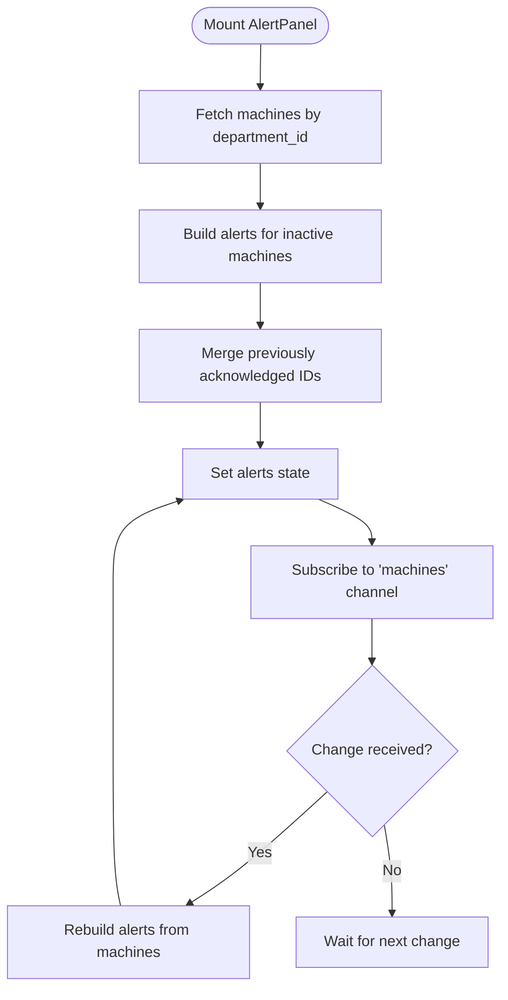
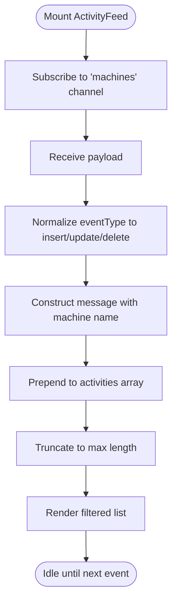
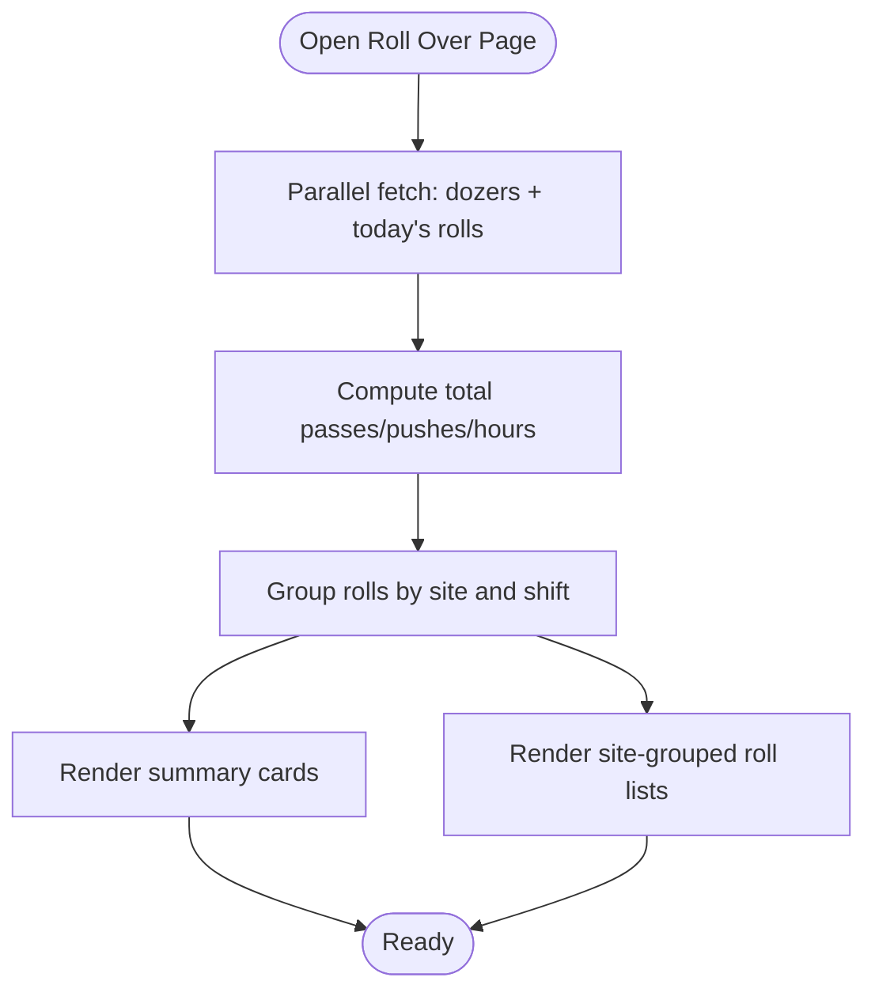
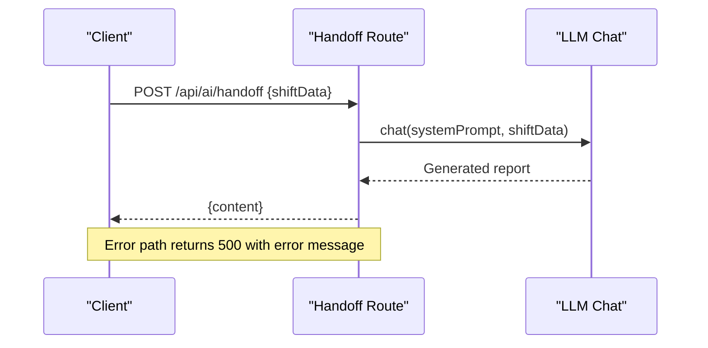
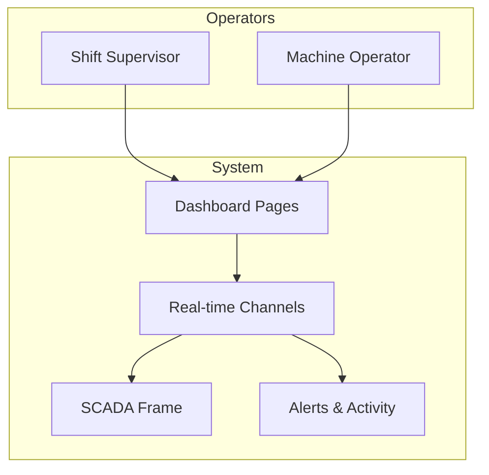
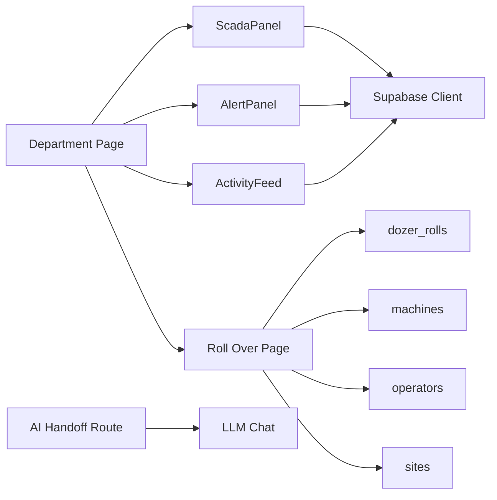

# Control Room Department

<cite>
**Referenced Files in This Document**
- [page.tsx](file://apps/portal/app/(departments)/[department]/page.tsx)
- [ScadaPanel.tsx](file://apps/portal/features/departments/components/control-room/ScadaPanel.tsx)
- [AlertPanel.tsx](file://apps/portal/features/departments/components/control-room/AlertPanel.tsx)
- [ControlRoomActivityFeed.tsx](file://apps/portal/features/departments/components/control-room/ControlRoomActivityFeed.tsx)
- [roll-over/page.tsx](file://apps/portal/app/(departments)/[department]/roll-over/page.tsx)
- [route.ts](file://apps/portal/app/api/ai/handoff/route.ts)
- [control-room-department.md](file://wiki/entities/control-room-department.md)
- [data.ts](file://apps/overview/lib/data.ts)
- [how-to-fetch-data.md](file://wiki/queries/how-to-fetch-data.md)
</cite>

## Table of Contents
1. Introduction
2. Project Structure
3. Core Components
4. Architecture Overview
5. Detailed Component Analysis
6. Dependency Analysis
7. Performance Considerations
8. Troubleshooting Guide
9. Conclusion

## Introduction
The Control Room department is the operational nerve center for SCADA integration and real-time monitoring across mining operations. It provides a high-density dashboard with live telemetry, alert management, shift handover tools, and incident response workflows. The implementation uses Next.js App Router components, Supabase for data persistence and real-time subscriptions, and dynamic client-side panels to render SCADA dashboards and activity feeds.

Key capabilities include:
- Real-time machine status and alerts via database change channels
- SCADA overview with list view and embedded SCADA frame
- Shift coverage and roll-over (dozer rolls) tracking
- AI-assisted shift handoff report generation
- Operational KPIs aggregated from machine operations, delays, hourly loads, and active machines

## Project Structure
The Control Room feature spans portal pages, feature components, and documentation entities:
- Dashboard entry point renders control room-specific sections and panels
- Feature components implement SCADA overview, alerts, and activity feed
- Roll-over page manages dozer roll records grouped by site and shift
- API route generates AI-powered shift handoff summaries
- Documentation entity outlines tabs, tables, and KPIs

**Diagram sources**
- [page.tsx](file://apps/portal/app/(departments)/[department]/page.tsx#L1-L222)
- [ScadaPanel.tsx:1-176](file://apps/portal/features/departments/components/control-room/ScadaPanel.tsx#L1-L176)
- [AlertPanel.tsx:1-166](file://apps/portal/features/departments/components/control-room/AlertPanel.tsx#L1-L166)
- [ControlRoomActivityFeed.tsx:1-136](file://apps/portal/features/departments/components/control-room/ControlRoomActivityFeed.tsx#L1-L136)
- [roll-over/page.tsx](file://apps/portal/app/(departments)/[department]/roll-over/page.tsx#L1-L262)
- [route.ts:31-70](file://apps/portal/app/api/ai/handoff/route.ts#L31-L70)
- [control-room-department.md:1-63](file://wiki/entities/control-room-department.md#L1-L63)
- [data.ts:163-202](file://apps/overview/lib/data.ts#L163-L202)

**Section sources**
- [page.tsx](file://apps/portal/app/(departments)/[department]/page.tsx#L1-L222)
- [control-room-department.md:1-63](file://wiki/entities/control-room-department.md#L1-L63)
- [data.ts:163-202](file://apps/overview/lib/data.ts#L163-L202)

## Core Components
- ScadaPanel: Displays machine inventory and online/offline status; supports switching between list view and an embedded SCADA frame. Subscribes to machine table changes for live updates.
- AlertPanel: Derives alerts from machine offline status; allows acknowledging and dismissing alerts; refreshes on machine table changes.
- ControlRoomActivityFeed: Streams insert/update/delete events for machines into an animated feed with filtering.
- Roll Over Page: Aggregates dozer roll metrics per site and shift; integrates with operators and sites metadata.
- AI Handoff Route: Generates concise shift handoff reports using an LLM based on provided shift data.

These components collectively enable real-time monitoring, operator workflow optimization, and structured shift handovers.

**Section sources**
- [ScadaPanel.tsx:1-176](file://apps/portal/features/departments/components/control-room/ScadaPanel.tsx#L1-L176)
- [AlertPanel.tsx:1-166](file://apps/portal/features/departments/components/control-room/AlertPanel.tsx#L1-L166)
- [ControlRoomActivityFeed.tsx:1-136](file://apps/portal/features/departments/components/control-room/ControlRoomActivityFeed.tsx#L1-L136)
- [roll-over/page.tsx](file://apps/portal/app/(departments)/[department]/roll-over/page.tsx#L1-L262)
- [route.ts:31-70](file://apps/portal/app/api/ai/handoff/route.ts#L31-L70)

## Architecture Overview
The Control Room architecture combines server-rendered dashboards with client-side real-time features:
- Server components compute KPIs and assemble the dashboard layout
- Client components subscribe to Postgres change events via Supabase channels
- Alerts are derived from machine status changes
- Activity feed streams event types for auditability
- Roll-over page aggregates operational metrics and links to operator/site details
- AI handoff route summarizes shift data for smooth transitions

**Diagram sources**
- [page.tsx](file://apps/portal/app/(departments)/[department]/page.tsx#L1-L222)
- [ScadaPanel.tsx:1-176](file://apps/portal/features/departments/components/control-room/ScadaPanel.tsx#L1-L176)
- [AlertPanel.tsx:1-166](file://apps/portal/features/departments/components/control-room/AlertPanel.tsx#L1-L166)
- [ControlRoomActivityFeed.tsx:1-136](file://apps/portal/features/departments/components/control-room/ControlRoomActivityFeed.tsx#L1-L136)
- [roll-over/page.tsx](file://apps/portal/app/(departments)/[department]/roll-over/page.tsx#L1-L262)

## Detailed Component Analysis

### ScadaPanel
Responsibilities:
- Fetch and display machines for the current department
- Maintain live state via Supabase channel subscriptions
- Toggle between list view and SCADA frame view
- Compute online/inactive counts

Real-time behavior:
- Subscribes to all changes on the machines table filtered by department_id
- Updates local state on INSERT/UPDATE/DELETE events

Integration points:
- Uses browser Supabase client
- Renders MachineControl and FuxaFrame components

**Diagram sources**
- [ScadaPanel.tsx:1-176](file://apps/portal/features/departments/components/control-room/ScadaPanel.tsx#L1-L176)

**Section sources**
- [ScadaPanel.tsx:1-176](file://apps/portal/features/departments/components/control-room/ScadaPanel.tsx#L1-L176)

### AlertPanel
Responsibilities:
- Generate alerts when machines are offline
- Allow acknowledge/dismiss actions
- Refresh on machine table changes

Algorithm:
- On mount, fetch machines for the department
- Build alert entries for each inactive machine
- Preserve acknowledged states across updates
- Re-run on any change to the machines table

**Diagram sources**
- [AlertPanel.tsx:1-166](file://apps/portal/features/departments/components/control-room/AlertPanel.tsx#L1-L166)

**Section sources**
- [AlertPanel.tsx:1-166](file://apps/portal/features/departments/components/control-room/AlertPanel.tsx#L1-L166)

### ControlRoomActivityFeed
Responsibilities:
- Stream machine lifecycle events into an activity feed
- Provide filters for all/insert/update/delete
- Limit history to recent items

Real-time behavior:
- Subscribes to machines table changes
- Normalizes event type and constructs messages
- Prepends new items and truncates to a fixed size

**Diagram sources**
- [ControlRoomActivityFeed.tsx:1-136](file://apps/portal/features/departments/components/control-room/ControlRoomActivityFeed.tsx#L1-L136)

**Section sources**
- [ControlRoomActivityFeed.tsx:1-136](file://apps/portal/features/departments/components/control-room/ControlRoomActivityFeed.tsx#L1-L136)

### Roll Over Page (Dozers)
Responsibilities:
- Aggregate daily dozer roll metrics (passes, pushes, hours operated)
- Group records by site and shift (day/night)
- Present totals and detailed entries with operator and area covered

Data flow:
- Fetch active dozers and today’s rolls in parallel
- Compute totals and group by site
- Render summaries and per-shift lists

**Diagram sources**
- [roll-over/page.tsx](file://apps/portal/app/(departments)/[department]/roll-over/page.tsx#L1-L262)

**Section sources**
- [roll-over/page.tsx](file://apps/portal/app/(departments)/[department]/roll-over/page.tsx#L1-L262)

### AI Shift Handoff Route
Responsibilities:
- Accept shift data and generate a concise handoff report
- Apply rate limiting and body size limits
- Return content or error responses

Workflow:
- Parse request body
- Call chat with system prompt and shift data
- Return generated text or error JSON

**Diagram sources**
- [route.ts:31-70](file://apps/portal/app/api/ai/handoff/route.ts#L31-L70)

**Section sources**
- [route.ts:31-70](file://apps/portal/app/api/ai/handoff/route.ts#L31-L70)

### Conceptual Overview
This section describes general patterns used across the Control Room without mapping to specific files:
- Live data streaming via database change channels
- Operator workflow optimization through quick actions and grouped views
- Emergency response protocols supported by alert acknowledgment and activity auditing
- Integration with industrial control systems through SCADA frames and machine telemetry

[No sources needed since this diagram shows conceptual workflow, not actual code structure]

## Dependency Analysis
- The department page composes multiple dynamic components for performance and modularity
- Client components depend on Supabase client for real-time subscriptions
- Roll-over page depends on machines, dozer_rolls, operators, and sites relationships
- AI handoff route depends on chat service and request middleware (rate limit, body limit)

**Diagram sources**
- [page.tsx](file://apps/portal/app/(departments)/[department]/page.tsx#L1-L222)
- [ScadaPanel.tsx:1-176](file://apps/portal/features/departments/components/control-room/ScadaPanel.tsx#L1-L176)
- [AlertPanel.tsx:1-166](file://apps/portal/features/departments/components/control-room/AlertPanel.tsx#L1-L166)
- [ControlRoomActivityFeed.tsx:1-136](file://apps/portal/features/departments/components/control-room/ControlRoomActivityFeed.tsx#L1-L136)
- [roll-over/page.tsx](file://apps/portal/app/(departments)/[department]/roll-over/page.tsx#L1-L262)
- [route.ts:31-70](file://apps/portal/app/api/ai/handoff/route.ts#L31-L70)

**Section sources**
- [page.tsx](file://apps/portal/app/(departments)/[department]/page.tsx#L1-L222)
- [roll-over/page.tsx](file://apps/portal/app/(departments)/[department]/roll-over/page.tsx#L1-L262)
- [route.ts:31-70](file://apps/portal/app/api/ai/handoff/route.ts#L31-L70)

## Performance Considerations
- Use Suspense boundaries around heavy panels to improve perceived load times
- Throttle frequent state updates to reduce re-renders during high-frequency events
- Prefer server-side aggregation for KPIs where possible and cache results
- Keep real-time channels scoped to relevant tables and filters to minimize overhead
- Lazy-load non-critical components (e.g., SCADA frame) to reduce initial bundle size

[No sources needed since this section provides general guidance]

## Troubleshooting Guide
Common issues and resolutions:
- No real-time updates: Ensure Supabase channels are subscribed and filters match department_id; verify that Postgres change notifications are enabled for the target table.
- Duplicate or missing alerts: Confirm that alert derivation logic merges acknowledged states and rebuilds from current machine statuses on each change.
- Activity feed lag: Check throttling configuration and ensure events are normalized correctly; verify channel subscription cleanup on unmount.
- Roll-over totals incorrect: Validate grouping by site and shift; confirm joins with machines, operators, and sites return expected values.
- AI handoff failures: Inspect request body size and rate limiting; check chat service availability and error handling paths.

**Section sources**
- [how-to-fetch-data.md:144-199](file://wiki/queries/how-to-fetch-data.md#L144-L199)
- [AlertPanel.tsx:1-166](file://apps/portal/features/departments/components/control-room/AlertPanel.tsx#L1-L166)
- [ControlRoomActivityFeed.tsx:1-136](file://apps/portal/features/departments/components/control-room/ControlRoomActivityFeed.tsx#L1-L136)
- [roll-over/page.tsx](file://apps/portal/app/(departments)/[department]/roll-over/page.tsx#L1-L262)
- [route.ts:31-70](file://apps/portal/app/api/ai/handoff/route.ts#L31-L70)

## Conclusion
The Control Room department delivers a robust, real-time operational interface integrating SCADA dashboards, live telemetry, alert management, and structured shift handovers. Its architecture leverages server-rendered dashboards for KPIs and client-side subscriptions for instant updates, ensuring operators have timely visibility and actionable insights. The inclusion of AI-assisted handoff reporting further streamlines shift transitions and improves continuity across teams.