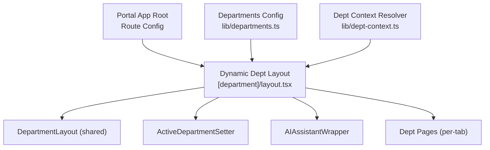
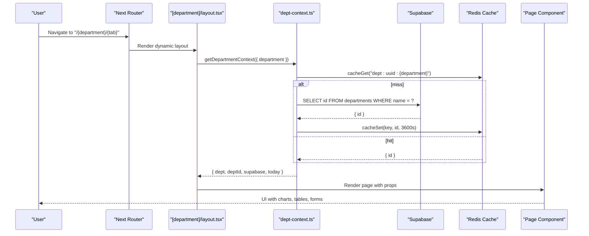
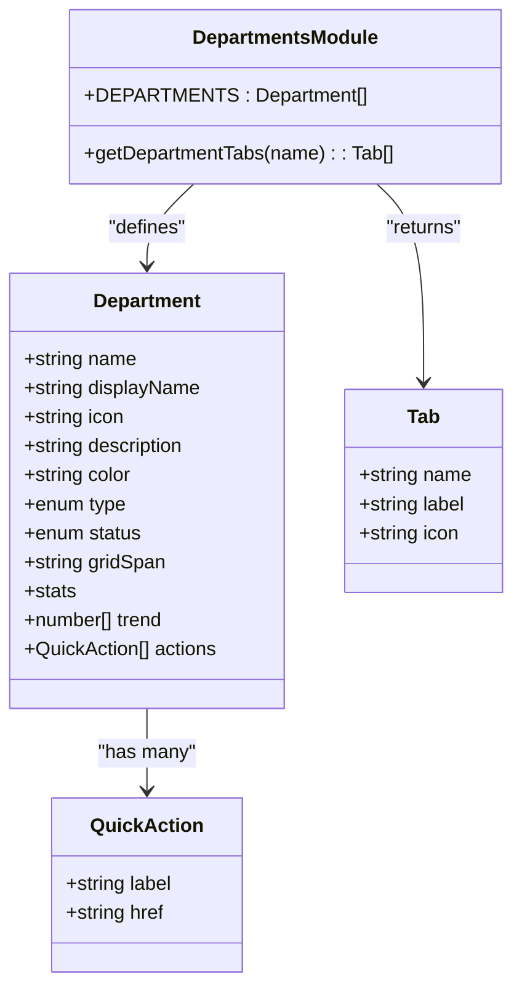
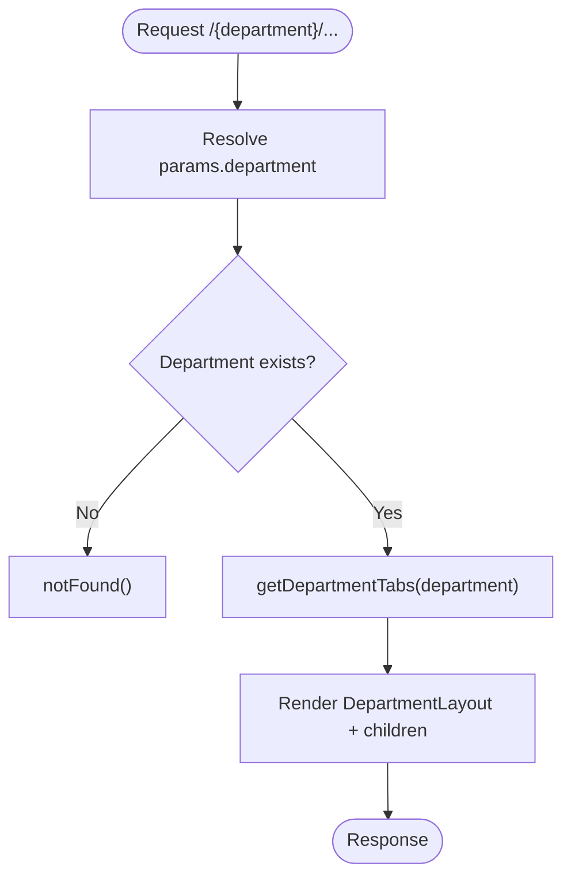
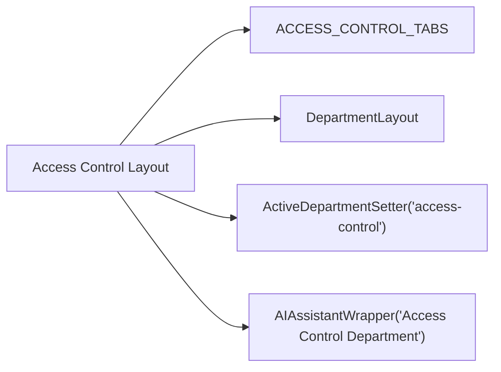
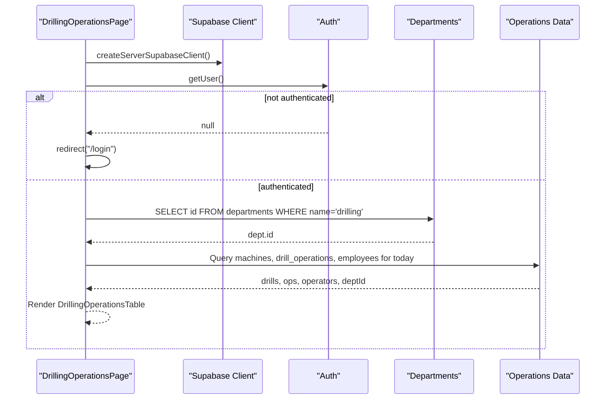
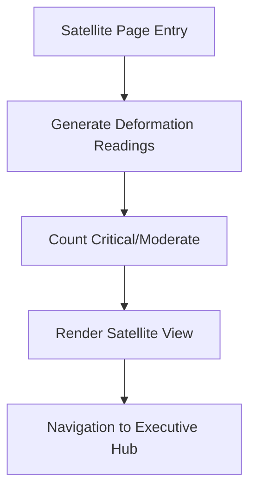
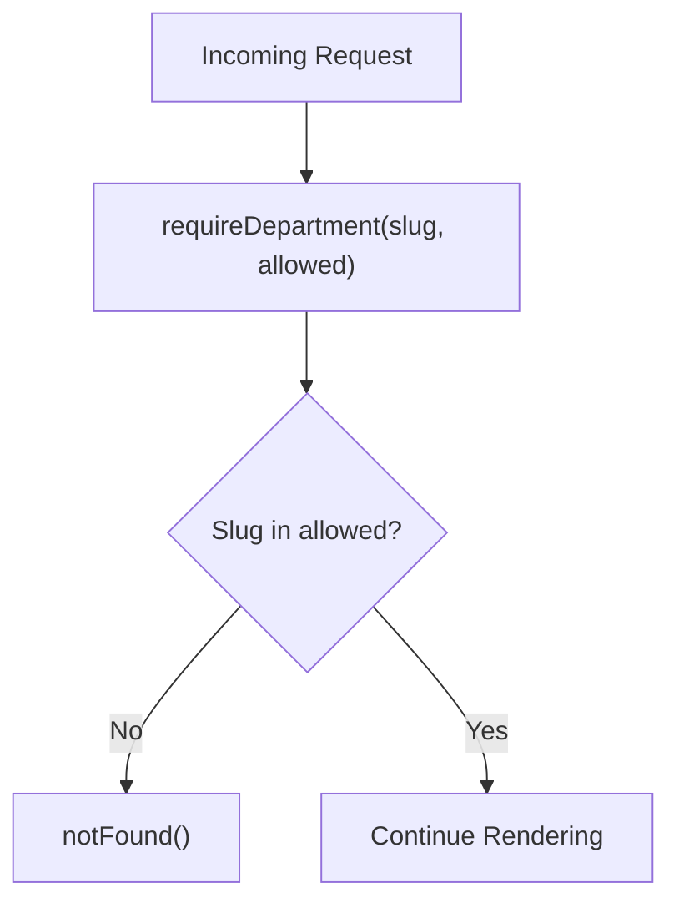
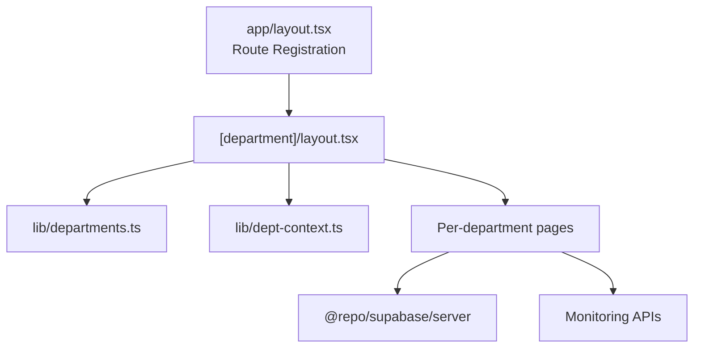

# Department Features

<cite>
**Referenced Files in This Document**
- [departments.ts](file://apps/portal/lib/departments.ts)
- [dept-context.ts](file://apps/portal/lib/dept-context.ts)
- [layout.tsx](file://apps/portal/app/(departments)/[department]/layout.tsx)
- [access-control/layout.tsx](file://apps/portal/app/(departments)/access-control/layout.tsx)
- [drilling/page.tsx](file://apps/portal/app/(departments)/drilling/drilling-operations/page.tsx)
- [satellite/page.tsx](file://apps/portal/app/(departments)/[department]/satellite/page.tsx)
- [loading.tsx](file://apps/portal/app/(departments)/loading.tsx)
- [layout.tsx](file://apps/portal/app/layout.tsx)
</cite>

## Table of Contents
1. Introduction
2. Project Structure
3. Core Components
4. Architecture Overview
5. Detailed Component Analysis
6. Dependency Analysis
7. Performance Considerations
8. Troubleshooting Guide
9. Conclusion
10. Appendices

## Introduction
This document explains the multi-departmental feature system that powers specialized operational areas across the portal. It covers the department architecture pattern, shared components, role-based access control, and the unique features, data models, and business logic for each department: Drilling, Production, Safety, Access Control, Engineering, Control Room, Training, and Satellite Monitoring. It also documents common patterns used for data visualization, reporting, and real-time updates, and provides guidelines for creating new departments and extending existing functionality.

## Project Structure
The department system is implemented as a Next.js application with:
- A centralized configuration module defining all departments, their metadata, and tab sets
- A dynamic route layout that resolves department context and renders a shared UI shell
- Per-department layouts and pages implementing domain-specific features
- Shared UI components and utilities for consistent UX across departments

**Diagram sources**
- [layout.tsx](file://apps/portal/app/(departments)/[department]/layout.tsx#L1-L30)
- [departments.ts:1-310](file://apps/portal/lib/departments.ts#L1-L310)
- [dept-context.ts:1-68](file://apps/portal/lib/dept-context.ts#L1-L68)

**Section sources**
- [layout.tsx](file://apps/portal/app/(departments)/[department]/layout.tsx#L1-L30)
- [departments.ts:1-310](file://apps/portal/lib/departments.ts#L1-L310)
- [dept-context.ts:1-68](file://apps/portal/lib/dept-context.ts#L1-L68)

## Core Components
- Departments registry and tab definitions: Centralized list of departments with metadata (name, display name, icon, color, type, status, grid span, stats, trend, actions) and per-department tab sets. Includes a resolver function to return the correct tabs based on department slug.
- Department context resolver: Server-side utility that validates the department slug, fetches the department UUID from Supabase, caches it in Redis, and returns a standardized context object including today’s operational date. Also includes a helper to restrict access to specific departments.
- Dynamic department layout: Resolves the current department from the URL, selects the appropriate tabs, and wraps content with the shared DepartmentLayout, active department setter, and AI assistant wrapper.
- Loading state: A shared skeleton loader for department routes to ensure smooth transitions.

Key responsibilities:
- Configuration-driven routing and navigation
- Consistent layout and chrome across departments
- Secure and cached resolution of department identity
- Standardized loading states

**Section sources**
- [departments.ts:1-310](file://apps/portal/lib/departments.ts#L1-L310)
- [dept-context.ts:1-68](file://apps/portal/lib/dept-context.ts#L1-L68)
- [layout.tsx](file://apps/portal/app/(departments)/[department]/layout.tsx#L1-L30)
- [loading.tsx](file://apps/portal/app/(departments)/loading.tsx#L1-L16)

## Architecture Overview
The department system follows a configuration-first, layout-driven architecture:
- The router matches /{department}/... and delegates to the dynamic layout
- The layout uses the departments registry to validate and render the correct tabs
- Each page implements its own data fetching and rendering logic
- Shared UI components provide consistent visuals and interactions

**Diagram sources**
- [layout.tsx](file://apps/portal/app/(departments)/[department]/layout.tsx#L1-L30)
- [dept-context.ts:1-68](file://apps/portal/lib/dept-context.ts#L1-L68)

## Detailed Component Analysis

### Department Registry and Tabs
- Defines all departments with rich metadata and quick actions
- Provides tab sets for standard, control room, satellite, engineering, drilling, access control, and training departments
- Exposes a resolver to select the correct tab set by department slug

**Diagram sources**
- [departments.ts:1-310](file://apps/portal/lib/departments.ts#L1-L310)

**Section sources**
- [departments.ts:1-310](file://apps/portal/lib/departments.ts#L1-L310)

### Dynamic Department Layout
- Validates the department against the registry
- Selects the appropriate tab set via the resolver
- Wraps content with shared layout, active department setter, and AI assistant wrapper

**Diagram sources**
- [layout.tsx](file://apps/portal/app/(departments)/[department]/layout.tsx#L1-L30)
- [departments.ts:289-309](file://apps/portal/lib/departments.ts#L289-L309)

**Section sources**
- [layout.tsx](file://apps/portal/app/(departments)/[department]/layout.tsx#L1-L30)

### Access Control Department
- Dedicated layout that pins the department and selects the Access Control tab set
- Provides sub-routes for access logs, visitors, badges, and reports
- Uses shared layout and AI assistant wrapper

**Diagram sources**
- [access-control/layout.tsx](file://apps/portal/app/(departments)/access-control/layout.tsx#L1-L26)
- [departments.ts:266-272](file://apps/portal/lib/departments.ts#L266-L272)

**Section sources**
- [access-control/layout.tsx](file://apps/portal/app/(departments)/access-control/layout.tsx#L1-L26)
- [departments.ts:266-272](file://apps/portal/lib/departments.ts#L266-L272)

### Drilling Operations
- Server component that enforces authentication and redirects unauthenticated users
- Fetches drill rigs, operations, and operators for the current operational day
- Passes data to a table component for inline editing and reporting

**Diagram sources**
- [drilling/page.tsx](file://apps/portal/app/(departments)/drilling/drilling-operations/page.tsx#L1-L79)

**Section sources**
- [drilling/page.tsx](file://apps/portal/app/(departments)/drilling/drilling-operations/page.tsx#L1-L79)

### Satellite Monitoring
- Renders a satellite monitoring view with deformation readings and severity counts
- Integrates with monitoring API to generate sample or live data
- Provides navigation back to the executive hub

**Diagram sources**
- [satellite/page.tsx](file://apps/portal/app/(departments)/[department]/satellite/page.tsx#L1-L33)

**Section sources**
- [satellite/page.tsx](file://apps/portal/app/(departments)/[department]/satellite/page.tsx#L1-L33)

### Role-Based Access Control
- Department-level validation: The dynamic layout rejects unknown departments
- Context caching: Department UUID lookup is cached in Redis to reduce database load
- Optional department restriction helper: A utility to enforce allowed departments for specific tabs or features

**Diagram sources**
- [dept-context.ts:59-67](file://apps/portal/lib/dept-context.ts#L59-L67)

**Section sources**
- [dept-context.ts:16-52](file://apps/portal/lib/dept-context.ts#L16-L52)
- [dept-context.ts:59-67](file://apps/portal/lib/dept-context.ts#L59-L67)

### Common Patterns Across Departments
- Data visualization: Charts and KPI grids are consistently rendered within the shared layout; satellite and control room views integrate map/raster layers and real-time indicators
- Reporting: Reports pages follow a uniform structure with copy/export buttons and filters
- Real-time updates: Pages use server components with dynamic rendering and client components for live widgets where needed
- Navigation: Active department setter ensures global navigation reflects the current department

**Section sources**
- [departments.ts:208-283](file://apps/portal/lib/departments.ts#L208-L283)
- [layout.tsx](file://apps/portal/app/(departments)/[department]/layout.tsx#L1-L30)

## Dependency Analysis
- Route configuration registers all department paths at the app root level
- Dynamic layout depends on the departments registry and the context resolver
- Department pages depend on Supabase clients and domain-specific APIs
- Shared UI components encapsulate visual consistency

**Diagram sources**
- [layout.tsx:115-139](file://apps/portal/app/layout.tsx#L115-L139)
- [layout.tsx](file://apps/portal/app/(departments)/[department]/layout.tsx#L1-L30)
- [departments.ts:1-310](file://apps/portal/lib/departments.ts#L1-L310)
- [dept-context.ts:1-68](file://apps/portal/lib/dept-context.ts#L1-L68)

**Section sources**
- [layout.tsx:115-139](file://apps/portal/app/layout.tsx#L115-L139)
- [layout.tsx](file://apps/portal/app/(departments)/[department]/layout.tsx#L1-L30)
- [departments.ts:1-310](file://apps/portal/lib/departments.ts#L1-L310)
- [dept-context.ts:1-68](file://apps/portal/lib/dept-context.ts#L1-L68)

## Performance Considerations
- Caching: Department UUID lookups are cached in Redis with a one-hour TTL to minimize database reads
- Dynamic rendering: Pages opt into dynamic rendering to support real-time data and user-specific queries
- Parallel queries: Use Promise.all to fetch related datasets concurrently (e.g., machines, operations, employees)
- Skeleton loaders: Provide lightweight placeholders during initial load to improve perceived performance

**Section sources**
- [dept-context.ts:28-41](file://apps/portal/lib/dept-context.ts#L28-L41)
- [drilling/page.tsx](file://apps/portal/app/(departments)/drilling/drilling-operations/page.tsx#L26-L46)
- [loading.tsx](file://apps/portal/app/(departments)/loading.tsx#L1-L16)

## Troubleshooting Guide
- Unknown department slugs: The dynamic layout calls notFound when the slug is not registered; verify the slug exists in the departments registry
- Missing department in database: The context resolver calls notFound if the department UUID cannot be resolved; ensure the department record exists
- Authentication failures: Some pages redirect to login if no user is present; confirm auth state before accessing protected routes
- Cache misses: If Redis is unavailable, the resolver falls back to direct database queries; monitor latency and errors

**Section sources**
- [layout.tsx](file://apps/portal/app/(departments)/[department]/layout.tsx#L14-L16)
- [dept-context.ts:23-41](file://apps/portal/lib/dept-context.ts#L23-L41)
- [drilling/page.tsx](file://apps/portal/app/(departments)/drilling/drilling-operations/page.tsx#L12-L13)

## Conclusion
The multi-departmental feature system leverages a configuration-driven approach with a shared layout and robust context resolution. Each department maintains its own tabs, pages, and business logic while reusing common UI and infrastructure. The design supports scalability, clear separation of concerns, and consistent user experience across operational areas.

## Appendices

### Guidelines for Creating a New Department
- Add a new entry to the departments registry with required metadata and optional stats/trend/actions
- Define a dedicated tab set if the department has specialized workflows
- Create a department layout under (departments)/{slug}/layout.tsx using the shared layout and AI assistant wrapper
- Implement pages for each tab following the established patterns for data fetching and rendering
- Register the new route path in the app root layout if necessary
- Optionally implement requireDepartment guards for restricted tabs

**Section sources**
- [departments.ts:23-168](file://apps/portal/lib/departments.ts#L23-L168)
- [departments.ts:208-283](file://apps/portal/lib/departments.ts#L208-L283)
- [layout.tsx](file://apps/portal/app/(departments)/[department]/layout.tsx#L1-L30)
- [layout.tsx:115-139](file://apps/portal/app/layout.tsx#L115-L139)

### Extending Existing Functionality
- Add new tabs by updating the relevant tab set and creating corresponding pages
- Introduce new KPIs or trends by extending department metadata
- Enhance real-time capabilities by integrating additional monitoring APIs and client components
- Improve reporting by adding export/copy features and filters consistent with existing report pages

**Section sources**
- [departments.ts:208-283](file://apps/portal/lib/departments.ts#L208-L283)
- [satellite/page.tsx](file://apps/portal/app/(departments)/[department]/satellite/page.tsx#L1-L33)