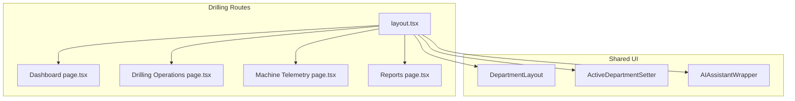
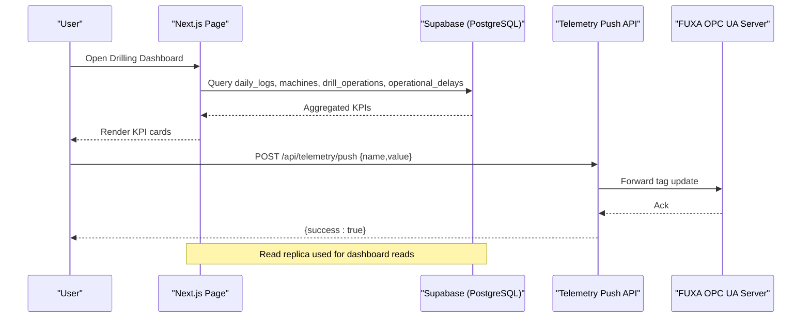
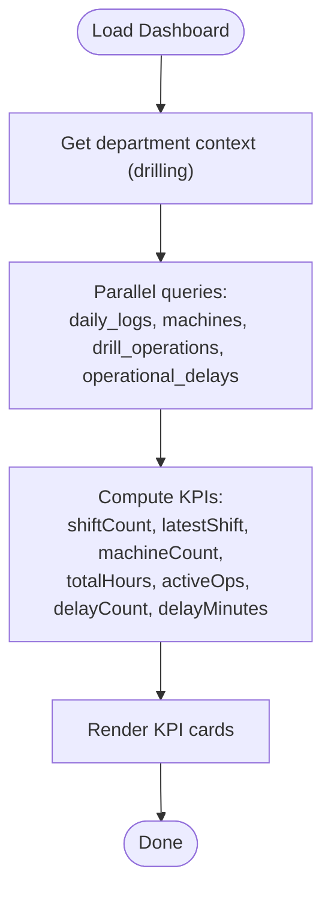
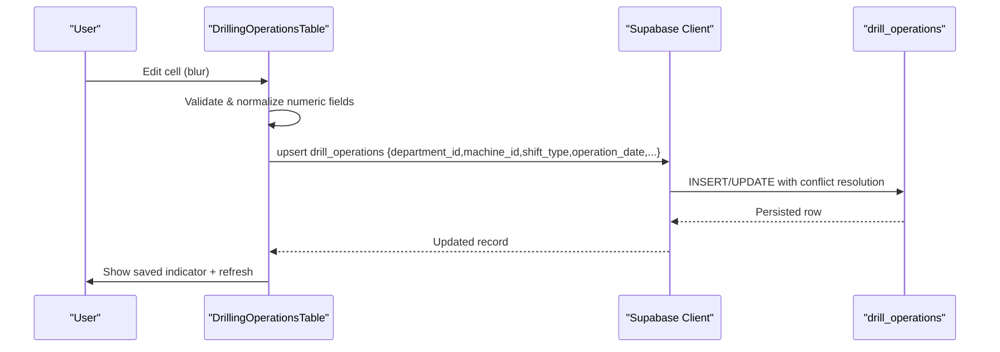
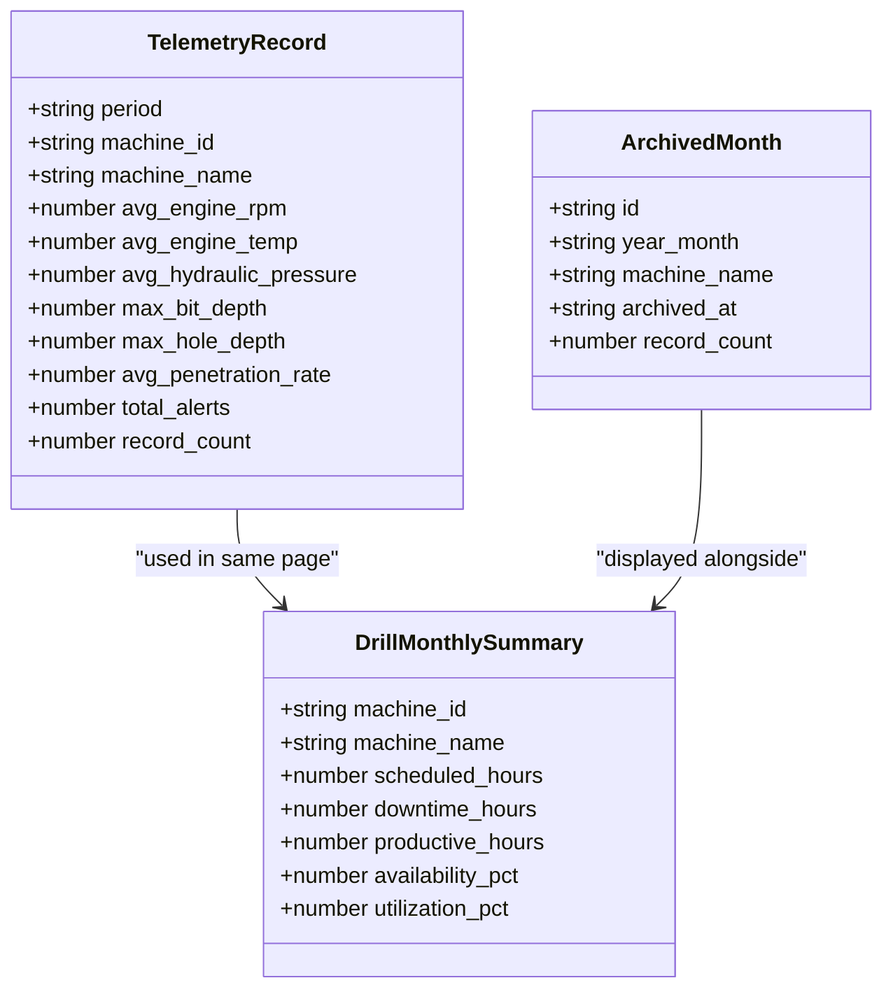
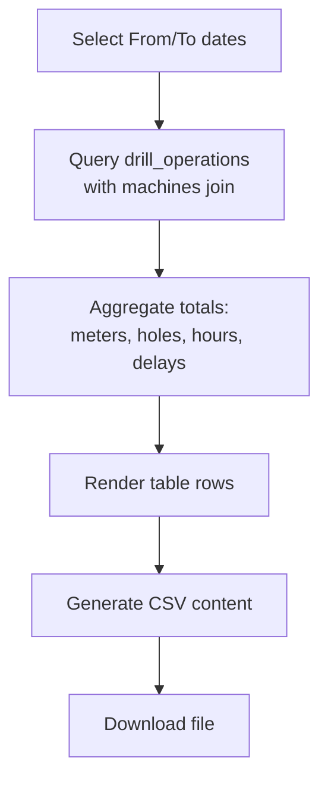
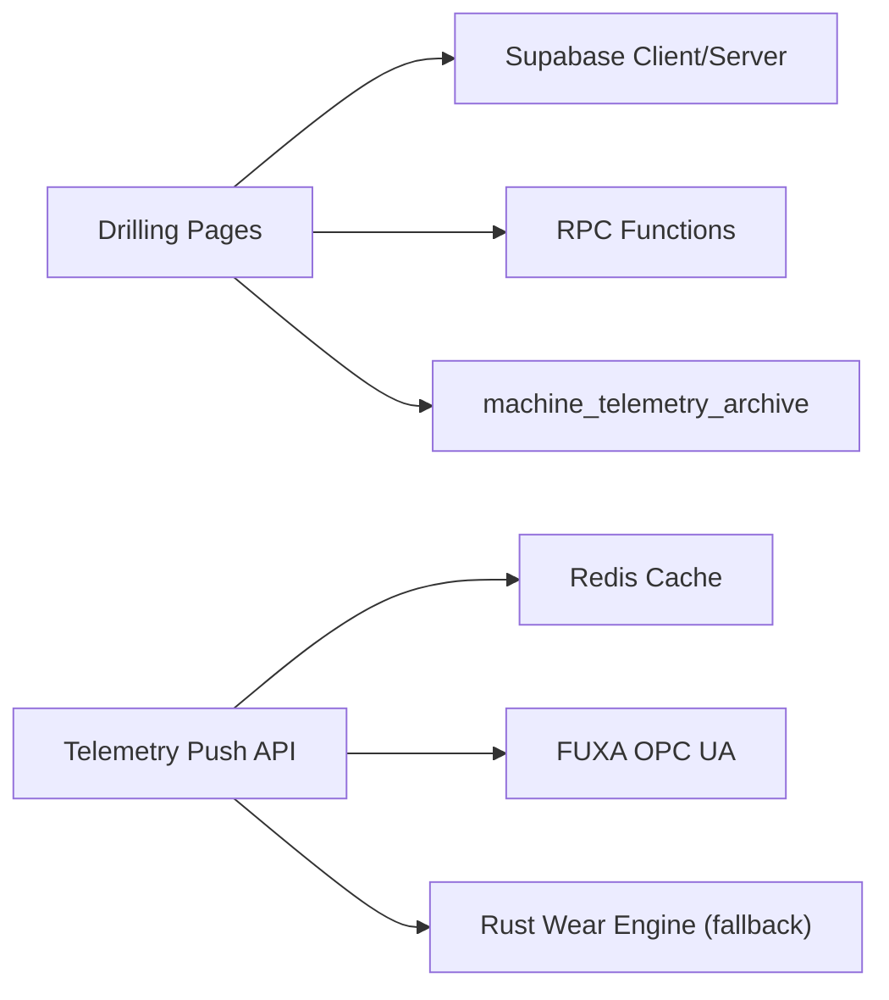

# Drilling Department

<cite>
**Referenced Files in This Document**
- [drilling-department.md](file://wiki/entities/drilling-department.md)
- [page.tsx](file://apps/portal/app/(departments)/drilling/page.tsx)
- [layout.tsx](file://apps/portal/app/(departments)/drilling/layout.tsx)
- [page.tsx](file://apps/portal/app/(departments)/drilling/drilling-operations/page.tsx)
- [DrillingOperationsTable.tsx](file://apps/portal/app/(departments)/drilling/drilling-operations/DrillingOperationsTable.tsx)
- [page.tsx](file://apps/portal/app/(departments)/drilling/machine-telemetry/page.tsx)
- [page.tsx](file://apps/portal/app/(departments)/drilling/reports/page.tsx)
- [database-schema.md](file://wiki/concepts/database-schema.md)
- [SCHEMA.md](file://wiki/SCHEMA.md)
- [024_drill_operations.sql](file://packages/database/migrations/024_drill_operations.sql)
- [056_drill_operations_v2.sql](file://packages/database/migrations/056_drill_operations_v2.sql)
- [route.ts](file://apps/portal/app/api/plugins/rust-telemetry/route.ts)
- [route.ts](file://apps/portal/app/api/telemetry/push/route.ts)
</cite>

## Table of Contents
1. [Introduction](#introduction)
2. [Project Structure](#project-structure)
3. [Core Components](#core-components)
4. [Architecture Overview](#architecture-overview)
5. [Detailed Component Analysis](#detailed-component-analysis)
6. [Dependency Analysis](#dependency-analysis)
7. [Performance Considerations](#performance-considerations)
8. [Troubleshooting Guide](#troubleshooting-guide)
9. [Conclusion](#conclusion)
10. [Appendices](#appendices)

## Introduction
This document provides comprehensive documentation for the Drilling department feature set, covering drill rig operations management, bit depth telemetry system, and real-time monitoring capabilities. It explains dashboard KPIs (current depth tracking, daily progress metrics, rig utilization percentages, and bit wear estimation), the database schema for daily_logs, machines, machine_hours, and fuel_logs with relationships and Row Level Security (RLS) policies, and the tabbed interface structure including dashboard, daily-log, machines, history, reports, and tools sections. It also documents implementation details for telemetry data ingestion, shift logging workflows, equipment inventory management, and examples of drilling-specific forms, charts, and reporting features.

## Project Structure
The Drilling department is implemented as a Next.js App Router route group under apps/portal/app/(departments)/drilling. The layout wires up shared navigation and AI assistant context, while individual pages implement dashboards, live operations, telemetry, and reports.

**Diagram sources**
- [layout.tsx](file://apps/portal/app/(departments)/drilling/layout.tsx#L1-L27)
- [page.tsx](file://apps/portal/app/(departments)/drilling/page.tsx#L1-L167)
- [page.tsx](file://apps/portal/app/(departments)/drilling/drilling-operations/page.tsx#L1-L79)
- [page.tsx](file://apps/portal/app/(departments)/drilling/machine-telemetry/page.tsx#L1-L719)
- [page.tsx](file://apps/portal/app/(departments)/drilling/reports/page.tsx#L1-L418)

**Section sources**
- [layout.tsx](file://apps/portal/app/(departments)/drilling/layout.tsx#L1-L27)
- [page.tsx](file://apps/portal/app/(departments)/drilling/page.tsx#L1-L167)

## Core Components
- Dashboard: Displays today’s shift count, active drills, total hours, and delays using read-replica queries scoped to the drilling department.
- Drilling Operations: Inline per-rig, per-shift log with on-blur save, shift toggling, operator assignment, and delay fields.
- Machine Telemetry: Aggregated daily telemetry summaries, monthly availability/utilization summary, and archived months view.
- Reports: Date-range production report with CSV export and aggregated totals.

Key responsibilities:
- Data fetching via Supabase server/client
- Department-scoped access through RLS
- Real-time or near-real-time updates where applicable
- Export and archival support

**Section sources**
- [page.tsx](file://apps/portal/app/(departments)/drilling/page.tsx#L1-L167)
- [page.tsx](file://apps/portal/app/(departments)/drilling/drilling-operations/page.tsx#L1-L79)
- [DrillingOperationsTable.tsx](file://apps/portal/app/(departments)/drilling/drilling-operations/DrillingOperationsTable.tsx#L1-L650)
- [page.tsx](file://apps/portal/app/(departments)/drilling/machine-telemetry/page.tsx#L1-L719)
- [page.tsx](file://apps/portal/app/(departments)/drilling/reports/page.tsx#L1-L418)

## Architecture Overview
The Drilling module integrates UI components with backend services and databases:
- Server-side pages fetch from Supabase using department-scoped clients.
- Client-side tables perform optimistic edits and upserts to drill_operations.
- Telemetry ingestion routes accept tag payloads and forward them to FUXA or compute wear estimates via a native Rust engine fallback.
- Database schemas enforce RLS policies and provide computed columns and RPC functions for summaries.

**Diagram sources**
- [page.tsx](file://apps/portal/app/(departments)/drilling/page.tsx#L1-L167)
- [route.ts:1-171](file://apps/portal/app/api/telemetry/push/route.ts#L1-L171)

## Detailed Component Analysis

### Dashboard
- Purpose: Provide high-level drilling KPIs for the current day.
- Data sources: daily_logs (shift counts), machines (active rigs), drill_operations (total hours, active ops), operational_delays (delay counts and minutes).
- Access control: Uses department context and read-replica client; RLS enforced at the database level.
- KPIs: Today's Log, Active Drills, Hours Today, Delays.

**Diagram sources**
- [page.tsx](file://apps/portal/app/(departments)/drilling/page.tsx#L1-L167)

**Section sources**
- [page.tsx](file://apps/portal/app/(departments)/drilling/page.tsx#L1-L167)

### Drilling Operations (Shift Logging)
- Purpose: Per-rig, per-shift inline logging with on-blur persistence.
- Key fields: open/close hours, total hours (computed), operator name, block/site, external/standard/production/engineering delays, comments.
- Behavior:
  - Shift toggle per row (day/night).
  - Numeric validation and null handling.
  - Upsert with conflict key (machine_id, operation_date, shift_type).
  - Immediate refresh after save.

**Diagram sources**
- [DrillingOperationsTable.tsx](file://apps/portal/app/(departments)/drilling/drilling-operations/DrillingOperationsTable.tsx#L1-L650)
- [024_drill_operations.sql:1-159](file://packages/database/migrations/024_drill_operations.sql#L1-L159)
- [056_drill_operations_v2.sql:1-102](file://packages/database/migrations/056_drill_operations_v2.sql#L1-L102)

**Section sources**
- [page.tsx](file://apps/portal/app/(departments)/drilling/drilling-operations/page.tsx#L1-L79)
- [DrillingOperationsTable.tsx](file://apps/portal/app/(departments)/drilling/drilling-operations/DrillingOperationsTable.tsx#L1-L650)
- [024_drill_operations.sql:1-159](file://packages/database/migrations/024_drill_operations.sql#L1-L159)
- [056_drill_operations_v2.sql:1-102](file://packages/database/migrations/056_drill_operations_v2.sql#L1-L102)

### Machine Telemetry
- Purpose: Display aggregated daily telemetry summaries, monthly availability/utilization, and archived months.
- Data sources:
  - RPC get_telemetry_summary (department-scoped, optional machine filter).
  - machine_telemetry_archive for historical records.
  - RPC get_drill_monthly_summary for availability/utilization derived from drill_operations.
- Features:
  - Filter by drill rig.
  - Highlight anomalies (high RPM, overheating).
  - Archive listing with record counts.

**Diagram sources**
- [page.tsx](file://apps/portal/app/(departments)/drilling/machine-telemetry/page.tsx#L1-L719)

**Section sources**
- [page.tsx](file://apps/portal/app/(departments)/drilling/machine-telemetry/page.tsx#L1-L719)

### Reports
- Purpose: Production report for selected date range with CSV export.
- Data source: drill_operations joined with machines for drill rig names.
- Metrics: Total meters drilled, holes, operating hours, and categorized delays.

**Diagram sources**
- [page.tsx](file://apps/portal/app/(departments)/drilling/reports/page.tsx#L1-L418)

**Section sources**
- [page.tsx](file://apps/portal/app/(departments)/drilling/reports/page.tsx#L1-L418)

### Tabbed Interface Structure
The drilling section includes tabs for:
- Dashboard
- Daily-log (implemented as Drilling Operations)
- Machines (inventory and specs)
- History (historical drilling data and trends)
- Reports
- Tools (calculators and utilities)

These are wired via the department layout and tab configuration.

**Section sources**
- [layout.tsx](file://apps/portal/app/(departments)/drilling/layout.tsx#L1-L27)
- [drilling-department.md:1-71](file://wiki/entities/drilling-department.md#L1-L71)

## Dependency Analysis
- UI depends on:
  - Shared UI components (GlassCard, Table, Button)
  - Supabase server/client libraries
  - Utility helpers (operational date calculation)
- Pages depend on:
  - Database tables: daily_logs, machines, drill_operations, operational_delays, employees
  - RPC functions: get_telemetry_summary, get_drill_monthly_summary
  - Archive table: machine_telemetry_archive
- Telemetry ingestion depends on:
  - Redis for last-value caching (optional)
  - External FUXA server for tag forwarding
  - Optional native Rust engine for wear estimation

**Diagram sources**
- [page.tsx](file://apps/portal/app/(departments)/drilling/machine-telemetry/page.tsx#L1-L719)
- [route.ts:1-171](file://apps/portal/app/api/telemetry/push/route.ts#L1-L171)
- [route.ts:1-92](file://apps/portal/app/api/plugins/rust-telemetry/route.ts#L1-L92)

**Section sources**
- [page.tsx](file://apps/portal/app/(departments)/drilling/machine-telemetry/page.tsx#L1-L719)
- [route.ts:1-171](file://apps/portal/app/api/telemetry/push/route.ts#L1-L171)
- [route.ts:1-92](file://apps/portal/app/api/plugins/rust-telemetry/route.ts#L1-L92)

## Performance Considerations
- Use read replicas for dashboard reads to offload primary database.
- Aggregate heavy computations via SQL/RPC functions (e.g., monthly summary).
- Leverage indexes on frequently filtered columns (department_id, machine_id, operation_date).
- Apply rate limiting and body limits on ingestion endpoints.
- Cache repeated values locally and in Redis to avoid redundant processing.

[No sources needed since this section provides general guidance]

## Troubleshooting Guide
- Authentication failures: Ensure user is authenticated before accessing protected routes; server pages redirect to login if missing.
- RLS denials: Verify employee membership and accessible_departments for the requesting user.
- Missing data: Confirm that daily logs and drill operations exist for the selected date range; empty states are handled gracefully.
- Telemetry ingestion errors: Check request payload validation and FUXA connectivity; inspect error logs for native engine exceptions.

**Section sources**
- [page.tsx](file://apps/portal/app/(departments)/drilling/drilling-operations/page.tsx#L1-L79)
- [route.ts:1-92](file://apps/portal/app/api/plugins/rust-telemetry/route.ts#L1-L92)
- [route.ts:1-171](file://apps/portal/app/api/telemetry/push/route.ts#L1-L171)

## Conclusion
The Drilling department feature set delivers robust drill rig operations management, bit depth telemetry visualization, and real-time monitoring. It combines intuitive forms, comprehensive reporting, and secure, department-scoped data access. With well-defined database schemas, RLS policies, and efficient aggregation patterns, it supports both operational needs and analytical insights.

[No sources needed since this section summarizes without analyzing specific files]

## Appendices

### Database Schema Summary (Drilling-related)
- daily_logs: Parent container for shift-level operational data per department.
- machines: Equipment registry per department with type and active flags.
- machine_hours: Child of daily_logs tracking per-machine hours worked.
- fuel_logs: Child of daily_logs tracking diesel consumption.
- drill_operations: Detailed shift-level drilling operations with computed total hours and editable delay fields.
- machine_telemetry_archive: Historical telemetry summaries per month.

Relationships:
- daily_logs -> machine_hours, fuel_logs (parent-child)
- machines -> drill_operations (one-to-many)
- departments -> all tables (ownership via department_id)

RLS policies:
- All tables use department-scoped policies based on employees.auth_id and roles.

**Section sources**
- [database-schema.md:1-338](file://wiki/concepts/database-schema.md#L1-L338)
- [SCHEMA.md:190-259](file://wiki/SCHEMA.md#L190-L259)
- [024_drill_operations.sql:1-159](file://packages/database/migrations/024_drill_operations.sql#L1-L159)
- [056_drill_operations_v2.sql:1-102](file://packages/database/migrations/056_drill_operations_v2.sql#L1-L102)

### Telemetry Ingestion Flow
- Direct single-tag push: Validates payload, checks local/Redis cache, forwards to FUXA, returns success.
- Native Rust wear estimation: If binary exists, calls executable with parameters; otherwise falls back to JS emulator.

**Section sources**
- [route.ts:1-171](file://apps/portal/app/api/telemetry/push/route.ts#L1-L171)
- [route.ts:1-92](file://apps/portal/app/api/plugins/rust-telemetry/route.ts#L1-L92)

### Examples of Forms, Charts, and Reporting
- Forms:
  - Inline shift log with per-cell blur saves, numeric normalization, and shift toggles.
- Charts:
  - Availability and utilization summary table auto-built from drill operations.
- Reporting:
  - CSV export of production metrics with categorized delays.

**Section sources**
- [DrillingOperationsTable.tsx](file://apps/portal/app/(departments)/drilling/drilling-operations/DrillingOperationsTable.tsx#L1-L650)
- [page.tsx](file://apps/portal/app/(departments)/drilling/machine-telemetry/page.tsx#L1-L719)
- [page.tsx](file://apps/portal/app/(departments)/drilling/reports/page.tsx#L1-L418)