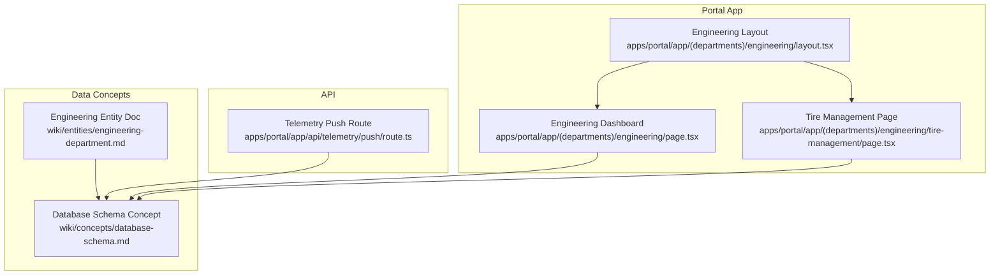
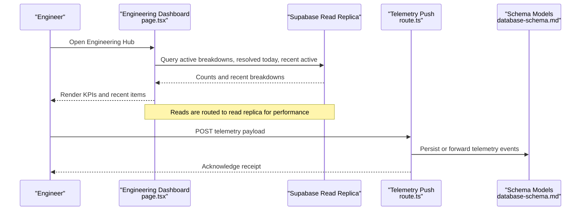
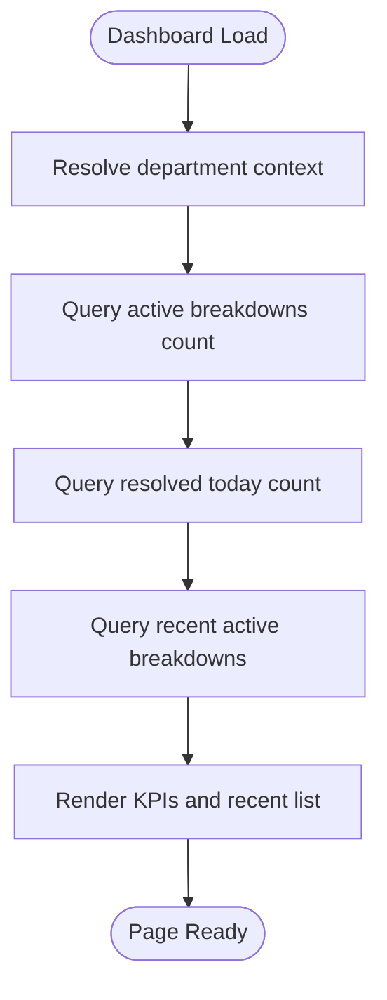
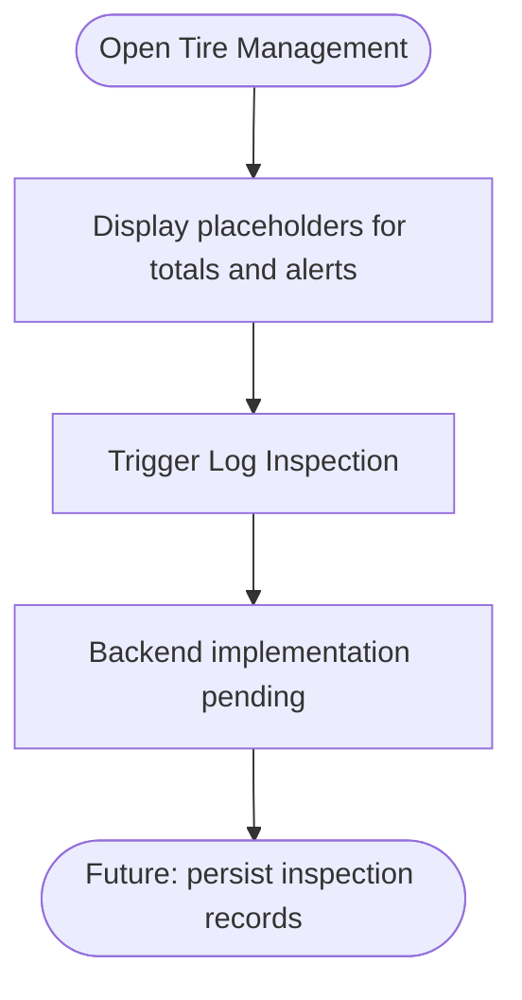
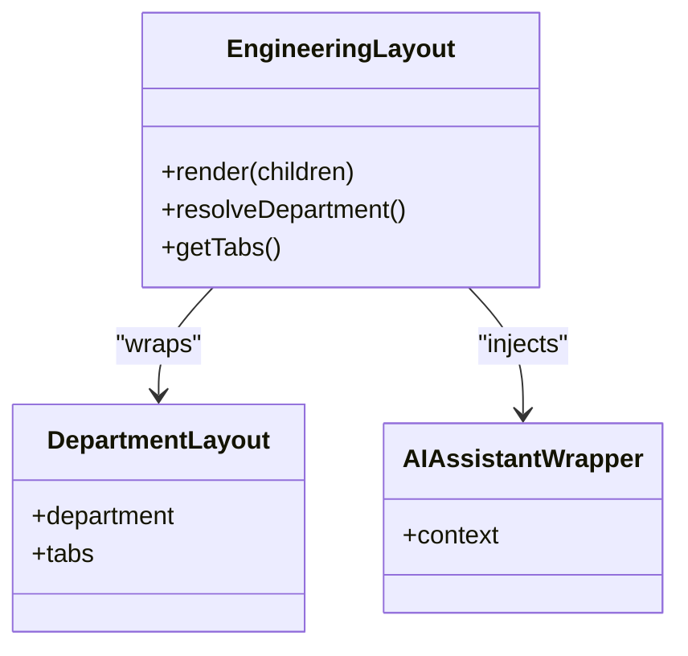
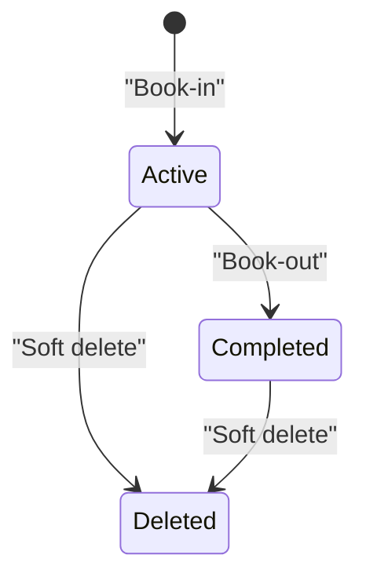
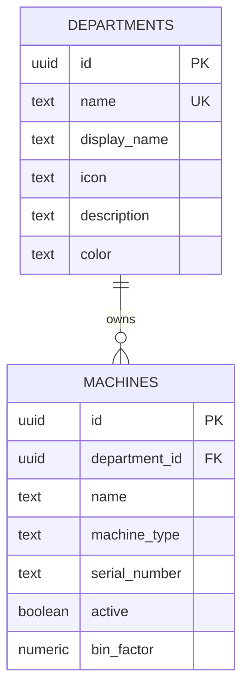
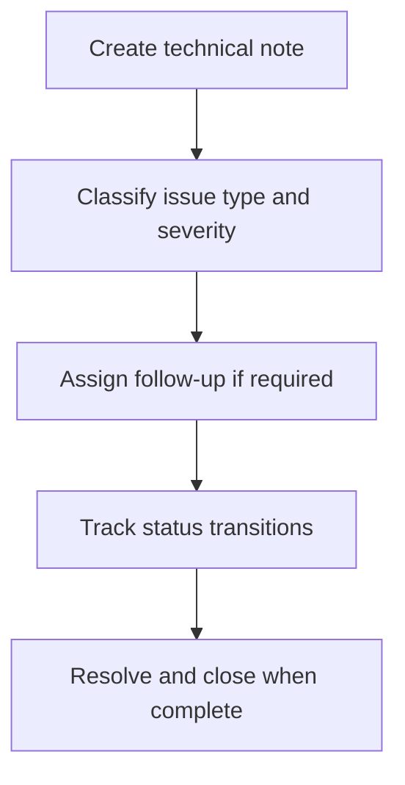
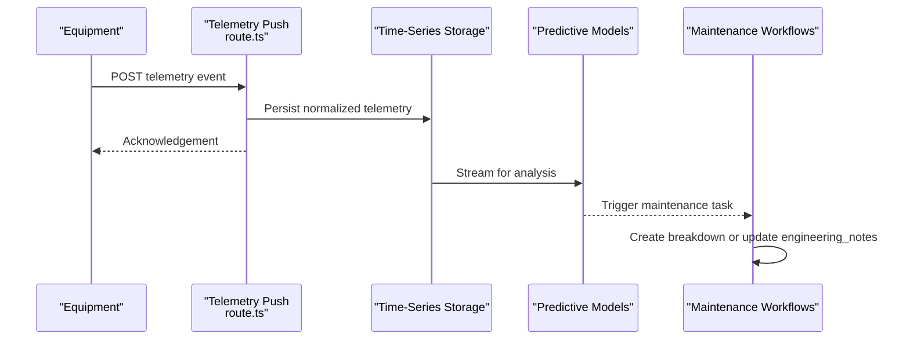
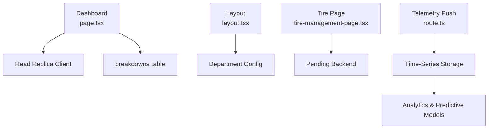

# Engineering Department

<cite>
**Referenced Files in This Document**
- [engineering-department.md](file://wiki/entities/engineering-department.md)
- [database-schema.md](file://wiki/concepts/database-schema.md)
- [page.tsx](file://apps/portal/app/(departments)/engineering/page.tsx)
- [layout.tsx](file://apps/portal/app/(departments)/engineering/layout.tsx)
- [tire-management-page.tsx](file://apps/portal/app/(departments)/engineering/tire-management/page.tsx)
- [telemetry-push-route.ts](file://apps/portal/app/api/telemetry/push/route.ts)
</cite>

## Table of Contents
1. [Introduction](#introduction)
2. [Project Structure](#project-structure)
3. [Core Components](#core-components)
4. [Architecture Overview](#architecture-overview)
5. [Detailed Component Analysis](#detailed-component-analysis)
6. [Dependency Analysis](#dependency-analysis)
7. [Performance Considerations](#performance-considerations)
8. [Troubleshooting Guide](#troubleshooting-guide)
9. [Conclusion](#conclusion)
10. [Appendices](#appendices)

## Introduction
This document describes the Engineering department features within the system, focusing on equipment specifications management, maintenance scheduling systems, CAD document handling, and technical notes organization. It explains the engineering data models, asset lifecycle tracking, and maintenance workflow automation. It also covers integration with equipment telemetry data and outlines guidelines for managing engineering documentation and technical specifications.

The Engineering module provides:
- A dashboard hub for breakdowns and tire management
- Breakdown book-in/book-out workflow with status and audit fields
- Equipment registry (machines) with per-department isolation
- Technical notes table for issue tracking
- Telemetry ingestion endpoint to support predictive maintenance workflows

## Project Structure
Engineering-related code is organized under the portal application’s department routes and shared database schema concepts:
- Portal UI for Engineering:
  - Dashboard page and layout
  - Tire management placeholder page
- Database schema concepts:
  - Core tables including machines, breakdowns, daily_logs, engineering_notes
- Telemetry ingestion API route for pushing equipment telemetry

**Diagram sources**
- [layout.tsx](file://apps/portal/app/(departments)/engineering/layout.tsx#L1-L27)
- [page.tsx](file://apps/portal/app/(departments)/engineering/page.tsx#L1-L220)
- [tire-management-page.tsx](file://apps/portal/app/(departments)/engineering/tire-management/page.tsx#L1-L77)
- [database-schema.md:1-338](file://wiki/concepts/database-schema.md#L1-L338)
- [engineering-department.md:1-69](file://wiki/entities/engineering-department.md#L1-L69)

**Section sources**
- [layout.tsx](file://apps/portal/app/(departments)/engineering/layout.tsx#L1-L27)
- [page.tsx](file://apps/portal/app/(departments)/engineering/page.tsx#L1-L220)
- [tire-management-page.tsx](file://apps/portal/app/(departments)/engineering/tire-management/page.tsx#L1-L77)
- [database-schema.md:1-338](file://wiki/concepts/database-schema.md#L1-L338)
- [engineering-department.md:1-69](file://wiki/entities/engineering-department.md#L1-L69)

## Core Components
- Engineering Dashboard Hub
  - Displays active breakdowns count, resolved today count, recent active breakdowns list, and quick links to breakdowns and tire management.
  - Queries read replica for breakdown counts and recent items filtered by department and status.
- Tire Management Module
  - Placeholder page for inspections, wear tracking, and replacement scheduling; UI present but backend not yet implemented.
- Engineering Layout
  - Provides department context, tab navigation, and AI assistant wrapper scoped to Engineering.

Key responsibilities:
- Data fetching from read replica for KPIs
- Routing to breakdowns and tire management sections
- Consistent department scoping via RLS policies

**Section sources**
- [page.tsx](file://apps/portal/app/(departments)/engineering/page.tsx#L1-L220)
- [tire-management-page.tsx](file://apps/portal/app/(departments)/engineering/tire-management/page.tsx#L1-L77)
- [layout.tsx](file://apps/portal/app/(departments)/engineering/layout.tsx#L1-L27)

## Architecture Overview
The Engineering feature integrates UI components with a PostgreSQL-backed schema using Supabase. The dashboard queries breakdowns and aggregates KPIs. The telemetry push endpoint accepts equipment telemetry for downstream processing and predictive maintenance.

**Diagram sources**
- [page.tsx](file://apps/portal/app/(departments)/engineering/page.tsx#L1-L220)
- [telemetry-push-route.ts](file://apps/portal/app/api/telemetry/push/route.ts)
- [database-schema.md:1-338](file://wiki/concepts/database-schema.md#L1-L338)

## Detailed Component Analysis

### Engineering Dashboard
- Purpose: Provide an overview of active breakdowns, resolution throughput, and quick access to related modules.
- Data flow:
  - Fetches counts for active breakdowns and completed breakdowns updated within the last day.
  - Retrieves recent active breakdowns limited to five entries.
  - Renders summary cards and recent items with priority indicators.
- Security:
  - Uses read replica client and filters by department_id via RLS policies.

**Diagram sources**
- [page.tsx](file://apps/portal/app/(departments)/engineering/page.tsx#L1-L220)

**Section sources**
- [page.tsx](file://apps/portal/app/(departments)/engineering/page.tsx#L1-L220)

### Tire Management Module
- Purpose: Track tire inspections, wear metrics, pressure monitoring, and replacement schedules.
- Current state:
  - UI scaffolded with metric cards and “Log Inspection” action.
  - Backend and database table pending creation.
- Future integration points:
  - Link to fleet ID lookup and machine associations.
  - Alerts for due service and critical conditions.

**Diagram sources**
- [tire-management-page.tsx](file://apps/portal/app/(departments)/engineering/tire-management/page.tsx#L1-L77)

**Section sources**
- [tire-management-page.tsx](file://apps/portal/app/(departments)/engineering/tire-management/page.tsx#L1-L77)

### Engineering Layout
- Purpose: Wrap department-specific layout, set active department, provide tabs, and integrate AI assistant.
- Behavior:
  - Validates department existence and renders NotFound if missing.
  - Supplies tabs via getDepartmentTabs("engineering").
  - Injects AIAssistantWrapper with Engineering context.

**Diagram sources**
- [layout.tsx](file://apps/portal/app/(departments)/engineering/layout.tsx#L1-L27)

**Section sources**
- [layout.tsx](file://apps/portal/app/(departments)/engineering/layout.tsx#L1-L27)

### Maintenance Workflow Automation (Breakdowns)
- Lifecycle states:
  - Book-in: Record date/time, fleet ID, machine type, reason.
  - Investigation: Add repair notes during diagnosis.
  - Book-out: Set date/time out and mark status completed.
  - Audit: created_by and completed_by track responsible users.
- Data model highlights:
  - Status enum includes active and completed.
  - Soft delete via deleted_at.
  - Indexes on department, status, fleet_id, and date_in for performance.

**Diagram sources**
- [database-schema.md:91-116](file://wiki/concepts/database-schema.md#L91-L116)
- [engineering-department.md:32-38](file://wiki/entities/engineering-department.md#L32-L38)

**Section sources**
- [database-schema.md:91-116](file://wiki/concepts/database-schema.md#L91-L116)
- [engineering-department.md:32-38](file://wiki/entities/engineering-department.md#L32-L38)

### Equipment Specifications Management
- Equipment registry:
  - Machines table stores name, type, serial number, active flag, and bin_factor for dump trucks.
  - Per-department isolation enforced via department_id and RLS policies.
- Usage:
  - Links to breakdowns and operational logs.
  - Supports filtering and reporting by machine_type and active status.

**Diagram sources**
- [database-schema.md:51-66](file://wiki/concepts/database-schema.md#L51-L66)

**Section sources**
- [database-schema.md:51-66](file://wiki/concepts/database-schema.md#L51-L66)

### Technical Notes Organization
- engineering_notes table supports:
  - Issue types: mechanical, electrical, structural, hydraulic, other.
  - Severity levels: low, medium, high, critical.
  - Follow-up flags and status transitions: open, in_progress, resolved, closed.
- Use cases:
  - Track recurring issues and root causes.
  - Enable prioritization based on severity and follow-up requirements.

**Diagram sources**
- [database-schema.md:157-168](file://wiki/concepts/database-schema.md#L157-L168)

**Section sources**
- [database-schema.md:157-168](file://wiki/concepts/database-schema.md#L157-L168)

### CAD Document Handling
- Documentation storage bucket and history are referenced in migration summaries indicating documents storage capabilities.
- Guidelines:
  - Store CAD files in designated storage buckets.
  - Maintain version history and link documents to machines or breakdowns where applicable.
  - Enforce access control through department-scoped RLS policies.

[No sources needed since this section provides general guidance]

### Integration with Equipment Telemetry and Predictive Maintenance
- Telemetry ingestion:
  - Endpoint available at the telemetry push route to accept equipment telemetry payloads.
- Predictive maintenance:
  - Use telemetry time-series data to compute health indicators and trigger maintenance tasks.
  - Integrate with breakdowns and engineering_notes to correlate failures with sensor anomalies.
- Operational considerations:
  - Validate payloads and normalize units.
  - Partition time-series data for scalability.
  - Leverage materialized views and indexes for analytics.

**Diagram sources**
- [telemetry-push-route.ts](file://apps/portal/app/api/telemetry/push/route.ts)
- [database-schema.md:269-276](file://wiki/concepts/database-schema.md#L269-L276)

**Section sources**
- [telemetry-push-route.ts](file://apps/portal/app/api/telemetry/push/route.ts)
- [database-schema.md:269-276](file://wiki/concepts/database-schema.md#L269-L276)

## Dependency Analysis
- UI dependencies:
  - Dashboard depends on read replica client and breakdowns table.
  - Layout depends on department configuration and tabs provider.
- Data dependencies:
  - All operational tables use RLS policies scoped by department membership.
  - Time-series tables benefit from partitioning and indexes.
- External integrations:
  - Telemetry push route integrates with external equipment sensors.

**Diagram sources**
- [page.tsx](file://apps/portal/app/(departments)/engineering/page.tsx#L1-L220)
- [layout.tsx](file://apps/portal/app/(departments)/engineering/layout.tsx#L1-L27)
- [tire-management-page.tsx](file://apps/portal/app/(departments)/engineering/tire-management/page.tsx#L1-L77)
- [telemetry-push-route.ts](file://apps/portal/app/api/telemetry/push/route.ts)
- [database-schema.md:269-276](file://wiki/concepts/database-schema.md#L269-L276)

**Section sources**
- [page.tsx](file://apps/portal/app/(departments)/engineering/page.tsx#L1-L220)
- [layout.tsx](file://apps/portal/app/(departments)/engineering/layout.tsx#L1-L27)
- [tire-management-page.tsx](file://apps/portal/app/(departments)/engineering/tire-management/page.tsx#L1-L77)
- [telemetry-push-route.ts](file://apps/portal/app/api/telemetry/push/route.ts)
- [database-schema.md:269-276](file://wiki/concepts/database-schema.md#L269-L276)

## Performance Considerations
- Read replica usage for dashboard queries reduces load on primary database.
- Indexes on frequently queried columns (department_id, status, fleet_id, date_in) improve breakdown lookups.
- Time-series partitioning for hourly_loads and daily_logs enhances query performance at scale.
- Materialized views pre-compute aggregations refreshed via scheduled jobs.

[No sources needed since this section provides general guidance]

## Troubleshooting Guide
- Dashboard shows zero counts:
  - Verify department_id filter and RLS policies allow access.
  - Ensure read replica is reachable and replication is healthy.
- Breakdowns not appearing:
  - Check soft delete flags (deleted_at) and status values.
  - Confirm indexes exist for department and status filters.
- Telemetry ingestion failures:
  - Validate payload structure and units.
  - Inspect error responses from the telemetry push route.

**Section sources**
- [database-schema.md:242-261](file://wiki/concepts/database-schema.md#L242-L261)
- [database-schema.md:313-333](file://wiki/concepts/database-schema.md#L313-L333)

## Conclusion
The Engineering department features provide a solid foundation for equipment specifications management, maintenance scheduling, and technical notes organization. The breakdown workflow is well-modeled with clear lifecycle states and auditability. The tire management module is scaffolded and ready for backend implementation. Telemetry ingestion enables future predictive maintenance capabilities. Adhering to RLS policies, leveraging read replicas, and maintaining robust indexes will ensure reliable and scalable operations.

[No sources needed since this section summarizes without analyzing specific files]

## Appendices

### Guidelines for Managing Engineering Documentation and Technical Specifications
- Centralize CAD and specification documents in designated storage buckets.
- Link documents to machines and breakdowns for traceability.
- Maintain version history and enforce access controls via department-scoped policies.
- Use engineering_notes to record technical decisions, issues, and follow-ups.
- Regularly review and archive outdated documents to maintain clarity.

[No sources needed since this section provides general guidance]