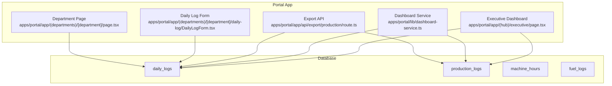
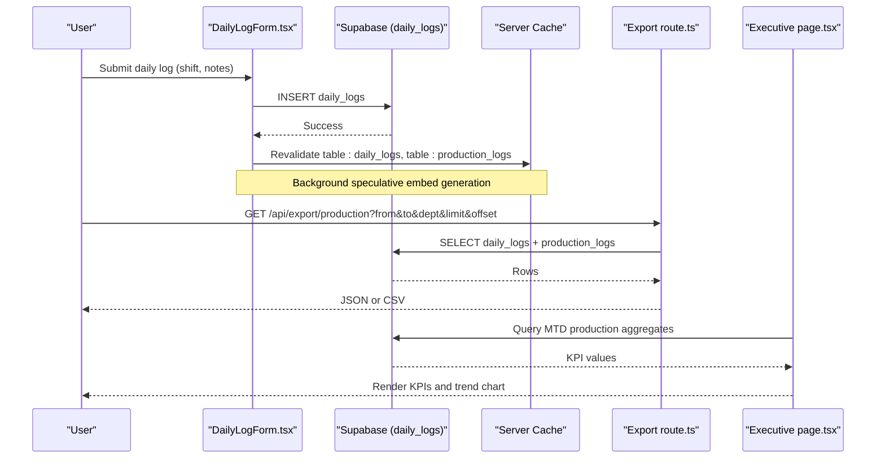
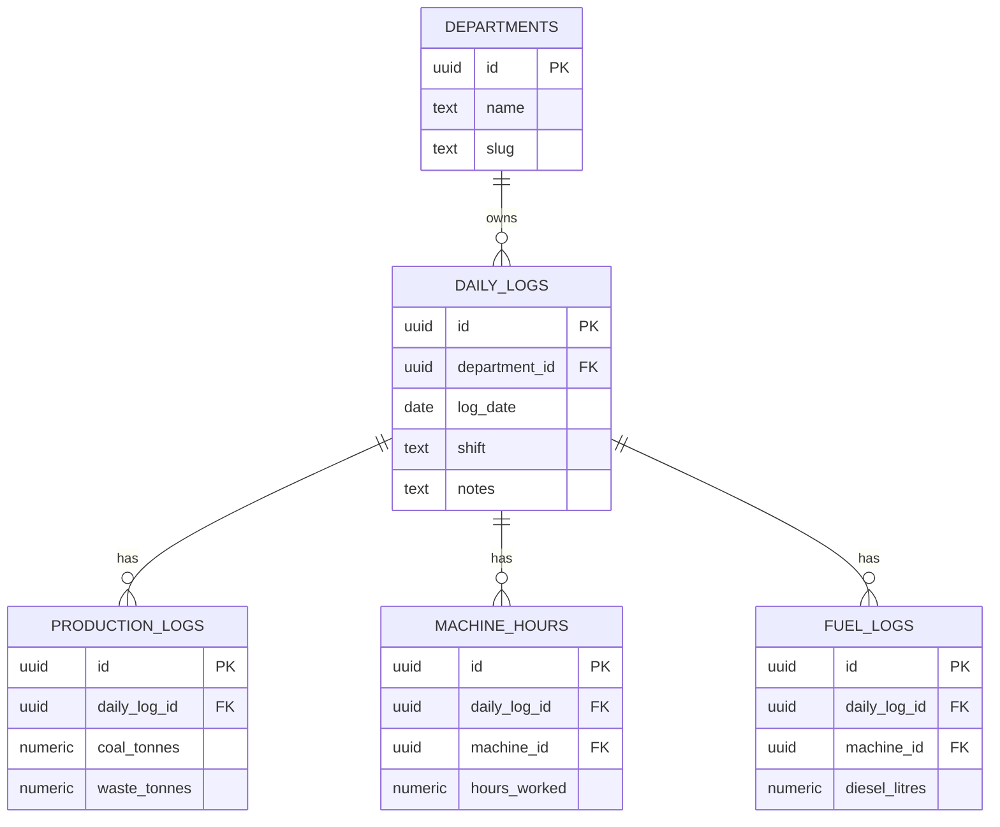
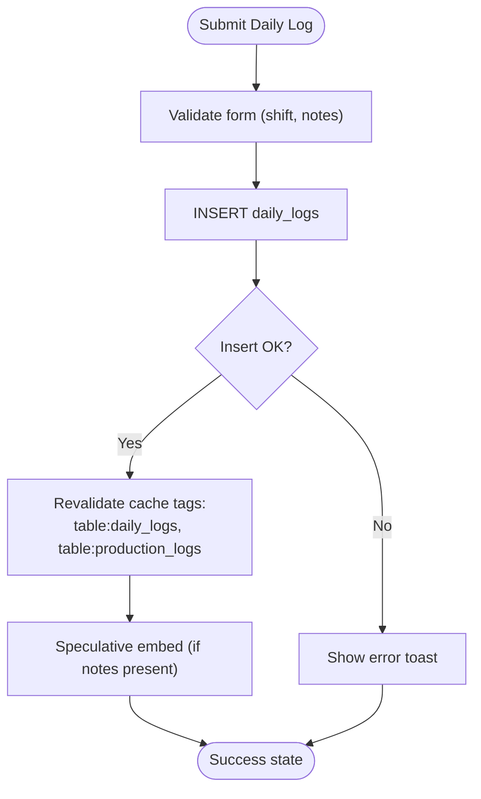
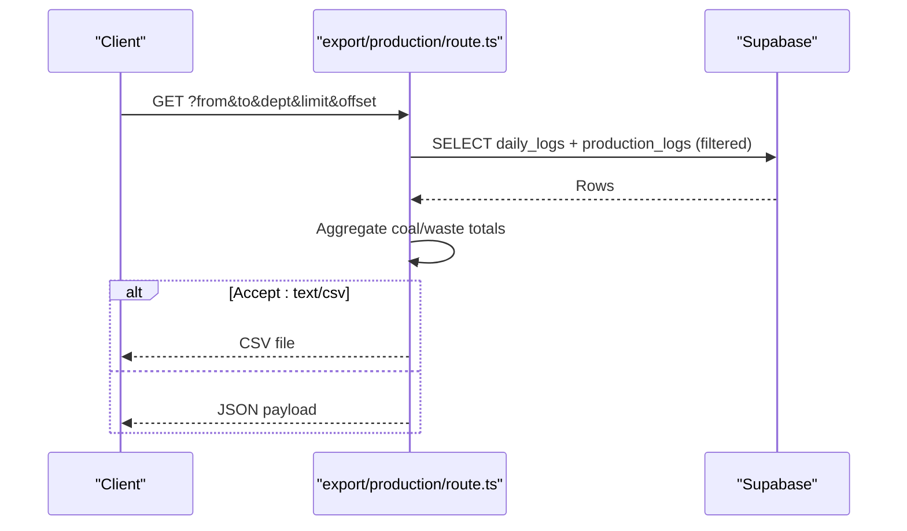
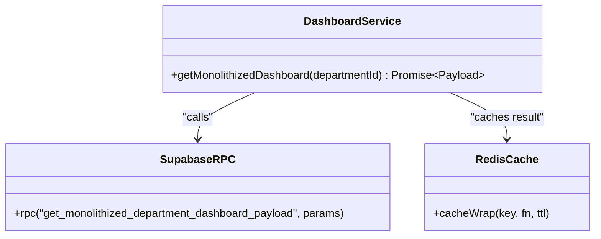
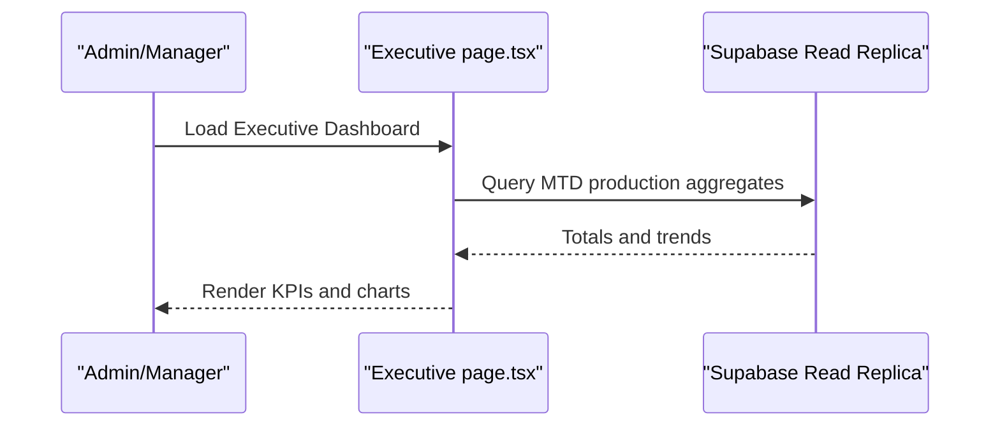
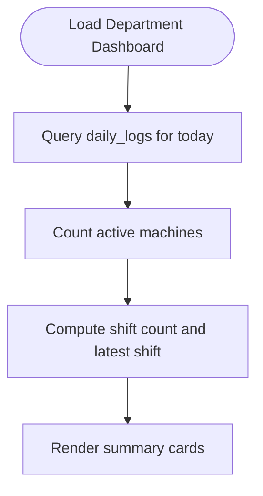
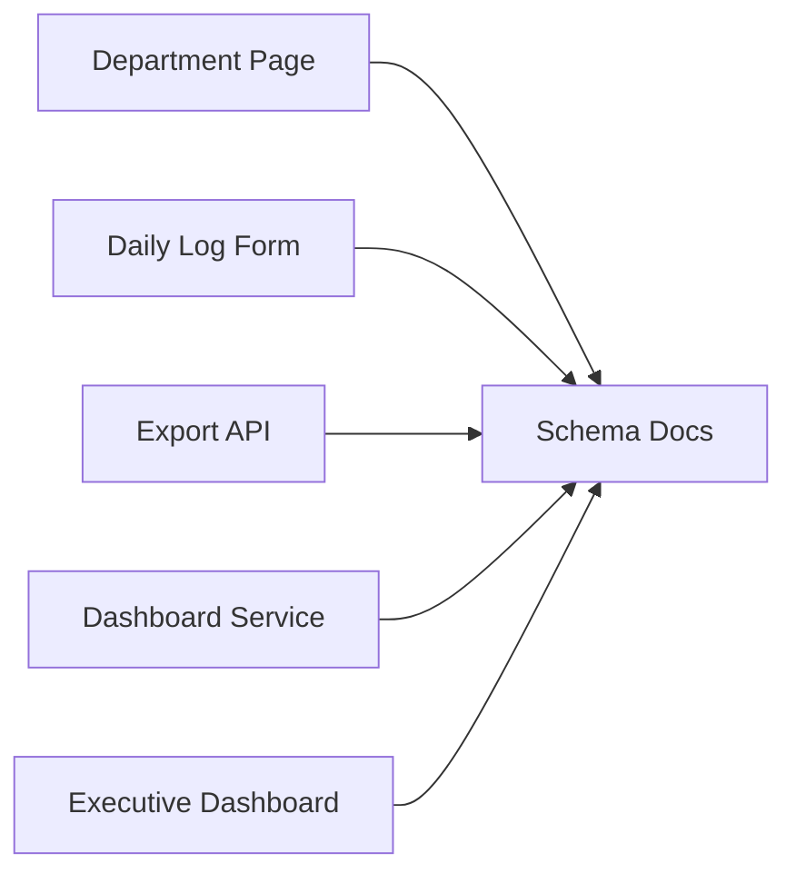

# Production Department

<cite>
**Referenced Files in This Document**
- [production-department.md](file://wiki/entities/production-department.md)
- [database-schema.md](file://wiki/concepts/database-schema.md)
- [SCHEMA.md](file://wiki/SCHEMA.md)
- [page.tsx](file://apps/portal/app/(departments)/[department]/page.tsx)
- [DailyLogForm.tsx](file://apps/portal/app/(departments)/[department]/daily-log/DailyLogForm.tsx)
- [route.ts](file://apps/portal/app/api/export/production/route.ts)
- [dashboard-service.ts](file://apps/portal/lib/dashboard-service.ts)
- [executive/page.tsx](file://apps/portal/app/(hub)/executive/page.tsx)
</cite>

## Table of Contents
1. [Introduction](#introduction)
2. [Project Structure](#project-structure)
3. [Core Components](#core-components)
4. [Architecture Overview](#architecture-overview)
5. [Detailed Component Analysis](#detailed-component-analysis)
6. [Dependency Analysis](#dependency-analysis)
7. [Performance Considerations](#performance-considerations)
8. [Troubleshooting Guide](#troubleshooting-guide)
9. [Conclusion](#conclusion)
10. [Appendices](#appendices)

## Introduction
This document describes the Production department functionality, including production tracking systems, yield analysis tools, shift management features, and quality control metrics. It explains the underlying data models, daily production logging, performance analytics, dashboard KPIs, trend analysis, export capabilities, and integration points with other departments for coordinated planning and resource allocation.

The Production department focuses on coal yield, tonnage, and extraction tracking for mining operations. Key operational tables include daily_logs as the parent container for shift-level records, with child tables machine_hours, fuel_logs, and production_logs capturing equipment utilization, fuel consumption, and tonnage outputs respectively. The system enforces append-only semantics for logs and uses row-level security scoped by department_id.

## Project Structure
Production-related implementation spans:
- Department pages and dashboards under apps/portal/app/(departments)/[department]
- Daily log entry form under apps/portal/app/(departments)/[department]/daily-log
- Export API endpoint under apps/portal/app/api/export/production
- Dashboard service for monolithized payload retrieval under apps/portal/lib/dashboard-service.ts
- Executive dashboard aggregating production KPIs under apps/portal/app/(hub)/executive
- Data model documentation under wiki/concepts/database-schema.md and wiki/SCHEMA.md
- Entity overview under wiki/entities/production-department.md

**Diagram sources**
- [page.tsx](file://apps/portal/app/(departments)/[department]/page.tsx)
- [DailyLogForm.tsx](file://apps/portal/app/(departments)/[department]/daily-log/DailyLogForm.tsx)
- [route.ts](file://apps/portal/app/api/export/production/route.ts)
- [dashboard-service.ts](file://apps/portal/lib/dashboard-service.ts)
- [executive/page.tsx](file://apps/portal/app/(hub)/executive/page.tsx)
- [database-schema.md](file://wiki/concepts/database-schema.md)
- [SCHEMA.md](file://wiki/SCHEMA.md)

**Section sources**
- [production-department.md](file://wiki/entities/production-department.md)
- [database-schema.md](file://wiki/concepts/database-schema.md)
- [SCHEMA.md](file://wiki/SCHEMA.md)

## Core Components
- Department Dashboard: Displays shift coverage, quick actions, and summary metrics for non-control-room departments (including production). It queries daily_logs and machines to show logged shifts and active machines.
- Daily Log Entry: Client-side form that inserts a new daily_logs record for the current date and selected shift, with optional notes and background embedding generation.
- Export API: Server endpoint that returns production data aggregated from daily_logs and production_logs in JSON or CSV formats, with rate limiting and CORS support.
- Monolithized Dashboard Service: Server function that fetches a consolidated payload via an RPC call and caches it per department for 15 seconds.
- Executive Dashboard: Aggregates month-to-date production KPIs (total tonnage, coal removed, waste removed, fuel efficiency) and renders a 30-day production trend chart.

Key responsibilities:
- Shift management: Create and track daily_logs entries per shift (day/night).
- Production tracking: Record coal_tonnes and waste_tonnes in production_logs linked to daily_logs.
- Yield analysis: Compute strip ratio and yield at query time; aggregate across shifts and dates.
- Export: Provide filtered, paginated exports for downstream reporting.

**Section sources**
- [page.tsx](file://apps/portal/app/(departments)/[department]/page.tsx)
- [DailyLogForm.tsx](file://apps/portal/app/(departments)/[department]/daily-log/DailyLogForm.tsx)
- [route.ts](file://apps/portal/app/api/export/production/route.ts)
- [dashboard-service.ts](file://apps/portal/lib/dashboard-service.ts)
- [executive/page.tsx](file://apps/portal/app/(hub)/executive/page.tsx)

## Architecture Overview
The Production module follows a layered architecture:
- Presentation layer: Next.js pages and client components render dashboards and forms.
- Server functions: Server-side logic performs database queries and caching.
- API layer: Route handlers expose endpoints for exports and integrations.
- Database layer: Relational schema with RLS policies ensures secure, department-scoped access.

**Diagram sources**
- [DailyLogForm.tsx](file://apps/portal/app/(departments)/[department]/daily-log/DailyLogForm.tsx)
- [route.ts](file://apps/portal/app/api/export/production/route.ts)
- [executive/page.tsx](file://apps/portal/app/(hub)/executive/page.tsx)
- [database-schema.md](file://wiki/concepts/database-schema.md)

## Detailed Component Analysis

### Data Models and Relationships
The core data model centers on daily_logs as the parent entity for each department’s shift. Child tables capture detailed metrics:
- daily_logs: Append-only shift container with unique constraint on (department_id, log_date, shift).
- production_logs: Coal and waste tonnage per daily_log.
- machine_hours: Equipment hours per daily_log and machine.
- fuel_logs: Fuel consumption per daily_log and machine.

Row-level security is enforced through department_id scoping. Strip ratio and yield are computed at query time.

**Diagram sources**
- [database-schema.md](file://wiki/concepts/database-schema.md)
- [SCHEMA.md](file://wiki/SCHEMA.md)

**Section sources**
- [database-schema.md](file://wiki/concepts/database-schema.md)
- [SCHEMA.md](file://wiki/SCHEMA.md)

### Daily Production Logging
The Daily Log form allows operators to create a daily_logs entry for the current date and selected shift. On success:
- Inserts into daily_logs with department_id, log_date, shift, and optional notes.
- Revalidates cached server components for table:daily_logs and table:production_logs.
- Optionally triggers speculative embedding for notes in the background.

**Diagram sources**
- [DailyLogForm.tsx](file://apps/portal/app/(departments)/[department]/daily-log/DailyLogForm.tsx)

**Section sources**
- [DailyLogForm.tsx](file://apps/portal/app/(departments)/[department]/daily-log/DailyLogForm.tsx)

### Production Export API
The export endpoint supports filtering by date range, department, pagination, and output format (JSON or CSV). It aggregates production_logs per daily_logs row and computes totals.

**Diagram sources**
- [route.ts](file://apps/portal/app/api/export/production/route.ts)

**Section sources**
- [route.ts](file://apps/portal/app/api/export/production/route.ts)

### Dashboard Service (Monolithized Payload)
A server function retrieves a consolidated dashboard payload via an RPC call and caches it per department for 15 seconds. It includes daily_logs, breakdowns, and safety_incidents arrays.

**Diagram sources**
- [dashboard-service.ts](file://apps/portal/lib/dashboard-service.ts)

**Section sources**
- [dashboard-service.ts](file://apps/portal/lib/dashboard-service.ts)

### Executive Dashboard Integration
The executive dashboard aggregates month-to-date production KPIs and displays a 30-day trend chart. It pulls totals for tonnage, coal removed, waste removed, and fuel efficiency, then renders visualizations.

**Diagram sources**
- [executive/page.tsx](file://apps/portal/app/(hub)/executive/page.tsx)

**Section sources**
- [executive/page.tsx](file://apps/portal/app/(hub)/executive/page.tsx)

### Department Dashboard (Non-Control-Room)
For non-control-room departments like Production, the dashboard shows today’s logged shifts, latest shift type, and active machine count. It queries daily_logs and machines to compute these metrics.

**Diagram sources**
- [page.tsx](file://apps/portal/app/(departments)/[department]/page.tsx)

**Section sources**
- [page.tsx](file://apps/portal/app/(departments)/[department]/page.tsx)

## Dependency Analysis
- Frontend dependencies:
  - Department page depends on server cache utilities and Supabase client/server clients.
  - Daily log form depends on React Hook Form, Zod validation, Supabase browser client, and revalidation actions.
- API dependencies:
  - Export route depends on Supabase server client, rate limiting middleware, CORS utility, and schema validation.
- Service dependencies:
  - Dashboard service depends on Supabase RPC and Redis cache wrapper.
- Data dependencies:
  - All components rely on relational tables defined in the schema docs.

**Diagram sources**
- [page.tsx](file://apps/portal/app/(departments)/[department]/page.tsx)
- [DailyLogForm.tsx](file://apps/portal/app/(departments)/[department]/daily-log/DailyLogForm.tsx)
- [route.ts](file://apps/portal/app/api/export/production/route.ts)
- [dashboard-service.ts](file://apps/portal/lib/dashboard-service.ts)
- [executive/page.tsx](file://apps/portal/app/(hub)/executive/page.tsx)
- [database-schema.md](file://wiki/concepts/database-schema.md)

**Section sources**
- [page.tsx](file://apps/portal/app/(departments)/[department]/page.tsx)
- [DailyLogForm.tsx](file://apps/portal/app/(departments)/[department]/daily-log/DailyLogForm.tsx)
- [route.ts](file://apps/portal/app/api/export/production/route.ts)
- [dashboard-service.ts](file://apps/portal/lib/dashboard-service.ts)
- [executive/page.tsx](file://apps/portal/app/(hub)/executive/page.tsx)
- [database-schema.md](file://wiki/concepts/database-schema.md)

## Performance Considerations
- Caching:
  - Server component cache tags are used to invalidate specific tables after writes.
  - Monolithized dashboard payload is cached per department for 15 seconds.
- Query optimization:
  - Use read replicas for heavy aggregation in executive dashboards.
  - Filter by department_id and date ranges to leverage indexes.
- Export efficiency:
  - Pagination parameters limit memory usage and response size.
  - CSV sanitization prevents injection issues and reduces downstream parsing overhead.

[No sources needed since this section provides general guidance]

## Troubleshooting Guide
- Daily log submission fails:
  - Check network errors and Supabase write permissions.
  - Verify RLS policies allow inserts for the authenticated user’s department.
  - Inspect revalidation tags to ensure dependent views refresh.
- Export API returns 401 or 400:
  - Ensure authentication is present and query parameters match the expected schema.
  - Confirm department filter resolves to a valid department ID.
- Dashboard metrics appear stale:
  - Invalidate cache tags for affected tables.
  - Verify RPC availability and Redis cache health.

**Section sources**
- [DailyLogForm.tsx](file://apps/portal/app/(departments)/[department]/daily-log/DailyLogForm.tsx)
- [route.ts](file://apps/portal/app/api/export/production/route.ts)
- [dashboard-service.ts](file://apps/portal/lib/dashboard-service.ts)

## Conclusion
The Production department provides robust tools for shift management, production logging, yield analysis, and exportable reporting. Its architecture leverages server-side caching, read replicas, and well-defined relational schemas to deliver accurate KPIs and trend insights. Integration points with the executive dashboard and export APIs enable coordinated planning and resource allocation across departments.

[No sources needed since this section summarizes without analyzing specific files]

## Appendices

### Production Dashboard KPIs
- Coal Yield: Current extraction yield percentage.
- Daily Tonnage: Coal tonnes extracted per shift.
- Waste Moved: Overburden tonnes removed.
- Strip Ratio: Waste-to-coal ratio (computed at query time).

**Section sources**
- [production-department.md](file://wiki/entities/production-department.md)

### Quality Control Metrics
- Yield monitoring and trend analysis are supported via production_logs and daily_logs.
- Strip ratio calculations can be performed using waste_tonnes and coal_tonnes fields.

**Section sources**
- [SCHEMA.md](file://wiki/SCHEMA.md)
- [production-department.md](file://wiki/entities/production-department.md)