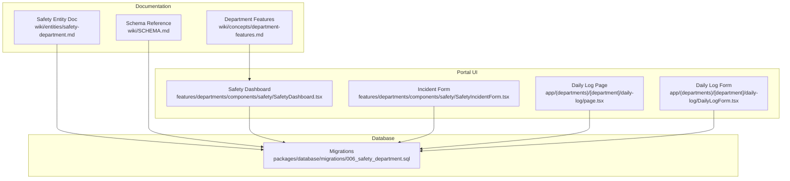
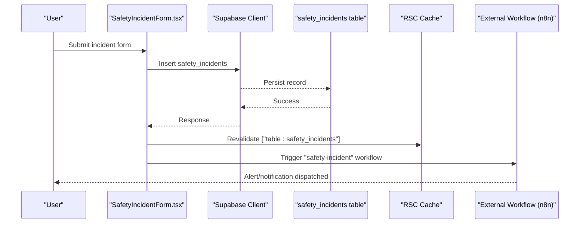
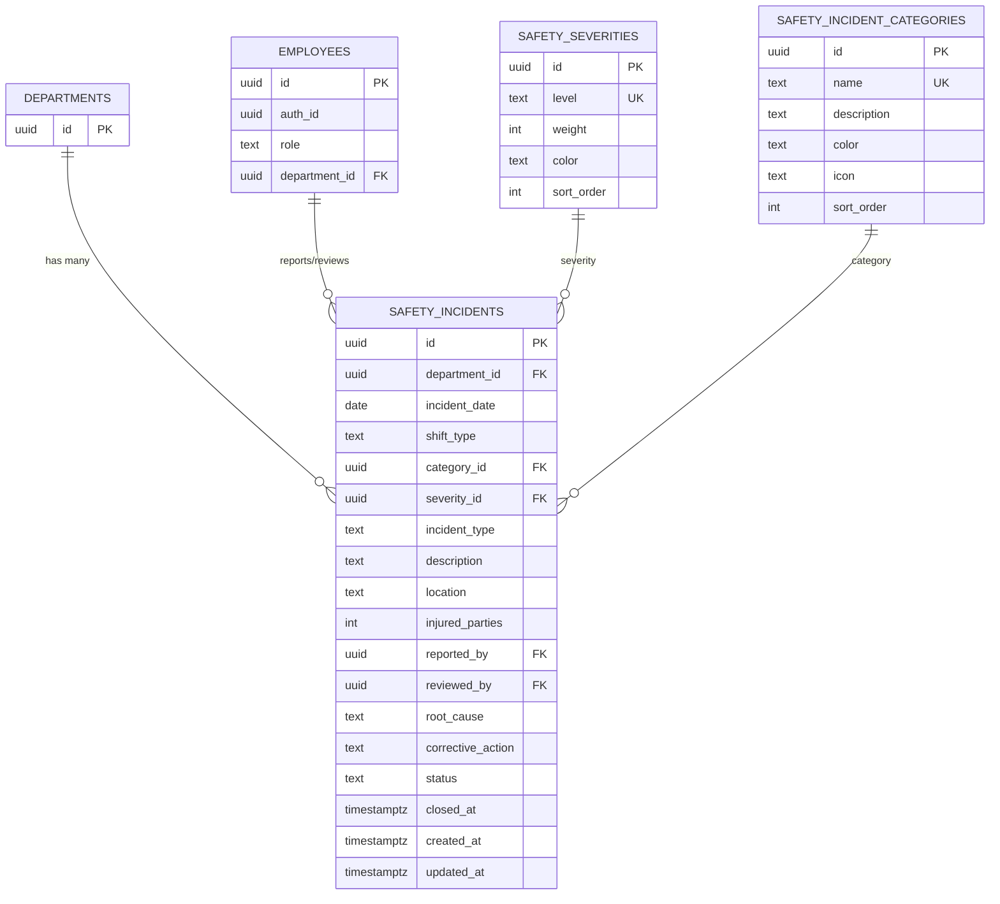
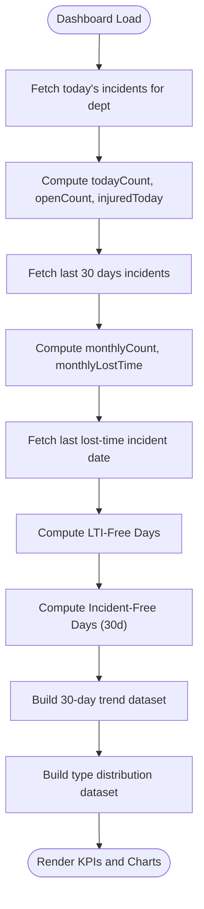
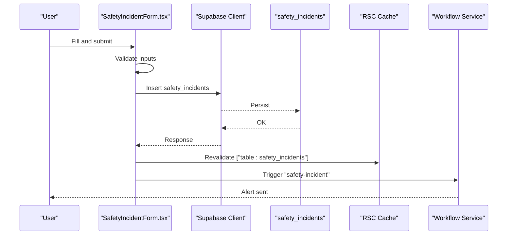
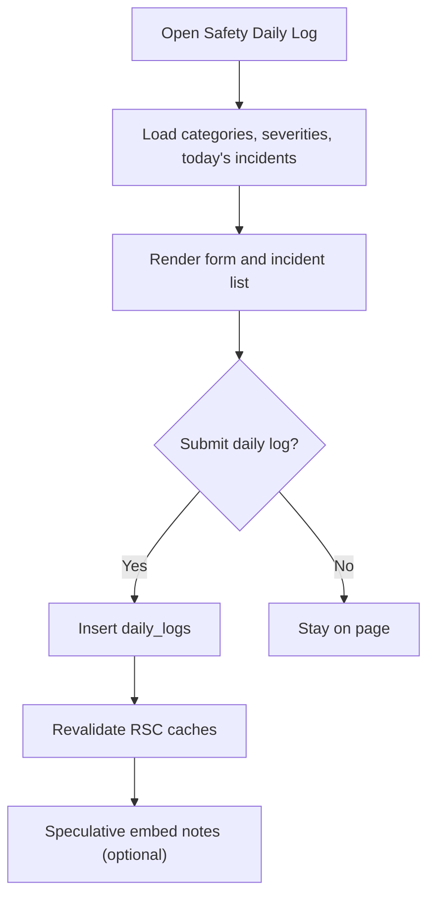
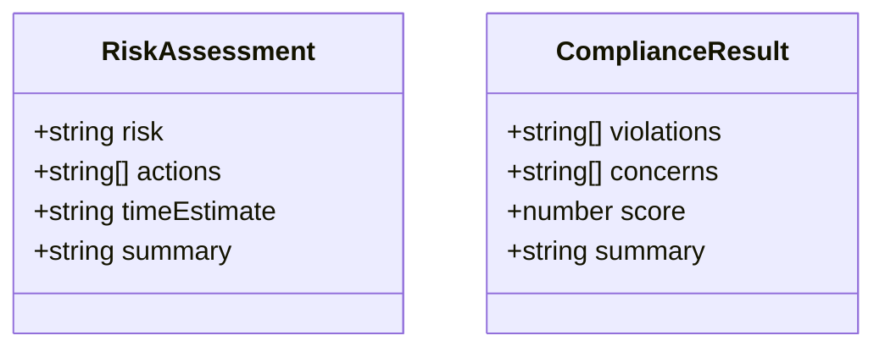
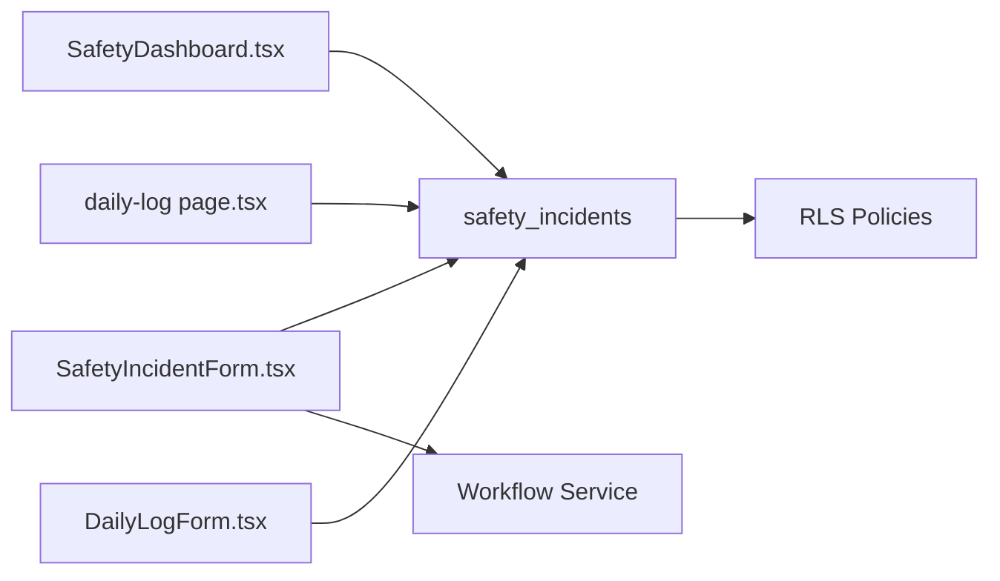

# Safety Department

<cite>
**Referenced Files in This Document**
- [safety-department.md](file://wiki/entities/safety-department.md)
- [department-features.md](file://wiki/concepts/department-features.md)
- [006_safety_department.sql](file://packages/database/migrations/006_safety_department.sql)
- [SCHEMA.md](file://wiki/SCHEMA.md)
- [SafetyDashboard.tsx](file://apps/portal/features/departments/components/safety/SafetyDashboard.tsx)
- [SafetyIncidentForm.tsx](file://apps/portal/features/departments/components/safety/SafetyIncidentForm.tsx)
- [daily-log page.tsx](file://apps/portal/app/(departments)/[department]/daily-log/page.tsx)
- [DailyLogForm.tsx](file://apps/portal/app/(departments)/[department]/daily-log/DailyLogForm.tsx)
- [schemas.ts (portal AI)](file://apps/portal/lib/ai/schemas.ts)
- [schemas.ts (API AI)](file://apps/api/src/ai/schemas.ts)
</cite>

## Table of Contents
1. [Introduction](#introduction)
2. [Project Structure](#project-structure)
3. [Core Components](#core-components)
4. [Architecture Overview](#architecture-overview)
5. [Detailed Component Analysis](#detailed-component-analysis)
6. [Dependency Analysis](#dependency-analysis)
7. [Performance Considerations](#performance-considerations)
8. [Troubleshooting Guide](#troubleshooting-guide)
9. [Conclusion](#conclusion)
10. [Appendices](#appendices)

## Introduction
This document describes the Safety department systems within the platform, focusing on incident logging and reporting workflows, compliance tracking mechanisms, inspection management tools, and safety protocol enforcement. It explains the safety data models, regulatory compliance frameworks, automated alerting systems, incident investigation workflows, safety training integration, and compliance reporting features. It also provides guidelines for safety data management and regulatory adherence.

## Project Structure
The Safety department spans documentation, database schema definitions, and portal UI components:
- Documentation and entity descriptions define scope, tabs, KPIs, categories, and completeness status.
- Database migrations define core tables, constraints, and row-level security policies.
- Portal pages and components implement dashboards, forms, and daily logs with real-time updates and workflow triggers.

**Diagram sources**
- [safety-department.md:1-76](file://wiki/entities/safety-department.md#L1-L76)
- [department-features.md:83-104](file://wiki/concepts/department-features.md#L83-L104)
- [006_safety_department.sql:1-143](file://packages/database/migrations/006_safety_department.sql#L1-L143)
- [SCHEMA.md:312-335](file://wiki/SCHEMA.md#L312-L335)
- [SafetyDashboard.tsx:1-257](file://apps/portal/features/departments/components/safety/SafetyDashboard.tsx#L1-L257)
- [SafetyIncidentForm.tsx:1-407](file://apps/portal/features/departments/components/safety/SafetyIncidentForm.tsx#L1-L407)
- [daily-log page.tsx](file://apps/portal/app/(departments)/[department]/daily-log/page.tsx#L17-L58)
- [DailyLogForm.tsx](file://apps/portal/app/(departments)/[department]/daily-log/DailyLogForm.tsx#L1-L197)

**Section sources**
- [safety-department.md:1-76](file://wiki/entities/safety-department.md#L1-L76)
- [department-features.md:83-104](file://wiki/concepts/department-features.md#L83-L104)
- [006_safety_department.sql:1-143](file://packages/database/migrations/006_safety_department.sql#L1-L143)
- [SCHEMA.md:312-335](file://wiki/SCHEMA.md#L312-L335)
- [SafetyDashboard.tsx:1-257](file://apps/portal/features/departments/components/safety/SafetyDashboard.tsx#L1-L257)
- [SafetyIncidentForm.tsx:1-407](file://apps/portal/features/departments/components/safety/SafetyIncidentForm.tsx#L1-L407)
- [daily-log page.tsx](file://apps/portal/app/(departments)/[department]/daily-log/page.tsx#L17-L58)
- [DailyLogForm.tsx](file://apps/portal/app/(departments)/[department]/daily-log/DailyLogForm.tsx#L1-L197)

## Core Components
- Safety Incident Data Model
  - Tables: safety_incidents, safety_severities, safety_incident_categories
  - Key fields include incident_type, severity_id, category_id, injured_parties, location, root_cause, corrective_action, status, timestamps, and audit links to employees and departments.
  - Row-level security enforces department-scoped access and role-based write permissions.
- Safety Dashboard
  - Computes KPIs: LTI-Free Days, Incident-Free Days (30d), Open Incidents, Lost Time (30d).
  - Aggregates today’s incidents and last 30-day trends for charts and summaries.
- Safety Incident Form
  - Client-side validation and submission to safety_incidents.
  - Triggers RSC cache revalidation and an external automation workflow for alerts.
- Daily Log
  - Shift-based logging with optional notes; integrates with embedding pipeline for searchability.

**Section sources**
- [006_safety_department.sql:1-143](file://packages/database/migrations/006_safety_department.sql#L1-L143)
- [SCHEMA.md:312-335](file://wiki/SCHEMA.md#L312-L335)
- [SafetyDashboard.tsx:1-257](file://apps/portal/features/departments/components/safety/SafetyDashboard.tsx#L1-L257)
- [SafetyIncidentForm.tsx:1-407](file://apps/portal/features/departments/components/safety/SafetyIncidentForm.tsx#L1-L407)
- [daily-log page.tsx](file://apps/portal/app/(departments)/[department]/daily-log/page.tsx#L17-L58)
- [DailyLogForm.tsx](file://apps/portal/app/(departments)/[department]/daily-log/DailyLogForm.tsx#L1-L197)

## Architecture Overview
The Safety system follows a client-server architecture with Supabase-backed persistence and Next.js App Router pages. The dashboard and forms query and mutate safety data directly via Supabase clients. Automated alerts are triggered through an external workflow service after successful incident creation.

**Diagram sources**
- [SafetyIncidentForm.tsx:83-146](file://apps/portal/features/departments/components/safety/SafetyIncidentForm.tsx#L83-L146)
- [006_safety_department.sql:48-118](file://packages/database/migrations/006_safety_department.sql#L48-L118)

## Detailed Component Analysis

### Safety Data Models and Security
- Tables and relationships
  - safety_incidents references departments, employees, safety_severities, and safety_incident_categories.
  - Constraints enforce valid shift_type, incident_type, and status values.
- Row-level security policies
  - SELECT: scoped by department or admin/supervisor roles.
  - INSERT: restricted to authorized users based on department and roles.
  - UPDATE: limited to creator or supervisors/admins.
- Seed data
  - Severities and categories are seeded with levels, weights, colors, and icons.

**Diagram sources**
- [006_safety_department.sql:1-143](file://packages/database/migrations/006_safety_department.sql#L1-L143)
- [SCHEMA.md:312-335](file://wiki/SCHEMA.md#L312-L335)

**Section sources**
- [006_safety_department.sql:1-143](file://packages/database/migrations/006_safety_department.sql#L1-L143)
- [SCHEMA.md:312-335](file://wiki/SCHEMA.md#L312-L335)

### Safety Dashboard
- Purpose: Provide safety KPIs and trend visualizations for the current department.
- Logic:
  - Today’s incidents count, open incidents, and injured parties aggregation.
  - Last 30 days counts and lost-time incidents.
  - LTI-free days computed from the most recent lost-time incident.
  - Incident-free days derived from unique dates in the last 30 days.
- Outputs:
  - KPI cards and summary panels.
  - Trend and distribution datasets for charts.

**Diagram sources**
- [SafetyDashboard.tsx:7-160](file://apps/portal/features/departments/components/safety/SafetyDashboard.tsx#L7-L160)

**Section sources**
- [SafetyDashboard.tsx:1-257](file://apps/portal/features/departments/components/safety/SafetyDashboard.tsx#L1-L257)

### Safety Incident Form and Workflow
- Validation: Enforces required fields and numeric bounds.
- Submission: Inserts into safety_incidents with department context and user attribution.
- Post-submit:
  - Revalidates cached RSC data for immediate UI refresh.
  - Invokes an external workflow to trigger safety alerts.

**Diagram sources**
- [SafetyIncidentForm.tsx:71-146](file://apps/portal/features/departments/components/safety/SafetyIncidentForm.tsx#L71-L146)

**Section sources**
- [SafetyIncidentForm.tsx:1-407](file://apps/portal/features/departments/components/safety/SafetyIncidentForm.tsx#L1-L407)

### Daily Log and Inspection Integration
- Daily log captures shift and optional notes for operational awareness.
- The daily log page for the Safety department loads reference data (categories, severities) and today’s incidents in parallel for fast rendering.
- Notes can be embedded asynchronously for enhanced search and retrieval.

**Diagram sources**
- [daily-log page.tsx](file://apps/portal/app/(departments)/[department]/daily-log/page.tsx#L17-L58)
- [DailyLogForm.tsx](file://apps/portal/app/(departments)/[department]/daily-log/DailyLogForm.tsx#L55-L97)

**Section sources**
- [daily-log page.tsx](file://apps/portal/app/(departments)/[department]/daily-log/page.tsx#L17-L58)
- [DailyLogForm.tsx](file://apps/portal/app/(departments)/[department]/daily-log/DailyLogForm.tsx#L1-L197)

### Compliance Tracking and Reporting
- Compliance schemas define structured outputs for risk assessments and compliance results used across modules.
- Training module includes compliance rates and reports, integrating with safety protocols and certifications.

**Diagram sources**
- [schemas.ts (portal AI):1-19](file://apps/portal/lib/ai/schemas.ts#L1-L19)
- [schemas.ts (API AI):1-19](file://apps/api/src/ai/schemas.ts#L1-L19)

**Section sources**
- [schemas.ts (portal AI):1-19](file://apps/portal/lib/ai/schemas.ts#L1-L19)
- [schemas.ts (API AI):1-19](file://apps/api/src/ai/schemas.ts#L1-L19)
- [department-features.md:83-104](file://wiki/concepts/department-features.md#L83-L104)

### Safety Training Integration
- Training courses cover standard safety protocols, regulatory compliance, and equipment-specific procedures.
- Reports display compliance rates per department, linking training outcomes to safety performance.

**Section sources**
- [department-features.md:83-104](file://wiki/concepts/department-features.md#L83-L104)

## Dependency Analysis
- UI components depend on Supabase clients for data access and on shared utilities for caching and error handling.
- Migrations define referential integrity and security policies that constrain UI behavior at the data layer.
- External workflow services are invoked post-submission to enable automated alerting.

**Diagram sources**
- [SafetyDashboard.tsx:1-257](file://apps/portal/features/departments/components/safety/SafetyDashboard.tsx#L1-L257)
- [SafetyIncidentForm.tsx:1-407](file://apps/portal/features/departments/components/safety/SafetyIncidentForm.tsx#L1-L407)
- [daily-log page.tsx](file://apps/portal/app/(departments)/[department]/daily-log/page.tsx#L17-L58)
- [DailyLogForm.tsx](file://apps/portal/app/(departments)/[department]/daily-log/DailyLogForm.tsx#L1-L197)
- [006_safety_department.sql:72-118](file://packages/database/migrations/006_safety_department.sql#L72-L118)

**Section sources**
- [006_safety_department.sql:72-118](file://packages/database/migrations/006_safety_department.sql#L72-L118)
- [SafetyIncidentForm.tsx:114-126](file://apps/portal/features/departments/components/safety/SafetyIncidentForm.tsx#L114-L126)

## Performance Considerations
- Parallel fetching: The daily log page uses concurrent queries for categories, severities, and incidents to reduce latency.
- Caching: RSC cache revalidation ensures UI consistency without full reloads.
- Lightweight aggregations: Dashboard computes simple aggregates suitable for typical department sizes; consider server-side materialized views if volumes grow significantly.

[No sources needed since this section provides general guidance]

## Troubleshooting Guide
- Common issues
  - Permission errors: Ensure the authenticated user has appropriate department access or role (admin/supervisor) due to RLS policies.
  - Missing reference data: Verify categories and severities are seeded and accessible.
  - Form validation failures: Check required fields and numeric ranges before submission.
  - Alert delivery: Confirm external workflow is configured and reachable when triggering safety alerts.
- Diagnostics
  - Inspect browser console for Supabase errors and toast messages.
  - Review RLS policy conditions and employee role mappings.
  - Validate workflow payload structure for the “safety-incident” trigger.

**Section sources**
- [006_safety_department.sql:72-118](file://packages/database/migrations/006_safety_department.sql#L72-L118)
- [SafetyIncidentForm.tsx:71-146](file://apps/portal/features/departments/components/safety/SafetyIncidentForm.tsx#L71-L146)
- [DailyLogForm.tsx](file://apps/portal/app/(departments)/[department]/daily-log/DailyLogForm.tsx#L68-L97)

## Conclusion
The Safety department system provides robust incident logging, compliance tracking, and inspection support through well-defined data models, secure access controls, and intuitive UI components. Automated alerting and training integration strengthen safety protocol enforcement and continuous improvement. The architecture balances simplicity with extensibility, enabling future enhancements such as advanced analytics, mobile-first field reporting, and richer compliance reporting.

[No sources needed since this section summarizes without analyzing specific files]

## Appendices

### Guidelines for Safety Data Management and Regulatory Adherence
- Data governance
  - Maintain consistent categorization and severity definitions; update seed data via controlled migrations.
  - Use department-scoped records and role-based permissions to protect sensitive information.
- Auditability
  - Track reporter and reviewer identities; preserve timestamps and status transitions.
- Compliance alignment
  - Align incident types and statuses with organizational standards and regulatory expectations.
  - Integrate training completion and compliance scores into safety dashboards and reports.
- Operational continuity
  - Ensure offline-capable daily logs where feasible and synchronize when connectivity is restored.
  - Keep external workflow endpoints resilient and monitor delivery success.

[No sources needed since this section provides general guidance]