# Training Department

<cite>
**Referenced Files in This Document**
- [training-department.md](file://wiki/entities/training-department.md)
- [page.tsx](file://apps/portal/app/(departments)/training/page.tsx)
- [courses/page.tsx](file://apps/portal/app/(departments)/training/courses/page.tsx)
- [certifications/page.tsx](file://apps/portal/app/(departments)/training/certifications/page.tsx)
- [schedules/page.tsx](file://apps/portal/app/(departments)/training/schedules/page.tsx)
- [reports/page.tsx](file://apps/portal/app/(departments)/training/reports/page.tsx)
- [SearchForm.tsx](file://apps/portal/app/(departments)/training/components/SearchForm.tsx)
- [FilterTabs.tsx](file://apps/portal/app/(departments)/training/components/FilterTabs.tsx)
- [ExportButton.tsx](file://apps/portal/app/(departments)/training/components/ExportButton.tsx)
</cite>

## Table of Contents
1. [Introduction](#introduction)
2. [Project Structure](#project-structure)
3. [Core Components](#core-components)
4. [Architecture Overview](#architecture-overview)
5. [Detailed Component Analysis](#detailed-component-analysis)
6. [Dependency Analysis](#dependency-analysis)
7. [Performance Considerations](#performance-considerations)
8. [Troubleshooting Guide](#troubleshooting-guide)
9. [Conclusion](#conclusion)
10. [Appendices](#appendices)

## Introduction
This document describes the Training department learning management system (LMS) within the portal application. It covers course administration, certification tracking, competency assessment tools, schedule management, training data models, learning path configurations, progress tracking, integration with employee records, automated certification expiration alerts, and training completion workflows. It also includes implementation details for content management and assessment tooling as implemented in the codebase.

The Training module provides:
- A dashboard overview with key performance indicators (KPIs)
- Course catalog browsing and configuration entry points
- Certification registry with status tracking and renewal visibility
- Schedule management for sessions, instructors, and locations
- Reports and audit exports for compliance and historical analysis

**Section sources**
- [training-department.md:11-36](file://wiki/entities/training-department.md#L11-L36)

## Project Structure
The Training feature is implemented as a set of Next.js App Router pages under the Training department route. Shared UI components are reused across pages to provide consistent search and filtering behavior.

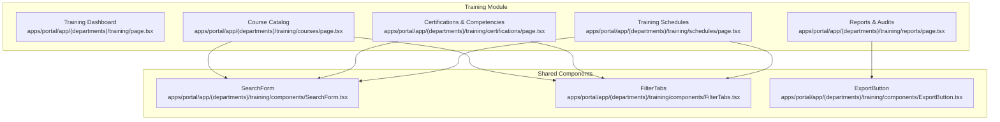

**Diagram sources**
- [page.tsx](file://apps/portal/app/(departments)/training/page.tsx)
- [courses/page.tsx](file://apps/portal/app/(departments)/training/courses/page.tsx)
- [certifications/page.tsx](file://apps/portal/app/(departments)/training/certifications/page.tsx)
- [schedules/page.tsx](file://apps/portal/app/(departments)/training/schedules/page.tsx)
- [reports/page.tsx](file://apps/portal/app/(departments)/training/reports/page.tsx)
- [SearchForm.tsx](file://apps/portal/app/(departments)/training/components/SearchForm.tsx)
- [FilterTabs.tsx](file://apps/portal/app/(departments)/training/components/FilterTabs.tsx)
- [ExportButton.tsx](file://apps/portal/app/(departments)/training/components/ExportButton.tsx)

**Section sources**
- [page.tsx](file://apps/portal/app/(departments)/training/page.tsx)
- [courses/page.tsx](file://apps/portal/app/(departments)/training/courses/page.tsx)
- [certifications/page.tsx](file://apps/portal/app/(departments)/training/certifications/page.tsx)
- [schedules/page.tsx](file://apps/portal/app/(departments)/training/schedules/page.tsx)
- [reports/page.tsx](file://apps/portal/app/(departments)/training/reports/page.tsx)
- [SearchForm.tsx](file://apps/portal/app/(departments)/training/components/SearchForm.tsx)
- [FilterTabs.tsx](file://apps/portal/app/(departments)/training/components/FilterTabs.tsx)
- [ExportButton.tsx](file://apps/portal/app/(departments)/training/components/ExportButton.tsx)

## Core Components
- Training Dashboard: Presents KPIs such as LMS compliance, active trainees, upcoming sessions, and hours logged. Includes today’s sessions and recent certifications.
- Course Catalog: Displays courses with metadata (category, lessons, duration, enrollment, completion rate), supports search and category filters, and exposes a “Configure Modules” action.
- Certifications & Competencies: Lists certifications with issue/expiry dates and status (Active, Expiring Soon, Expired). Provides summary counts and search/filter by status.
- Training Schedules: Shows scheduled sessions with type (Mandatory, Refresher, Voluntary), location, instructor, capacity, and registration progress. Supports search and type filter.
- Reports & Audits: Displays generated reports and exports, departmental compliance rates, and quick summary cards for overall compliance and pending expirations.

Key shared components:
- SearchForm: GET-based search form that preserves other query parameters via hidden inputs.
- FilterTabs: Renders filter options as links that update URL query parameters while preserving existing ones.
- ExportButton: Client-side export button with loading state and simulated download flow.

**Section sources**
- [page.tsx:5-92](file://apps/portal/app/(departments)/training/page.tsx#L5-L92)
- [courses/page.tsx:18-91](file://apps/portal/app/(departments)/training/courses/page.tsx#L18-L91)
- [certifications/page.tsx:22-95](file://apps/portal/app/(departments)/training/certifications/page.tsx#L22-L95)
- [schedules/page.tsx:19-92](file://apps/portal/app/(departments)/training/schedules/page.tsx#L19-L92)
- [reports/page.tsx:20-76](file://apps/portal/app/(departments)/training/reports/page.tsx#L20-L76)
- [SearchForm.tsx:9-27](file://apps/portal/app/(departments)/training/components/SearchForm.tsx#L9-L27)
- [FilterTabs.tsx:11-46](file://apps/portal/app/(departments)/training/components/FilterTabs.tsx#L11-L46)
- [ExportButton.tsx:6-26](file://apps/portal/app/(departments)/training/components/ExportButton.tsx#L6-L26)

## Architecture Overview
The Training module follows a server-rendered page architecture with client-side interactions for exports. Data shown on pages is currently represented by in-memory sample datasets. The UI uses shared components for search and filtering, which manipulate URL query strings to persist state.

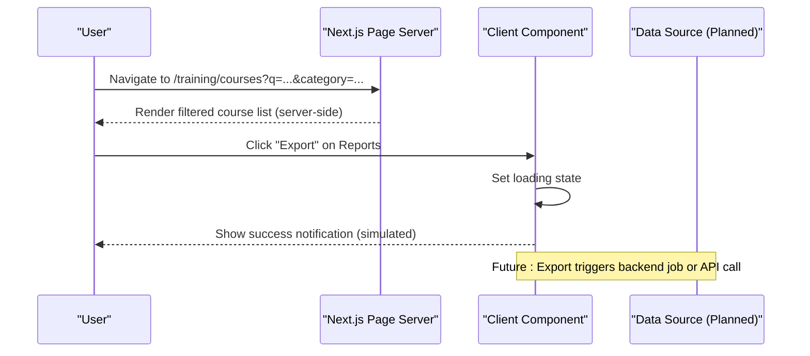

**Diagram sources**
- [courses/page.tsx:93-108](file://apps/portal/app/(departments)/training/courses/page.tsx#L93-L108)
- [reports/page.tsx:78-102](file://apps/portal/app/(departments)/training/reports/page.tsx#L78-L102)
- [ExportButton.tsx:9-15](file://apps/portal/app/(departments)/training/components/ExportButton.tsx#L9-L15)

## Detailed Component Analysis

### Training Dashboard
- Purpose: High-level overview of training activity and compliance.
- Key elements:
  - Stats cards: LMS Compliance, Active Trainees, Upcoming Sessions, Hours Logged (MTD)
  - Today’s Sessions: ongoing classes with trainer, time, and trainee count
  - Recent Certifications: table of latest issued credentials
- Implementation notes:
  - Uses static arrays for demonstration; can be replaced with API calls.
  - Date formatting uses locale-aware date rendering.

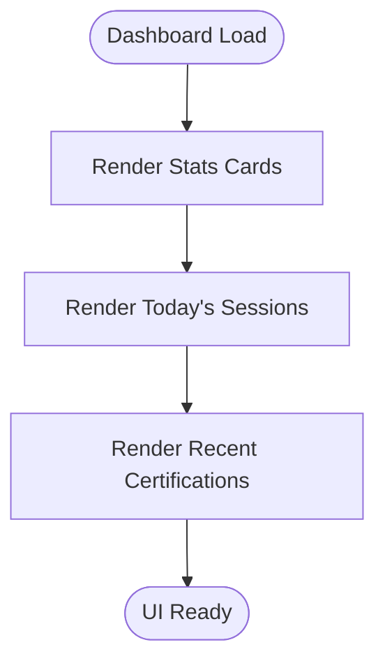

**Diagram sources**
- [page.tsx:5-92](file://apps/portal/app/(departments)/training/page.tsx#L5-L92)

**Section sources**
- [page.tsx:5-92](file://apps/portal/app/(departments)/training/page.tsx#L5-L92)

### Course Administration (Catalog)
- Purpose: Browse and manage courses; configure modules.
- Features:
  - Search by title/description
  - Category filter (All, Safety, Equipment, Induction, Compliance)
  - Metadata display: lessons, duration, enrolled, completion rate
  - Action: Configure Modules
- Filtering logic:
  - Combines text search and category filter using URL query parameters.

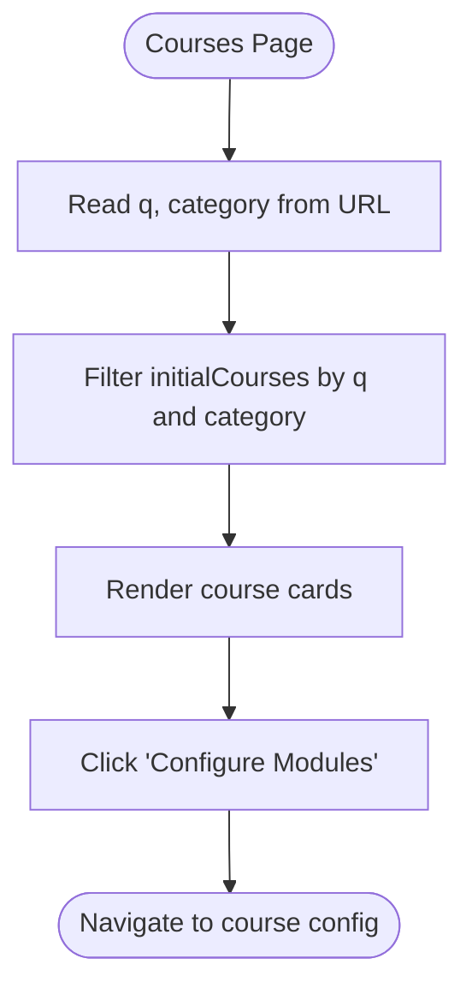

**Diagram sources**
- [courses/page.tsx:93-108](file://apps/portal/app/(departments)/training/courses/page.tsx#L93-L108)
- [courses/page.tsx:146-225](file://apps/portal/app/(departments)/training/courses/page.tsx#L146-L225)

**Section sources**
- [courses/page.tsx:18-91](file://apps/portal/app/(departments)/training/courses/page.tsx#L18-L91)
- [courses/page.tsx:93-108](file://apps/portal/app/(departments)/training/courses/page.tsx#L93-L108)
- [courses/page.tsx:146-225](file://apps/portal/app/(departments)/training/courses/page.tsx#L146-L225)

### Certification Tracking
- Purpose: Track employee certifications, statuses, and renewals.
- Features:
  - Summary counts: Active, Expiring Soon, Expired
  - Search by employee, certification, role
  - Status filter (All, Active, Expiring Soon, Expired)
  - Issue and expiry dates displayed per record
- Expiration alerting:
  - UI highlights “Expiring Soon” and “Expired” states.
  - Database documentation indicates queries use an interval threshold for upcoming renewals.

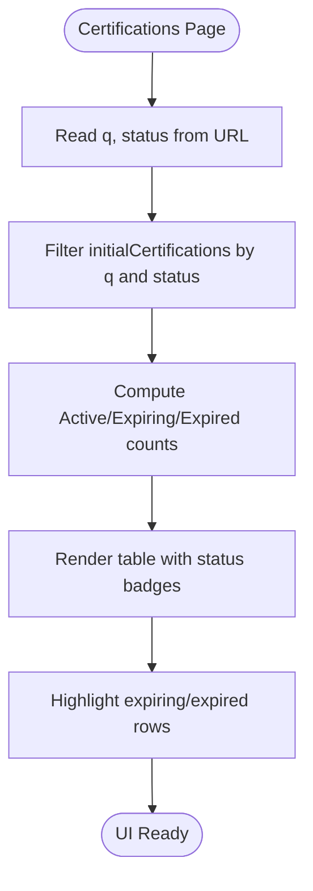

**Diagram sources**
- [certifications/page.tsx:97-122](file://apps/portal/app/(departments)/training/certifications/page.tsx#L97-L122)
- [certifications/page.tsx:216-252](file://apps/portal/app/(departments)/training/certifications/page.tsx#L216-L252)
- [training-department.md:48](file://wiki/entities/training-department.md#L48)

**Section sources**
- [certifications/page.tsx:22-95](file://apps/portal/app/(departments)/training/certifications/page.tsx#L22-L95)
- [certifications/page.tsx:97-122](file://apps/portal/app/(departments)/training/certifications/page.tsx#L97-L122)
- [certifications/page.tsx:216-252](file://apps/portal/app/(departments)/training/certifications/page.tsx#L216-L252)
- [training-department.md:48](file://wiki/entities/training-department.md#L48)

### Schedule Management
- Purpose: Manage training sessions, instructors, locations, and capacity.
- Features:
  - Session type tags: Mandatory, Refresher, Voluntary
  - Status: Confirmed, Tentative
  - Capacity and filled slots with progress bar
  - Search by course, instructor, location; filter by type
- Implementation notes:
  - Uses URL query parameters for search and type filter.

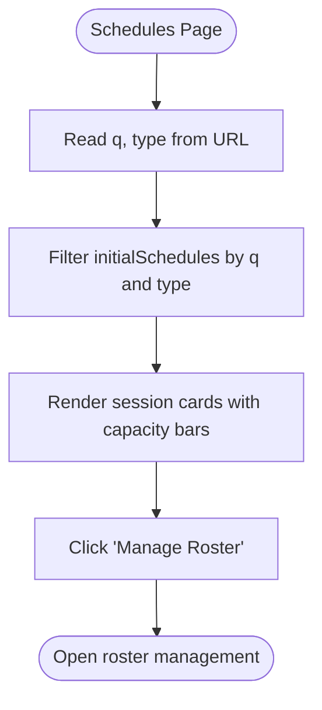

**Diagram sources**
- [schedules/page.tsx:94-109](file://apps/portal/app/(departments)/training/schedules/page.tsx#L94-L109)
- [schedules/page.tsx:147-223](file://apps/portal/app/(departments)/training/schedules/page.tsx#L147-L223)

**Section sources**
- [schedules/page.tsx:19-92](file://apps/portal/app/(departments)/training/schedules/page.tsx#L19-L92)
- [schedules/page.tsx:94-109](file://apps/portal/app/(departments)/training/schedules/page.tsx#L94-L109)
- [schedules/page.tsx:147-223](file://apps/portal/app/(departments)/training/schedules/page.tsx#L147-L223)

### Reports and Audits
- Purpose: Provide compliance audits, history, and exports.
- Features:
  - Departmental compliance rates with visual bars
  - Quick summary cards: Overall Site Compliance, Pending Expirations (15d), LMS Completions MTD
  - Generated reports table with format, author, and download action
- Export workflow:
  - Client-side button toggles loading state and simulates download.

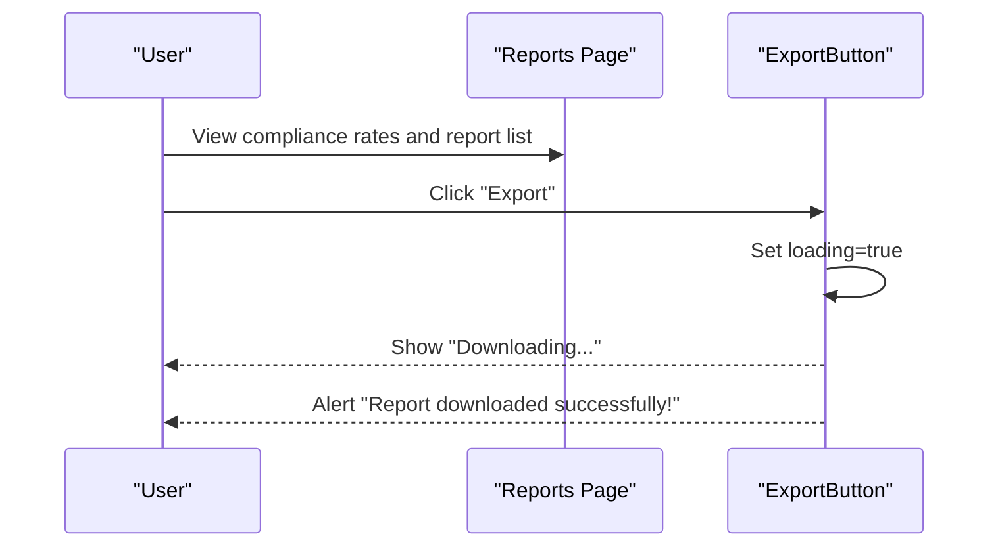

**Diagram sources**
- [reports/page.tsx:78-102](file://apps/portal/app/(departments)/training/reports/page.tsx#L78-L102)
- [reports/page.tsx:229-253](file://apps/portal/app/(departments)/training/reports/page.tsx#L229-L253)
- [ExportButton.tsx:9-15](file://apps/portal/app/(departments)/training/components/ExportButton.tsx#L9-L15)

**Section sources**
- [reports/page.tsx:20-76](file://apps/portal/app/(departments)/training/reports/page.tsx#L20-L76)
- [reports/page.tsx:78-102](file://apps/portal/app/(departments)/training/reports/page.tsx#L78-L102)
- [reports/page.tsx:229-253](file://apps/portal/app/(departments)/training/reports/page.tsx#L229-L253)
- [ExportButton.tsx:6-26](file://apps/portal/app/(departments)/training/components/ExportButton.tsx#L6-L26)

### Shared Components

#### SearchForm
- Behavior: Submit GET requests with name="q". Preserves other params via hidden inputs.
- Use cases: Persistent search across pages.

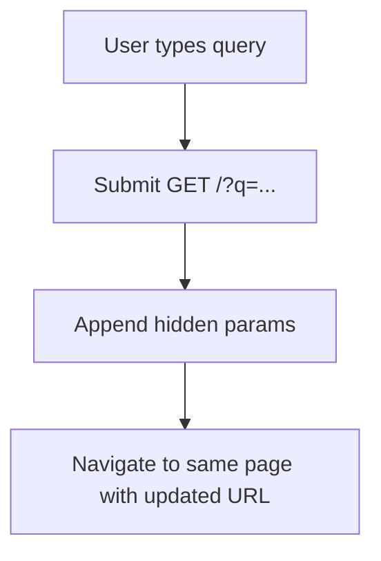

**Diagram sources**
- [SearchForm.tsx:9-27](file://apps/portal/app/(departments)/training/components/SearchForm.tsx#L9-L27)

**Section sources**
- [SearchForm.tsx:9-27](file://apps/portal/app/(departments)/training/components/SearchForm.tsx#L9-L27)

#### FilterTabs
- Behavior: Renders filter options as links that update a specific query parameter while preserving others.
- Use cases: Category/status/type filters.

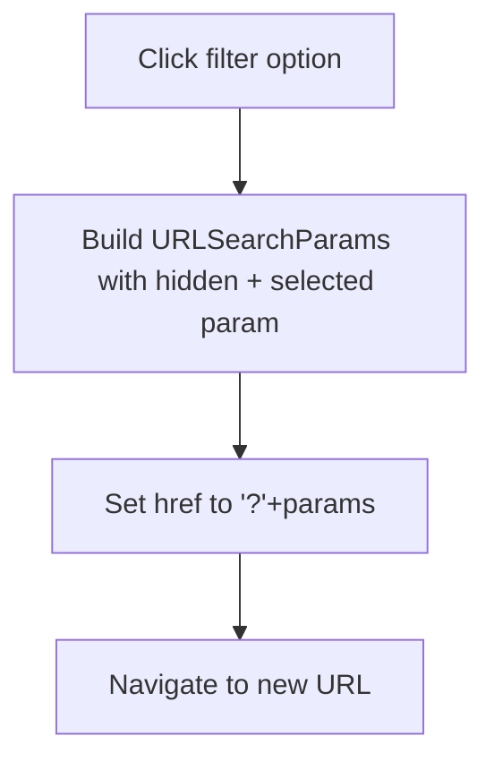

**Diagram sources**
- [FilterTabs.tsx:11-46](file://apps/portal/app/(departments)/training/components/FilterTabs.tsx#L11-L46)

**Section sources**
- [FilterTabs.tsx:11-46](file://apps/portal/app/(departments)/training/components/FilterTabs.tsx#L11-L46)

#### ExportButton
- Behavior: Client-side toggle of loading state and simulated download confirmation.
- Integration point: Used in Reports page actions.

**Section sources**
- [ExportButton.tsx:6-26](file://apps/portal/app/(departments)/training/components/ExportButton.tsx#L6-L26)

## Dependency Analysis
- Pages depend on shared components for consistent UX:
  - Courses, Certifications, Schedules use SearchForm and FilterTabs.
  - Reports uses ExportButton.
- Filtering and search rely on URL query parameters rather than global state.
- No direct runtime imports between pages; coupling is through shared components.

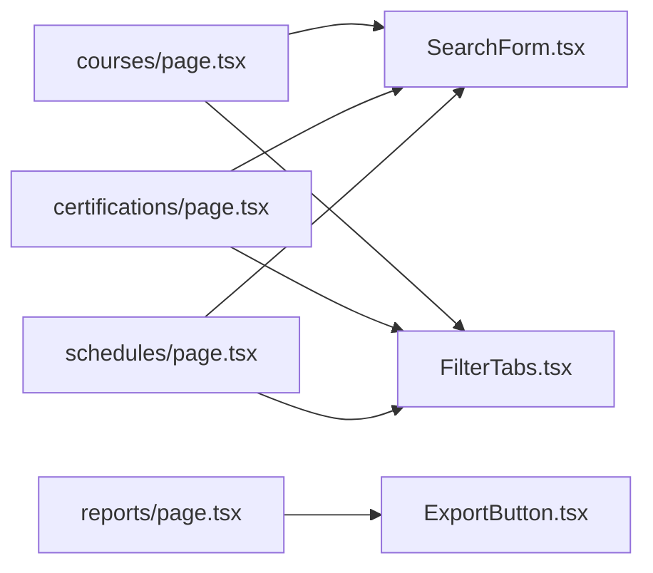

**Diagram sources**
- [courses/page.tsx:130-141](file://apps/portal/app/(departments)/training/courses/page.tsx#L130-L141)
- [certifications/page.tsx:189-201](file://apps/portal/app/(departments)/training/certifications/page.tsx#L189-L201)
- [schedules/page.tsx:130-142](file://apps/portal/app/(departments)/training/schedules/page.tsx#L130-L142)
- [reports/page.tsx:229-253](file://apps/portal/app/(departments)/training/reports/page.tsx#L229-L253)

**Section sources**
- [courses/page.tsx:130-141](file://apps/portal/app/(departments)/training/courses/page.tsx#L130-L141)
- [certifications/page.tsx:189-201](file://apps/portal/app/(departments)/training/certifications/page.tsx#L189-L201)
- [schedules/page.tsx:130-142](file://apps/portal/app/(departments)/training/schedules/page.tsx#L130-L142)
- [reports/page.tsx:229-253](file://apps/portal/app/(departments)/training/reports/page.tsx#L229-L253)

## Performance Considerations
- Client-side filtering on small datasets is efficient; consider pagination or server-side filtering when scaling to large catalogs.
- Avoid unnecessary re-renders by memoizing computed values if datasets grow.
- For exports, prefer streaming responses and background jobs to avoid blocking UI.

[No sources needed since this section provides general guidance]

## Troubleshooting Guide
- Search not updating: Ensure hidden parameters are preserved when navigating; verify SearchForm hidden inputs are rendered correctly.
- Filters not applying: Confirm FilterTabs builds URLSearchParams correctly and that pages read the expected query keys.
- Export not downloading: ExportButton currently simulates download; integrate with a real endpoint and handle errors appropriately.

**Section sources**
- [SearchForm.tsx:9-27](file://apps/portal/app/(departments)/training/components/SearchForm.tsx#L9-L27)
- [FilterTabs.tsx:11-46](file://apps/portal/app/(departments)/training/components/FilterTabs.tsx#L11-L46)
- [ExportButton.tsx:9-15](file://apps/portal/app/(departments)/training/components/ExportButton.tsx#L9-L15)

## Conclusion
The Training module provides a solid foundation for course administration, certification tracking, scheduling, and reporting. Current implementations use in-memory data and client-side filtering. To reach production readiness, integrate with backend APIs, implement server-side search and pagination, add robust error handling, and connect export functionality to actual data pipelines.

[No sources needed since this section summarizes without analyzing specific files]

## Appendices

### Training Data Models
The following tables define the core entities used by the Training department. They support course administration, certification tracking, competency assessments, and equipment inventory.

```mermaid
erDiagram
TRAINING_RECORDS {
int employee_id
int course_id
timestamp completed_at
float score
}
CERTIFICATIONS {
int employee_id
string cert_type
timestamp issued_at
timestamp expires_at
}
TRAINING_COURSES {
int id PK
string name
int department_id
float duration_hours
string required_role
}
COMPETENCY_ASSESSMENTS {
int employee_id
string skill_area
timestamp assessed_at
string result
}
MACHINES {
int id PK
string name
string machine_type
string serial_number
boolean active
}
TRAINING_RECORDS }o--|| TRAINING_COURSES : "enrolls in"
CERTIFICATIONS }o--|| TRAINING_COURSES : "issued after"
COMPETENCY_ASSESSMENTS }o--|| TRAINING_COURSES : "assessed against"
```

**Diagram sources**
- [training-department.md:40-48](file://wiki/entities/training-department.md#L40-L48)

**Section sources**
- [training-department.md:40-48](file://wiki/entities/training-department.md#L40-L48)

### Learning Path Configurations
- Courses include metadata such as category, level, lessons, and duration, enabling structured learning paths.
- Completion rates and enrollment numbers inform path effectiveness and prioritization.
- “Configure Modules” action suggests per-course curriculum configuration.

**Section sources**
- [courses/page.tsx:18-91](file://apps/portal/app/(departments)/training/courses/page.tsx#L18-L91)
- [courses/page.tsx:219-223](file://apps/portal/app/(departments)/training/courses/page.tsx#L219-L223)

### Progress Tracking Systems
- Dashboard shows hours logged month-to-date and active trainees.
- Course cards show completion rates; schedules show registration progress.
- Reports summarize completions and compliance trends.

**Section sources**
- [page.tsx:5-34](file://apps/portal/app/(departments)/training/page.tsx#L5-L34)
- [courses/page.tsx:180-217](file://apps/portal/app/(departments)/training/courses/page.tsx#L180-L217)
- [schedules/page.tsx:202-222](file://apps/portal/app/(departments)/training/schedules/page.tsx#L202-L222)
- [reports/page.tsx:187-201](file://apps/portal/app/(departments)/training/reports/page.tsx#L187-L201)

### Integration with Employee Records
- Certification and assessment entities reference employees via identifiers.
- Dashboard and certification pages associate roles and names with credentials.
- Future integration should link employee IDs to HR systems for synchronized rosters.

**Section sources**
- [certifications/page.tsx:22-95](file://apps/portal/app/(departments)/training/certifications/page.tsx#L22-L95)
- [training-department.md:40-48](file://wiki/entities/training-department.md#L40-L48)

### Automated Certification Expiration Alerts
- UI surfaces “Expiring Soon” and “Expired” statuses.
- Documentation specifies database queries using an interval threshold for upcoming renewals.
- Recommended automation: periodic job to compute expirations and trigger notifications.

**Section sources**
- [certifications/page.tsx:114-122](file://apps/portal/app/(departments)/training/certifications/page.tsx#L114-L122)
- [training-department.md:48](file://wiki/entities/training-department.md#L48)

### Training Completion Workflows
- Courses track completion rates; schedules track registrations.
- Reports capture completions and compliance summaries.
- Workflow suggestion: upon course completion, create a training_record and evaluate eligibility for certification issuance.

**Section sources**
- [courses/page.tsx:180-217](file://apps/portal/app/(departments)/training/courses/page.tsx#L180-L217)
- [schedules/page.tsx:202-222](file://apps/portal/app/(departments)/training/schedules/page.tsx#L202-L222)
- [reports/page.tsx:187-201](file://apps/portal/app/(departments)/training/reports/page.tsx#L187-L201)
- [training-department.md:40-48](file://wiki/entities/training-department.md#L40-L48)

### Content Management and Assessment Tools
- Content management: Course catalog with categories and levels; “Configure Modules” action for curriculum setup.
- Assessment tools: Competency assessments entity exists; UI placeholders exist for assessment sign-off and results.
- Recommendation: Implement forms for assessment creation, grading, and linking to learning paths.

**Section sources**
- [courses/page.tsx:18-91](file://apps/portal/app/(departments)/training/courses/page.tsx#L18-L91)
- [courses/page.tsx:219-223](file://apps/portal/app/(departments)/training/courses/page.tsx#L219-L223)
- [training-department.md:40-48](file://wiki/entities/training-department.md#L40-L48)