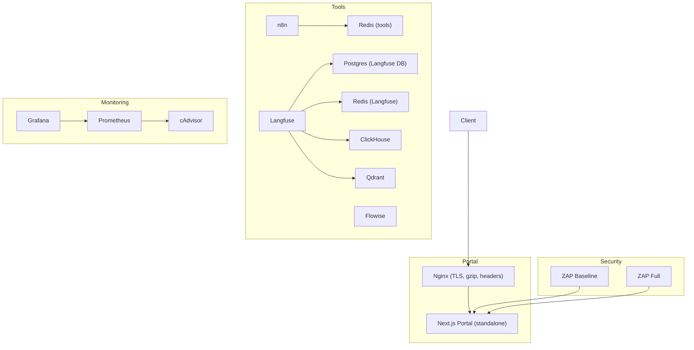
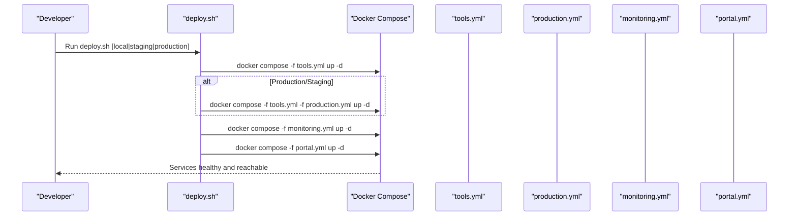
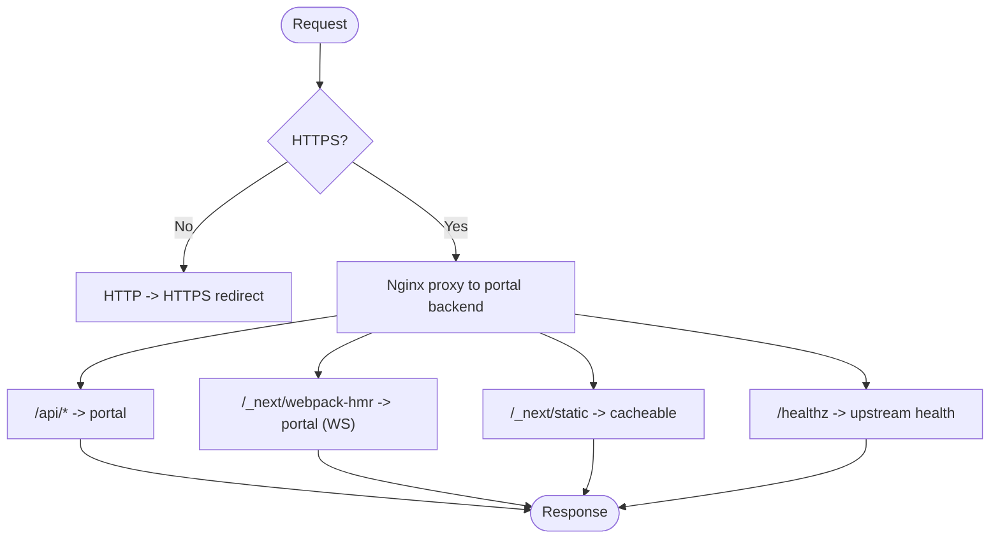
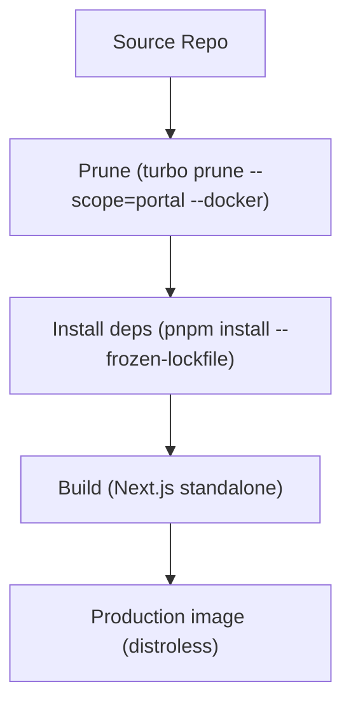
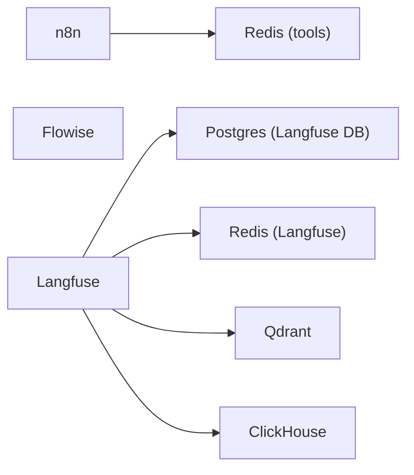
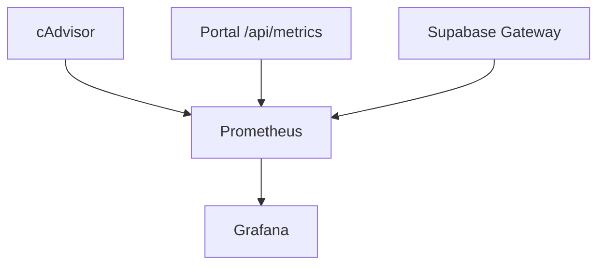
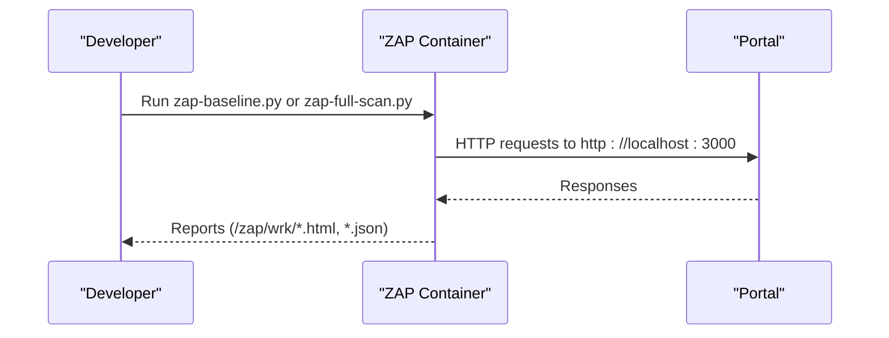
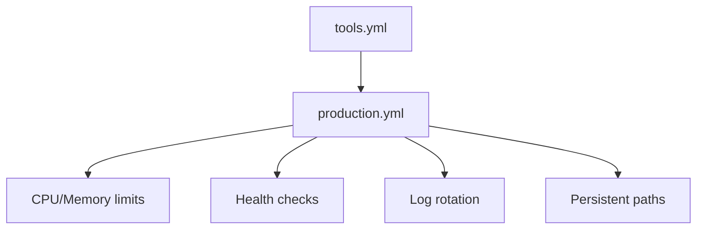
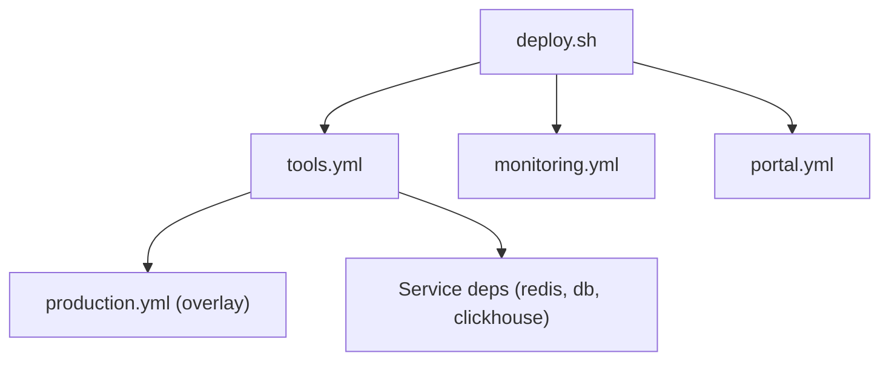

# Containerization & Docker

<cite>
**Referenced Files in This Document**
- [docker-compose.portal.yml](file://docker-compose.portal.yml)
- [apps/portal/Dockerfile](file://apps/portal/Dockerfile)
- [config/nginx.conf](file://config/nginx.conf)
- [docker-compose.tools.yml](file://docker-compose.tools.yml)
- [docker-compose.production.yml](file://docker-compose.production.yml)
- [docker-compose.monitoring.yml](file://docker-compose.monitoring.yml)
- [monitoring/prometheus.yml](file://monitoring/prometheus.yml)
- [docker-compose.security.yml](file://docker-compose.security.yml)
- [scripts/deploy.sh](file://scripts/deploy.sh)
- [scripts/setup-production-environment.sh](file://scripts/setup-production-environment.sh)
</cite>

## Table of Contents
1. [Introduction](#introduction)
2. [Project Structure](#project-structure)
3. [Core Components](#core-components)
4. [Architecture Overview](#architecture-overview)
5. [Detailed Component Analysis](#detailed-component-analysis)
6. [Dependency Analysis](#dependency-analysis)
7. [Performance Considerations](#performance-considerations)
8. [Troubleshooting Guide](#troubleshooting-guide)
9. [Conclusion](#conclusion)
10. [Appendices](#appendices)

## Introduction
This document explains the containerization strategy for the Arch-Mk2 platform using Docker Compose. It covers multi-service orchestration (Portal, CMS, monitoring tools, and infrastructure), production hardening with resource limits and health checks, multi-stage image builds, volume management, environment variables and secrets, networking, scaling, load balancing, and high availability patterns.

## Project Structure
The repository provides a set of focused Docker Compose files that compose different environments:
- Portal stack: Nginx reverse proxy + Next.js portal
- Tools stack: n8n, Flowise, Langfuse, Qdrant, ClickHouse, Redis
- Monitoring stack: Prometheus, Grafana, cAdvisor
- Security scanning: OWASP ZAP baseline/full scans
- Production overrides: restart policies, resource limits, logging, and hardened env defaults

**Diagram sources**
- [docker-compose.portal.yml:1-37](file://docker-compose.portal.yml#L1-L37)
- [config/nginx.conf:1-133](file://config/nginx.conf#L1-L133)
- [docker-compose.tools.yml:1-275](file://docker-compose.tools.yml#L1-L275)
- [docker-compose.monitoring.yml:1-54](file://docker-compose.monitoring.yml#L1-L54)
- [docker-compose.security.yml:1-41](file://docker-compose.security.yml#L1-L41)

**Section sources**
- [docker-compose.portal.yml:1-37](file://docker-compose.portal.yml#L1-L37)
- [docker-compose.tools.yml:1-275](file://docker-compose.tools.yml#L1-L275)
- [docker-compose.monitoring.yml:1-54](file://docker-compose.monitoring.yml#L1-L54)
- [docker-compose.security.yml:1-41](file://docker-compose.security.yml#L1-L41)

## Core Components
- Portal service: Next.js app built via multi-stage Dockerfile; served by Nginx for TLS termination, security headers, caching, and WebSocket support.
- Tools services: Workflow automation (n8n), AI orchestration UI (Flowise), observability (Langfuse), vector store (Qdrant), analytics DB (ClickHouse), and caches (Redis).
- Monitoring services: Prometheus scrapes metrics; Grafana visualizes dashboards; cAdvisor exposes container-level metrics.
- Security scanning: OWASP ZAP runs baseline or full scans against the running portal.

Key responsibilities:
- Build optimization and minimal runtime images for the portal
- Health checks across all services
- Persistent volumes for stateful components
- Isolated networks per stack
- Environment-driven configuration and secrets

**Section sources**
- [apps/portal/Dockerfile:1-64](file://apps/portal/Dockerfile#L1-L64)
- [docker-compose.portal.yml:1-37](file://docker-compose.portal.yml#L1-L37)
- [docker-compose.tools.yml:1-275](file://docker-compose.tools.yml#L1-L275)
- [docker-compose.monitoring.yml:1-54](file://docker-compose.monitoring.yml#L1-L54)
- [docker-compose.security.yml:1-41](file://docker-compose.security.yml#L1-L41)

## Architecture Overview
The system is composed of independent stacks orchestrated by separate Docker Compose files. The deployment script composes them together based on environment (local, staging, production).

**Diagram sources**
- [scripts/deploy.sh:710-795](file://scripts/deploy.sh#L710-L795)
- [docker-compose.tools.yml:1-275](file://docker-compose.tools.yml#L1-L275)
- [docker-compose.production.yml:1-106](file://docker-compose.production.yml#L1-L106)
- [docker-compose.monitoring.yml:1-54](file://docker-compose.monitoring.yml#L1-L54)
- [docker-compose.portal.yml:1-37](file://docker-compose.portal.yml#L1-L37)

## Detailed Component Analysis

### Portal Stack (Nginx + Next.js)
- Nginx terminates TLS, enforces security headers, proxies API routes, supports WebSockets, and caches static assets.
- Next.js runs from a distroless standalone output for a small attack surface and fast startup.
- Health check probes the application’s /api/health endpoint.

**Diagram sources**
- [config/nginx.conf:49-133](file://config/nginx.conf#L49-L133)
- [docker-compose.portal.yml:1-37](file://docker-compose.portal.yml#L1-L37)

**Section sources**
- [docker-compose.portal.yml:1-37](file://docker-compose.portal.yml#L1-L37)
- [config/nginx.conf:1-133](file://config/nginx.conf#L1-L133)

#### Multi-stage Build and Image Optimization
- Stage 1 (pruner): Turbo prune isolates only the portal scope.
- Stage 2 (deps): pnpm install with frozen lockfile and pnpm store cache mount.
- Stage 3 (builder): Build with Next.js cache mount and embed build-time env vars into standalone output.
- Stage 4 (production): Distroless runtime with only standalone artifacts and public assets; non-root user.

**Diagram sources**
- [apps/portal/Dockerfile:1-64](file://apps/portal/Dockerfile#L1-L64)

**Section sources**
- [apps/portal/Dockerfile:1-64](file://apps/portal/Dockerfile#L1-L64)

### Tools Stack (n8n, Flowise, Langfuse, Qdrant, ClickHouse, Redis)
- n8n: workflow automation with basic auth and encryption key; depends on Redis.
- Flowise: AI orchestration UI with credentials and secret overwrite.
- Langfuse: Observability requiring Postgres, Redis, Qdrant, and ClickHouse.
- Qdrant: Vector database for embeddings.
- ClickHouse: Analytical data store.
- Redis: Cache and job queue backing for multiple services.

**Diagram sources**
- [docker-compose.tools.yml:1-275](file://docker-compose.tools.yml#L1-L275)

**Section sources**
- [docker-compose.tools.yml:1-275](file://docker-compose.tools.yml#L1-L275)

### Monitoring Stack (Prometheus, Grafana, cAdvisor)
- Prometheus scrapes cadvisor and local targets (including host.docker.internal for Supabase and portal metrics).
- Grafana provides dashboards and alerting.
- cAdvisor exposes container metrics.

**Diagram sources**
- [docker-compose.monitoring.yml:1-54](file://docker-compose.monitoring.yml#L1-L54)
- [monitoring/prometheus.yml:1-22](file://monitoring/prometheus.yml#L1-L22)

**Section sources**
- [docker-compose.monitoring.yml:1-54](file://docker-compose.monitoring.yml#L1-L54)
- [monitoring/prometheus.yml:1-22](file://monitoring/prometheus.yml#L1-L22)

### Security Scanning (OWASP ZAP)
- Baseline and full scan profiles run against the running portal.
- Uses host networking to reach localhost services and writes reports to a shared volume.

**Diagram sources**
- [docker-compose.security.yml:1-41](file://docker-compose.security.yml#L1-L41)

**Section sources**
- [docker-compose.security.yml:1-41](file://docker-compose.security.yml#L1-L41)

### Production Overrides
- Adds restart policies, resource limits/reservations, health checks, and logging rotation for tool services.
- Persists data under /opt/arch-systems/data for n8n, Flowise, Redis, and ClickHouse.

**Diagram sources**
- [docker-compose.production.yml:1-106](file://docker-compose.production.yml#L1-L106)

**Section sources**
- [docker-compose.production.yml:1-106](file://docker-compose.production.yml#L1-L106)

## Dependency Analysis
- Compose file composition:
  - Local/staging/production flows are orchestrated by the deployment script which selects compose files accordingly.
  - Production mode overlays production.yml onto tools.yml to add runtime safeguards.
- Service dependencies:
  - n8n depends on Redis health.
  - Langfuse depends on its Postgres and Redis instances being healthy.
  - Monitoring stack uses a dedicated network and extra_hosts for host access.

**Diagram sources**
- [scripts/deploy.sh:710-795](file://scripts/deploy.sh#L710-L795)
- [docker-compose.tools.yml:1-275](file://docker-compose.tools.yml#L1-L275)
- [docker-compose.production.yml:1-106](file://docker-compose.production.yml#L1-L106)

**Section sources**
- [scripts/deploy.sh:710-795](file://scripts/deploy.sh#L710-L795)
- [docker-compose.tools.yml:1-275](file://docker-compose.tools.yml#L1-L275)
- [docker-compose.production.yml:1-106](file://docker-compose.production.yml#L1-L106)

## Performance Considerations
- Build performance:
  - Use BuildKit and pnpm store mounts to accelerate dependency installs.
  - Turbo prune reduces build context size.
  - Next.js cache mount speeds rebuilds.
- Runtime performance:
  - Nginx gzip, keepalive, and static asset caching reduce bandwidth and latency.
  - Resource limits prevent noisy neighbor issues and ensure fair scheduling.
  - Separate networks isolate traffic and reduce overhead.
- Storage:
  - Persistent volumes for databases and tool data avoid cold starts and data loss.

[No sources needed since this section provides general guidance]

## Troubleshooting Guide
- Health checks:
  - Verify service endpoints exposed by each compose file (e.g., /healthz, /api/health, redis-cli ping, pg_isready).
- Logging:
  - Production overlay configures json-file driver with max-size and max-file to cap disk usage.
- Networking:
  - Monitoring stack uses extra_hosts to reach host.docker.internal for local Supabase and portal metrics.
- Common failures:
  - Port conflicts resolved by the deployment script before starting services.
  - Missing .env files validated during pre-flight; production requires non-localhost external Supabase URL.

**Section sources**
- [docker-compose.tools.yml:24-36](file://docker-compose.tools.yml#L24-L36)
- [docker-compose.production.yml:28-38](file://docker-compose.production.yml#L28-L38)
- [docker-compose.monitoring.yml:1-54](file://docker-compose.monitoring.yml#L1-L54)
- [monitoring/prometheus.yml:1-22](file://monitoring/prometheus.yml#L1-L22)
- [scripts/deploy.sh:434-498](file://scripts/deploy.sh#L434-L498)

## Conclusion
Arch-Mk2’s containerization leverages modular Docker Compose files to assemble a scalable, observable, and secure platform. The multi-stage portal build minimizes attack surface and improves startup time. Production overlays enforce resilience and resource governance. Clear separation of concerns across stacks simplifies operations and enables targeted scaling and HA strategies.

[No sources needed since this section summarizes without analyzing specific files]

## Appendices

### Environment Variables and Secrets Management
- Portal:
  - Build-time NEXT_PUBLIC_* variables embedded into the standalone output.
  - Runtime env_file loads additional values at container start.
- Tools:
  - Shared .env.tools supplies credentials for n8n, Flowise, Langfuse, Qdrant, ClickHouse, and Redis.
- Production:
  - Overlay sets hardened defaults and expects secrets via environment (e.g., passwords, keys).
- Best practices:
  - Keep secrets out of version control; use environment injection or orchestrator secret stores.
  - Validate required variables during setup and deployment phases.

**Section sources**
- [apps/portal/Dockerfile:31-51](file://apps/portal/Dockerfile#L31-L51)
- [docker-compose.portal.yml:9-14](file://docker-compose.portal.yml#L9-L14)
- [docker-compose.tools.yml:8-11](file://docker-compose.tools.yml#L8-L11)
- [docker-compose.production.yml:11-18](file://docker-compose.production.yml#L11-L18)
- [scripts/setup-production-environment.sh:360-413](file://scripts/setup-production-environment.sh#L360-L413)

### Volume Management for Persistent Data
- Tools:
  - n8n, Flowise, Langfuse DB, Qdrant, ClickHouse, and Redis persist data under named volumes or host paths.
- Production:
  - Host-mounted directories under /opt/arch-systems/data for durability and backup.
- Monitoring:
  - Prometheus and Grafana data persisted via named volumes.

**Section sources**
- [docker-compose.tools.yml:22-270](file://docker-compose.tools.yml#L22-L270)
- [docker-compose.production.yml:19-105](file://docker-compose.production.yml#L19-L105)
- [docker-compose.monitoring.yml:10-49](file://docker-compose.monitoring.yml#L10-L49)

### Networking Between Containers
- Dedicated bridge networks:
  - plantcor-tools for tool services.
  - plantcor-monitoring for observability.
- Cross-stack access:
  - Monitoring uses extra_hosts to reach host services when running locally.
- Reverse proxy:
  - Nginx proxies to the portal backend within the same compose network.

**Section sources**
- [docker-compose.tools.yml:272-275](file://docker-compose.tools.yml#L272-L275)
- [docker-compose.monitoring.yml:13-16](file://docker-compose.monitoring.yml#L13-L16)
- [docker-compose.portal.yml:22-34](file://docker-compose.portal.yml#L22-L34)

### Scaling, Load Balancing, and High Availability
- Horizontal scaling:
  - Add more portal replicas behind Nginx upstream; configure keepalive and failover parameters.
- Load balancing:
  - Nginx upstream distributes requests across multiple portal instances.
- High availability:
  - Use persistent storage for stateful services (databases, caches).
  - Apply resource limits and health checks to enable orchestrator-based recovery.
  - For advanced HA, consider Kubernetes manifests or an external load balancer in front of Nginx.

**Section sources**
- [config/nginx.conf:42-47](file://config/nginx.conf#L42-L47)
- [docker-compose.production.yml:21-38](file://docker-compose.production.yml#L21-L38)

### Deployment Orchestration
- The deployment script:
  - Validates prerequisites and environment.
  - Starts tools and monitoring stacks.
  - Applies production overlays where applicable.
  - Performs health checks and logs outcomes.

**Section sources**
- [scripts/deploy.sh:710-795](file://scripts/deploy.sh#L710-L795)
- [scripts/setup-production-environment.sh:551-623](file://scripts/setup-production-environment.sh#L551-L623)