# Deployment & DevOps

<cite>
**Referenced Files in This Document**
- [docker-compose.portal.yml](file://docker-compose.portal.yml)
- [docker-compose.tools.yml](file://docker-compose.tools.yml)
- [docker-compose.production.yml](file://docker-compose.production.yml)
- [docker-compose.monitoring.yml](file://docker-compose.monitoring.yml)
- [apps/portal/Dockerfile](file://apps/portal/Dockerfile)
- [vercel.json](file://vercel.json)
- [scripts/deploy.sh](file://scripts/deploy.sh)
- [scripts/setup-production-environment.sh](file://scripts/setup-production-environment.sh)
- [scripts/deploy-dev.sh](file://scripts/deploy-dev.sh)
- [ci/workflows/policy-evaluation.yml](file://ci/workflows/policy-evaluation.yml)
- [ci/workflows/pr-cache-warmup.yml](file://ci/workflows/pr-cache-warmup.yml)
- [ci/scripts/rollback.sh](file://ci/scripts/rollback.sh)
- [config/prometheus.yml](file://config/prometheus.yml)
- [monitoring/prometheus.yml](file://monitoring/prometheus.yml)
- [infra/k8s/cache-agent.yaml](file://infra/k8s/cache-agent.yaml)
- [infra/observability/grafana-dashboards/cache-dashboard.json](file://infra/observability/grafana-dashboards/cache-dashboard.json)
- [infra/observability/prometheus-rules/cache-alerts.yaml](file://infra/observability/prometheus-rules/cache-alerts.yaml)
- [apps/portal/lib/env.ts](file://apps/portal/lib/env.ts)
</cite>

## Table of Contents
1. Introduction
2. Project Structure
3. Core Components
4. Architecture Overview
5. Detailed Component Analysis
6. Dependency Analysis
7. Performance Considerations
8. Troubleshooting Guide
9. Conclusion
10. Appendices

## Introduction
This document provides comprehensive deployment and DevOps guidance for the Arch-Mk2 platform. It covers container orchestration with Docker Compose, cloud deployment to Vercel, production environment configuration, CI/CD pipelines, automated testing hooks, monitoring with Prometheus and Grafana, backup and recovery procedures, disaster recovery planning, rollback strategies, environment variable management, secrets handling, and security hardening for production deployments.

## Project Structure
The repository includes multiple Docker Compose files that compose different environments:
- Portal stack (Next.js + Nginx)
- Tools stack (n8n, Flowise, Redis, Langfuse, Qdrant, ClickHouse, Prometheus)
- Production overrides (restart policies, resource limits, health checks)
- Monitoring stack (Prometheus, Grafana, cAdvisor)
- A Next.js Dockerfile optimized for standalone output and distroless runtime
- Vercel configuration for serverless/static hosting
- Scripts for local development, production setup, and full sequential deployments
- CI workflows for policy evaluation and predictive cache warmup
- Kubernetes manifests for a cache agent
- Prometheus configurations for dev and tool stacks
- Observability assets (dashboards and alert rules)

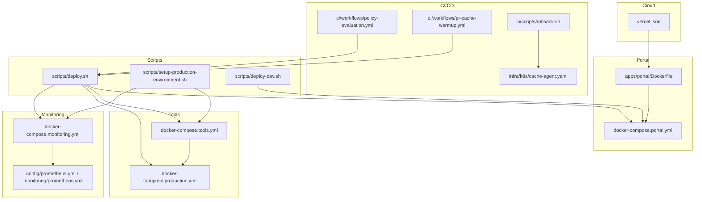

**Diagram sources**
- [apps/portal/Dockerfile](file://apps/portal/Dockerfile)
- [docker-compose.portal.yml](file://docker-compose.portal.yml)
- [docker-compose.tools.yml](file://docker-compose.tools.yml)
- [docker-compose.production.yml](file://docker-compose.production.yml)
- [docker-compose.monitoring.yml](file://docker-compose.monitoring.yml)
- [config/prometheus.yml](file://config/prometheus.yml)
- [monitoring/prometheus.yml](file://monitoring/prometheus.yml)
- [vercel.json](file://vercel.json)
- [scripts/deploy.sh](file://scripts/deploy.sh)
- [scripts/setup-production-environment.sh](file://scripts/setup-production-environment.sh)
- [scripts/deploy-dev.sh](file://scripts/deploy-dev.sh)
- [ci/workflows/policy-evaluation.yml](file://ci/workflows/policy-evaluation.yml)
- [ci/workflows/pr-cache-warmup.yml](file://ci/workflows/pr-cache-warmup.yml)
- [ci/scripts/rollback.sh](file://ci/scripts/rollback.sh)
- [infra/k8s/cache-agent.yaml](file://infra/k8s/cache-agent.yaml)

**Section sources**
- [docker-compose.portal.yml](file://docker-compose.portal.yml)
- [docker-compose.tools.yml](file://docker-compose.tools.yml)
- [docker-compose.production.yml](file://docker-compose.production.yml)
- [docker-compose.monitoring.yml](file://docker-compose.monitoring.yml)
- [apps/portal/Dockerfile](file://apps/portal/Dockerfile)
- [vercel.json](file://vercel.json)
- [scripts/deploy.sh](file://scripts/deploy.sh)
- [scripts/setup-production-environment.sh](file://scripts/setup-production-environment.sh)
- [scripts/deploy-dev.sh](file://scripts/deploy-dev.sh)
- [ci/workflows/policy-evaluation.yml](file://ci/workflows/policy-evaluation.yml)
- [ci/workflows/pr-cache-warmup.yml](file://ci/workflows/pr-cache-warmup.yml)
- [ci/scripts/rollback.sh](file://ci/scripts/rollback.sh)
- [infra/k8s/cache-agent.yaml](file://infra/k8s/cache-agent.yaml)
- [config/prometheus.yml](file://config/prometheus.yml)
- [monitoring/prometheus.yml](file://monitoring/prometheus.yml)

## Core Components
- Containerized Portal: Next.js app built via a multi-stage Dockerfile producing a standalone output and served by an optimized distroless image. Health endpoint is exposed at /api/health.
- Nginx Reverse Proxy: Exposes ports 80/443 and proxies to the portal service; mounts nginx config and TLS certs.
- Tools Stack: n8n, Flowise, Redis, Langfuse (with Postgres and Redis), Qdrant, ClickHouse, and Prometheus are orchestrated together with health checks and persistent volumes.
- Production Overrides: Adds restart policies, resource limits, health checks, and hardened env defaults for tools.
- Monitoring Stack: Prometheus scrapes internal services and host metrics via cAdvisor; Grafana exposes dashboards.
- Vercel Deployment: Build command targets the portal app and outputs to .next for static/serverless hosting.
- Deployment Scripts: Comprehensive scripts for local dev, production setup, and sequential phased deployments with backups and health gating.
- CI/CD: Policy evaluation gate on main branch and PR cache warmup workflow to pre-fetch build targets.
- Rollback Utilities: Script to roll back Kubernetes deployments for specific components.

**Section sources**
- [apps/portal/Dockerfile](file://apps/portal/Dockerfile)
- [docker-compose.portal.yml](file://docker-compose.portal.yml)
- [docker-compose.tools.yml](file://docker-compose.tools.yml)
- [docker-compose.production.yml](file://docker-compose.production.yml)
- [docker-compose.monitoring.yml](file://docker-compose.monitoring.yml)
- [vercel.json](file://vercel.json)
- [scripts/deploy.sh](file://scripts/deploy.sh)
- [scripts/setup-production-environment.sh](file://scripts/setup-production-environment.sh)
- [scripts/deploy-dev.sh](file://scripts/deploy-dev.sh)
- [ci/workflows/policy-evaluation.yml](file://ci/workflows/policy-evaluation.yml)
- [ci/workflows/pr-cache-warmup.yml](file://ci/workflows/pr-cache-warmup.yml)
- [ci/scripts/rollback.sh](file://ci/scripts/rollback.sh)

## Architecture Overview
The system composes several layers:
- Application Layer: Next.js portal (standalone output) behind Nginx or directly on port 3000.
- Data and Tooling Layer: Redis, ClickHouse, Qdrant, Postgres (for Langfuse), and automation/AI tools (n8n, Flowise).
- Observability Layer: Prometheus scraping application and infrastructure metrics; Grafana for visualization.
- Orchestration Layer: Docker Compose for local/staging/production; optional Kubernetes for specific agents.
- Cloud Layer: Vercel for static/serverless builds of the portal.

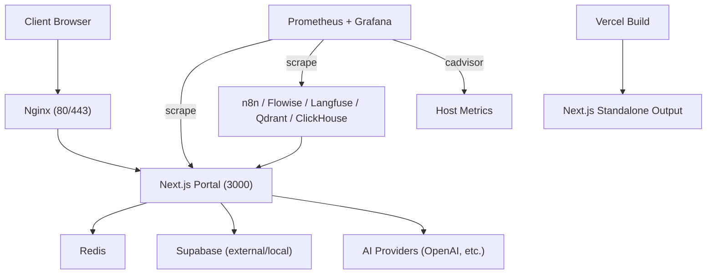

**Diagram sources**
- [docker-compose.portal.yml](file://docker-compose.portal.yml)
- [docker-compose.tools.yml](file://docker-compose.tools.yml)
- [docker-compose.monitoring.yml](file://docker-compose.monitoring.yml)
- [monitoring/prometheus.yml](file://monitoring/prometheus.yml)
- [vercel.json](file://vercel.json)
- [apps/portal/Dockerfile](file://apps/portal/Dockerfile)

## Detailed Component Analysis

### Docker Compose Orchestration
- Portal Compose: Builds the portal using apps/portal/Dockerfile, sets NODE_ENV=production, defines healthcheck against /api/health, and runs Nginx as reverse proxy with TLS cert mount.
- Tools Compose: Defines n8n, Flowise, Redis, Langfuse (with its own Postgres and Redis), Qdrant, ClickHouse, and Prometheus. Includes health checks, persistent volumes, and networking.
- Production Overrides: Adds restart policies, resource limits, logging rotation, and secure defaults for credentials and encryption keys.
- Monitoring Compose: Runs Prometheus, Grafana, and cAdvisor with separate data volumes and network isolation.

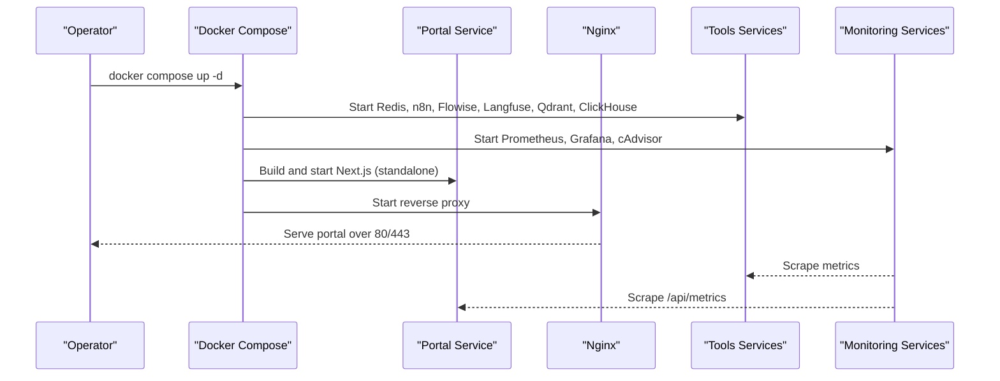

**Diagram sources**
- [docker-compose.portal.yml](file://docker-compose.portal.yml)
- [docker-compose.tools.yml](file://docker-compose.tools.yml)
- [docker-compose.production.yml](file://docker-compose.production.yml)
- [docker-compose.monitoring.yml](file://docker-compose.monitoring.yml)

**Section sources**
- [docker-compose.portal.yml](file://docker-compose.portal.yml)
- [docker-compose.tools.yml](file://docker-compose.tools.yml)
- [docker-compose.production.yml](file://docker-compose.production.yml)
- [docker-compose.monitoring.yml](file://docker-compose.monitoring.yml)

### Next.js Dockerfile and Standalone Build
- Multi-stage build: pruner → deps → builder → production.
- Uses Turbo prune to scope dependencies to portal only.
- pnpm store cache mount for faster installs.
- Build-time ARGs embed public variables into the Next.js standalone output.
- Final stage uses a distroless Node image, runs as non-root user, and serves from standalone output.

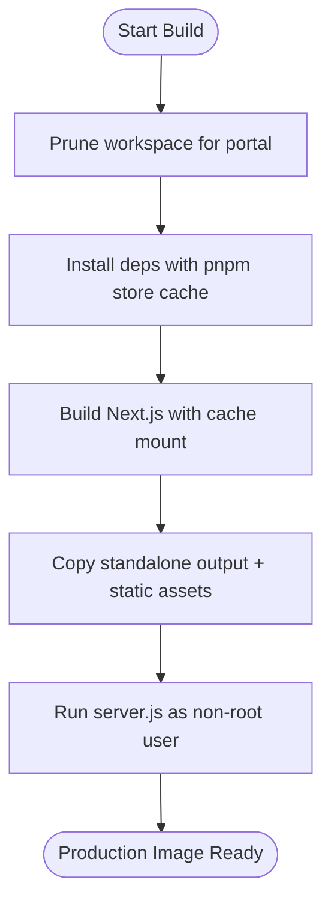

**Diagram sources**
- [apps/portal/Dockerfile](file://apps/portal/Dockerfile)

**Section sources**
- [apps/portal/Dockerfile](file://apps/portal/Dockerfile)

### Vercel Deployment
- Build command targets the portal package.
- Output directory points to .next for Next.js serverless/static hosting.
- Framework detection configured for Next.js.

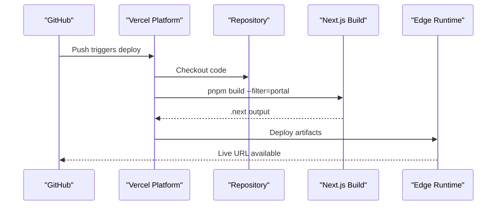

**Diagram sources**
- [vercel.json](file://vercel.json)

**Section sources**
- [vercel.json](file://vercel.json)

### CI/CD Pipelines
- Policy Evaluation Gate: Runs on push to main; simulates policy checks and telemetry validation.
- Predictive Cache Warmup: On PR open/synchronize, fetches full history, installs deps, generates dry-run build targets, and pre-warms cache via internal API.

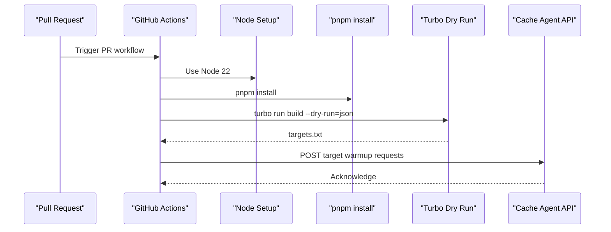

**Diagram sources**
- [ci/workflows/pr-cache-warmup.yml](file://ci/workflows/pr-cache-warmup.yml)

**Section sources**
- [ci/workflows/policy-evaluation.yml](file://ci/workflows/policy-evaluation.yml)
- [ci/workflows/pr-cache-warmup.yml](file://ci/workflows/pr-cache-warmup.yml)

### Rollback Strategy
- Kubernetes Rollback: Script issues rollout undo for specified deployments (e.g., cache-agent, policy-engine).
- Local/Compose Rollback: The deployment script supports creating backups and can stop/restart services; manual rollback involves restoring previous artifacts and restarting.

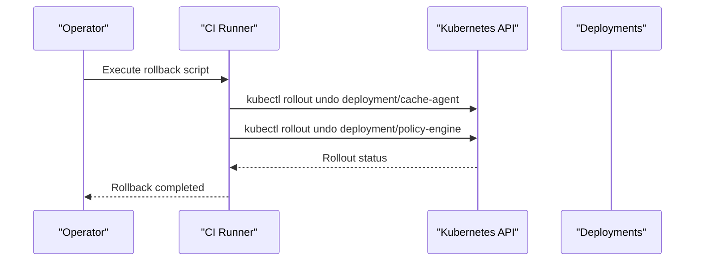

**Diagram sources**
- [ci/scripts/rollback.sh](file://ci/scripts/rollback.sh)
- [infra/k8s/cache-agent.yaml](file://infra/k8s/cache-agent.yaml)

**Section sources**
- [ci/scripts/rollback.sh](file://ci/scripts/rollback.sh)
- [infra/k8s/cache-agent.yaml](file://infra/k8s/cache-agent.yaml)

### Environment Variables and Secrets Handling
- Runtime Validation: The portal validates environment variables at module load time using Zod schema, failing fast in production when required vars are missing.
- Public vs Server-only: NEXT_PUBLIC_* variables are embedded in client bundles; server-only variables remain on the backend.
- Compose Secrets: Credentials and encryption keys are provided via environment variables and env_file references (.env.tools).
- Production Hardening: Production overrides enforce authentication, encryption keys, and logging rotation.

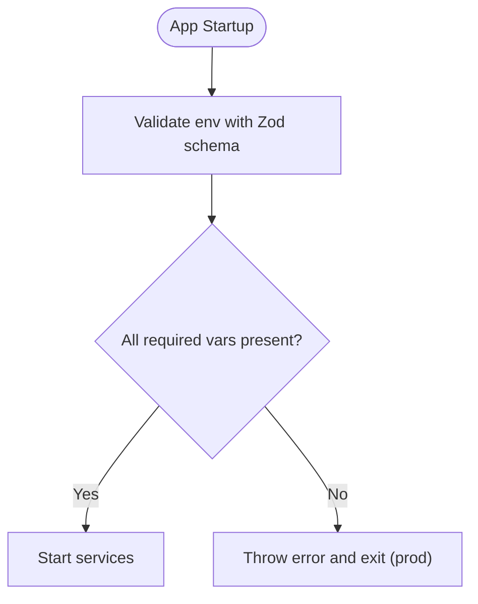

**Diagram sources**
- [apps/portal/lib/env.ts](file://apps/portal/lib/env.ts)

**Section sources**
- [apps/portal/lib/env.ts](file://apps/portal/lib/env.ts)
- [docker-compose.tools.yml](file://docker-compose.tools.yml)
- [docker-compose.production.yml](file://docker-compose.production.yml)

### Monitoring Setup (Prometheus and Grafana)
- Prometheus Configurations: Two configurations exist — one for dev (monitoring/prometheus.yml) and one for tools (config/prometheus.yml). Both define scrape intervals and targets including portal metrics, cadvisor, and internal services.
- Monitoring Compose: Runs Prometheus, Grafana, and cAdvisor with isolated networks and persistent storage.
- Dashboards and Alerts: Grafana dashboard JSON and Prometheus alert rules are included under infra/observability.

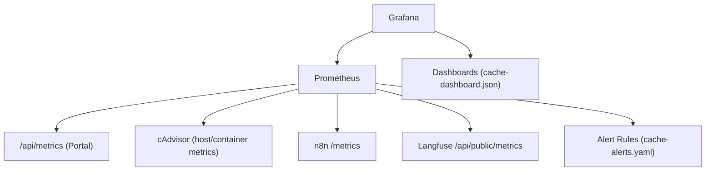

**Diagram sources**
- [monitoring/prometheus.yml](file://monitoring/prometheus.yml)
- [config/prometheus.yml](file://config/prometheus.yml)
- [docker-compose.monitoring.yml](file://docker-compose.monitoring.yml)
- [infra/observability/grafana-dashboards/cache-dashboard.json](file://infra/observability/grafana-dashboards/cache-dashboard.json)
- [infra/observability/prometheus-rules/cache-alerts.yaml](file://infra/observability/prometheus-rules/cache-alerts.yaml)

**Section sources**
- [monitoring/prometheus.yml](file://monitoring/prometheus.yml)
- [config/prometheus.yml](file://config/prometheus.yml)
- [docker-compose.monitoring.yml](file://docker-compose.monitoring.yml)
- [infra/observability/grafana-dashboards/cache-dashboard.json](file://infra/observability/grafana-dashboards/cache-dashboard.json)
- [infra/observability/prometheus-rules/cache-alerts.yaml](file://infra/observability/prometheus-rules/cache-alerts.yaml)

### Backup and Recovery Procedures
- Pre-deployment Backups: The deployment script creates backups in production mode, archiving build artifacts and PID files.
- Persistent Volumes: Tools and databases use named volumes for persistence (e.g., redis_data, clickhouse_data, langfuse_db_data).
- Restore Steps: Stop services, replace volume contents or restore from snapshots, restart services, verify health endpoints.

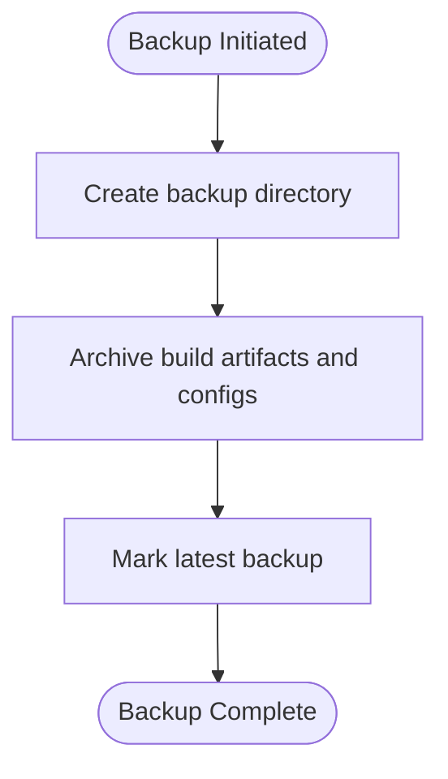

**Diagram sources**
- [scripts/deploy.sh](file://scripts/deploy.sh)

**Section sources**
- [scripts/deploy.sh](file://scripts/deploy.sh)
- [docker-compose.tools.yml](file://docker-compose.tools.yml)

### Disaster Recovery Planning
- Infrastructure Redundancy: Use external managed services where possible (e.g., Supabase, object storage).
- Data Replication: Ensure database backups and replication are configured externally (ClickHouse, Postgres for Langfuse).
- Rollback Readiness: Maintain recent artifact versions and Kubernetes rollout history for quick revert.
- Incident Response: Monitor alerts and maintain runbooks for common failures.

[No sources needed since this section provides general guidance]

### Security Hardening for Production
- Non-root Containers: The production image runs as a non-root user.
- Resource Limits: CPU and memory limits enforced via Compose deploy resources.
- Logging Rotation: json-file driver with max-size and max-file options.
- Authentication: Basic auth for n8n and Flowise via environment variables.
- Network Isolation: Separate networks for tools and monitoring.
- Secrets Management: Avoid committing .env files; use env_file and secret managers in CI/CD.

**Section sources**
- [apps/portal/Dockerfile](file://apps/portal/Dockerfile)
- [docker-compose.production.yml](file://docker-compose.production.yml)
- [docker-compose.tools.yml](file://docker-compose.tools.yml)
- [docker-compose.monitoring.yml](file://docker-compose.monitoring.yml)

## Dependency Analysis
Key dependency relationships:
- Portal depends on Redis, Supabase, and optionally AI providers.
- Tools depend on Redis, Postgres (Langfuse), ClickHouse, and Qdrant.
- Monitoring depends on all services exposing metrics.
- Deployment scripts orchestrate Compose stacks and health checks.

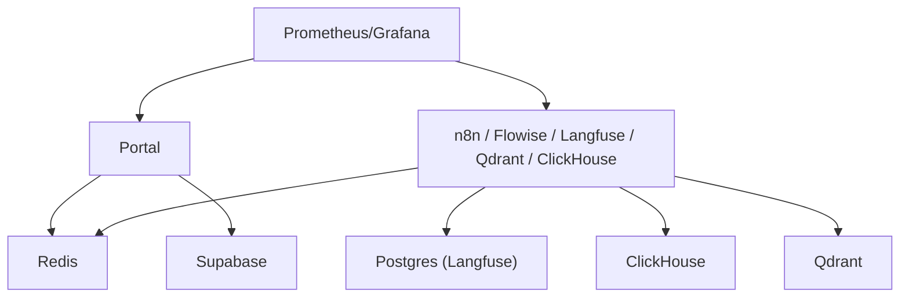

**Diagram sources**
- [docker-compose.tools.yml](file://docker-compose.tools.yml)
- [docker-compose.portal.yml](file://docker-compose.portal.yml)
- [docker-compose.monitoring.yml](file://docker-compose.monitoring.yml)

**Section sources**
- [docker-compose.tools.yml](file://docker-compose.tools.yml)
- [docker-compose.portal.yml](file://docker-compose.portal.yml)
- [docker-compose.monitoring.yml](file://docker-compose.monitoring.yml)

## Performance Considerations
- Build Optimization: Turbo prune and pnpm store cache reduce build times.
- Standalone Output: Next.js standalone reduces runtime overhead and improves cold starts.
- Resource Limits: Apply appropriate CPU/memory reservations and limits per service.
- Health Checks: Use health endpoints to gate deployments and avoid premature traffic routing.
- Monitoring: High-fidelity scraping intervals for development; adjust for production based on cost and needs.

[No sources needed since this section provides general guidance]

## Troubleshooting Guide
Common issues and resolutions:
- Port Conflicts: The deployment script detects and frees occupied ports; ensure no native services conflict with expected ports.
- Docker Not Running: The scripts attempt to start Docker automatically in local mode; otherwise, start manually.
- Health Check Failures: Inspect logs and verify endpoints; use healthcheck functions in scripts to diagnose.
- Missing Environment Variables: The portal fails fast in production if required vars are absent; validate .env files and templates.
- Monitoring Unavailable: Verify Prometheus scrape targets and network connectivity; check cAdvisor permissions.

**Section sources**
- [scripts/deploy.sh](file://scripts/deploy.sh)
- [scripts/setup-production-environment.sh](file://scripts/setup-production-environment.sh)
- [scripts/deploy-dev.sh](file://scripts/deploy-dev.sh)
- [apps/portal/lib/env.ts](file://apps/portal/lib/env.ts)
- [docker-compose.monitoring.yml](file://docker-compose.monitoring.yml)

## Conclusion
Arch-Mk2 provides a robust, modular deployment model leveraging Docker Compose, Next.js standalone builds, and comprehensive observability. With clear environment validation, health-gated deployments, and CI/CD pipelines, the platform supports reliable local, staging, and production operations. Security hardening, backup procedures, and rollback strategies further strengthen operational resilience.

[No sources needed since this section summarizes without analyzing specific files]

## Appendices

### Infrastructure Requirements
- Node.js >= 22.x and pnpm >= 9.x
- Docker and Docker Compose
- Optional: systemd for service management
- Ports: 3000 (portal), 5678 (n8n), 3001 (Flowise), 6379 (Redis), 6333/6334 (Qdrant), 8123/9000 (ClickHouse), 9090 (Prometheus), 9091 (Grafana)

**Section sources**
- [scripts/setup-production-environment.sh](file://scripts/setup-production-environment.sh)
- [docker-compose.tools.yml](file://docker-compose.tools.yml)
- [docker-compose.monitoring.yml](file://docker-compose.monitoring.yml)

### Scaling Considerations
- Horizontal scaling of the portal behind a load balancer (Nginx or cloud LB).
- Redis clustering or managed Redis for high availability.
- ClickHouse and Qdrant scaling according to workload; consider dedicated nodes.
- Prometheus federation and Grafana provisioning for multi-cluster setups.

[No sources needed since this section provides general guidance]

### Automated Testing Hooks
- CI workflows include policy evaluation and cache warmup; integrate unit/integration tests within the build pipeline.
- E2E tests can be executed post-deployment against health endpoints.

**Section sources**
- [ci/workflows/policy-evaluation.yml](file://ci/workflows/policy-evaluation.yml)
- [ci/workflows/pr-cache-warmup.yml](file://ci/workflows/pr-cache-warmup.yml)