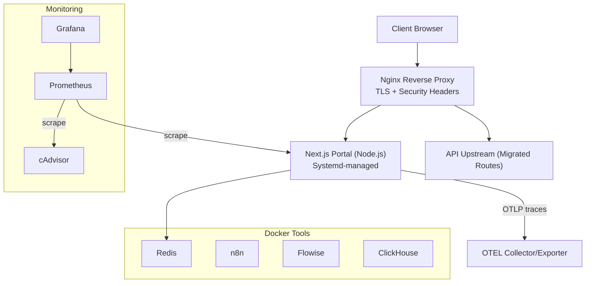
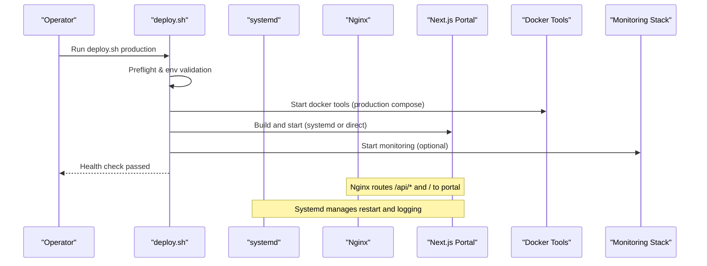
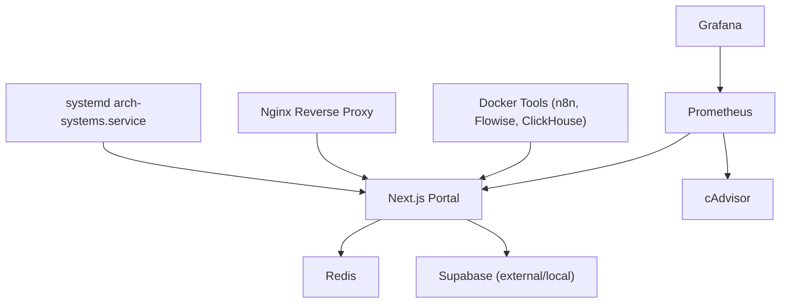

# Production Operations

<cite>
**Referenced Files in This Document**
- [arch-systems.service](file://systemd/arch-systems.service)
- [deploy.sh](file://scripts/deploy.sh)
- [shutdown.sh](file://scripts/shutdown.sh)
- [nginx.conf](file://config/nginx.conf)
- [docker-compose.production.yml](file://docker-compose.production.yml)
- [preflight-checklist.sh](file://scripts/preflight-checklist.sh)
- [logrotate.arch-systems](file://config/logrotate.arch-systems)
- [prometheus.yml](file://monitoring/prometheus.yml)
- [auth-unavailable.md](file://docs/runbooks/auth-unavailable.md)
- [instrumentation.ts](file://apps/portal/instrumentation.ts)
- [setup-production-environment.sh](file://scripts/setup-production-environment.sh)
- [package.json](file://apps/portal/package.json)
</cite>

## Table of Contents
1. Introduction
2. Project Structure
3. Core Components
4. Architecture Overview
5. Detailed Component Analysis
6. Dependency Analysis
7. Performance Considerations
8. Troubleshooting Guide
9. Conclusion
10. Appendices

## Introduction
This document provides production operations guidance for the Arch-Mk2 platform. It covers system initialization, service management with systemd, graceful shutdown procedures, backup and recovery strategies, database maintenance, disaster recovery planning, capacity planning, resource monitoring, scaling procedures, troubleshooting, security hardening, compliance requirements, and audit logging. The content is grounded in the repository’s operational scripts, configuration files, and runtime artifacts.

## Project Structure
The production stack includes:
- Next.js Portal application (Node.js)
- Nginx reverse proxy with TLS termination and health endpoints
- Docker-based tooling and monitoring stacks (n8n, Flowise, Redis, ClickHouse, Prometheus, Grafana, cAdvisor)
- Systemd service unit for process supervision
- Deployment and lifecycle automation via shell scripts
- Observability integration (OpenTelemetry and Sentry)

[No sources needed since this diagram shows conceptual workflow, not actual code structure]

**Section sources**
- [arch-systems.service:1-47](file://systemd/arch-systems.service#L1-L47)
- [nginx.conf:1-218](file://config/nginx.conf#L1-L218)
- [docker-compose.production.yml:1-106](file://docker-compose.production.yml#L1-L106)
- [prometheus.yml:1-22](file://monitoring/prometheus.yml#L1-L22)

## Core Components
- Systemd Service Unit: Defines user, working directory, environment, start command, restart policy, security hardening, and logging for the portal.
- Deployment Script: Orchestrates preflight checks, port conflict resolution, environment validation, backups, build, infrastructure startup, migrations, and health checks.
- Graceful Shutdown Script: Drains connections, stops containers safely, preserves volumes, and restores local .env if present.
- Nginx Configuration: TLS termination, security headers, upstream routing, WebSocket support, static asset caching, and health endpoints.
- Production Docker Overrides: Restart policies, resource limits, health checks, and logging for tooling services.
- Preflight Checklist: Validates prerequisites, ports, stale processes, container status, build artifacts, logs, and systemd service correctness.
- Log Rotation: Daily rotation with compression and log file handle reload via USR1 signal.
- Monitoring: Prometheus scrape targets including portal metrics endpoint and cAdvisor.
- Observability: OpenTelemetry Node SDK initialization and Sentry integration.

**Section sources**
- [arch-systems.service:1-47](file://systemd/arch-systems.service#L1-L47)
- [deploy.sh:1-800](file://scripts/deploy.sh#L1-L800)
- [shutdown.sh:1-126](file://scripts/shutdown.sh#L1-L126)
- [nginx.conf:1-218](file://config/nginx.conf#L1-L218)
- [docker-compose.production.yml:1-106](file://docker-compose.production.yml#L1-L106)
- [preflight-checklist.sh:1-360](file://scripts/preflight-checklist.sh#L1-L360)
- [logrotate.arch-systems:1-17](file://config/logrotate.arch-systems#L1-L17)
- [prometheus.yml:1-22](file://monitoring/prometheus.yml#L1-L22)
- [instrumentation.ts:1-61](file://apps/portal/instrumentation.ts#L1-L61)

## Architecture Overview
Production deployment typically uses Nginx as a reverse proxy to the Next.js portal. The portal runs under systemd supervision and communicates with Redis and external Supabase. Tooling and monitoring are orchestrated via Docker Compose with production overrides providing resource constraints and health checks.

**Diagram sources**
- [deploy.sh:1-800](file://scripts/deploy.sh#L1-L800)
- [arch-systems.service:1-47](file://systemd/arch-systems.service#L1-L47)
- [nginx.conf:1-218](file://config/nginx.conf#L1-L218)
- [docker-compose.production.yml:1-106](file://docker-compose.production.yml#L1-L106)

## Detailed Component Analysis

### System Initialization and Environment Setup
- Prerequisites: Node.js version, pnpm, Docker, Git repository presence, required directories, and lockfiles are validated.
- Environment: Template-based .env creation, required variable verification, and Rocky Linux/RHEL-specific guidance.
- Systemd: Optional service file generation, daemon reload, enablement, and instructions for start/status/logs.
- Essential Services: Local Supabase detection and optional migration push; Redis auto-start attempts across OS variants.
- Docker Tools and Monitoring: Conditional startup based on flags and availability.
- Build and Start: Install dependencies, build, then start portal either via systemd or background process with PID file.
- Health Check: Polls portal health endpoint until healthy or timeout.

Operational notes:
- Use --dry-run to preview changes without execution.
- Use --force to overwrite existing configurations.
- For Rocky Linux/RHEL, ensure firewall and SELinux considerations are addressed before running setup.

**Section sources**
- [setup-production-environment.sh:1-778](file://scripts/setup-production-environment.sh#L1-L778)

### Service Management with systemd
- User and Working Directory: Runs under a dedicated user with a defined working directory.
- Environment: NODE_ENV=production and PORT configured via EnvironmentFile and inline variables.
- Start Command: Uses Next.js production server binary path.
- Graceful Stop: Sends SIGTERM to MAINPID with TimeoutStopSec to allow in-flight requests to complete.
- Restart Policy: Always restart with backoff and start limit burst controls.
- Security Hardening: NoNewPrivileges, PrivateTmp, ProtectSystem full, ProtectHome read-only, ReadWritePaths restricted.
- Logging: StandardOutput and StandardError directed to journal with SyslogIdentifier.

Operational commands:
- Enable and start: systemctl enable arch-systems && systemctl start arch-systems
- Status and logs: systemctl status arch-systems && journalctl -u arch-systems -f

**Section sources**
- [arch-systems.service:1-47](file://systemd/arch-systems.service#L1-L47)

### Graceful Shutdown Procedures
- Next.js Drainage: Sends SIGTERM to the portal process, waits briefly, then force-kills if hung.
- Port Cleanup: Clears stray listeners on port 3000.
- Environment Restore: Restores local .env from .env.bak if present.
- Container Halting: Stops monitoring and tools stacks preserving volumes.
- Supabase Stop: Safely halts local Supabase containers while retaining data volumes.

Operational note:
- Ensure no active writes during shutdown to avoid transaction corruption.

**Section sources**
- [shutdown.sh:1-126](file://scripts/shutdown.sh#L1-L126)

### Backup and Recovery Strategies
- Pre-deployment Backups: Production deployments create timestamped backups including build artifacts and PID files.
- Latest Marker: A latest marker points to the most recent backup path for quick rollback reference.
- Rollback Guidance: Use the latest backup path to restore previous builds and state as needed.

Operational steps:
- Trigger backup by running the production deployment flow.
- Inspect backup directory for artifacts and metadata.
- To roll back, stop current services, replace artifacts with those from the latest backup, and restart.

**Section sources**
- [deploy.sh:612-633](file://scripts/deploy.sh#L612-L633)

### Database Maintenance and Migrations
- Migration Execution: The deployment script orchestrates database migrations after infrastructure is ready.
- Supabase Push Option: The setup script can optionally apply migrations and regenerate types when using local Supabase.
- Materialized Views and Schedules: Documentation references materialized views and pg_cron schedules for periodic refreshes.

Operational guidance:
- Validate connectivity to Supabase before running migrations.
- After migrations, verify schema integrity and run type generation if applicable.
- Monitor slow queries and replication lag per database optimization recommendations.

**Section sources**
- [deploy.sh:798-800](file://scripts/deploy.sh#L798-L800)
- [setup-production-environment.sh:483-496](file://scripts/setup-production-environment.sh#L483-L496)
- [database-optimization.md:152-201](file://wiki/concepts/database-optimization.md#L152-L201)

### Disaster Recovery Planning
- Data Preservation: Shutdown script ensures persistent volumes are preserved when stopping containers.
- Backup Artifacts: Build artifacts and PID files are archived prior to deployment.
- Recovery Steps:
  - Stop all services gracefully.
  - Restore database volumes from snapshots or backups.
  - Restore application artifacts from the latest backup.
  - Rebuild and redeploy if necessary.
  - Verify health endpoints and run smoke tests.

Operational reminders:
- Maintain off-host backups for critical data.
- Test recovery procedures regularly.
- Document RTO/RPO targets and validate against actual recovery times.

**Section sources**
- [shutdown.sh:108-117](file://scripts/shutdown.sh#L108-L117)
- [deploy.sh:612-633](file://scripts/deploy.sh#L612-L633)

### Capacity Planning and Scaling Procedures
- Resource Limits: Docker production overrides define CPU and memory limits and reservations for tooling services.
- Keepalive and Connections: Nginx upstream keepalive settings improve connection reuse.
- Horizontal Scaling: Multiple portal instances behind Nginx with health checks and failover parameters.
- Metrics Collection: Prometheus scrapes portal metrics and container resources via cAdvisor.

Scaling checklist:
- Add additional portal instances and update Nginx upstream servers.
- Adjust resource limits based on observed usage.
- Configure alerting thresholds for CPU, memory, and request latency.
- Monitor queue depths and cache hit ratios for Redis-backed features.

**Section sources**
- [docker-compose.production.yml:1-106](file://docker-compose.production.yml#L1-L106)
- [nginx.conf:43-51](file://config/nginx.conf#L43-L51)
- [prometheus.yml:1-22](file://monitoring/prometheus.yml#L1-L22)

### Resource Monitoring and Observability
- Prometheus Targets: Scrapes self, cAdvisor, Supabase gateway, and portal metrics endpoint.
- Grafana Dashboards: Visualize metrics collected by Prometheus.
- OpenTelemetry: Dynamic initialization of NodeSDK with OTLP exporter and auto-instrumentations.
- Sentry: Error tracking and tracing with environment-aware sampling rates.

Operational tips:
- Ensure OTEL_EXPORTER_OTLP_ENDPOINT is set for trace export.
- Verify /api/metrics endpoint exposure for Prometheus scraping.
- Review Sentry DSN and environment configuration for accurate error reporting.

**Section sources**
- [prometheus.yml:1-22](file://monitoring/prometheus.yml#L1-L22)
- [instrumentation.ts:1-61](file://apps/portal/instrumentation.ts#L1-L61)

### Security Hardening and Compliance
- Nginx Security Headers: X-Frame-Options, X-Content-Type-Options, X-XSS-Protection, Referrer-Policy, HSTS.
- TLS Configuration: Enforces TLSv1.2/1.3 with strong cipher suites and session caching.
- Systemd Hardening: NoNewPrivileges, PrivateTmp, ProtectSystem full, ProtectHome read-only, restricted write paths.
- Firewall and SELinux: Setup script warns about firewalld and SELinux enforcement and provides remediation hints.

Compliance considerations:
- Audit logging via journalctl and log rotation.
- Least privilege execution via dedicated user and restricted filesystem access.
- Secure secrets handling through environment files and Docker secrets where applicable.

**Section sources**
- [nginx.conf:72-98](file://config/nginx.conf#L72-L98)
- [arch-systems.service:33-38](file://systemd/arch-systems.service#L33-L38)
- [setup-production-environment.sh:186-239](file://scripts/setup-production-environment.sh#L186-L239)

### Audit Logging and Log Management
- Journal Logging: Systemd directs stdout/stderr to journal with a consistent SyslogIdentifier.
- Log Rotation: Daily rotation with compression and delayed compression; postrotate sends USR1 to reload log handles.
- Application Logs: Deployment and setup scripts append to timestamped log files for traceability.

Operational commands:
- View logs: journalctl -u arch-systems -f
- Rotate logs: logrotate config triggers USR1 to reopen file descriptors.

**Section sources**
- [arch-systems.service:40-43](file://systemd/arch-systems.service#L40-L43)
- [logrotate.arch-systems:1-17](file://config/logrotate.arch-systems#L1-L17)
- [deploy.sh:90-122](file://scripts/deploy.sh#L90-L122)

## Dependency Analysis
The following diagram maps key runtime dependencies and interactions among components used in production.

**Diagram sources**
- [arch-systems.service:1-47](file://systemd/arch-systems.service#L1-L47)
- [nginx.conf:1-218](file://config/nginx.conf#L1-L218)
- [docker-compose.production.yml:1-106](file://docker-compose.production.yml#L1-L106)
- [prometheus.yml:1-22](file://monitoring/prometheus.yml#L1-L22)

**Section sources**
- [package.json:66-74](file://apps/portal/package.json#L66-L74)
- [deploy.sh:296-318](file://scripts/deploy.sh#L296-L318)

## Performance Considerations
- Nginx Tuning: sendfile, tcp_nopush, tcp_nodelay, keepalive_timeout, gzip levels, and upstream keepalive connections.
- Static Asset Caching: Long-lived cache headers for _next/static assets.
- Resource Limits: Apply conservative CPU/memory limits for tooling services to prevent contention.
- Monitoring: Track p99 latency, error rates, and resource utilization; adjust limits accordingly.
- Build Optimization: Use standalone output for efficient production serving.

[No sources needed since this section provides general guidance]

## Troubleshooting Guide
Common operational issues and resolutions:
- Auth Unavailable:
  - Quick checks: Review Sentry for auth errors, confirm Redis and Supabase health, inspect middleware logs.
  - Immediate mitigations: Fail open read-only mode if Supabase degraded, flush stale keys, consider rollback.
  - Browser-side guidance: Hard-refresh, clear cache, unregister PWA service workers.
  - Root cause analysis: Correlate releases, check package exports causing Turbopack errors, verify Cache-Control and SW strategy.
  - Post-incident: Add alerts for auth failure spikes and automated login smoke tests.

- Port Conflicts:
  - Use preflight checklist to detect and resolve conflicts; kill non-Docker processes occupying required ports.

- Stale Processes:
  - Identify and terminate lingering next-server processes; clean caches and rebuild if necessary.

- Container Health:
  - Verify health endpoints for tooling services; restart failed containers; review logs.

- Build Artifacts:
  - Ensure .next/standalone exists and server.js is present; rebuild with appropriate flags if missing.

- Systemd Service:
  - Confirm ExecStart points to standalone server.js; reload daemon and restart service.

- Log Growth:
  - Rotate logs and ensure USR1 reload is effective; truncate large logs cautiously.

**Section sources**
- [auth-unavailable.md:1-41](file://docs/runbooks/auth-unavailable.md#L1-L41)
- [preflight-checklist.sh:119-213](file://scripts/preflight-checklist.sh#L119-L213)
- [preflight-checklist.sh:218-241](file://scripts/preflight-checklist.sh#L218-L241)
- [preflight-checklist.sh:274-297](file://scripts/preflight-checklist.sh#L274-L297)
- [logrotate.arch-systems:10-15](file://config/logrotate.arch-systems#L10-L15)

## Conclusion
Arch-Mk2’s production operations rely on robust orchestration via systemd, Nginx, Docker Compose, and comprehensive observability. The provided scripts and configurations enable safe initialization, controlled deployments, graceful shutdowns, and resilient recovery. Adhering to security hardening practices, maintaining up-to-date backups, and continuously monitoring performance will ensure reliable operation at scale.

[No sources needed since this section summarizes without analyzing specific files]

## Appendices

### Operational Commands Reference
- Start/Stop/Status:
  - systemctl start|stop|status arch-systems
  - journalctl -u arch-systems -f
- Deployment:
  - ./scripts/deploy.sh production [--dry-run] [--force]
- Graceful Shutdown:
  - ./scripts/shutdown.sh
- Preflight Checks:
  - ./scripts/preflight-checklist.sh [--fix]
- Environment Setup:
  - ./scripts/setup-production-environment.sh [--no-systemd] [--no-docker-tools] [--no-monitoring] [--force] [--dry-run]

**Section sources**
- [arch-systems.service:1-47](file://systemd/arch-systems.service#L1-L47)
- [deploy.sh:1-800](file://scripts/deploy.sh#L1-L800)
- [shutdown.sh:1-126](file://scripts/shutdown.sh#L1-L126)
- [preflight-checklist.sh:1-360](file://scripts/preflight-checklist.sh#L1-L360)
- [setup-production-environment.sh:1-778](file://scripts/setup-production-environment.sh#L1-L778)