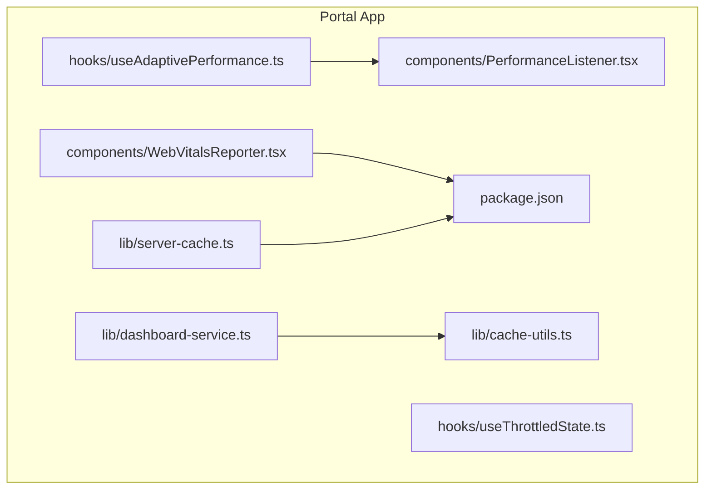
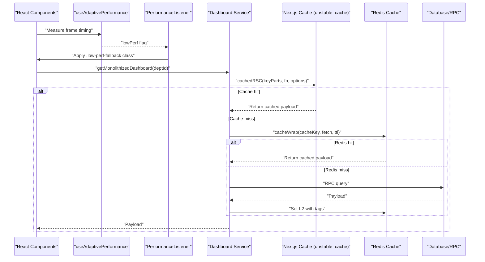
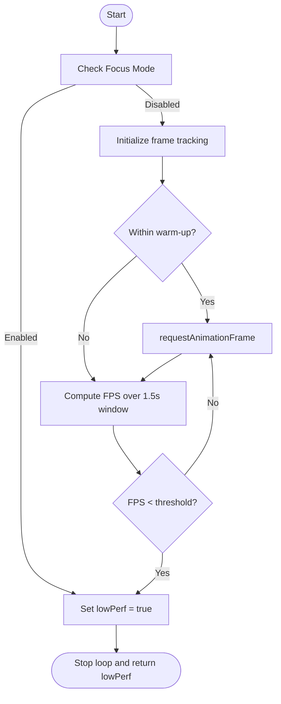
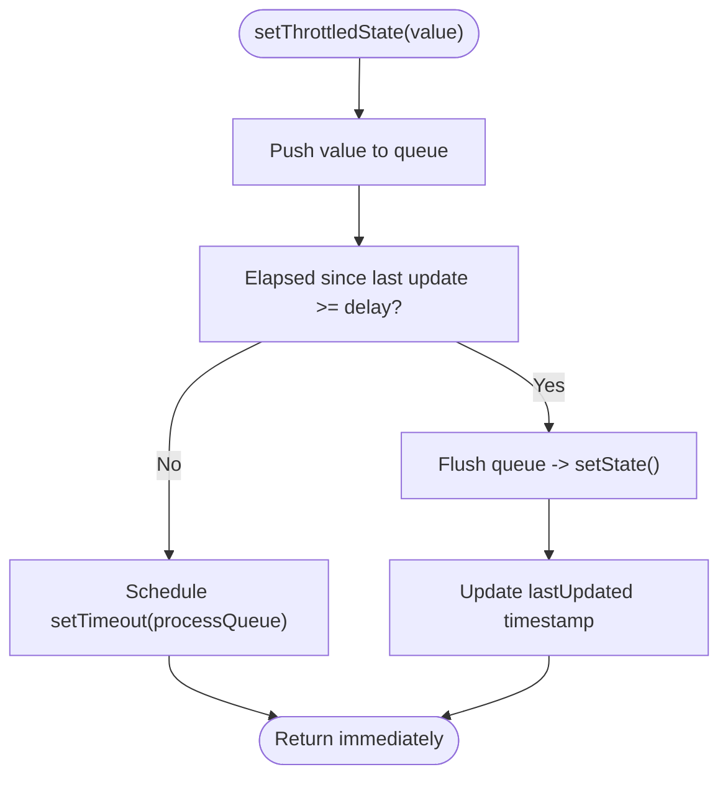
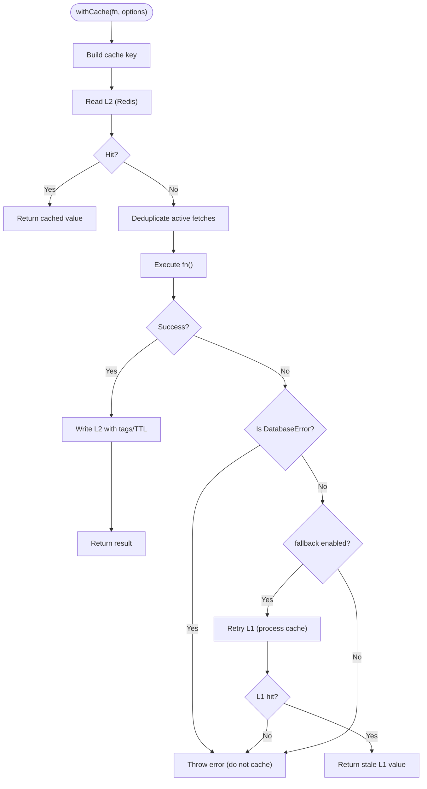
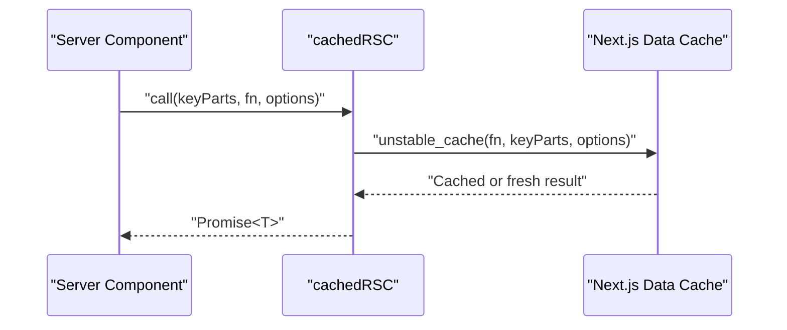
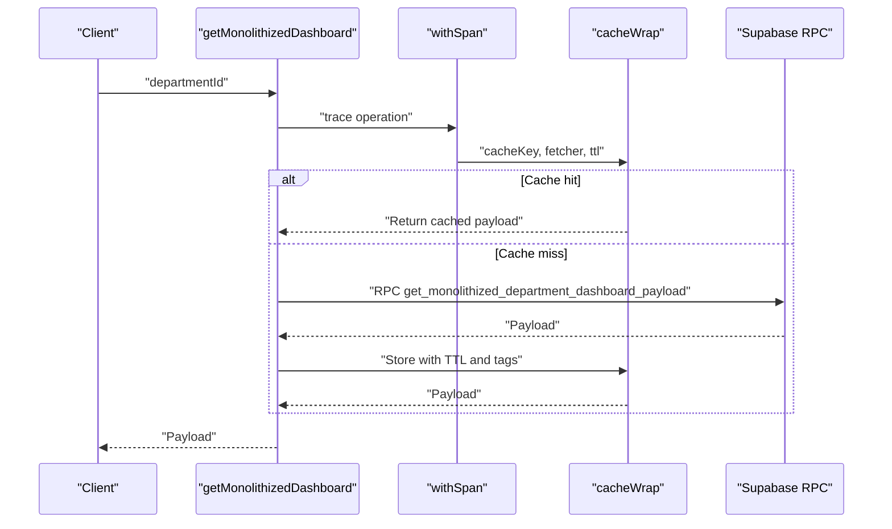
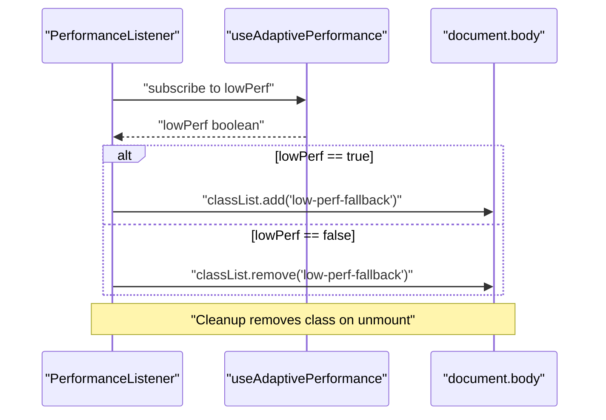
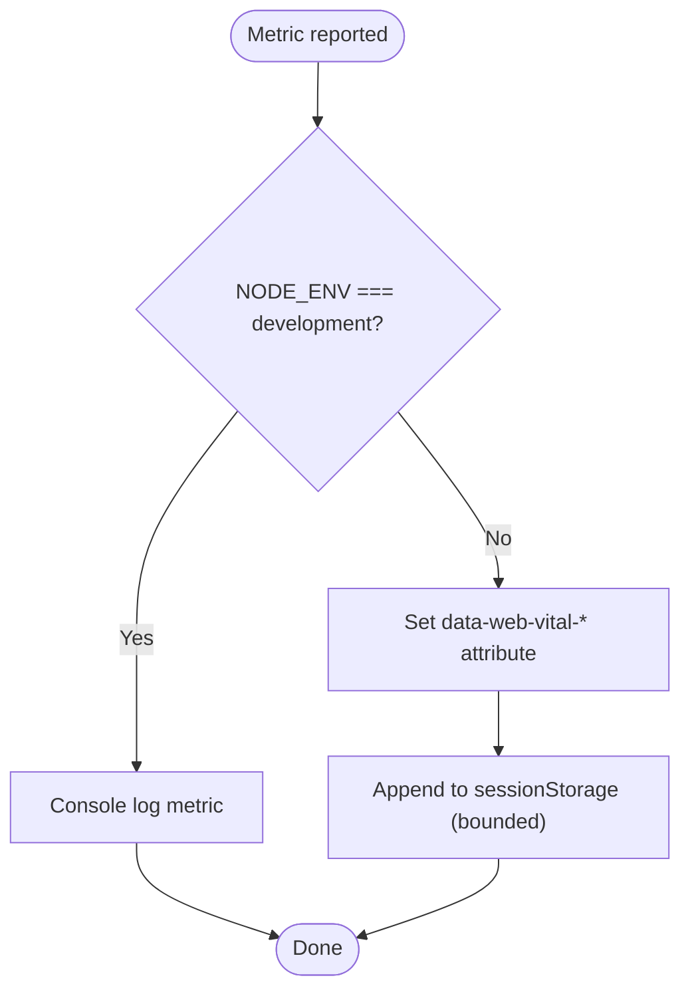
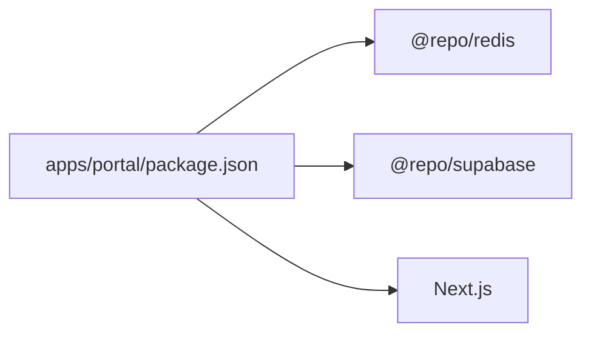

# Client-Side Caching

<cite>
**Referenced Files in This Document**
- [useAdaptivePerformance.ts](file://apps/portal/hooks/useAdaptivePerformance.ts)
- [useThrottledState.ts](file://apps/portal/hooks/useThrottledState.ts)
- [dashboard-service.ts](file://apps/portal/lib/dashboard-service.ts)
- [cache-utils.ts](file://apps/portal/lib/cache-utils.ts)
- [server-cache.ts](file://apps/portal/lib/server-cache.ts)
- [PerformanceListener.tsx](file://apps/portal/components/PerformanceListener.tsx)
- [WebVitalsReporter.tsx](file://apps/portal/components/WebVitalsReporter.tsx)
- [package.json](file://apps/portal/package.json)
</cite>

## Table of Contents
1. [Introduction](#introduction)
2. [Project Structure](#project-structure)
3. [Core Components](#core-components)
4. [Architecture Overview](#architecture-overview)
5. [Detailed Component Analysis](#detailed-component-analysis)
6. [Dependency Analysis](#dependency-analysis)
7. [Performance Considerations](#performance-considerations)
8. [Troubleshooting Guide](#troubleshooting-guide)
9. [Conclusion](#conclusion)

## Introduction
This document explains the client-side caching and performance optimization strategies implemented in the portal application. It covers:
- Adaptive performance hooks that adjust behavior based on device capabilities and runtime conditions
- Throttled state updates to prevent excessive re-renders
- Dashboard service caching patterns using server-side cache layers
- Browser storage utilization for metrics aggregation
- Integration with Next.js data caching for React Server Components
- Memory management considerations, cache size limits, and cleanup strategies for long-running applications

Where applicable, diagrams map directly to source files to clarify interactions and data flows.

## Project Structure
The relevant implementation is concentrated under apps/portal:
- Hooks for adaptive performance and throttled state
- Library utilities for server-side caching and Redis-backed caching
- Components that observe performance and report Web Vitals
- Package configuration indicating dependencies used by these features

**Diagram sources**
- [useAdaptivePerformance.ts:1-83](file://apps/portal/hooks/useAdaptivePerformance.ts#L1-L83)
- [useThrottledState.ts:1-67](file://apps/portal/hooks/useThrottledState.ts#L1-L67)
- [cache-utils.ts:1-79](file://apps/portal/lib/cache-utils.ts#L1-L79)
- [server-cache.ts:1-27](file://apps/portal/lib/server-cache.ts#L1-L27)
- [dashboard-service.ts:1-100](file://apps/portal/lib/dashboard-service.ts#L1-L100)
- [PerformanceListener.tsx:1-29](file://apps/portal/components/PerformanceListener.tsx#L1-L29)
- [WebVitalsReporter.tsx:1-66](file://apps/portal/components/WebVitalsReporter.tsx#L1-L66)
- [package.json:1-76](file://apps/portal/package.json#L1-L76)

**Section sources**
- [useAdaptivePerformance.ts:1-83](file://apps/portal/hooks/useAdaptivePerformance.ts#L1-L83)
- [useThrottledState.ts:1-67](file://apps/portal/hooks/useThrottledState.ts#L1-L67)
- [cache-utils.ts:1-79](file://apps/portal/lib/cache-utils.ts#L1-L79)
- [server-cache.ts:1-27](file://apps/portal/lib/server-cache.ts#L1-L27)
- [dashboard-service.ts:1-100](file://apps/portal/lib/dashboard-service.ts#L1-L100)
- [PerformanceListener.tsx:1-29](file://apps/portal/components/PerformanceListener.tsx#L1-L29)
- [WebVitalsReporter.tsx:1-66](file://apps/portal/components/WebVitalsReporter.tsx#L1-L66)
- [package.json:1-76](file://apps/portal/package.json#L1-L76)

## Core Components
- Adaptive Performance Hook: Measures frame timing and signals when to downgrade rendering quality or enable fallbacks.
- Throttled State Hook: Batches frequent state updates to reduce render churn while preserving functional transitions.
- Server Cache Utilities: Wraps fetch operations with a two-level cache (in-process and Redis), deduplicates concurrent requests, and handles graceful degradation.
- RSC Cache Wrapper: Integrates with Next.js unstable_cache for tag-based revalidation and TTL control.
- Dashboard Service: Provides a monolithized payload with short-lived server-side caching per department.
- Performance Listener: Applies CSS classes to the body when low performance is detected.
- Web Vitals Reporter: Collects and stores Core Web Vitals in sessionStorage and DOM attributes for monitoring.

**Section sources**
- [useAdaptivePerformance.ts:1-83](file://apps/portal/hooks/useAdaptivePerformance.ts#L1-L83)
- [useThrottledState.ts:1-67](file://apps/portal/hooks/useThrottledState.ts#L1-L67)
- [cache-utils.ts:1-79](file://apps/portal/lib/cache-utils.ts#L1-L79)
- [server-cache.ts:1-27](file://apps/portal/lib/server-cache.ts#L1-L27)
- [dashboard-service.ts:1-100](file://apps/portal/lib/dashboard-service.ts#L1-L100)
- [PerformanceListener.tsx:1-29](file://apps/portal/components/PerformanceListener.tsx#L1-L29)
- [WebVitalsReporter.tsx:1-66](file://apps/portal/components/WebVitalsReporter.tsx#L1-L66)

## Architecture Overview
The caching and performance system spans client and server boundaries:
- Client-side: Adaptive performance detection and throttled state updates minimize UI jank and unnecessary renders.
- Server-side: Next.js Data Cache and Redis-backed caches serve dashboard payloads quickly with short TTLs and tag-based invalidation.
- Observability: Web Vitals are collected and persisted in-browser for later scraping/reporting.

**Diagram sources**
- [useAdaptivePerformance.ts:1-83](file://apps/portal/hooks/useAdaptivePerformance.ts#L1-L83)
- [PerformanceListener.tsx:1-29](file://apps/portal/components/PerformanceListener.tsx#L1-L29)
- [dashboard-service.ts:1-100](file://apps/portal/lib/dashboard-service.ts#L1-L100)
- [cache-utils.ts:1-79](file://apps/portal/lib/cache-utils.ts#L1-L79)
- [server-cache.ts:1-27](file://apps/portal/lib/server-cache.ts#L1-L27)

## Detailed Component Analysis

### Adaptive Performance Hook
Purpose:
- Detect sustained low frame rates and signal components to adopt a lower-performance mode.
- Immediately trigger fallback when Focus Mode is enabled.

Behavior highlights:
- Uses requestAnimationFrame to sample frames over a rolling window.
- Ignores initial hydration lag via a warm-up period.
- Triggers fallback when average FPS drops below a threshold within the measurement window.

**Diagram sources**
- [useAdaptivePerformance.ts:1-83](file://apps/portal/hooks/useAdaptivePerformance.ts#L1-L83)

**Section sources**
- [useAdaptivePerformance.ts:1-83](file://apps/portal/hooks/useAdaptivePerformance.ts#L1-L83)

### Throttled State Hook
Purpose:
- Reduce render frequency by batching multiple state updates into a single update at most once per delay interval.
- Preserve functional updates so transformations like array appends remain correct.

Behavior highlights:
- Maintains an internal queue of pending updates.
- Schedules a flush after the remaining time until the next allowed tick.
- Clears timers on unmount to avoid leaks.

**Diagram sources**
- [useThrottledState.ts:1-67](file://apps/portal/hooks/useThrottledState.ts#L1-L67)

**Section sources**
- [useThrottledState.ts:1-67](file://apps/portal/hooks/useThrottledState.ts#L1-L67)

### Server Cache Utilities (withCache)
Purpose:
- Provide a robust caching wrapper around async functions with:
  - Key building and TTL lookup
  - In-process deduplication of concurrent requests
  - Graceful fallback when Redis is unreachable
  - Non-caching of database errors

Flow overview:
- Build key from category and parts.
- Attempt L2 (Redis) read; if hit, return immediately.
- If not found, ensure only one active fetch per key; others await it.
- On success, write result to L2 with tags and TTL.
- On failure:
  - DatabaseError is rethrown without caching.
  - With fallback enabled, retry L1 (process cache) before propagating error.

**Diagram sources**
- [cache-utils.ts:1-79](file://apps/portal/lib/cache-utils.ts#L1-L79)

**Section sources**
- [cache-utils.ts:1-79](file://apps/portal/lib/cache-utils.ts#L1-L79)

### Next.js RSC Cache Wrapper (cachedRSC)
Purpose:
- Wrap server-side data fetching with Next.js unstable_cache for tag-based revalidation and TTL control.

Usage pattern:
- Provide unique key parts and optional revalidate seconds and tags.
- Returns a Promise resolved from the Next.js Data Cache when available.

**Diagram sources**
- [server-cache.ts:1-27](file://apps/portal/lib/server-cache.ts#L1-L27)

**Section sources**
- [server-cache.ts:1-27](file://apps/portal/lib/server-cache.ts#L1-L27)

### Dashboard Service Caching Pattern
Purpose:
- Serve a highly optimized, monolithized dashboard payload per department.
- Authenticate once per call and cache the RPC result for a short TTL.

Caching strategy:
- Per-department cache key.
- Short TTL suitable for near-real-time dashboards.
- Tagging support via underlying cache utilities.

**Diagram sources**
- [dashboard-service.ts:1-100](file://apps/portal/lib/dashboard-service.ts#L1-L100)
- [cache-utils.ts:1-79](file://apps/portal/lib/cache-utils.ts#L1-L79)

**Section sources**
- [dashboard-service.ts:1-100](file://apps/portal/lib/dashboard-service.ts#L1-L100)
- [cache-utils.ts:1-79](file://apps/portal/lib/cache-utils.ts#L1-L79)

### Performance Listener Component
Purpose:
- Observe the adaptive performance hook and apply a CSS class to the document body to enable fallback styles.

Behavior:
- Adds/removes a class based on the low performance flag.
- Ensures cleanup on unmount.

**Diagram sources**
- [PerformanceListener.tsx:1-29](file://apps/portal/components/PerformanceListener.tsx#L1-L29)
- [useAdaptivePerformance.ts:1-83](file://apps/portal/hooks/useAdaptivePerformance.ts#L1-L83)

**Section sources**
- [PerformanceListener.tsx:1-29](file://apps/portal/components/PerformanceListener.tsx#L1-L29)
- [useAdaptivePerformance.ts:1-83](file://apps/portal/hooks/useAdaptivePerformance.ts#L1-L83)

### Web Vitals Reporter
Purpose:
- Collect Core Web Vitals and persist them for monitoring.
- Store entries in sessionStorage with bounded size to avoid memory growth.

Behavior highlights:
- Development: logs to console.
- Production: sets data attributes on body and accumulates recent values in sessionStorage.

**Diagram sources**
- [WebVitalsReporter.tsx:1-66](file://apps/portal/components/WebVitalsReporter.tsx#L1-L66)

**Section sources**
- [WebVitalsReporter.tsx:1-66](file://apps/portal/components/WebVitalsReporter.tsx#L1-L66)

## Dependency Analysis
- The portal depends on:
  - @repo/redis for cache utilities and TTL registry
  - @repo/supabase for tracing and server client integration
  - Next.js for Data Cache and Web Vitals reporting
  - Zustand for global state elsewhere in the app (not directly part of this caching layer)

**Diagram sources**
- [package.json:1-76](file://apps/portal/package.json#L1-L76)

**Section sources**
- [package.json:1-76](file://apps/portal/package.json#L1-L76)

## Performance Considerations
- Adaptive performance:
  - Use the low performance flag to disable heavy animations, reduce chart complexity, or switch to lighter visualizations.
- Throttled state:
  - Prefer useThrottledState for high-frequency updates (e.g., live metrics, scroll position) to limit re-renders.
- Server-side caching:
  - Keep TTLs short for real-time dashboards; leverage tags for targeted invalidation.
  - Ensure DatabaseError paths bypass caching to avoid serving stale failures.
- Browser storage:
  - Cap stored entries (as done for Web Vitals) to prevent unbounded growth.
- Cleanup:
  - Always clear timers and cancel animation frames to avoid leaks in long-running sessions.

[No sources needed since this section provides general guidance]

## Troubleshooting Guide
- Stale data after updates:
  - Verify tags are set on cache writes and that revalidateTag is invoked where appropriate.
- Frequent re-renders:
  - Confirm high-frequency state updates are routed through the throttled state hook.
- Low performance fallback not applied:
  - Ensure the PerformanceListener component is mounted and that the CSS class selector exists.
- Web Vitals missing:
  - Check that the reporter is mounted and that sessionStorage is available.
- Redis unavailable:
  - The withCache utility falls back to process cache or executes the function directly; monitor for increased latency and consider increasing TTLs or adding circuit breakers.

**Section sources**
- [cache-utils.ts:1-79](file://apps/portal/lib/cache-utils.ts#L1-L79)
- [PerformanceListener.tsx:1-29](file://apps/portal/components/PerformanceListener.tsx#L1-L29)
- [WebVitalsReporter.tsx:1-66](file://apps/portal/components/WebVitalsReporter.tsx#L1-L66)

## Conclusion
The portal implements a layered approach to client-side caching and performance:
- Adaptive detection and throttling keep the UI responsive under load.
- Server-side caching with short TTLs and tags ensures fast, consistent dashboard loads.
- Lightweight browser storage supports observability without impacting performance.
These patterns collectively improve perceived performance, reduce network pressure, and maintain stability in long-running sessions.

[No sources needed since this section summarizes without analyzing specific files]