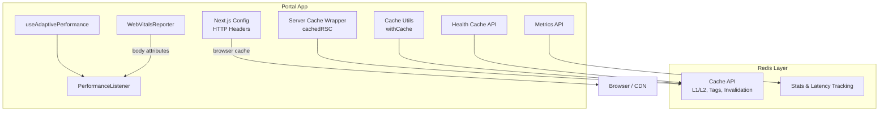
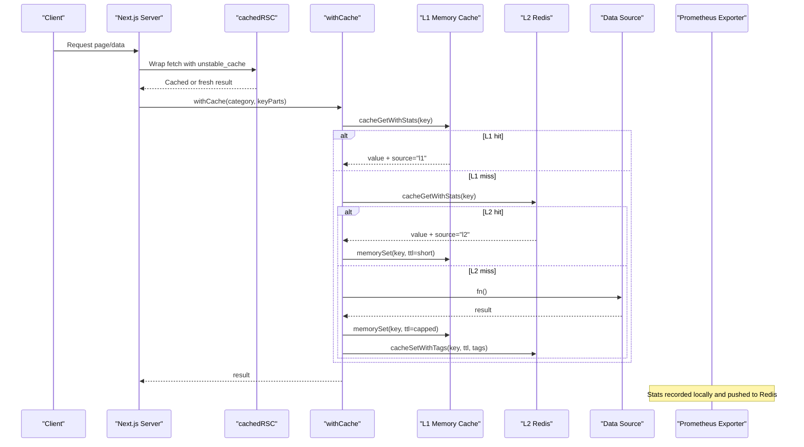
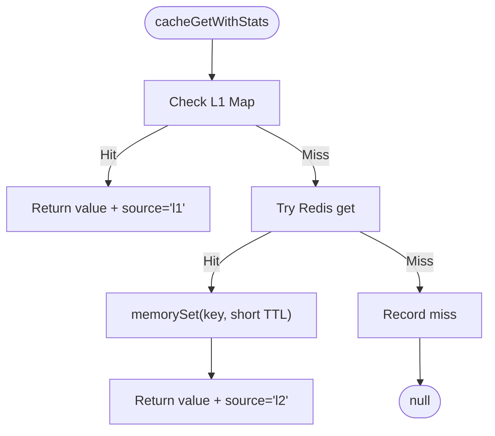
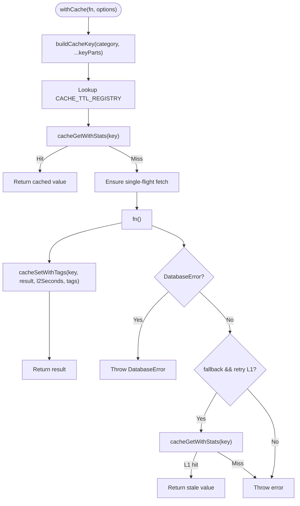
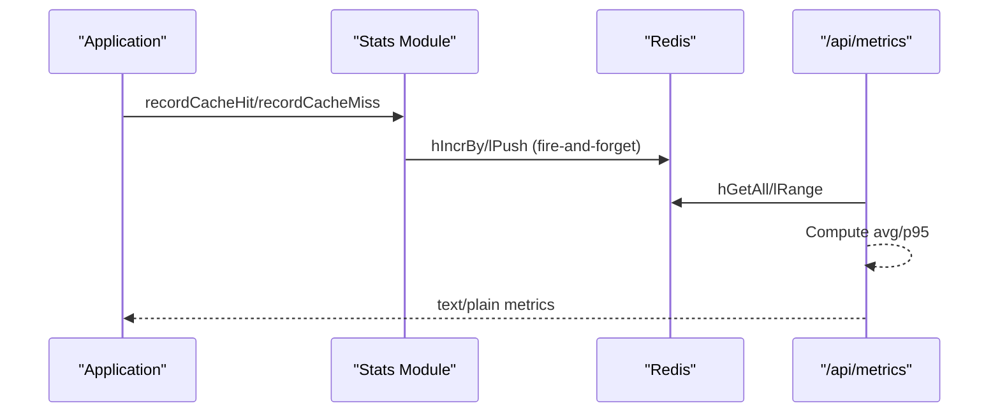
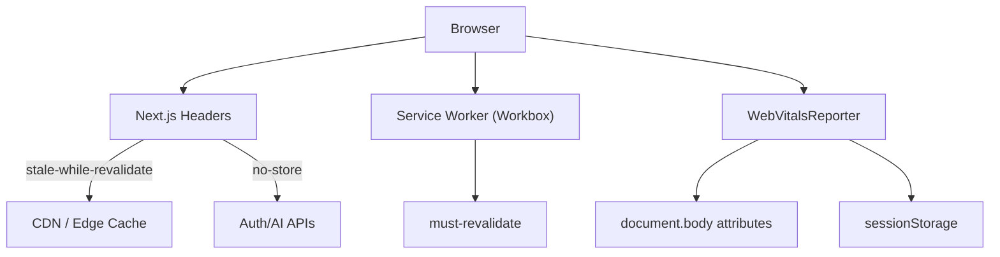
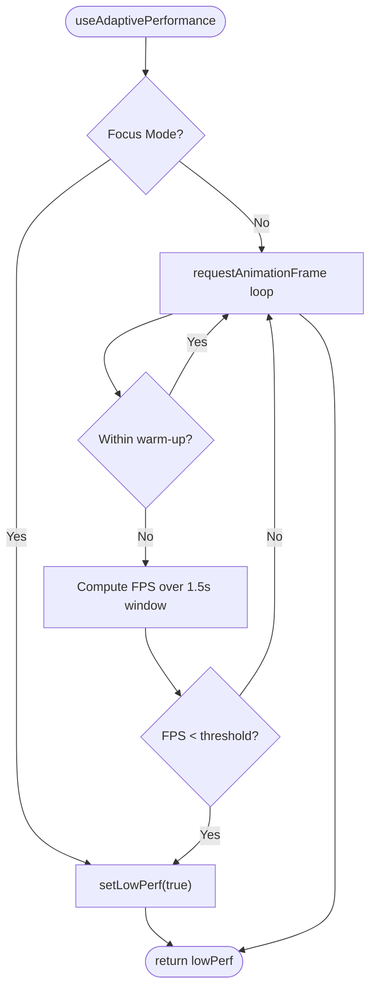
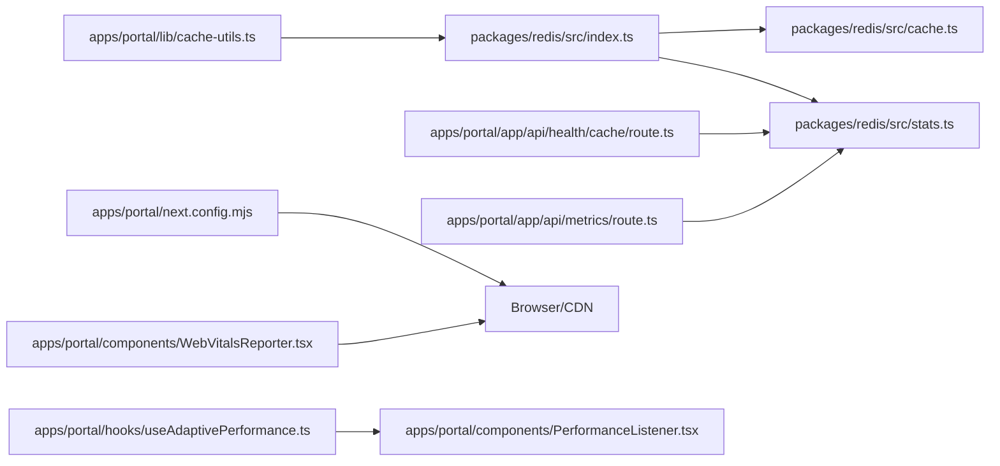

# Performance & Caching

<cite>
**Referenced Files in This Document**
- [cache.ts](file://packages/redis/src/cache.ts)
- [stats.ts](file://packages/redis/src/stats.ts)
- [index.ts](file://packages/redis/src/index.ts)
- [server-cache.ts](file://apps/portal/lib/server-cache.ts)
- [cache-utils.ts](file://apps/portal/lib/cache-utils.ts)
- [cache-utils.test.ts](file://apps/portal/lib/cache-utils.test.ts)
- [useAdaptivePerformance.ts](file://apps/portal/hooks/useAdaptivePerformance.ts)
- [PerformanceListener.tsx](file://apps/portal/components/PerformanceListener.tsx)
- [WebVitalsReporter.tsx](file://apps/portal/components/WebVitalsReporter.tsx)
- [route.ts (health cache)](file://apps/portal/app/api/health/cache/route.ts)
- [route.ts (metrics)](file://apps/portal/app/api/metrics/route.ts)
- [next.config.mjs](file://apps/portal/next.config.mjs)
</cite>

## Table of Contents
1. Introduction
2. Project Structure
3. Core Components
4. Architecture Overview
5. Detailed Component Analysis
6. Dependency Analysis
7. Performance Considerations
8. Troubleshooting Guide
9. Conclusion

## Introduction
This document explains the multi-level caching strategy and performance optimization techniques implemented across the application. It covers:
- Server-side caching with Next.js Data Cache and Redis-backed L1/L2 layers
- Client-side caching strategies via HTTP headers and service worker considerations
- Adaptive performance system that adjusts rendering behavior based on device capability and frame rate
- Cache invalidation, single-flight request coalescing, and monitoring approaches
- Performance profiling tools, bottleneck identification, and optimization recommendations
- Memory management, cache size limits, and distributed caching considerations for production

## Project Structure
The caching and performance features are implemented across a few key areas:
- Shared Redis client and cache layer under packages/redis
- Portal-specific server-side cache wrappers and utilities
- Client-side adaptive performance hooks and components
- Metrics endpoints exposing Prometheus-compatible metrics
- Next.js configuration for HTTP caching headers

**Diagram sources**
- [server-cache.ts:1-27](file://apps/portal/lib/server-cache.ts#L1-L27)
- [cache-utils.ts:1-78](file://apps/portal/lib/cache-utils.ts#L1-L78)
- [cache.ts:1-269](file://packages/redis/src/cache.ts#L1-L269)
- [stats.ts:1-169](file://packages/redis/src/stats.ts#L1-L169)
- [route.ts (health cache):1-27](file://apps/portal/app/api/health/cache/route.ts#L1-L27)
- [route.ts (metrics):1-92](file://apps/portal/app/api/metrics/route.ts#L1-L92)
- [useAdaptivePerformance.ts:1-83](file://apps/portal/hooks/useAdaptivePerformance.ts#L1-L83)
- [PerformanceListener.tsx:1-29](file://apps/portal/components/PerformanceListener.tsx#L1-L29)
- [WebVitalsReporter.tsx:1-66](file://apps/portal/components/WebVitalsReporter.tsx#L1-L66)
- [next.config.mjs:126-166](file://apps/portal/next.config.mjs#L126-L166)

**Section sources**
- [server-cache.ts:1-27](file://apps/portal/lib/server-cache.ts#L1-L27)
- [cache-utils.ts:1-78](file://apps/portal/lib/cache-utils.ts#L1-L78)
- [cache.ts:1-269](file://packages/redis/src/cache.ts#L1-L269)
- [stats.ts:1-169](file://packages/redis/src/stats.ts#L1-L169)
- [route.ts (health cache):1-27](file://apps/portal/app/api/health/cache/route.ts#L1-L27)
- [route.ts (metrics):1-92](file://apps/portal/app/api/metrics/route.ts#L1-L92)
- [useAdaptivePerformance.ts:1-83](file://apps/portal/hooks/useAdaptivePerformance.ts#L1-L83)
- [PerformanceListener.tsx:1-29](file://apps/portal/components/PerformanceListener.tsx#L1-L29)
- [WebVitalsReporter.tsx:1-66](file://apps/portal/components/WebVitalsReporter.tsx#L1-L66)
- [next.config.mjs:126-166](file://apps/portal/next.config.mjs#L126-L166)

## Core Components
- Server-side data cache wrapper for React Server Components using Next.js unstable_cache with tags-based revalidation.
- Portal cache utility providing category-based TTLs, single-flight coalescing, and graceful degradation when Redis is unavailable.
- Redis-backed two-layer cache:
  - L1: In-memory Map with TTL and simple eviction at capacity
  - L2: Redis with write-through and tag-based indexing for invalidation
- Monitoring and metrics:
  - Local and Redis-backed counters for hits, misses, errors, and latency percentiles
  - Prometheus-style metrics endpoint aggregating cache and other observability signals
- Adaptive performance:
  - Client hook measuring frame timing to detect sustained low FPS
  - Listener component toggling CSS fallback class on body
  - Web Vitals reporter attaching metric values to DOM and sessionStorage

**Section sources**
- [server-cache.ts:1-27](file://apps/portal/lib/server-cache.ts#L1-L27)
- [cache-utils.ts:1-78](file://apps/portal/lib/cache-utils.ts#L1-L78)
- [cache.ts:1-269](file://packages/redis/src/cache.ts#L1-L269)
- [stats.ts:1-169](file://packages/redis/src/stats.ts#L1-L169)
- [route.ts (metrics):1-92](file://apps/portal/app/api/metrics/route.ts#L1-L92)
- [useAdaptivePerformance.ts:1-83](file://apps/portal/hooks/useAdaptivePerformance.ts#L1-L83)
- [PerformanceListener.tsx:1-29](file://apps/portal/components/PerformanceListener.tsx#L1-L29)
- [WebVitalsReporter.tsx:1-66](file://apps/portal/components/WebVitalsReporter.tsx#L1-L66)

## Architecture Overview
The system implements a layered caching architecture:
- Next.js Data Cache for server-side rendering and route-level caching
- Application-level L1 (in-process memory) and L2 (Redis) caches
- Tag-based invalidation and prefix-based cleanup
- Single-flight request coalescing to reduce thundering herds
- Prometheus metrics for cache health and latency
- Client-side adaptive rendering and Web Vitals reporting

**Diagram sources**
- [server-cache.ts:1-27](file://apps/portal/lib/server-cache.ts#L1-L27)
- [cache-utils.ts:1-78](file://apps/portal/lib/cache-utils.ts#L1-L78)
- [cache.ts:1-269](file://packages/redis/src/cache.ts#L1-L269)
- [stats.ts:1-169](file://packages/redis/src/stats.ts#L1-L169)

## Detailed Component Analysis

### Server-Side Caching with Next.js Data Cache
- Purpose: Provide fast server-rendered responses with tag-based revalidation.
- Behavior:
  - Wraps async functions with unstable_cache
  - Supports revalidate TTL and tags for targeted invalidation
  - Enforces non-empty key parts to avoid collisions
- Usage pattern:
  - Call cachedRSC with unique key parts and optional revalidate/tags
  - Use revalidateTag from Next.js to invalidate by tag

**Section sources**
- [server-cache.ts:1-27](file://apps/portal/lib/server-cache.ts#L1-L27)

### Redis Integration: L1/L2 Cache, Coalescing, and Invalidation
- L1 (In-Memory):
  - Map-based store with TTL per entry
  - Simple eviction policy when exceeding capacity
  - Short TTL cap on writes to limit memory footprint
- L2 (Redis):
  - Write-through on cacheSet
  - Tag indexing for invalidation by tags or prefixes
  - Graceful degradation if Redis is unreachable
- Coalescing:
  - Active fetches map prevents duplicate concurrent computations
- Invalidation:
  - Tag-based index mapping keys to tags
  - Prefix-based invalidation for bulk cleanup
  - L1-only eviction helper for middleware scenarios

**Diagram sources**
- [cache.ts:75-150](file://packages/redis/src/cache.ts#L75-L150)

**Section sources**
- [cache.ts:1-269](file://packages/redis/src/cache.ts#L1-L269)
- [index.ts:1-28](file://packages/redis/src/index.ts#L1-L28)

### Portal Cache Utility: Category-Based TTL and Fallbacks
- Builds keys from category and key parts
- Looks up TTL registry for L2 TTL; uses short TTL for L1
- On cache miss: executes function, then writes to L1 and L2
- Error handling:
  - DatabaseError is not cached and rethrown immediately
  - If fallback enabled and initial lookup missed L2 due to Redis error, retries L1 once
- Single-flight coalescing within the portal layer

**Diagram sources**
- [cache-utils.ts:1-78](file://apps/portal/lib/cache-utils.ts#L1-L78)

**Section sources**
- [cache-utils.ts:1-78](file://apps/portal/lib/cache-utils.ts#L1-L78)
- [cache-utils.test.ts:1-86](file://apps/portal/lib/cache-utils.test.ts#L1-L86)

### Cache Invalidation Strategies
- Tag-based invalidation:
  - Associate keys with tags on write
  - Invalidate all keys by tag set
- Prefix-based invalidation:
  - Bulk delete matching keys in Redis and L1
- L1-only eviction:
  - Useful in middleware where Redis may be unavailable

**Section sources**
- [cache.ts:176-260](file://packages/redis/src/cache.ts#L176-L260)

### Cache Warming Techniques
- Warm-up workflows can pre-populate high-value keys during deployment or scheduled jobs.
- Recommended approach:
  - Identify hot categories and keys
  - Execute data fetchers and write to cache with appropriate TTLs
  - Optionally use tags to enable rapid invalidation post-warmup

[No sources needed since this section provides general guidance]

### Monitoring Approaches and Metrics
- Local stats:
  - Counters for hits, misses, L1/L2 hits, Redis errors
  - Sliding window of latencies for average and p95 computation
- Redis-backed stats:
  - Hash for counters and list for recent latencies
  - Fire-and-forget updates to avoid impacting request latency
- Health endpoint:
  - Returns status, hit rate, and Redis connectivity
- Prometheus exporter:
  - Aggregates cache metrics and additional observability signals

**Diagram sources**
- [stats.ts:59-169](file://packages/redis/src/stats.ts#L59-L169)
- [route.ts (metrics):1-92](file://apps/portal/app/api/metrics/route.ts#L1-L92)
- [route.ts (health cache):1-27](file://apps/portal/app/api/health/cache/route.ts#L1-L27)

**Section sources**
- [stats.ts:1-169](file://packages/redis/src/stats.ts#L1-L169)
- [route.ts (metrics):1-92](file://apps/portal/app/api/metrics/route.ts#L1-L92)
- [route.ts (health cache):1-27](file://apps/portal/app/api/health/cache/route.ts#L1-L27)

### Client-Side Caching and Browser Storage
- HTTP caching headers configured in Next.js:
  - Stale-while-revalidate for login page
  - Public caching for health endpoint
  - Private no-store for auth and AI APIs
- Service Worker considerations:
  - Workbox script served with must-revalidate
- Web Vitals reporting:
  - Attaches metric values to body attributes
  - Accumulates last N entries in sessionStorage per metric

**Diagram sources**
- [next.config.mjs:126-166](file://apps/portal/next.config.mjs#L126-L166)
- [WebVitalsReporter.tsx:1-66](file://apps/portal/components/WebVitalsReporter.tsx#L1-L66)

**Section sources**
- [next.config.mjs:126-166](file://apps/portal/next.config.mjs#L126-L166)
- [WebVitalsReporter.tsx:1-66](file://apps/portal/components/WebVitalsReporter.tsx#L1-L66)

### Adaptive Performance System
- Frame timing measurement:
  - Uses requestAnimationFrame to track deltas
  - Ignores hydration warm-up period
  - Triggers fallback when average FPS < threshold over a sliding window
- Focus Mode integration:
  - Immediately engages fallback when enabled
- UI adaptation:
  - Toggles CSS class on body to downgrade animations/effects

**Diagram sources**
- [useAdaptivePerformance.ts:1-83](file://apps/portal/hooks/useAdaptivePerformance.ts#L1-L83)
- [PerformanceListener.tsx:1-29](file://apps/portal/components/PerformanceListener.tsx#L1-L29)

**Section sources**
- [useAdaptivePerformance.ts:1-83](file://apps/portal/hooks/useAdaptivePerformance.ts#L1-L83)
- [PerformanceListener.tsx:1-29](file://apps/portal/components/PerformanceListener.tsx#L1-L29)

## Dependency Analysis
- The portal’s cache utilities depend on the shared Redis package for L1/L2 operations and stats recording.
- Health and metrics endpoints depend on Redis stats and client availability.
- Next.js config influences browser and edge caching behavior.
- Client components rely on hooks and global DOM/session storage for performance adaptation and metrics.

**Diagram sources**
- [cache-utils.ts:1-78](file://apps/portal/lib/cache-utils.ts#L1-L78)
- [index.ts:1-28](file://packages/redis/src/index.ts#L1-L28)
- [cache.ts:1-269](file://packages/redis/src/cache.ts#L1-L269)
- [stats.ts:1-169](file://packages/redis/src/stats.ts#L1-L169)
- [route.ts (health cache):1-27](file://apps/portal/app/api/health/cache/route.ts#L1-L27)
- [route.ts (metrics):1-92](file://apps/portal/app/api/metrics/route.ts#L1-L92)
- [next.config.mjs:126-166](file://apps/portal/next.config.mjs#L126-L166)
- [useAdaptivePerformance.ts:1-83](file://apps/portal/hooks/useAdaptivePerformance.ts#L1-L83)
- [PerformanceListener.tsx:1-29](file://apps/portal/components/PerformanceListener.tsx#L1-L29)
- [WebVitalsReporter.tsx:1-66](file://apps/portal/components/WebVitalsReporter.tsx#L1-L66)

**Section sources**
- [cache-utils.ts:1-78](file://apps/portal/lib/cache-utils.ts#L1-L78)
- [index.ts:1-28](file://packages/redis/src/index.ts#L1-L28)
- [cache.ts:1-269](file://packages/redis/src/cache.ts#L1-L269)
- [stats.ts:1-169](file://packages/redis/src/stats.ts#L1-L169)
- [route.ts (health cache):1-27](file://apps/portal/app/api/health/cache/route.ts#L1-L27)
- [route.ts (metrics):1-92](file://apps/portal/app/api/metrics/route.ts#L1-L92)
- [next.config.mjs:126-166](file://apps/portal/next.config.mjs#L126-L166)
- [useAdaptivePerformance.ts:1-83](file://apps/portal/hooks/useAdaptivePerformance.ts#L1-L83)
- [PerformanceListener.tsx:1-29](file://apps/portal/components/PerformanceListener.tsx#L1-L29)
- [WebVitalsReporter.tsx:1-66](file://apps/portal/components/WebVitalsReporter.tsx#L1-L66)

## Performance Considerations
- Cache sizing and memory management:
  - L1 capacity capped; entries evicted when full
  - L1 TTL capped on writes to prevent unbounded memory growth
  - Prefer short L1 TTLs for hot paths and longer L2 TTLs for durability
- Distributed caching:
  - L1 is process-local; ensure horizontal scaling does not bypass L1 benefits
  - Use Redis for cross-process consistency and invalidation
- Request coalescing:
  - Prevents thundering herds on cache misses
- Observability:
  - Track hit rates, misses, and latency percentiles
  - Alert on elevated Redis errors and low hit rates
- Client-side adaptation:
  - Downgrade heavy effects on low-FPS devices
  - Use Web Vitals to identify bottlenecks and regressions

[No sources needed since this section provides general guidance]

## Troubleshooting Guide
- Symptoms:
  - High miss rate or rising Redis errors
  - Elevated p95 latency
  - Degraded user experience on low-end devices
- Actions:
  - Inspect /api/health/cache for Redis connectivity and hit rate
  - Review /api/metrics for cache counters and latency trends
  - Validate tag and prefix invalidation flows after schema changes
  - Confirm L1 eviction thresholds and TTL caps align with workload patterns
  - Enable focus mode testing to verify fallback behavior
  - Use Web Vitals attributes and sessionStorage to correlate client-side issues

**Section sources**
- [route.ts (health cache):1-27](file://apps/portal/app/api/health/cache/route.ts#L1-L27)
- [route.ts (metrics):1-92](file://apps/portal/app/api/metrics/route.ts#L1-L92)
- [cache.ts:1-269](file://packages/redis/src/cache.ts#L1-L269)
- [useAdaptivePerformance.ts:1-83](file://apps/portal/hooks/useAdaptivePerformance.ts#L1-L83)
- [WebVitalsReporter.tsx:1-66](file://apps/portal/components/WebVitalsReporter.tsx#L1-L66)

## Conclusion
The application employs a robust multi-level caching strategy combining Next.js Data Cache, in-memory L1, and Redis-backed L2 with tag-based invalidation and single-flight coalescing. Monitoring and metrics provide visibility into cache health and latency, while the adaptive performance system ensures responsive UX across diverse devices. For production deployments, prioritize correct TTL tuning, consistent invalidation, and observability-driven iteration to maintain optimal performance.