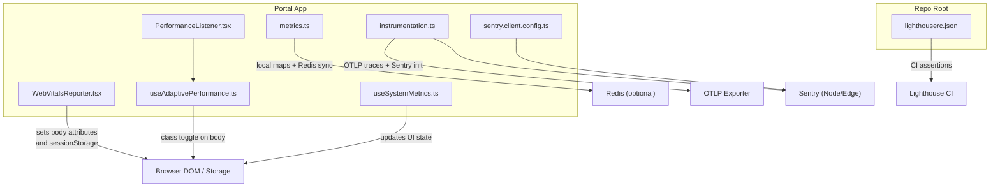
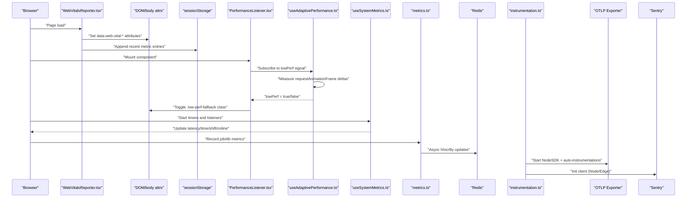
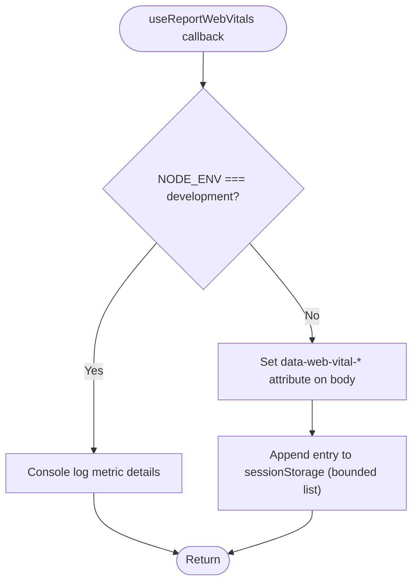
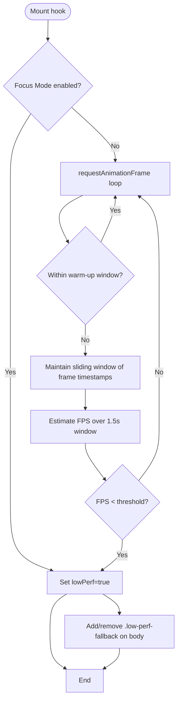
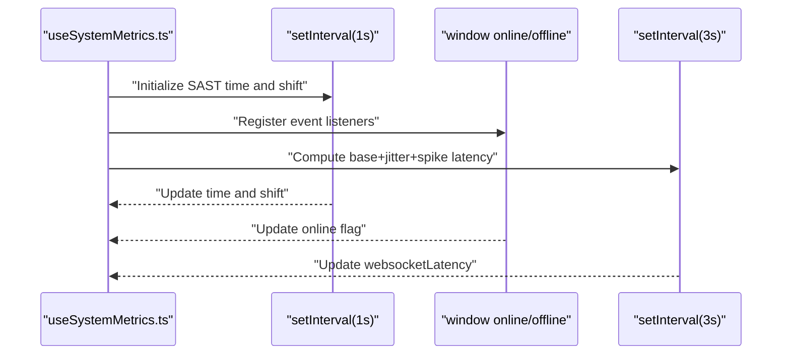
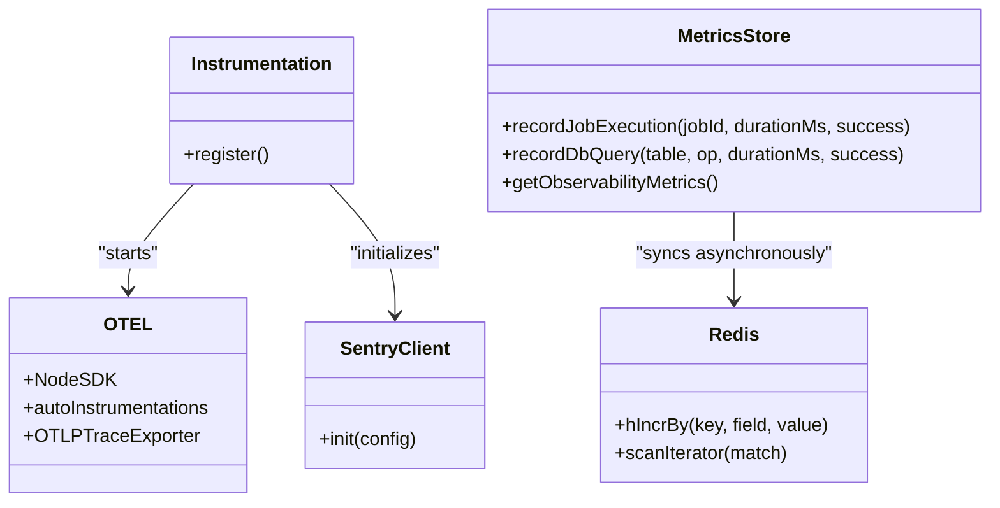
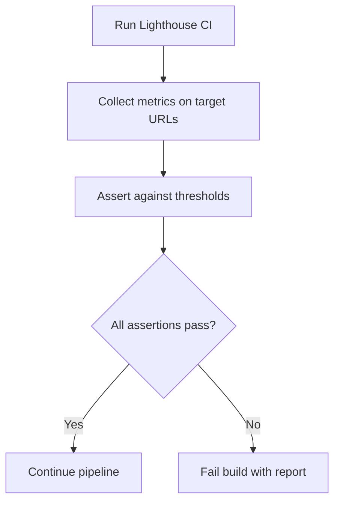
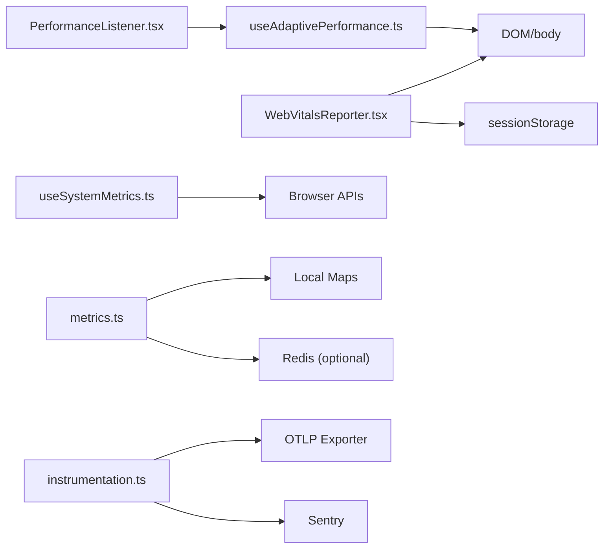

# Performance Monitoring & Profiling

<cite>
**Referenced Files in This Document**
- [WebVitalsReporter.tsx](file://apps/portal/components/WebVitalsReporter.tsx)
- [PerformanceListener.tsx](file://apps/portal/components/PerformanceListener.tsx)
- [useAdaptivePerformance.ts](file://apps/portal/hooks/useAdaptivePerformance.ts)
- [useSystemMetrics.ts](file://apps/portal/hooks/useSystemMetrics.ts)
- [metrics.ts](file://apps/portal/lib/observability/metrics.ts)
- [instrumentation.ts](file://apps/portal/instrumentation.ts)
- [sentry.client.config.ts](file://apps/portal/sentry.client.config.ts)
- [lighthouserc.json](file://lighthouserc.json)
</cite>

## Table of Contents
1. [Introduction](#introduction)
2. [Project Structure](#project-structure)
3. [Core Components](#core-components)
4. [Architecture Overview](#architecture-overview)
5. [Detailed Component Analysis](#detailed-component-analysis)
6. [Dependency Analysis](#dependency-analysis)
7. [Performance Considerations](#performance-considerations)
8. [Troubleshooting Guide](#troubleshooting-guide)
9. [Conclusion](#conclusion)
10. [Appendices](#appendices)

## Introduction
This document explains the performance monitoring and profiling capabilities integrated into the application. It covers:
- Web Vitals reporting for Core Web Vitals metrics
- Custom performance listeners for application-specific metrics
- System metrics collection hooks
- Server-side observability (OpenTelemetry and Sentry)
- CI performance budgets via Lighthouse
- Techniques for bottleneck identification, regression detection, dashboards/alerting setup, A/B testing strategies, and continuous performance monitoring

## Project Structure
The performance-related code is primarily located under the portal app with supporting configuration at the repository root.

**Diagram sources**
- [WebVitalsReporter.tsx:1-66](file://apps/portal/components/WebVitalsReporter.tsx#L1-L66)
- [PerformanceListener.tsx:1-29](file://apps/portal/components/PerformanceListener.tsx#L1-L29)
- [useAdaptivePerformance.ts:1-83](file://apps/portal/hooks/useAdaptivePerformance.ts#L1-L83)
- [useSystemMetrics.ts:1-107](file://apps/portal/hooks/useSystemMetrics.ts#L1-L107)
- [metrics.ts:1-184](file://apps/portal/lib/observability/metrics.ts#L1-L184)
- [instrumentation.ts:1-61](file://apps/portal/instrumentation.ts#L1-L61)
- [sentry.client.config.ts:1-23](file://apps/portal/sentry.client.config.ts#L1-L23)
- [lighthouserc.json:1-37](file://lighthouserc.json#L1-L37)

**Section sources**
- [WebVitalsReporter.tsx:1-66](file://apps/portal/components/WebVitalsReporter.tsx#L1-L66)
- [PerformanceListener.tsx:1-29](file://apps/portal/components/PerformanceListener.tsx#L1-L29)
- [useAdaptivePerformance.ts:1-83](file://apps/portal/hooks/useAdaptivePerformance.ts#L1-L83)
- [useSystemMetrics.ts:1-107](file://apps/portal/hooks/useSystemMetrics.ts#L1-L107)
- [metrics.ts:1-184](file://apps/portal/lib/observability/metrics.ts#L1-L184)
- [instrumentation.ts:1-61](file://apps/portal/instrumentation.ts#L1-L61)
- [sentry.client.config.ts:1-23](file://apps/portal/sentry.client.config.ts#L1-L23)
- [lighthouserc.json:1-37](file://lighthouserc.json#L1-L37)

## Core Components
- Web Vitals Reporter: Captures Core Web Vitals in production by stamping data attributes on the body and aggregating recent samples in sessionStorage; logs in development.
- Adaptive Performance Listener: Measures frame timing to detect sustained low FPS and toggles a CSS class to enable fallback rendering paths.
- System Metrics Hook: Tracks simulated websocket latency, server time in SAST, current shift, and online status.
- Observability Metrics: Records job and database operation durations and error counts locally and synchronizes to Redis when available.
- OpenTelemetry and Sentry: Initializes tracing and error tracking across Node and Edge runtimes; exports traces via OTLP.
- Lighthouse CI: Enforces performance budgets and thresholds in CI.

**Section sources**
- [WebVitalsReporter.tsx:1-66](file://apps/portal/components/WebVitalsReporter.tsx#L1-L66)
- [PerformanceListener.tsx:1-29](file://apps/portal/components/PerformanceListener.tsx#L1-L29)
- [useAdaptivePerformance.ts:1-83](file://apps/portal/hooks/useAdaptivePerformance.ts#L1-L83)
- [useSystemMetrics.ts:1-107](file://apps/portal/hooks/useSystemMetrics.ts#L1-L107)
- [metrics.ts:1-184](file://apps/portal/lib/observability/metrics.ts#L1-L184)
- [instrumentation.ts:1-61](file://apps/portal/instrumentation.ts#L1-L61)
- [sentry.client.config.ts:1-23](file://apps/portal/sentry.client.config.ts#L1-L23)
- [lighthouserc.json:1-37](file://lighthouserc.json#L1-L37)

## Architecture Overview
End-to-end flow from browser metrics to storage and visualization:

**Diagram sources**
- [WebVitalsReporter.tsx:1-66](file://apps/portal/components/WebVitalsReporter.tsx#L1-L66)
- [PerformanceListener.tsx:1-29](file://apps/portal/components/PerformanceListener.tsx#L1-L29)
- [useAdaptivePerformance.ts:1-83](file://apps/portal/hooks/useAdaptivePerformance.ts#L1-L83)
- [useSystemMetrics.ts:1-107](file://apps/portal/hooks/useSystemMetrics.ts#L1-L107)
- [metrics.ts:1-184](file://apps/portal/lib/observability/metrics.ts#L1-L184)
- [instrumentation.ts:1-61](file://apps/portal/instrumentation.ts#L1-L61)

## Detailed Component Analysis

### Web Vitals Reporting
- Purpose: Capture Core Web Vitals (e.g., LCP, CLS, FCP, TTFB, INP) without external network calls.
- Behavior:
  - Development: console logging for quick inspection.
  - Production: writes `data-web-vital-*` attributes to `<body>` for scraping by monitoring tools; maintains last N samples per metric in sessionStorage.
- Integration points:
  - Scrapers can read body attributes or session storage to feed dashboards.
  - No backend writes; designed to be lightweight.

**Diagram sources**
- [WebVitalsReporter.tsx:1-66](file://apps/portal/components/WebVitalsReporter.tsx#L1-L66)

**Section sources**
- [WebVitalsReporter.tsx:1-66](file://apps/portal/components/WebVitalsReporter.tsx#L1-L66)

### Adaptive Performance Listener
- Purpose: Detect sustained low frame rates and apply a CSS-based fallback strategy.
- Logic:
  - Warm-up period to ignore hydration lag.
  - Sliding window of frames to estimate FPS; if below threshold for a sustained period, mark low performance.
  - If Focus Mode is enabled, immediately trigger fallback.
- Side effects:
  - Adds/removes `.low-perf-fallback` class on `<body>` to drive CSS-level optimizations.

**Diagram sources**
- [useAdaptivePerformance.ts:1-83](file://apps/portal/hooks/useAdaptivePerformance.ts#L1-L83)
- [PerformanceListener.tsx:1-29](file://apps/portal/components/PerformanceListener.tsx#L1-L29)

**Section sources**
- [useAdaptivePerformance.ts:1-83](file://apps/portal/hooks/useAdaptivePerformance.ts#L1-L83)
- [PerformanceListener.tsx:1-29](file://apps/portal/components/PerformanceListener.tsx#L1-L29)

### System Metrics Hook
- Purpose: Provide runtime system signals for UI and analytics.
- Signals:
  - Simulated websocket latency with jitter and occasional spikes.
  - Server time in SAST.
  - Current operational shift calculation.
  - Online/offline status via browser events.
- Usage: Suitable for HUD displays and operational awareness.

**Diagram sources**
- [useSystemMetrics.ts:1-107](file://apps/portal/hooks/useSystemMetrics.ts#L1-L107)

**Section sources**
- [useSystemMetrics.ts:1-107](file://apps/portal/hooks/useSystemMetrics.ts#L1-L107)

### Server-Side Observability (OpenTelemetry + Sentry)
- OpenTelemetry:
  - Dynamically imports Node SDK and auto-instrumentations when an OTLP endpoint is configured.
  - Exports traces via OTLP HTTP exporter.
- Sentry:
  - Initialized for Node and Edge runtimes with environment-aware sampling.
  - Client config includes PII filtering for exceptions.
- Database metrics:
  - Local in-process maps aggregate counts, errors, and total duration for jobs and DB operations.
  - Async synchronization to Redis using hash fields for aggregation.

**Diagram sources**
- [instrumentation.ts:1-61](file://apps/portal/instrumentation.ts#L1-L61)
- [sentry.client.config.ts:1-23](file://apps/portal/sentry.client.config.ts#L1-L23)
- [metrics.ts:1-184](file://apps/portal/lib/observability/metrics.ts#L1-L184)

**Section sources**
- [instrumentation.ts:1-61](file://apps/portal/instrumentation.ts#L1-L61)
- [sentry.client.config.ts:1-23](file://apps/portal/sentry.client.config.ts#L1-L23)
- [metrics.ts:1-184](file://apps/portal/lib/observability/metrics.ts#L1-L184)

### CI Performance Budgets (Lighthouse)
- Configuration enforces minimum category scores and maximum numeric thresholds for key metrics.
- Targets multiple routes to ensure broad coverage.
- Integrates into CI pipelines to block regressions based on defined budgets.

**Diagram sources**
- [lighthouserc.json:1-37](file://lighthouserc.json#L1-L37)

**Section sources**
- [lighthouserc.json:1-37](file://lighthouserc.json#L1-L37)

## Dependency Analysis
- Client components depend on React hooks and browser APIs (requestAnimationFrame, sessionStorage, DOM).
- Server instrumentation depends on optional OTLP exporter and Sentry initialization.
- Metrics store depends on optional Redis availability; gracefully falls back to local memory.

**Diagram sources**
- [WebVitalsReporter.tsx:1-66](file://apps/portal/components/WebVitalsReporter.tsx#L1-L66)
- [PerformanceListener.tsx:1-29](file://apps/portal/components/PerformanceListener.tsx#L1-L29)
- [useAdaptivePerformance.ts:1-83](file://apps/portal/hooks/useAdaptivePerformance.ts#L1-L83)
- [useSystemMetrics.ts:1-107](file://apps/portal/hooks/useSystemMetrics.ts#L1-L107)
- [metrics.ts:1-184](file://apps/portal/lib/observability/metrics.ts#L1-L184)
- [instrumentation.ts:1-61](file://apps/portal/instrumentation.ts#L1-L61)

**Section sources**
- [WebVitalsReporter.tsx:1-66](file://apps/portal/components/WebVitalsReporter.tsx#L1-L66)
- [PerformanceListener.tsx:1-29](file://apps/portal/components/PerformanceListener.tsx#L1-L29)
- [useAdaptivePerformance.ts:1-83](file://apps/portal/hooks/useAdaptivePerformance.ts#L1-L83)
- [useSystemMetrics.ts:1-107](file://apps/portal/hooks/useSystemMetrics.ts#L1-L107)
- [metrics.ts:1-184](file://apps/portal/lib/observability/metrics.ts#L1-L184)
- [instrumentation.ts:1-61](file://apps/portal/instrumentation.ts#L1-L61)

## Performance Considerations
- Keep Web Vitals reporter lightweight: avoid network calls; rely on DOM attributes and sessionStorage for scraping.
- Adaptive performance: tune warm-up and FPS thresholds to balance false positives and responsiveness.
- Metrics store: prefer Redis-backed aggregation in multi-instance deployments; use fire-and-forget updates to avoid blocking hot paths.
- Tracing: adjust sample rates for production to control overhead while retaining visibility.
- Lighthouse budgets: set realistic thresholds aligned with user experience goals; expand URL coverage as features grow.

[No sources needed since this section provides general guidance]

## Troubleshooting Guide
- Web Vitals not appearing:
  - Verify that the reporter is mounted and that body attributes are present in production builds.
  - Check sessionStorage availability and capacity limits.
- Adaptive fallback not triggering:
  - Confirm focus mode behavior and frame measurement logic; inspect whether warm-up window is masking early issues.
- System metrics stale:
  - Ensure intervals are running and event listeners are attached; verify timezone and shift computation.
- Missing server metrics:
  - Validate Redis connectivity; confirm async sync paths are not failing silently.
- Traces not exported:
  - Ensure OTLP endpoint is configured and Node SDK starts only in Node runtime.
- Errors not captured:
  - Confirm Sentry DSN and environment variables; check PII filtering rules.

**Section sources**
- [WebVitalsReporter.tsx:1-66](file://apps/portal/components/WebVitalsReporter.tsx#L1-L66)
- [useAdaptivePerformance.ts:1-83](file://apps/portal/hooks/useAdaptivePerformance.ts#L1-L83)
- [useSystemMetrics.ts:1-107](file://apps/portal/hooks/useSystemMetrics.ts#L1-L107)
- [metrics.ts:1-184](file://apps/portal/lib/observability/metrics.ts#L1-L184)
- [instrumentation.ts:1-61](file://apps/portal/instrumentation.ts#L1-L61)
- [sentry.client.config.ts:1-23](file://apps/portal/sentry.client.config.ts#L1-L23)

## Conclusion
The application integrates a comprehensive performance monitoring stack:
- Client-side Web Vitals and adaptive rendering controls provide immediate insights and automatic fallbacks.
- System metrics hooks support operational dashboards.
- Server-side tracing and error tracking offer deep diagnostics.
- CI budgets enforce quality gates.
Together, these pieces enable proactive bottleneck identification, regression detection, and continuous performance improvement.

[No sources needed since this section summarizes without analyzing specific files]

## Appendices

### Monitoring Dashboards Setup
- Data sources:
  - Body attributes and sessionStorage for Web Vitals scraping.
  - Redis keys for job and DB metrics summaries.
  - OTLP traces for distributed tracing.
- Visualization:
  - Use a dashboard tool to scrape body attributes/session storage, query Redis, and visualize OTLP traces.
- Example queries:
  - Job metrics: count, errors, average duration per job ID.
  - DB metrics: count, errors, average duration per table:operation.
  - Web Vitals: latest values from body attributes or aggregated from session storage.

[No sources needed since this section provides general guidance]

### Alerting Configurations
- Error rate alerts:
  - Trigger on elevated error counts from job or DB metrics.
- Latency alerts:
  - Alert when average DB or job durations exceed thresholds.
- Web Vitals alerts:
  - Alert when LCP/CLS/TTFB/INP breach budgeted thresholds.
- Trace anomalies:
  - Alert on increased p95/p99 latencies or error spans.

[No sources needed since this section provides general guidance]

### Performance Budget Enforcement
- Define budgets in Lighthouse CI for critical routes and metrics.
- Gate merges on passing budgets; publish reports for review.
- Periodically revisit thresholds based on real-world baselines.

**Section sources**
- [lighthouserc.json:1-37](file://lighthouserc.json#L1-L37)

### Production Performance Analysis
- Use OTLP traces to identify slow endpoints and database queries.
- Correlate Web Vitals spikes with deployment changes.
- Review Redis-backed metrics for long-tail latency and error trends.
- Inspect Sentry for crash patterns and regressions.

**Section sources**
- [instrumentation.ts:1-61](file://apps/portal/instrumentation.ts#L1-L61)
- [metrics.ts:1-184](file://apps/portal/lib/observability/metrics.ts#L1-L184)
- [sentry.client.config.ts:1-23](file://apps/portal/sentry.client.config.ts#L1-L23)

### A/B Testing for Performance Improvements
- Feature flags to toggle heavy UI elements or animations.
- Measure impact via Web Vitals and adaptive performance signals.
- Compare distributions across variants using dashboards.

[No sources needed since this section provides general guidance]

### Continuous Performance Monitoring Strategies
- Integrate Lighthouse CI into PR checks.
- Maintain rolling dashboards for Web Vitals, job/DB metrics, and traces.
- Establish alerting policies tied to budgets and SLOs.
- Regularly audit thresholds and refine adaptive performance parameters.

[No sources needed since this section provides general guidance]