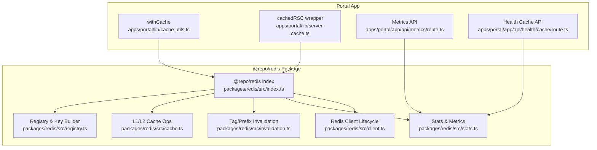
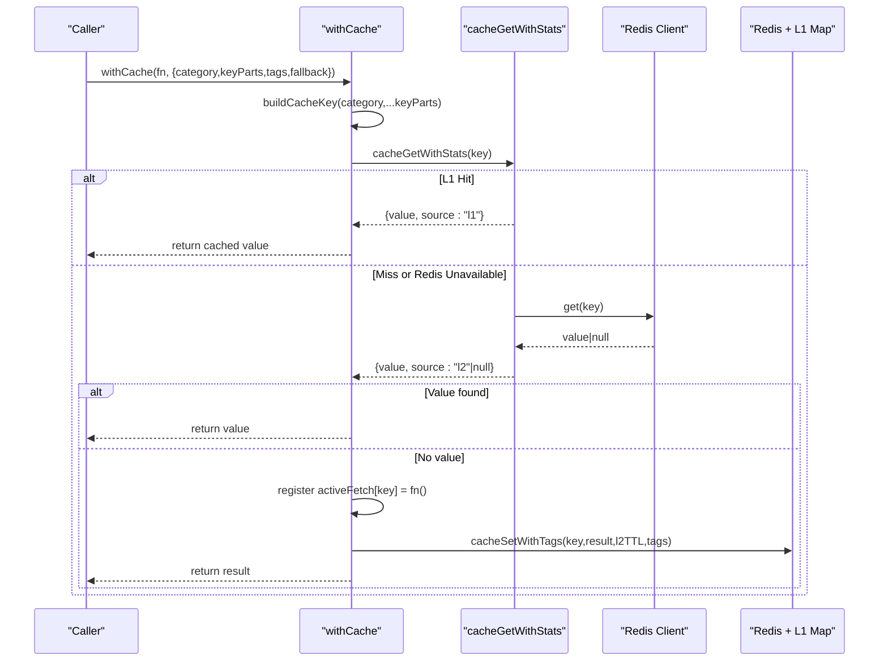
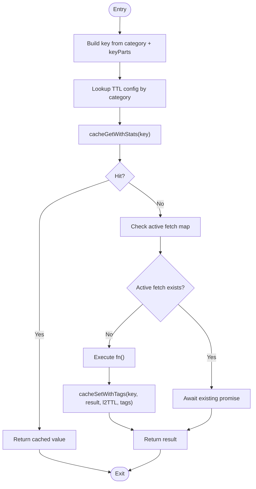
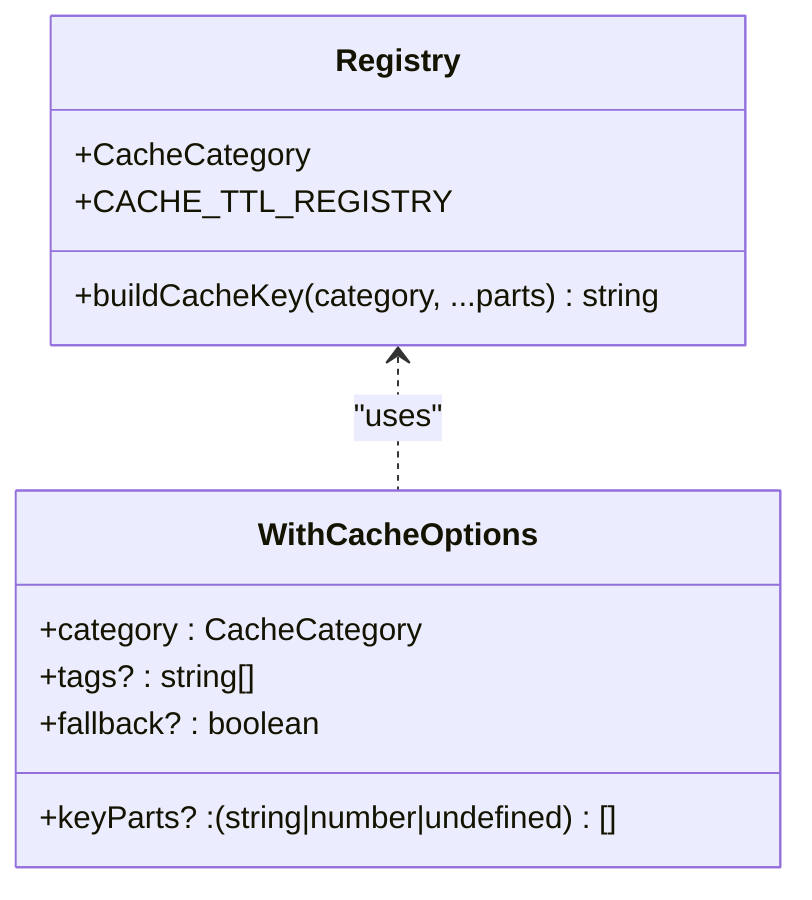
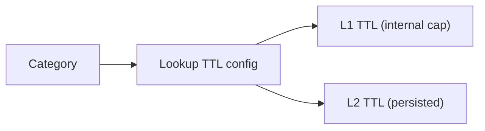
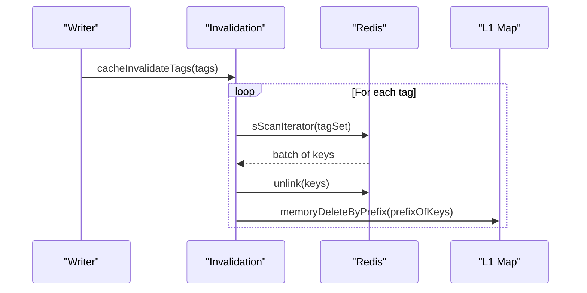
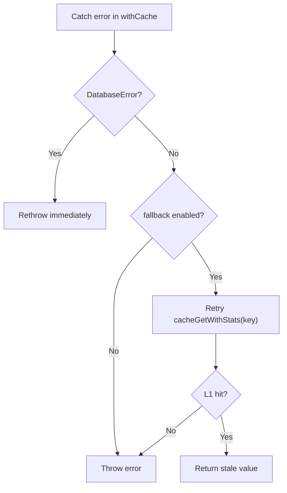
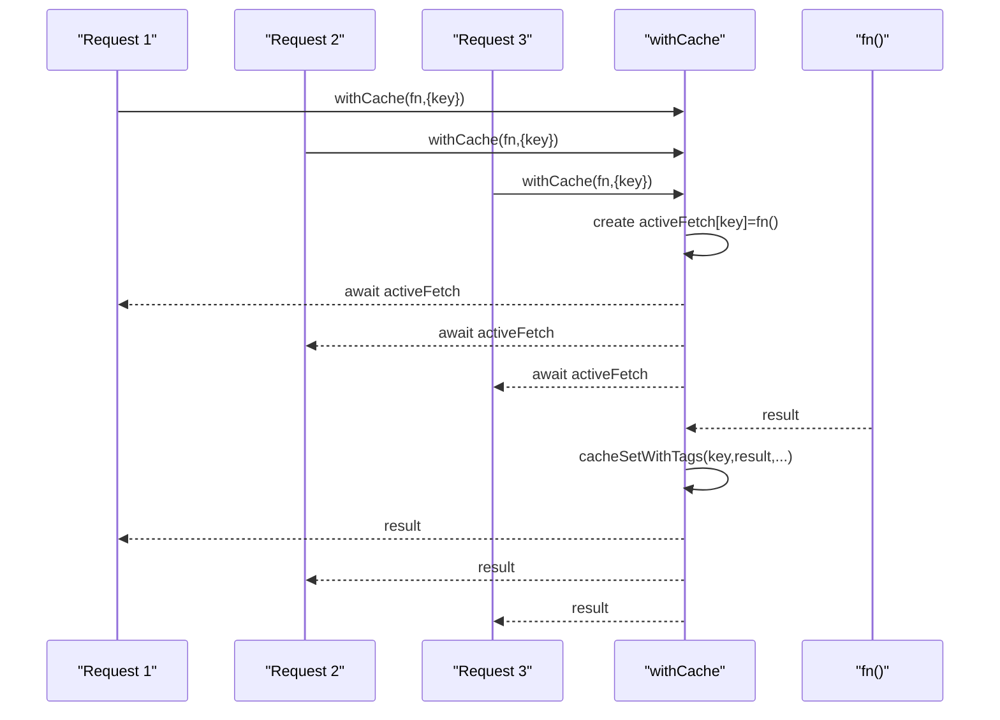
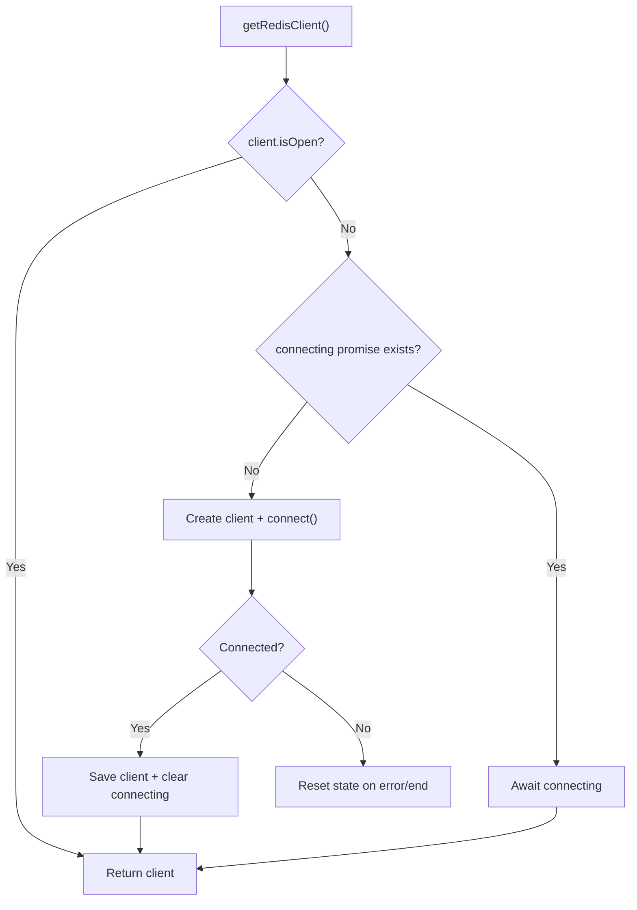
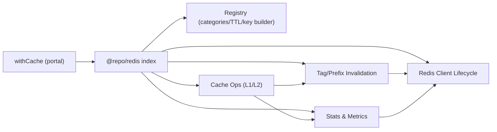

# Server-Side Caching

<cite>
**Referenced Files in This Document**
- [cache-utils.ts](file://apps/portal/lib/cache-utils.ts)
- [cache-utils.test.ts](file://apps/portal/lib/cache-utils.test.ts)
- [server-cache.ts](file://apps/portal/lib/server-cache.ts)
- [cache.ts](file://packages/redis/src/cache.ts)
- [client.ts](file://packages/redis/src/client.ts)
- [registry.ts](file://packages/redis/src/registry.ts)
- [invalidation.ts](file://packages/redis/src/invalidation.ts)
- [stats.ts](file://packages/redis/src/stats.ts)
- [index.ts](file://packages/redis/src/index.ts)
- [route.ts](file://apps/portal/app/api/metrics/route.ts)
- [route.ts](file://apps/portal/app/api/health/cache/route.ts)
</cite>

## Table of Contents
1. [Introduction](#introduction)
2. [Project Structure](#project-structure)
3. [Core Components](#core-components)
4. [Architecture Overview](#architecture-overview)
5. [Detailed Component Analysis](#detailed-component-analysis)
6. [Dependency Analysis](#dependency-analysis)
7. [Performance Considerations](#performance-considerations)
8. [Troubleshooting Guide](#troubleshooting-guide)
9. [Conclusion](#conclusion)

## Introduction
This document explains the server-side caching implementation with a multi-level architecture: L1 (in-memory) and L2 (Redis). It covers the withCache utility, cache key generation, TTL management via CACHE_TTL_REGISTRY, tag-based invalidation, error handling patterns (including DatabaseError propagation), fallback behavior when Redis is unreachable, and active fetch deduplication to prevent thundering herd problems. Configuration options for categories, key parts construction, and tag-based invalidation strategies are also detailed.

## Project Structure
The caching system spans two main areas:
- Portal application layer: high-level utilities and Next.js integration
- Shared Redis package: L1/L2 cache logic, client lifecycle, tagging/invalidation, and metrics

**Diagram sources**
- [cache-utils.ts:1-79](file://apps/portal/lib/cache-utils.ts#L1-L79)
- [server-cache.ts:1-27](file://apps/portal/lib/server-cache.ts#L1-L27)
- [index.ts:1-28](file://packages/redis/src/index.ts#L1-L28)
- [registry.ts:1-34](file://packages/redis/src/registry.ts#L1-L34)
- [cache.ts:1-269](file://packages/redis/src/cache.ts#L1-L269)
- [invalidation.ts:1-114](file://packages/redis/src/invalidation.ts#L1-L114)
- [stats.ts:1-169](file://packages/redis/src/stats.ts#L1-L169)
- [client.ts:1-67](file://packages/redis/src/client.ts#L1-L67)
- [route.ts:1-30](file://apps/portal/app/api/metrics/route.ts#L1-L30)
- [route.ts:1-27](file://apps/portal/app/api/health/cache/route.ts#L1-L27)

**Section sources**
- [cache-utils.ts:1-79](file://apps/portal/lib/cache-utils.ts#L1-L79)
- [server-cache.ts:1-27](file://apps/portal/lib/server-cache.ts#L1-L27)
- [index.ts:1-28](file://packages/redis/src/index.ts#L1-L28)

## Core Components
- withCache: Portal-specific wrapper that builds keys, resolves TTLs from registry, performs L1/L2 reads, executes fn on miss, writes back with tags, deduplicates concurrent calls, and applies fallback/error policies.
- Registry: Defines cache categories and per-category TTLs; provides deterministic key builder.
- L1/L2 Cache: L1 is an in-memory Map with TTL and simple eviction; L2 is Redis with safe client access. Reads check L1 then L2; writes propagate to both layers.
- Tagging and Invalidation: Keys can be associated with tags stored as Redis Sets; invalidation uses SSCAN/UNLINK and clears matching L1 entries.
- Stats and Observability: Tracks hits/misses by layer, Redis errors, and latency percentiles; exposed via APIs.
- Client Lifecycle: Singleton Redis client with reconnection and single-flight connect to avoid thundering herd at connection time.

**Section sources**
- [cache-utils.ts:1-79](file://apps/portal/lib/cache-utils.ts#L1-L79)
- [registry.ts:1-34](file://packages/redis/src/registry.ts#L1-L34)
- [cache.ts:1-269](file://packages/redis/src/cache.ts#L1-L269)
- [invalidation.ts:1-114](file://packages/redis/src/invalidation.ts#L1-L114)
- [stats.ts:1-169](file://packages/redis/src/stats.ts#L1-L169)
- [client.ts:1-67](file://packages/redis/src/client.ts#L1-L67)

## Architecture Overview
The multi-level cache prioritizes low-latency reads via L1, falls back to L2 (Redis), and persists results write-through. Tags enable targeted invalidation. The system includes robust error handling and request coalescing.

**Diagram sources**
- [cache-utils.ts:30-78](file://apps/portal/lib/cache-utils.ts#L30-L78)
- [cache.ts:119-150](file://packages/redis/src/cache.ts#L119-L150)
- [cache.ts:179-189](file://packages/redis/src/cache.ts#L179-L189)
- [registry.ts:27-33](file://packages/redis/src/registry.ts#L27-L33)

## Detailed Component Analysis

### withCache Utility
Responsibilities:
- Key construction using buildCacheKey(category, ...keyParts)
- TTL resolution from CACHE_TTL_REGISTRY[category]
- Read path: L1 first, then L2; returns immediately on hit
- Write path: execute fn on miss, persist with cacheSetWithTags using l2Seconds and optional tags
- Active fetch deduplication: Map keyed by cache key ensures only one fn execution per key
- Error handling:
  - DatabaseError is rethrown without caching
  - On generic error with fallback enabled, retries L1 once to serve stale data if available
  - If Redis was unreachable during initial read, the flow still attempts fn and may fall back to L1 after error

**Diagram sources**
- [cache-utils.ts:30-78](file://apps/portal/lib/cache-utils.ts#L30-L78)
- [registry.ts:27-33](file://packages/redis/src/registry.ts#L27-L33)
- [cache.ts:179-189](file://packages/redis/src/cache.ts#L179-L189)

**Section sources**
- [cache-utils.ts:1-79](file://apps/portal/lib/cache-utils.ts#L1-L79)
- [cache-utils.test.ts:1-86](file://apps/portal/lib/cache-utils.test.ts#L1-L86)

### Cache Key Generation Strategy
- Categories are defined centrally and typed to ensure correctness.
- Keys are built deterministically: prefix arch:<category>:<parts...>, filtering undefined parts.
- This strategy supports consistent scoping and predictable invalidation by prefix/tag.

**Diagram sources**
- [registry.ts:1-34](file://packages/redis/src/registry.ts#L1-L34)
- [cache-utils.ts:10-15](file://apps/portal/lib/cache-utils.ts#L10-L15)

**Section sources**
- [registry.ts:1-34](file://packages/redis/src/registry.ts#L1-L34)

### TTL Management via CACHE_TTL_REGISTRY
- Each category defines separate L1 and L2 TTLs.
- withCache uses the category’s l2Seconds for L2 persistence; L1 TTL is capped internally by the cache layer.
- This allows tuning freshness vs. performance per domain.

**Diagram sources**
- [registry.ts:18-25](file://packages/redis/src/registry.ts#L18-L25)
- [cache.ts:156-174](file://packages/redis/src/cache.ts#L156-L174)
- [cache-utils.ts:36-37](file://apps/portal/lib/cache-utils.ts#L36-L37)

**Section sources**
- [registry.ts:18-25](file://packages/redis/src/registry.ts#L18-L25)
- [cache.ts:156-174](file://packages/redis/src/cache.ts#L156-L174)
- [cache-utils.ts:36-37](file://apps/portal/lib/cache-utils.ts#L36-L37)

### Tag-Based Invalidation System
- When writing values, optional tags are indexed in Redis sets under a dedicated namespace.
- Invalidation scans tag sets and deletes associated keys non-blockingly; it also evicts matching L1 entries.
- Prefix-based invalidation is supported for bulk operations.

**Diagram sources**
- [invalidation.ts:17-33](file://packages/redis/src/invalidation.ts#L17-L33)
- [invalidation.ts:40-72](file://packages/redis/src/invalidation.ts#L40-L72)
- [cache.ts:50-56](file://packages/redis/src/cache.ts#L50-L56)

**Section sources**
- [invalidation.ts:1-114](file://packages/redis/src/invalidation.ts#L1-L114)
- [cache.ts:50-56](file://packages/redis/src/cache.ts#L50-L56)

### Error Handling Patterns
- DatabaseError propagation: withCache detects DatabaseError and rethrows without caching, ensuring transient DB issues do not poison caches.
- Fallback mechanism: on generic error with fallback enabled, withCache retries L1 to serve potentially fresh-enough data before failing.
- Redis unavailability: cacheGetWithStats and cacheSet gracefully handle missing Redis client, recording stats and returning null or skipping L2 writes while preserving L1.

**Diagram sources**
- [cache-utils.ts:58-77](file://apps/portal/lib/cache-utils.ts#L58-L77)
- [cache.ts:119-150](file://packages/redis/src/cache.ts#L119-L150)

**Section sources**
- [cache-utils.ts:58-77](file://apps/portal/lib/cache-utils.ts#L58-L77)
- [cache.ts:119-150](file://packages/redis/src/cache.ts#L119-L150)

### Active Fetch Deduplication (Single-Flight)
- withCache maintains an in-process Map of active promises keyed by cache key.
- Concurrent requests for the same key await the same underlying computation, preventing thundering herd on fn and downstream systems.
- Tests verify that multiple concurrent calls resolve to the same result and invoke fn exactly once.

**Diagram sources**
- [cache-utils.ts:45-56](file://apps/portal/lib/cache-utils.ts#L45-L56)
- [cache-utils.test.ts:54-85](file://apps/portal/lib/cache-utils.test.ts#L54-L85)

**Section sources**
- [cache-utils.ts:45-56](file://apps/portal/lib/cache-utils.ts#L45-L56)
- [cache-utils.test.ts:54-85](file://apps/portal/lib/cache-utils.test.ts#L54-L85)

### Redis Client Lifecycle and Connection Coalescing
- The singleton client prevents concurrent connection storms by awaiting a single connecting promise.
- On error/end events, state resets so subsequent callers retry.
- This complements function-level deduplication to mitigate thundering herd at both compute and connection levels.

**Diagram sources**
- [client.ts:16-54](file://packages/redis/src/client.ts#L16-L54)

**Section sources**
- [client.ts:1-67](file://packages/redis/src/client.ts#L1-L67)

### Next.js Integration (RSC Cache Wrapper)
- cachedRSC wraps Next.js unstable_cache for React Server Components, enabling tag-based revalidation alongside the custom L1/L2 cache.
- Useful for server-rendered data paths where Next.js Data Cache semantics apply.

**Section sources**
- [server-cache.ts:1-27](file://apps/portal/lib/server-cache.ts#L1-L27)

## Dependency Analysis
High-level dependencies between modules:

**Diagram sources**
- [index.ts:1-28](file://packages/redis/src/index.ts#L1-L28)
- [cache-utils.ts:1-79](file://apps/portal/lib/cache-utils.ts#L1-L79)
- [cache.ts:1-269](file://packages/redis/src/cache.ts#L1-L269)
- [invalidation.ts:1-114](file://packages/redis/src/invalidation.ts#L1-L114)
- [stats.ts:1-169](file://packages/redis/src/stats.ts#L1-L169)
- [client.ts:1-67](file://packages/redis/src/client.ts#L1-L67)

**Section sources**
- [index.ts:1-28](file://packages/redis/src/index.ts#L1-L28)

## Performance Considerations
- L1 in-memory cache minimizes latency for hot paths; short TTLs reduce memory pressure.
- L2 Redis provides cross-process sharing and durability; write-through ensures consistency.
- Request coalescing reduces redundant computations and downstream load spikes.
- Non-blocking invalidation (SSCAN/UNLINK) avoids Redis contention during bulk deletions.
- Metrics capture hit rates, misses, Redis errors, and latency percentiles for observability.

## Troubleshooting Guide
Common scenarios and guidance:
- Low hit rate or high misses:
  - Verify category TTL configuration and key construction to ensure stable keys.
  - Inspect metrics endpoint for hit/miss ratios and p95 latency.
- Frequent Redis errors:
  - Health endpoint reports redisConnected status; investigate REDIS_URL and network connectivity.
  - Stats record redisErrors; monitor trends and consider increasing retry/backoff or circuit-breaking.
- Stale data after updates:
  - Ensure tags are attached on writes and invalidated on mutations.
  - Use tag-based invalidation for precise scope; use prefix invalidation for broader sweeps.
- Thundering herd symptoms:
  - Confirm withCache is used around expensive functions and that keys are unique per resource.
  - Validate client-level connection coalescing is active.

Operational endpoints:
- Metrics: exposes cache counters and latency metrics.
- Health: returns cache hit rate and Redis connectivity status.

**Section sources**
- [route.ts:1-30](file://apps/portal/app/api/metrics/route.ts#L1-L30)
- [route.ts:1-27](file://apps/portal/app/api/health/cache/route.ts#L1-L27)
- [stats.ts:120-169](file://packages/redis/src/stats.ts#L120-L169)

## Conclusion
The server-side caching system combines fast L1 in-memory storage with durable L2 Redis backing, governed by category-driven TTLs and tag-based invalidation. The withCache utility centralizes key building, single-flight deduplication, and resilient error handling, including graceful degradation when Redis is unavailable. Together with Next.js RSC caching and comprehensive metrics, this design delivers scalable, observable, and maintainable server-side performance.