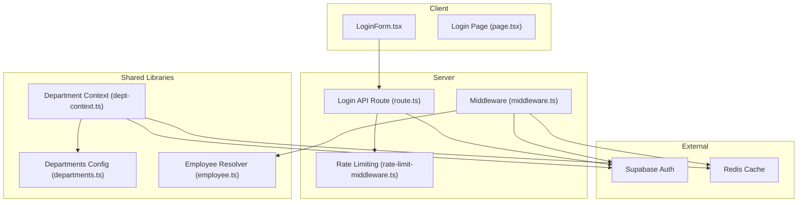
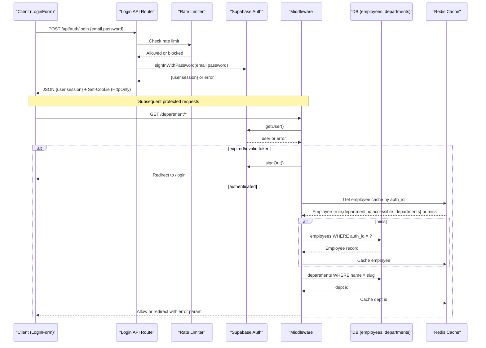
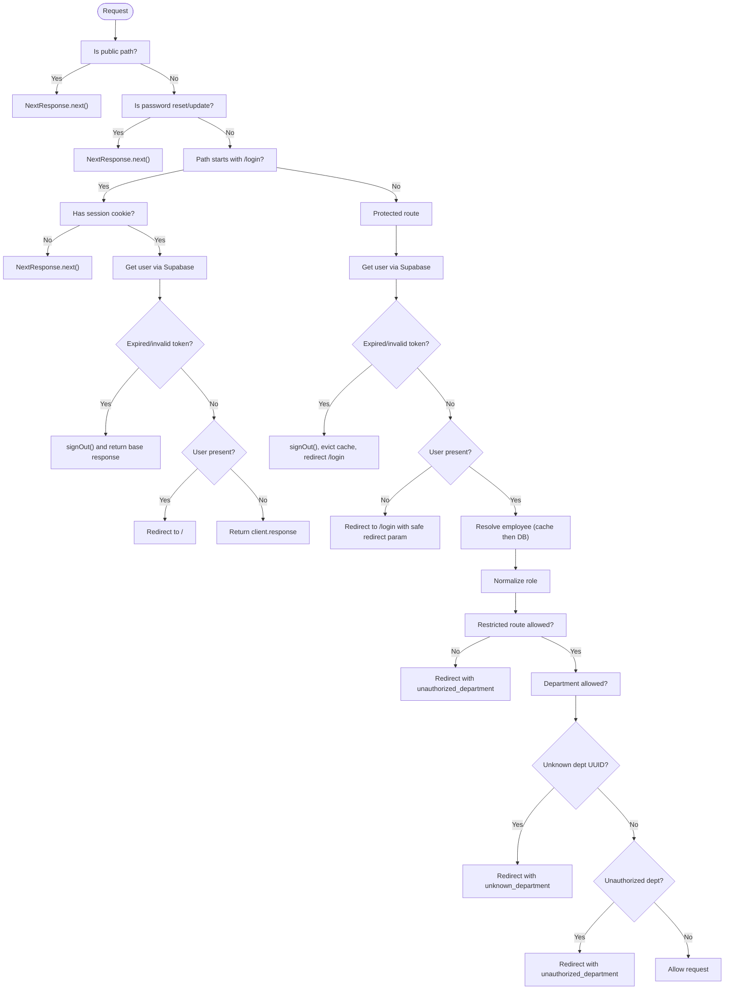
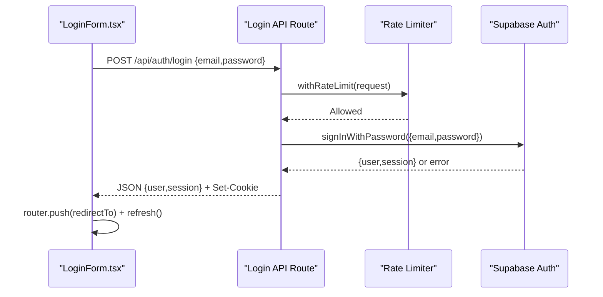
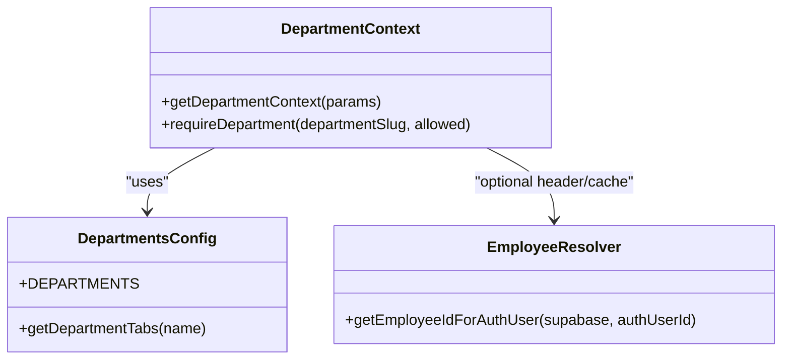
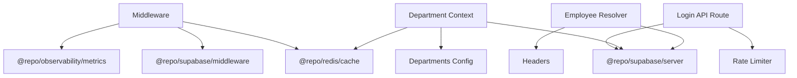

# Authentication & Authorization

<cite>
**Referenced Files in This Document**
- [middleware.ts](file://apps/portal/middleware.ts)
- [middleware.test.ts](file://apps/portal/middleware.test.ts)
- [route.ts](file://apps/portal/app/api/auth/login/route.ts)
- [LoginForm.tsx](file://apps/portal/app/(auth)/login/LoginForm.tsx)
- [page.tsx](file://apps/portal/app/(auth)/login/page.tsx)
- [layout.tsx](file://apps/portal/app/(auth)/layout.tsx)
- [rate-limit-middleware.ts](file://apps/portal/lib/api/rate-limit-middleware.ts)
- [dept-context.ts](file://apps/portal/lib/dept-context.ts)
- [departments.ts](file://apps/portal/lib/departments.ts)
- [employee.ts](file://apps/portal/lib/employee.ts)
</cite>

## Table of Contents
1. [Introduction](#introduction)
2. [Project Structure](#project-structure)
3. [Core Components](#core-components)
4. [Architecture Overview](#architecture-overview)
5. [Detailed Component Analysis](#detailed-component-analysis)
6. [Dependency Analysis](#dependency-analysis)
7. [Performance Considerations](#performance-considerations)
8. [Security Considerations](#security-considerations)
9. [Troubleshooting Guide](#troubleshooting-guide)
10. [Conclusion](#conclusion)
11. [Appendices](#appendices)

## Introduction
This document explains the authentication and authorization system for the Portal application. It covers:
- Request interception via Next.js middleware, session validation with Supabase Auth, and role-based access control (RBAC).
- The login flow using Supabase Auth, including JWT/session handling and cookie propagation.
- Department-specific authorization patterns that restrict access based on employee roles and permissions.
- Employee context utilities used to resolve user identity and department scope.
- Security considerations such as CSRF protection, input validation, secure cookies, and rate limiting.
- Practical examples for adding new authentication routes, implementing role checks, and extending authorization logic.

## Project Structure
The authentication and authorization features are implemented across server-side middleware, API routes, client components, and shared libraries:
- Middleware enforces authentication and authorization at the request boundary.
- Login API route authenticates users via Supabase and sets secure cookies.
- Client login form validates inputs and handles redirects safely.
- Department context and configuration define allowed departments and tabs.
- Employee utility resolves user-to-employee mapping efficiently.

**Diagram sources**
- [middleware.ts](file://apps/portal/middleware.ts)
- [route.ts](file://apps/portal/app/api/auth/login/route.ts)
- [LoginForm.tsx](file://apps/portal/app/(auth)/login/LoginForm.tsx)
- [page.tsx](file://apps/portal/app/(auth)/login/page.tsx)
- [rate-limit-middleware.ts](file://apps/portal/lib/api/rate-limit-middleware.ts)
- [dept-context.ts](file://apps/portal/lib/dept-context.ts)
- [departments.ts](file://apps/portal/lib/departments.ts)
- [employee.ts](file://apps/portal/lib/employee.ts)

**Section sources**
- [middleware.ts](file://apps/portal/middleware.ts)
- [route.ts](file://apps/portal/app/api/auth/login/route.ts)
- [LoginForm.tsx](file://apps/portal/app/(auth)/login/LoginForm.tsx)
- [page.tsx](file://apps/portal/app/(auth)/login/page.tsx)
- [dept-context.ts](file://apps/portal/lib/dept-context.ts)
- [departments.ts](file://apps/portal/lib/departments.ts)
- [employee.ts](file://apps/portal/lib/employee.ts)
- [rate-limit-middleware.ts](file://apps/portal/lib/api/rate-limit-middleware.ts)

## Core Components
- Middleware: Intercepts requests, validates sessions, enforces RBAC, and applies department-level access rules.
- Login API Route: Authenticates credentials via Supabase, returns session data, and sets HttpOnly cookies.
- Client Login Form: Validates inputs, prevents open redirects, and navigates after successful login.
- Department Context: Resolves department metadata and IDs with caching; provides helpers for page-level restrictions.
- Employee Resolver: Efficiently maps auth user IDs to employee records, leveraging headers or DB fallback.
- Rate Limiting: Protects endpoints from abuse using Redis-backed sliding window/token bucket strategies.

Key responsibilities:
- Session lifecycle management (create, validate, sign out).
- Role normalization and restricted route enforcement.
- Department UUID resolution and access checks.
- Secure redirect validation.
- Input validation and error sanitization.

**Section sources**
- [middleware.ts](file://apps/portal/middleware.ts)
- [route.ts](file://apps/portal/app/api/auth/login/route.ts)
- [LoginForm.tsx](file://apps/portal/app/(auth)/login/LoginForm.tsx)
- [dept-context.ts](file://apps/portal/lib/dept-context.ts)
- [employee.ts](file://apps/portal/lib/employee.ts)
- [rate-limit-middleware.ts](file://apps/portal/lib/api/rate-limit-middleware.ts)

## Architecture Overview
The system uses a layered approach:
- Client submits credentials to the login API route.
- Server authenticates via Supabase and sets secure cookies.
- Middleware intercepts subsequent requests, validates sessions, and enforces RBAC and department access.
- Department pages use cached lookups and server-side guards to ensure correct scoping.

**Diagram sources**
- [route.ts](file://apps/portal/app/api/auth/login/route.ts)
- [rate-limit-middleware.ts](file://apps/portal/lib/api/rate-limit-middleware.ts)
- [middleware.ts](file://apps/portal/middleware.ts)

## Detailed Component Analysis

### Middleware Implementation
Responsibilities:
- Skip public paths and password reset/update flows.
- Handle login page routing for authenticated/unauthenticated users.
- Validate sessions and handle token expiration/sign-out.
- Normalize roles and enforce restricted routes.
- Resolve department UUIDs and check department access.
- Preserve cookies during redirects and errors.

Key behaviors:
- Public path detection includes static assets and root files.
- Login page bypasses if no session cookie exists; otherwise validates session and redirects to home if authenticated.
- For protected routes, unauthenticated users are redirected to /login with a safe redirect parameter.
- Restricted routes map specific paths to allowed roles; non-compliant users receive an unauthorized error redirect.
- Department access allows admin, primary department match, or cross-department access list.
- Expired refresh tokens trigger sign-out and clear related caches.

**Diagram sources**
- [middleware.ts](file://apps/portal/middleware.ts)

**Section sources**
- [middleware.ts](file://apps/portal/middleware.ts)
- [middleware.test.ts](file://apps/portal/middleware.test.ts)

### Login Flow with Supabase Auth
- Client form validates inputs and calls the login API route.
- Server route applies rate limiting, validates payload, authenticates via Supabase, and returns session data.
- Supabase sets HttpOnly cookies for session persistence.
- Client navigates to a validated internal redirect target.

**Diagram sources**
- [LoginForm.tsx](file://apps/portal/app/(auth)/login/LoginForm.tsx)
- [route.ts](file://apps/portal/app/api/auth/login/route.ts)
- [rate-limit-middleware.ts](file://apps/portal/lib/api/rate-limit-middleware.ts)

**Section sources**
- [LoginForm.tsx](file://apps/portal/app/(auth)/login/LoginForm.tsx)
- [route.ts](file://apps/portal/app/api/auth/login/route.ts)
- [rate-limit-middleware.ts](file://apps/portal/lib/api/rate-limit-middleware.ts)

### Department-Specific Authorization Patterns
- Departments are defined centrally and validated before rendering department layouts.
- Middleware enforces access based on:
  - Admin role (full access).
  - Primary department match.
  - Cross-department access list.
- Department UUIDs are resolved and cached to reduce database load.
- Page-level helpers can restrict tabs or features to specific departments.

**Diagram sources**
- [dept-context.ts](file://apps/portal/lib/dept-context.ts)
- [departments.ts](file://apps/portal/lib/departments.ts)
- [employee.ts](file://apps/portal/lib/employee.ts)

**Section sources**
- [dept-context.ts](file://apps/portal/lib/dept-context.ts)
- [departments.ts](file://apps/portal/lib/departments.ts)
- [employee.ts](file://apps/portal/lib/employee.ts)
- [middleware.ts](file://apps/portal/middleware.ts)

### Employee Context Provider and State Management
- The employee resolver prioritizes a header set by middleware to avoid redundant DB queries.
- If unavailable (e.g., tests), it falls back to querying the employees table by auth_id.
- This pattern ensures efficient access to employee identity across server components and actions.

Implementation notes:
- Header-based optimization reduces latency and DB pressure.
- Graceful fallback maintains correctness outside request contexts.

**Section sources**
- [employee.ts](file://apps/portal/lib/employee.ts)
- [middleware.ts](file://apps/portal/middleware.ts)

## Dependency Analysis
- Middleware depends on Supabase middleware client, Redis cache, and observability metrics.
- Login API route depends on server Supabase client and rate limiter.
- Department context depends on Supabase server client, Redis cache, and department configuration.
- Employee resolver depends on headers and Supabase server client.

**Diagram sources**
- [middleware.ts](file://apps/portal/middleware.ts)
- [route.ts](file://apps/portal/app/api/auth/login/route.ts)
- [dept-context.ts](file://apps/portal/lib/dept-context.ts)
- [departments.ts](file://apps/portal/lib/departments.ts)
- [employee.ts](file://apps/portal/lib/employee.ts)
- [rate-limit-middleware.ts](file://apps/portal/lib/api/rate-limit-middleware.ts)

**Section sources**
- [middleware.ts](file://apps/portal/middleware.ts)
- [route.ts](file://apps/portal/app/api/auth/login/route.ts)
- [dept-context.ts](file://apps/portal/lib/dept-context.ts)
- [departments.ts](file://apps/portal/lib/departments.ts)
- [employee.ts](file://apps/portal/lib/employee.ts)
- [rate-limit-middleware.ts](file://apps/portal/lib/api/rate-limit-middleware.ts)

## Performance Considerations
- Caching:
  - Department UUIDs cached in Redis for 1 hour.
  - Employee profiles cached per user ID for 1 hour.
- Header-based employee ID lookup avoids extra DB queries when available.
- Rate limiting adapts under high CPU load, reducing maxRequests proportionally.
- Best-effort metrics do not block authentication flows.

Recommendations:
- Monitor cache hit ratios for department and employee keys.
- Tune Redis TTLs based on update frequency and consistency needs.
- Use server-side caching for frequently accessed department metadata.

[No sources needed since this section provides general guidance]

## Security Considerations
- CSRF Protection:
  - Cookies are managed by Supabase and marked HttpOnly; avoid reading them client-side.
  - Ensure SameSite and Secure flags are configured appropriately in your environment.
- Input Validation:
  - Login API validates required fields and returns generic errors to prevent enumeration.
  - Client form enforces min/max lengths and patterns for inputs.
- Secure Redirect Handling:
  - Strict allowlist for redirect targets prevents open redirects and protocol bypasses.
- Rate Limiting:
  - Sliding window strategy protects login endpoint from brute-force attacks.
  - Load-adaptive throttling scales limits under high system load.
- Token Expiration Handling:
  - Middleware detects invalid/expired refresh tokens and signs out users automatically.
- Observability:
  - Metrics are recorded best-effort without blocking critical flows.

**Section sources**
- [route.ts](file://apps/portal/app/api/auth/login/route.ts)
- [LoginForm.tsx](file://apps/portal/app/(auth)/login/LoginForm.tsx)
- [middleware.ts](file://apps/portal/middleware.ts)
- [rate-limit-middleware.ts](file://apps/portal/lib/api/rate-limit-middleware.ts)

## Troubleshooting Guide
Common issues and resolutions:
- Invalid credentials:
  - Verify email/password and network connectivity to Supabase.
  - Check rate limit headers and retry-after values.
- Unauthorized department access:
  - Confirm employee role and department assignments.
  - Ensure department UUID exists and is accessible to the user.
- Unknown department:
  - Validate department slug and existence in the database.
- Expired session:
  - Re-authenticate; middleware will sign out and redirect to login.
- Login page shows system unavailable:
  - Indicates catastrophic failure reaching authentication services; retry later or contact support.

Operational tips:
- Inspect cookies for presence of Supabase auth tokens.
- Review middleware logs and metrics for signout events and checks.
- Use test suite scenarios to reproduce edge cases like expired tokens and invalid redirects.

**Section sources**
- [middleware.test.ts](file://apps/portal/middleware.test.ts)
- [page.tsx](file://apps/portal/app/(auth)/login/page.tsx)
- [route.ts](file://apps/portal/app/api/auth/login/route.ts)

## Conclusion
The Portal’s authentication and authorization system combines robust middleware enforcement, secure login flows, and department-scoped access controls. Caching and header optimizations improve performance, while rate limiting and strict redirect validation enhance security. Extending the system involves updating role mappings, department configurations, and middleware policies consistently.

[No sources needed since this section summarizes without analyzing specific files]

## Appendices

### How to Implement a New Authentication Route
Steps:
- Create a new API route under app/api/auth/.
- Wrap handler with rate limiting middleware.
- Validate inputs and call Supabase auth methods.
- Return standardized JSON responses and rely on Supabase to set secure cookies.

Example references:
- [route.ts](file://apps/portal/app/api/auth/login/route.ts)
- [rate-limit-middleware.ts](file://apps/portal/lib/api/rate-limit-middleware.ts)

### How to Add Role Checks
Steps:
- Define role requirements for new routes in the restricted routes mapping.
- Update normalized role handling if necessary.
- Test with various roles and department scopes.

Example references:
- [middleware.ts](file://apps/portal/middleware.ts)
- [middleware.test.ts](file://apps/portal/middleware.test.ts)

### How to Extend Authorization Logic
Steps:
- Add new department routes to the allowed list if needed.
- Implement additional checks in department access logic.
- Cache new lookups and invalidate on updates.

Example references:
- [middleware.ts](file://apps/portal/middleware.ts)
- [dept-context.ts](file://apps/portal/lib/dept-context.ts)
- [departments.ts](file://apps/portal/lib/departments.ts)