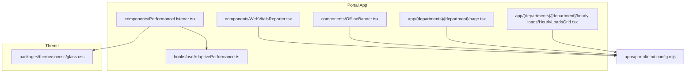
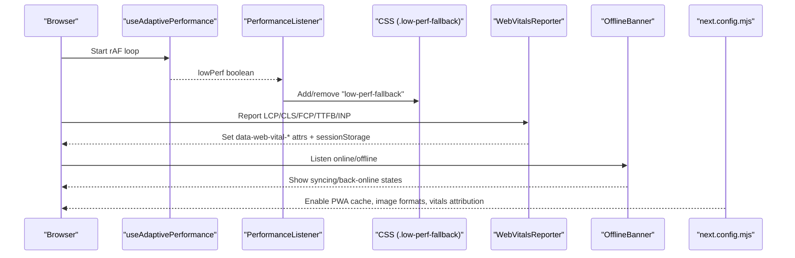
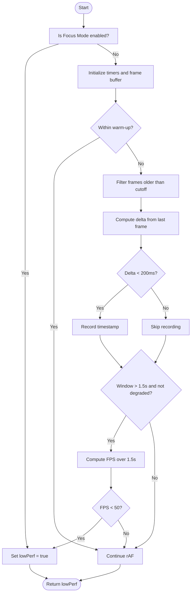
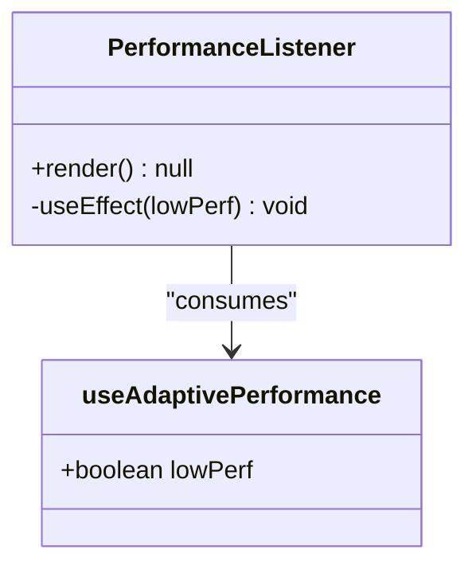
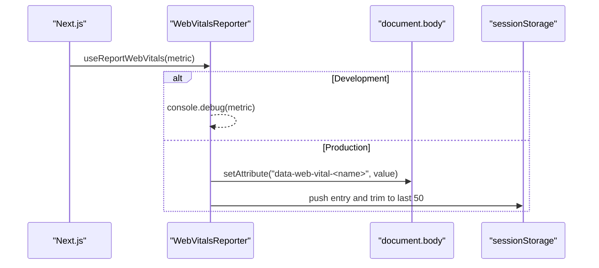
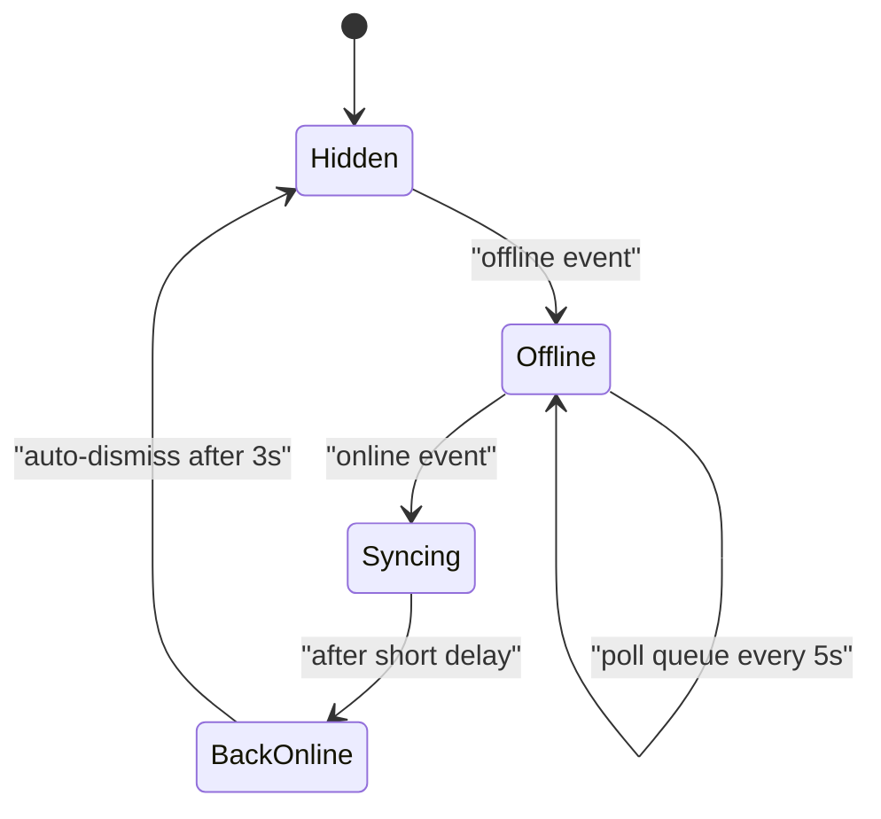
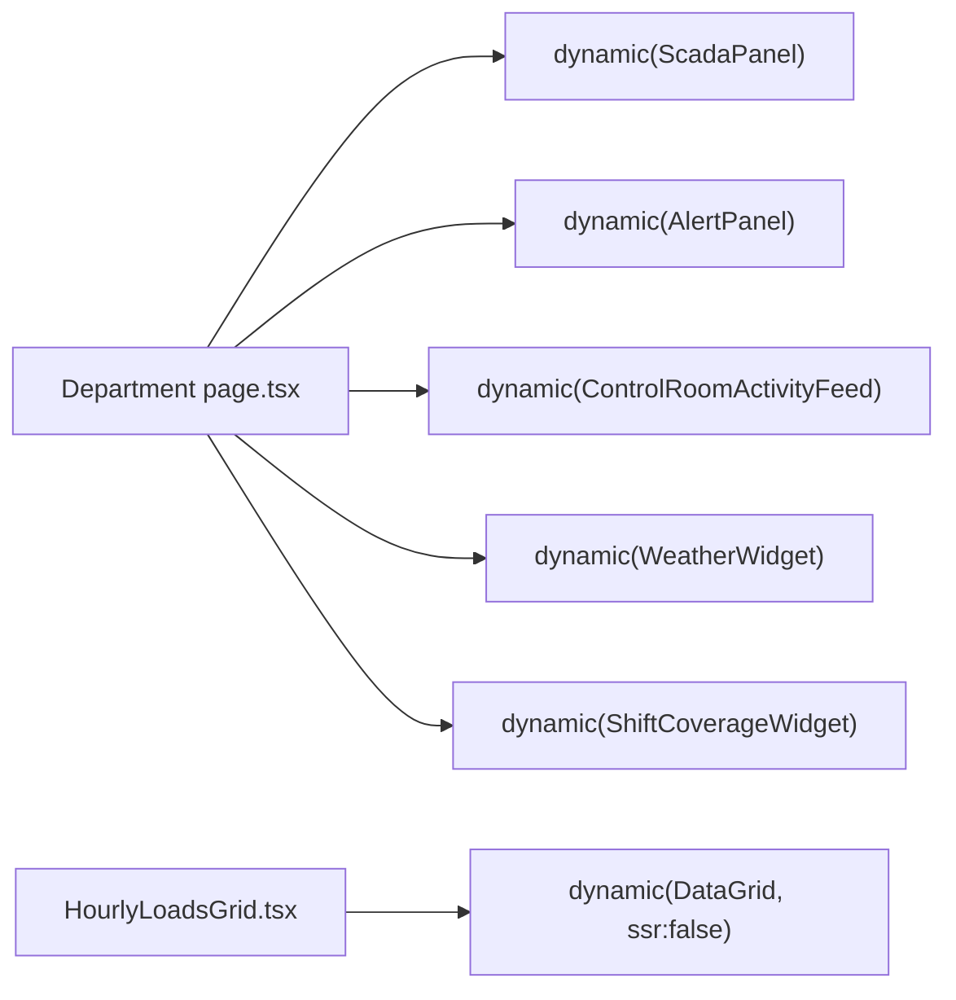
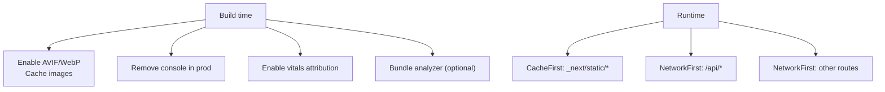
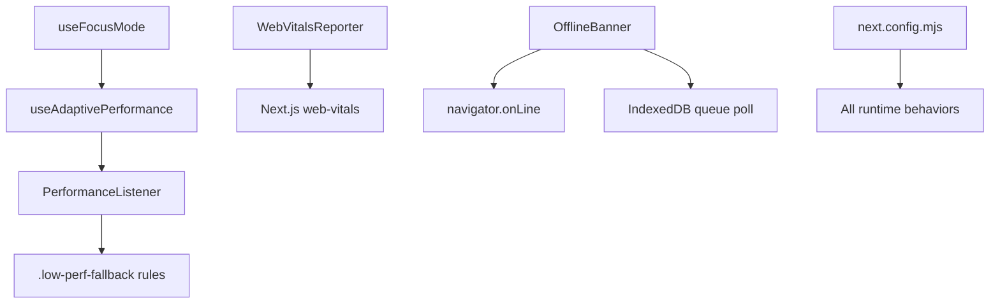

# Performance Optimization & Monitoring

<cite>
**Referenced Files in This Document**
- [PerformanceListener.tsx](file://apps/portal/components/PerformanceListener.tsx)
- [WebVitalsReporter.tsx](file://apps/portal/components/WebVitalsReporter.tsx)
- [useAdaptivePerformance.ts](file://apps/portal/hooks/useAdaptivePerformance.ts)
- [OfflineBanner.tsx](file://apps/portal/components/OfflineBanner.tsx)
- [next.config.mjs](file://apps/portal/next.config.mjs)
- [page.tsx](file://apps/portal/app/(departments)/[department]/page.tsx)
- [HourlyLoadsGrid.tsx](file://apps/portal/app/(departments)/[department]/hourly-loads/HourlyLoadsGrid.tsx)
- [glass.css](file://packages/theme/src/css/glass.css)
</cite>

## Table of Contents
1. [Introduction](#introduction)
2. [Project Structure](#project-structure)
3. [Core Components](#core-components)
4. [Architecture Overview](#architecture-overview)
5. [Detailed Component Analysis](#detailed-component-analysis)
6. [Dependency Analysis](#dependency-analysis)
7. [Performance Considerations](#performance-considerations)
8. [Troubleshooting Guide](#troubleshooting-guide)
9. [Conclusion](#conclusion)

## Introduction
This document explains the performance optimization and monitoring systems implemented in the Portal application. It focuses on:
- Real-time frame-rate monitoring and adaptive rendering via a custom hook and listener component
- Core Web Vitals collection and exposure for observability
- Offline connectivity feedback with queued operations
- Code splitting, lazy loading, and bundle optimization strategies
- Practical examples to add monitoring, implement adaptive features, and optimize performance

## Project Structure
The performance-related code is organized into small, focused components and hooks under the Portal app, with build-time optimizations configured centrally.

**Diagram sources**
- [PerformanceListener.tsx:1-28](file://apps/portal/components/PerformanceListener.tsx#L1-L28)
- [WebVitalsReporter.tsx:1-66](file://apps/portal/components/WebVitalsReporter.tsx#L1-L66)
- [useAdaptivePerformance.ts:1-83](file://apps/portal/hooks/useAdaptivePerformance.ts#L1-L83)
- [OfflineBanner.tsx:1-108](file://apps/portal/components/OfflineBanner.tsx#L1-L108)
- [page.tsx](file://apps/portal/app/(departments)/[department]/page.tsx#L1-L433)
- [HourlyLoadsGrid.tsx](file://apps/portal/app/(departments)/[department]/hourly-loads/HourlyLoadsGrid.tsx#L1-L800)
- [glass.css:1316-1423](file://packages/theme/src/css/glass.css#L1316-L1423)
- [next.config.mjs:1-254](file://apps/portal/next.config.mjs#L1-L254)

**Section sources**
- [PerformanceListener.tsx:1-28](file://apps/portal/components/PerformanceListener.tsx#L1-L28)
- [WebVitalsReporter.tsx:1-66](file://apps/portal/components/WebVitalsReporter.tsx#L1-L66)
- [useAdaptivePerformance.ts:1-83](file://apps/portal/hooks/useAdaptivePerformance.ts#L1-L83)
- [OfflineBanner.tsx:1-108](file://apps/portal/components/OfflineBanner.tsx#L1-L108)
- [next.config.mjs:1-254](file://apps/portal/next.config.mjs#L1-L254)
- [page.tsx](file://apps/portal/app/(departments)/[department]/page.tsx#L1-L433)
- [HourlyLoadsGrid.tsx](file://apps/portal/app/(departments)/[department]/hourly-loads/HourlyLoadsGrid.tsx#L1-L800)
- [glass.css:1316-1423](file://packages/theme/src/css/glass.css#L1316-L1423)

## Core Components
- PerformanceListener: Adds/removes a body class when low performance is detected, enabling CSS fallbacks.
- useAdaptivePerformance: Measures frame timing using requestAnimationFrame and signals degradation based on sustained FPS thresholds or Focus Mode.
- WebVitalsReporter: Collects Core Web Vitals (LCP, CLS, FCP, TTFB, INP), exposes them as DOM attributes and aggregates per-session data.
- OfflineBanner: Observes online/offline events, polls local queue size, and provides user feedback during connectivity issues.
- next.config.mjs: Configures PWA runtime caching, image formats, compiler options, web vitals attribution, and bundle analysis.

**Section sources**
- [PerformanceListener.tsx:1-28](file://apps/portal/components/PerformanceListener.tsx#L1-L28)
- [useAdaptivePerformance.ts:1-83](file://apps/portal/hooks/useAdaptivePerformance.ts#L1-L83)
- [WebVitalsReporter.tsx:1-66](file://apps/portal/components/WebVitalsReporter.tsx#L1-L66)
- [OfflineBanner.tsx:1-108](file://apps/portal/components/OfflineBanner.tsx#L1-L108)
- [next.config.mjs:1-254](file://apps/portal/next.config.mjs#L1-L254)

## Architecture Overview
The system combines client-side runtime monitoring with build-time optimizations:
- Runtime: The adaptive performance hook measures frame rates; the listener toggles a body class that triggers CSS fallbacks. Web Vitals are reported to DOM attributes and sessionStorage. The offline banner reacts to network state and shows sync status.
- Build-time: Next.js config enables modern image formats, PWA runtime caching, web vitals attribution, and optional bundle analysis. Pages use dynamic imports and Suspense to split bundles and defer heavy UI.

**Diagram sources**
- [useAdaptivePerformance.ts:1-83](file://apps/portal/hooks/useAdaptivePerformance.ts#L1-L83)
- [PerformanceListener.tsx:1-28](file://apps/portal/components/PerformanceListener.tsx#L1-L28)
- [WebVitalsReporter.tsx:1-66](file://apps/portal/components/WebVitalsReporter.tsx#L1-L66)
- [OfflineBanner.tsx:1-108](file://apps/portal/components/OfflineBanner.tsx#L1-L108)
- [next.config.mjs:1-254](file://apps/portal/next.config.mjs#L1-L254)

## Detailed Component Analysis

### Adaptive Performance Hook
- Purpose: Detect sustained low frame rate and signal rendering downgrades. Also responds immediately to Focus Mode.
- Mechanism: Uses requestAnimationFrame with a warm-up period, sliding window filtering, and an FPS threshold check.
- Output: Boolean indicating whether to apply performance fallbacks.

**Diagram sources**
- [useAdaptivePerformance.ts:1-83](file://apps/portal/hooks/useAdaptivePerformance.ts#L1-L83)

**Section sources**
- [useAdaptivePerformance.ts:1-83](file://apps/portal/hooks/useAdaptivePerformance.ts#L1-L83)

### PerformanceListener Component
- Purpose: Reacts to the adaptive performance signal by adding/removing a CSS class on the document body.
- Effect: Enables CSS rules to disable expensive visuals (e.g., glass effects, animations) when performance is poor.

**Diagram sources**
- [PerformanceListener.tsx:1-28](file://apps/portal/components/PerformanceListener.tsx#L1-L28)
- [useAdaptivePerformance.ts:1-83](file://apps/portal/hooks/useAdaptivePerformance.ts#L1-L83)

**Section sources**
- [PerformanceListener.tsx:1-28](file://apps/portal/components/PerformanceListener.tsx#L1-L28)
- [glass.css:1316-1423](file://packages/theme/src/css/glass.css#L1316-L1423)

### WebVitalsReporter
- Purpose: Collects Core Web Vitals metrics and makes them available for scraping and session aggregation without external dependencies.
- Behavior:
  - Development: Logs metric details to console.
  - Production: Sets data attributes on the body and accumulates recent entries in sessionStorage.

**Diagram sources**
- [WebVitalsReporter.tsx:1-66](file://apps/portal/components/WebVitalsReporter.tsx#L1-L66)

**Section sources**
- [WebVitalsReporter.tsx:1-66](file://apps/portal/components/WebVitalsReporter.tsx#L1-L66)

### Offline Banner System
- Purpose: Provides clear feedback during connectivity changes and indicates queued operations.
- Behavior:
  - Listens for online/offline events.
  - While offline, polls IndexedDB for pending action count.
  - On reconnect, briefly shows syncing then success before auto-dismissing.

**Diagram sources**
- [OfflineBanner.tsx:1-108](file://apps/portal/components/OfflineBanner.tsx#L1-L108)

**Section sources**
- [OfflineBanner.tsx:1-108](file://apps/portal/components/OfflineBanner.tsx#L1-L108)

### Code Splitting and Lazy Loading
- Strategy: Heavy or rarely used components are loaded dynamically with next/dynamic and wrapped in Suspense with meaningful fallbacks.
- Examples:
  - Department dashboard page uses dynamic imports for large panels and widgets.
  - Hourly loads grid lazily loads a data grid component and disables SSR for it.

**Diagram sources**
- [page.tsx](file://apps/portal/app/(departments)/[department]/page.tsx#L1-L433)
- [HourlyLoadsGrid.tsx](file://apps/portal/app/(departments)/[department]/hourly-loads/HourlyLoadsGrid.tsx#L1-L800)

**Section sources**
- [page.tsx](file://apps/portal/app/(departments)/[department]/page.tsx#L1-L433)
- [HourlyLoadsGrid.tsx](file://apps/portal/app/(departments)/[department]/hourly-loads/HourlyLoadsGrid.tsx#L1-L800)

### Bundle Optimization Techniques
- Image formats: AVIF and WebP with long cache TTLs.
- Compiler: Removes non-critical console logs in production.
- Web Vitals attribution: Enabled for key metrics.
- PWA runtime caching: Cache-first for static assets, NetworkFirst for API and general routes with expiration policies.
- Bundle analysis: Optional analyzer integration for inspecting bundle composition.

**Diagram sources**
- [next.config.mjs:1-254](file://apps/portal/next.config.mjs#L1-L254)

**Section sources**
- [next.config.mjs:1-254](file://apps/portal/next.config.mjs#L1-L254)

## Dependency Analysis
- useAdaptivePerformance depends on Focus Mode state to immediately downgrade rendering when needed.
- PerformanceListener depends on the hook and affects global CSS classes.
- WebVitalsReporter integrates with Next.js web vitals instrumentation.
- OfflineBanner interacts with browser networking APIs and IndexedDB.
- next.config.mjs influences all client behavior through headers, caching, and experimental flags.

**Diagram sources**
- [useAdaptivePerformance.ts:1-83](file://apps/portal/hooks/useAdaptivePerformance.ts#L1-L83)
- [PerformanceListener.tsx:1-28](file://apps/portal/components/PerformanceListener.tsx#L1-L28)
- [WebVitalsReporter.tsx:1-66](file://apps/portal/components/WebVitalsReporter.tsx#L1-L66)
- [OfflineBanner.tsx:1-108](file://apps/portal/components/OfflineBanner.tsx#L1-L108)
- [glass.css:1316-1423](file://packages/theme/src/css/glass.css#L1316-L1423)
- [next.config.mjs:1-254](file://apps/portal/next.config.mjs#L1-L254)

**Section sources**
- [useAdaptivePerformance.ts:1-83](file://apps/portal/hooks/useAdaptivePerformance.ts#L1-L83)
- [PerformanceListener.tsx:1-28](file://apps/portal/components/PerformanceListener.tsx#L1-L28)
- [WebVitalsReporter.tsx:1-66](file://apps/portal/components/WebVitalsReporter.tsx#L1-L66)
- [OfflineBanner.tsx:1-108](file://apps/portal/components/OfflineBanner.tsx#L1-L108)
- [glass.css:1316-1423](file://packages/theme/src/css/glass.css#L1316-L1423)
- [next.config.mjs:1-254](file://apps/portal/next.config.mjs#L1-L254)

## Performance Considerations
- Frame budget: The adaptive hook uses a 1.5-second sliding window and a threshold around 50 FPS to trigger fallbacks. Adjust thresholds if your UI requires stricter budgets.
- Warm-up period: Initial hydration spikes are ignored to avoid false positives.
- CSS fallbacks: Ensure .low-perf-fallback rules target only expensive visuals to minimize reflow/repaint costs.
- Web Vitals: Use data attributes for scraping or integrate with your telemetry pipeline. Keep sessionStorage bounded to avoid storage limits.
- Offline UX: Queue critical mutations locally and provide clear feedback. Avoid blocking UI while syncing.
- Code splitting: Prefer dynamic imports for heavy components and Suspense boundaries for progressive loading.
- Caching strategy: Leverage PWA runtime caching for static assets and API responses where appropriate. Tune maxAge and maxEntries to balance freshness and performance.

## Troubleshooting Guide
- Low performance fallback not applied:
  - Verify the hook returns true under load and that the listener adds the body class.
  - Confirm CSS selectors for .low-perf-fallback exist and match affected elements.
- Web Vitals not visible:
  - In development, check console for metric logs.
  - In production, inspect body attributes for data-web-vital-* keys and verify sessionStorage entries.
- Offline banner not showing:
  - Ensure online/offline listeners are attached and that IndexedDB is available for queue polling.
  - Validate that the sync queue exists and contains pending items.
- Bundle size concerns:
  - Enable the bundle analyzer and review large chunks.
  - Move heavy libraries behind dynamic imports and consider disabling SSR for non-essential components.

**Section sources**
- [PerformanceListener.tsx:1-28](file://apps/portal/components/PerformanceListener.tsx#L1-L28)
- [useAdaptivePerformance.ts:1-83](file://apps/portal/hooks/useAdaptivePerformance.ts#L1-L83)
- [WebVitalsReporter.tsx:1-66](file://apps/portal/components/WebVitalsReporter.tsx#L1-L66)
- [OfflineBanner.tsx:1-108](file://apps/portal/components/OfflineBanner.tsx#L1-L108)
- [glass.css:1316-1423](file://packages/theme/src/css/glass.css#L1316-L1423)
- [next.config.mjs:1-254](file://apps/portal/next.config.mjs#L1-L254)

## Conclusion
The Portal’s performance strategy blends real-time monitoring with thoughtful build-time optimizations. The adaptive hook and listener enable graceful degradation, Web Vitals reporting provides actionable insights, and the offline banner improves resilience. Combined with aggressive code splitting and PWA caching, these patterns deliver a responsive experience across devices and network conditions.