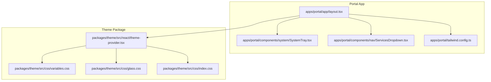
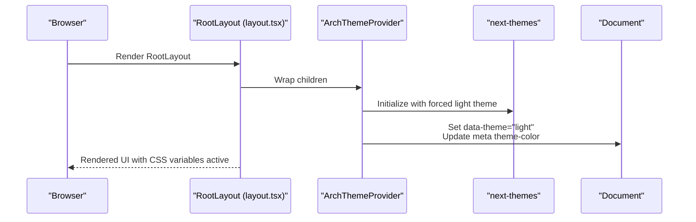
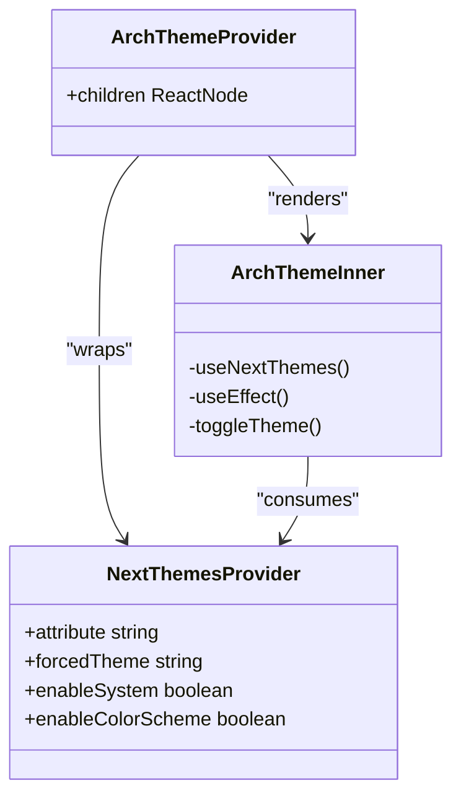
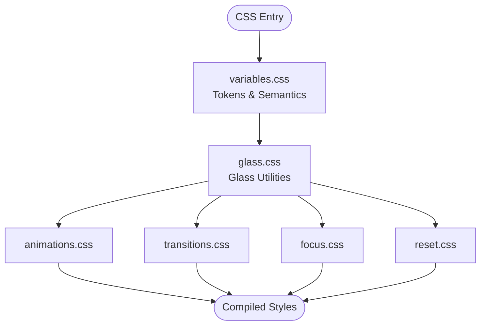
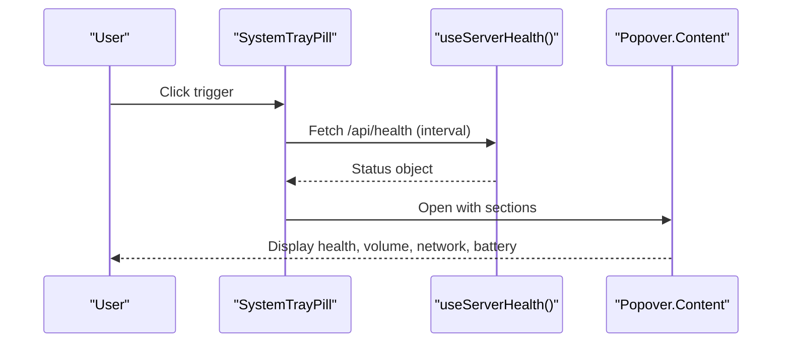
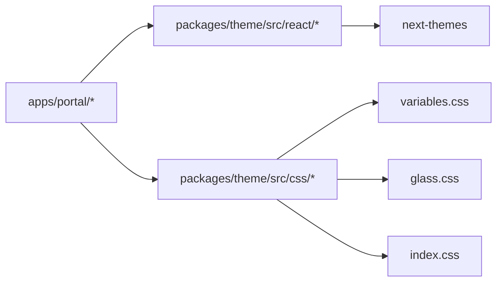

# UI Framework & Theme System

<cite>
**Referenced Files in This Document**
- [layout.tsx](file://apps/portal/app/layout.tsx)
- [theme-provider.tsx](file://packages/theme/src/react/theme-provider.tsx)
- [variables.css](file://packages/theme/src/css/variables.css)
- [glass.css](file://packages/theme/src/css/glass.css)
- [index.css](file://packages/theme/src/css/index.css)
- [tailwind.config.ts](file://apps/portal/tailwind.config.ts)
- [SystemTray.tsx](file://apps/portal/components/system/SystemTray.tsx)
- [ServicesDropdown.tsx](file://apps/portal/components/nav/ServicesDropdown.tsx)
</cite>

## Table of Contents
1. [Introduction](#introduction)
2. [Project Structure](#project-structure)
3. [Core Components](#core-components)
4. [Architecture Overview](#architecture-overview)
5. [Detailed Component Analysis](#detailed-component-analysis)
6. [Dependency Analysis](#dependency-analysis)
7. [Performance Considerations](#performance-considerations)
8. [Troubleshooting Guide](#troubleshooting-guide)
9. [Conclusion](#conclusion)
10. [Appendices](#appendices)

## Introduction
This document explains the UI framework integration and theme system that provides consistent design across the Portal application. It covers:
- ArchThemeProvider implementation for theme state and CSS variable injection
- Tailwind CSS configuration with custom design tokens, color schemes, and responsive breakpoints
- Global CSS architecture and component styling patterns (glassmorphism, shadows, transitions)
- System tray and Mac-style menu bar components providing desktop-like interface elements
- Accessibility compliance, dark/light theme switching strategy, and responsive design approaches
- Practical examples for adding new themes, creating styled components, and extending the design system

## Project Structure
The UI and theming are implemented as a shared package consumed by the Portal app. The root layout wires up providers, global styles, and top-level chrome (menu bar and system tray).

**Diagram sources**
- [layout.tsx:1-189](file://apps/portal/app/layout.tsx#L1-L189)
- [theme-provider.tsx:1-85](file://packages/theme/src/react/theme-provider.tsx#L1-L85)
- [variables.css:1-386](file://packages/theme/src/css/variables.css#L1-L386)
- [glass.css:1-800](file://packages/theme/src/css/glass.css#L1-L800)
- [index.css:1-8](file://packages/theme/src/css/index.css#L1-L8)
- [tailwind.config.ts:1-2](file://apps/portal/tailwind.config.ts#L1-L2)
- [SystemTray.tsx:1-800](file://apps/portal/components/system/SystemTray.tsx#L1-L800)
- [ServicesDropdown.tsx:1-505](file://apps/portal/components/nav/ServicesDropdown.tsx#L1-L505)

**Section sources**
- [layout.tsx:1-189](file://apps/portal/app/layout.tsx#L1-L189)
- [tailwind.config.ts:1-2](file://apps/portal/tailwind.config.ts#L1-L2)

## Core Components
- ArchThemeProvider: A client-side provider that enforces a light-only theme, sets data attributes, and updates meta tags. It exposes a stable API for consuming theme context and re-exports next-themes utilities.
- Global CSS: Centralized variables, glass utilities, animations, transitions, focus styles, and resets are composed via index.css. Variables include semantic tokens, shadcn/ui HSL mappings, Tremor brand tokens, glass tokens, z-index matrix, and font families.
- Tailwind Configuration: The Portal’s Tailwind config re-exports a shared preset from the theme package, ensuring consistent tokens, colors, radii, and typography across the app.
- System Tray and Services Dropdown: Desktop-like status and actions exposed through a compact pill and a rich dropdown, integrating network, battery, volume, notifications, and server health.

**Section sources**
- [theme-provider.tsx:1-85](file://packages/theme/src/react/theme-provider.tsx#L1-L85)
- [index.css:1-8](file://packages/theme/src/css/index.css#L1-L8)
- [variables.css:1-386](file://packages/theme/src/css/variables.css#L1-L386)
- [glass.css:1-800](file://packages/theme/src/css/glass.css#L1-L800)
- [tailwind.config.ts:1-2](file://apps/portal/tailwind.config.ts#L1-L2)
- [SystemTray.tsx:1-800](file://apps/portal/components/system/SystemTray.tsx#L1-L800)
- [ServicesDropdown.tsx:1-505](file://apps/portal/components/nav/ServicesDropdown.tsx#L1-L505)

## Architecture Overview
The runtime theme flow is driven by ArchThemeProvider, which wraps the app and ensures consistent CSS variables and metadata. The Portal layout composes providers, global styles, and chrome components.

**Diagram sources**
- [layout.tsx:144-184](file://apps/portal/app/layout.tsx#L144-L184)
- [theme-provider.tsx:32-74](file://packages/theme/src/react/theme-provider.tsx#L32-L74)

## Detailed Component Analysis

### ArchThemeProvider Implementation
ArchThemeProvider enforces a light-only theme using next-themes under the hood. It:
- Forces the theme to light and disables system detection and color scheme toggles
- Sets data-theme on the document element
- Updates the meta theme-color tag for mobile browsers
- Exposes a stable context with no-op setters to maintain a consistent API

**Diagram sources**
- [theme-provider.tsx:1-85](file://packages/theme/src/react/theme-provider.tsx#L1-L85)

**Section sources**
- [theme-provider.tsx:1-85](file://packages/theme/src/react/theme-provider.tsx#L1-L85)

### Global CSS Architecture and Styling Patterns
Global CSS is organized into layers and modules:
- variables.css: Single source of truth for tokens (primitives, semantics, shadcn/ui HSL, Tremor brand, glass tokens, z-index, fonts)
- glass.css: Reusable glass utility classes and premium variants
- index.css: Composes all theme layers

Key patterns:
- Semantic token usage (--text-heading, --accent-blue, etc.)
- Glass surfaces with backdrop-filter and layered gradients
- Consistent radius, shadow, and transition tokens
- Focus-visible rings and reduced-motion support

**Diagram sources**
- [index.css:1-8](file://packages/theme/src/css/index.css#L1-L8)
- [variables.css:1-386](file://packages/theme/src/css/variables.css#L1-L386)
- [glass.css:1-800](file://packages/theme/src/css/glass.css#L1-L800)

**Section sources**
- [variables.css:1-386](file://packages/theme/src/css/variables.css#L1-L386)
- [glass.css:1-800](file://packages/theme/src/css/glass.css#L1-L800)
- [index.css:1-8](file://packages/theme/src/css/index.css#L1-L8)

### Tailwind CSS Configuration and Design Tokens
The Portal’s Tailwind config delegates to a shared theme preset, ensuring consistent tokens, colors, and responsive scales. This centralization allows:
- Uniform color usage via semantic tokens
- Shared border radius, spacing, and typography scales
- Predictable responsive breakpoints across features

**Section sources**
- [tailwind.config.ts:1-2](file://apps/portal/tailwind.config.ts#L1-L2)

### System Tray and Mac-style Menu Bar
The system tray provides a compact status indicator and popover with sections for server health, volume control, network details, and battery status. The services dropdown offers operational context (weather, shift, safety alerts), view options, and power actions. Both integrate with the theme tokens for consistent appearance.

**Diagram sources**
- [SystemTray.tsx:277-341](file://apps/portal/components/system/SystemTray.tsx#L277-L341)
- [SystemTray.tsx:728-776](file://apps/portal/components/system/SystemTray.tsx#L728-L776)

Accessibility highlights:
- aria-labels and roles for interactive controls
- Keyboard shortcuts (Alt+S) for opening the services menu
- Visible focus indicators using theme accent tokens

**Section sources**
- [SystemTray.tsx:1-800](file://apps/portal/components/system/SystemTray.tsx#L1-L800)
- [ServicesDropdown.tsx:142-151](file://apps/portal/components/nav/ServicesDropdown.tsx#L142-L151)
- [ServicesDropdown.tsx:153-180](file://apps/portal/components/nav/ServicesDropdown.tsx#L153-L180)

### Root Layout Integration
The root layout:
- Imports global UI styles and theme provider
- Wraps content with providers (focus mode, performance listeners, route announcer)
- Renders MacMenuBar and SystemTrayPill in the header
- Applies semantic landmarks and skip navigation for accessibility

**Section sources**
- [layout.tsx:1-189](file://apps/portal/app/layout.tsx#L1-L189)

## Dependency Analysis
High-level dependencies between UI and theme layers:

**Diagram sources**
- [layout.tsx:1-189](file://apps/portal/app/layout.tsx#L1-L189)
- [theme-provider.tsx:1-85](file://packages/theme/src/react/theme-provider.tsx#L1-L85)
- [index.css:1-8](file://packages/theme/src/css/index.css#L1-L8)
- [variables.css:1-386](file://packages/theme/src/css/variables.css#L1-L386)
- [glass.css:1-800](file://packages/theme/src/css/glass.css#L1-L800)

**Section sources**
- [layout.tsx:1-189](file://apps/portal/app/layout.tsx#L1-L189)
- [theme-provider.tsx:1-85](file://packages/theme/src/react/theme-provider.tsx#L1-L85)
- [index.css:1-8](file://packages/theme/src/css/index.css#L1-L8)

## Performance Considerations
- Backdrop filters and complex shadows can be expensive; prefer glass utilities sparingly on large surfaces and avoid stacking multiple heavy effects.
- Respect prefers-reduced-motion where provided to minimize animations for users who prefer reduced motion.
- Use semantic tokens to avoid recalculating values and keep style changes centralized.
- Defer non-critical UI (e.g., dynamic widgets) to improve initial render time.

[No sources needed since this section provides general guidance]

## Troubleshooting Guide
Common issues and resolutions:
- Theme not applied or inconsistent colors: Ensure ArchThemeProvider wraps your routes and that global CSS is imported at the app entry point.
- Missing tokens or broken glass effects: Verify variables.css and glass.css are included via index.css and that Tailwind uses the shared preset.
- System tray popover not opening: Check keyboard shortcut handlers and aria-expanded states; confirm Popover triggers have correct roles and labels.
- Server health stale: Confirm polling interval and visibility checks; verify /api/health availability.

**Section sources**
- [layout.tsx:144-184](file://apps/portal/app/layout.tsx#L144-L184)
- [SystemTray.tsx:277-341](file://apps/portal/components/system/SystemTray.tsx#L277-L341)
- [ServicesDropdown.tsx:142-151](file://apps/portal/components/nav/ServicesDropdown.tsx#L142-L151)

## Conclusion
The Portal’s UI framework centers around a robust theme system built on CSS custom properties, a light-only enforced provider, and a comprehensive set of glass utilities. Tailwind integration via a shared preset guarantees consistency across components. The system tray and services dropdown deliver desktop-like UX while adhering to accessibility best practices. This structure makes it straightforward to extend tokens, add new themes, and build reusable styled components.

[No sources needed since this section summarizes without analyzing specific files]

## Appendices

### How to Add a New Theme
- Define new tokens in variables.css under appropriate tiers (primitives, semantics, glass, shadows).
- If supporting multiple themes, update ArchThemeProvider to manage theme state and attribute toggling.
- Extend Tailwind preset to expose new color scales and radii.
- Validate glass utilities against new tokens and adjust backdrop/saturation if needed.

[No sources needed since this section provides general guidance]

### Creating Styled Components
- Prefer semantic tokens (--text-heading, --accent-blue, --radius-card) over raw values.
- Use glass utilities (.glass-card, .glass-premium, .liquid-glass) for consistent surfaces.
- Apply focus-visible rings and ensure sufficient contrast per WCAG guidelines.

[No sources needed since this section provides general guidance]

### Extending the Design System
- Add new tokens to variables.css and reference them via Tailwind preset.
- Introduce new glass variants in glass.css with clear naming and documented usage.
- Update index.css layer order if introducing new modules.

[No sources needed since this section provides general guidance]