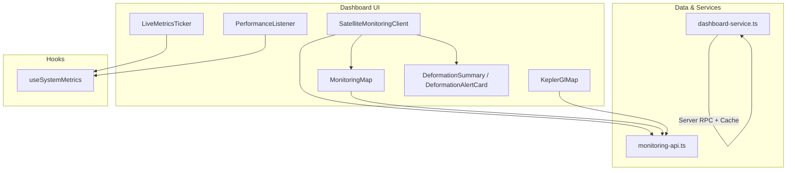
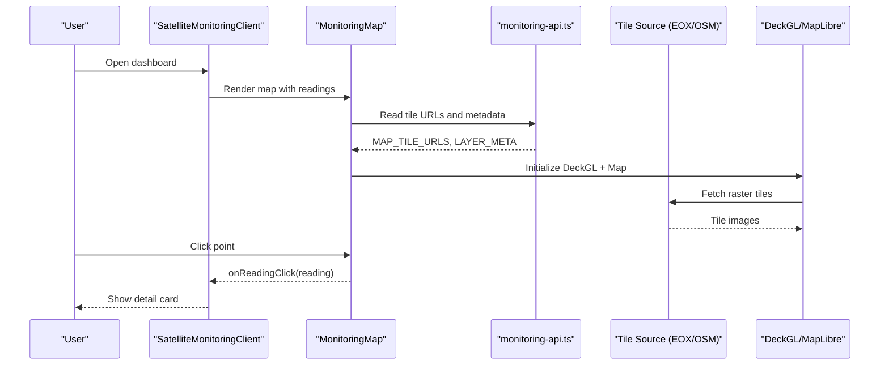
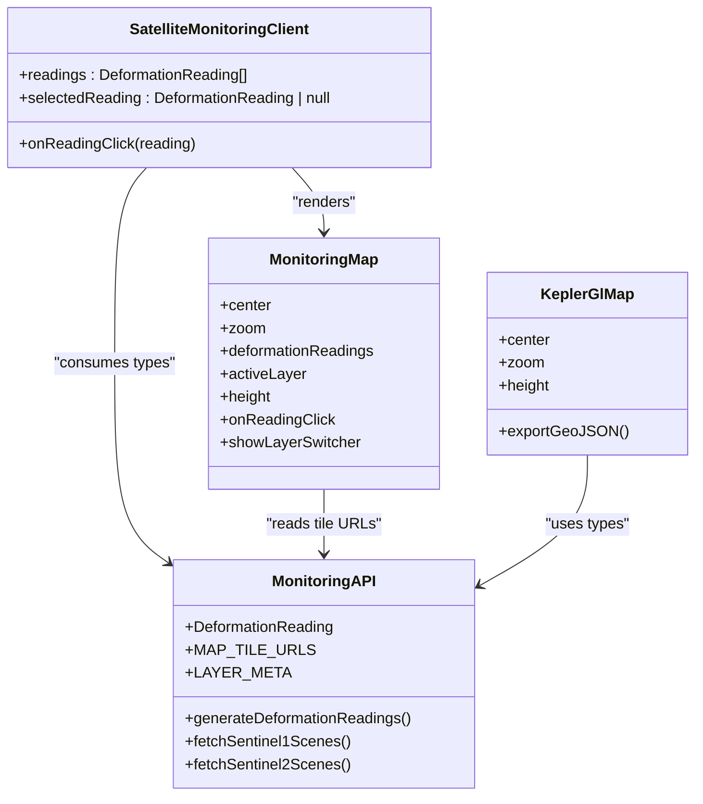
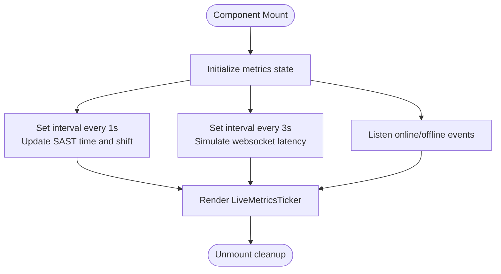
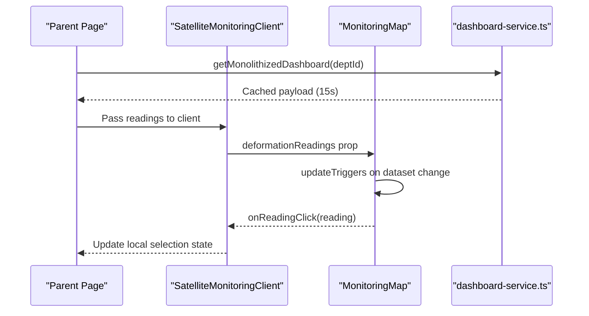
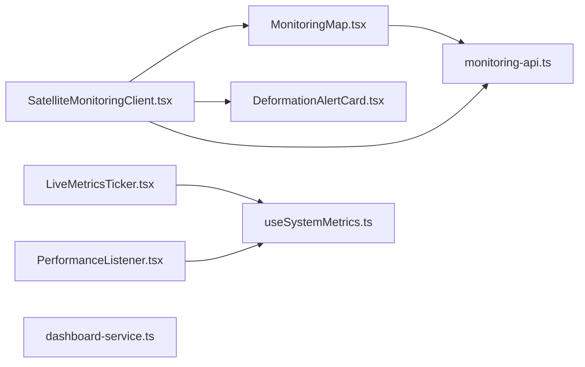

# Live Monitoring Dashboards

<cite>
**Referenced Files in This Document**
- [KeplerGlMap.tsx](file://apps/portal/components/monitoring/KeplerGlMap.tsx)
- [MonitoringMap.tsx](file://apps/portal/components/monitoring/MonitoringMap.tsx)
- [SatelliteMonitoringClient.tsx](file://apps/portal/components/monitoring/SatelliteMonitoringClient.tsx)
- [monitoring-api.ts](file://apps/portal/lib/monitoring-api.ts)
- [LiveMetricsTicker.tsx](file://apps/portal/components/system/LiveMetricsTicker.tsx)
- [useSystemMetrics.ts](file://apps/portal/hooks/useSystemMetrics.ts)
- [PerformanceListener.tsx](file://apps/portal/components/PerformanceListener.tsx)
- [dashboard-service.ts](file://apps/portal/lib/dashboard-service.ts)
- [DeformationAlertCard.tsx](file://apps/portal/features/departments/components/satellite/DeformationAlertCard.tsx)
</cite>

## Table of Contents
1. [Introduction](#introduction)
2. [Project Structure](#project-structure)
3. [Core Components](#core-components)
4. [Architecture Overview](#architecture-overview)
5. [Detailed Component Analysis](#detailed-component-analysis)
6. [Dependency Analysis](#dependency-analysis)
7. [Performance Considerations](#performance-considerations)
8. [Troubleshooting Guide](#troubleshooting-guide)
9. [Conclusion](#conclusion)
10. [Appendices](#appendices)

## Introduction
This document explains the live monitoring dashboards that visualize real-time operational data, focusing on geospatial visualization, real-time metrics, alerting, and performance optimization. It covers:
- Dashboard architecture and component composition patterns
- Data binding strategies for live updates
- Mapping components including Kepler.gl integration points, custom layers, and geospatial data visualization
- Real-time chart rendering approaches, alert systems, and interactive controls
- Performance optimization techniques for large datasets, memory management, and smooth interactions
- Examples of creating custom dashboard widgets, integrating external data sources, and implementing responsive layouts

## Project Structure
The live monitoring features are implemented primarily under apps/portal with a clear separation between UI components, hooks, and shared API utilities:
- Monitoring map and satellite client compose DeckGL + MapLibre for interactive maps
- Deformation readings and tile sources are defined in a shared API module
- System metrics ticker provides live runtime status
- Performance listener applies adaptive fallbacks based on frame timing
- A server-side dashboard service demonstrates cached aggregation patterns suitable for dashboards

**Diagram sources**
- [SatelliteMonitoringClient.tsx:1-83](file://apps/portal/components/monitoring/SatelliteMonitoringClient.tsx#L1-L83)
- [MonitoringMap.tsx:1-192](file://apps/portal/components/monitoring/MonitoringMap.tsx#L1-L192)
- [KeplerGlMap.tsx:1-176](file://apps/portal/components/monitoring/KeplerGlMap.tsx#L1-L176)
- [monitoring-api.ts:1-398](file://apps/portal/lib/monitoring-api.ts#L1-L398)
- [LiveMetricsTicker.tsx:1-56](file://apps/portal/components/system/LiveMetricsTicker.tsx#L1-L56)
- [useSystemMetrics.ts:1-107](file://apps/portal/hooks/useSystemMetrics.ts#L1-L107)
- [PerformanceListener.tsx:1-29](file://apps/portal/components/PerformanceListener.tsx#L1-L29)
- [dashboard-service.ts:1-100](file://apps/portal/lib/dashboard-service.ts#L1-L100)
- [DeformationAlertCard.tsx:1-153](file://apps/portal/features/departments/components/satellite/DeformationAlertCard.tsx#L1-L153)

**Section sources**
- [SatelliteMonitoringClient.tsx:1-83](file://apps/portal/components/monitoring/SatelliteMonitoringClient.tsx#L1-L83)
- [MonitoringMap.tsx:1-192](file://apps/portal/components/monitoring/MonitoringMap.tsx#L1-L192)
- [KeplerGlMap.tsx:1-176](file://apps/portal/components/monitoring/KeplerGlMap.tsx#L1-L176)
- [monitoring-api.ts:1-398](file://apps/portal/lib/monitoring-api.ts#L1-L398)
- [LiveMetricsTicker.tsx:1-56](file://apps/portal/components/system/LiveMetricsTicker.tsx#L1-L56)
- [useSystemMetrics.ts:1-107](file://apps/portal/hooks/useSystemMetrics.ts#L1-L107)
- [PerformanceListener.tsx:1-29](file://apps/portal/components/PerformanceListener.tsx#L1-L29)
- [dashboard-service.ts:1-100](file://apps/portal/lib/dashboard-service.ts#L1-L100)
- [DeformationAlertCard.tsx:1-153](file://apps/portal/features/departments/components/satellite/DeformationAlertCard.tsx#L1-L153)

## Core Components
- SatelliteMonitoringClient: Orchestrates the map, selected reading detail, and deformation summary list; uses dynamic import to defer heavy map code.
- MonitoringMap: Renders a DeckGL ScatterplotLayer over MapLibre tiles; supports layer switching and click-to-select readings.
- KeplerGlMap: Generates GeoJSON for deformation points and exposes export; documents how to integrate with Kepler.gl via Redux store.
- LiveMetricsTicker: Displays system health, latency, time, and shift info using useSystemMetrics.
- useSystemMetrics: Simulates websocket latency, tracks SAST clock, computes current shift, and listens to online/offline events.
- PerformanceListener: Applies a CSS class when low performance is detected to trigger fallback styles.
- DeformationSummary/DeformationAlertCard: Presents alerts sorted by severity with visual indicators and click-through to map selection.
- monitoring-api.ts: Defines types, tile URLs, STAC helpers, thresholds, and sample data generation for deformation readings.
- dashboard-service.ts: Demonstrates server-side caching and error handling for dashboard payloads.

**Section sources**
- [SatelliteMonitoringClient.tsx:1-83](file://apps/portal/components/monitoring/SatelliteMonitoringClient.tsx#L1-L83)
- [MonitoringMap.tsx:1-192](file://apps/portal/components/monitoring/MonitoringMap.tsx#L1-L192)
- [KeplerGlMap.tsx:1-176](file://apps/portal/components/monitoring/KeplerGlMap.tsx#L1-L176)
- [LiveMetricsTicker.tsx:1-56](file://apps/portal/components/system/LiveMetricsTicker.tsx#L1-L56)
- [useSystemMetrics.ts:1-107](file://apps/portal/hooks/useSystemMetrics.ts#L1-L107)
- [PerformanceListener.tsx:1-29](file://apps/portal/components/PerformanceListener.tsx#L1-L29)
- [DeformationAlertCard.tsx:1-153](file://apps/portal/features/departments/components/satellite/DeformationAlertCard.tsx#L1-L153)
- [monitoring-api.ts:1-398](file://apps/portal/lib/monitoring-api.ts#L1-L398)
- [dashboard-service.ts:1-100](file://apps/portal/lib/dashboard-service.ts#L1-L100)

## Architecture Overview
The dashboard composes a client-side React application with:
- Dynamic loading of map components to reduce initial bundle size
- DeckGL + MapLibre for high-performance geospatial rendering
- Shared API module for tile sources, STAC queries, and deformation data models
- Server-side cached payload retrieval for non-realtime dashboard sections
- Live metrics ticker driven by a hook simulating websocket latency and shift computation

**Diagram sources**
- [SatelliteMonitoringClient.tsx:1-83](file://apps/portal/components/monitoring/SatelliteMonitoringClient.tsx#L1-L83)
- [MonitoringMap.tsx:1-192](file://apps/portal/components/monitoring/MonitoringMap.tsx#L1-L192)
- [monitoring-api.ts:1-398](file://apps/portal/lib/monitoring-api.ts#L1-L398)

## Detailed Component Analysis

### Geospatial Visualization and Mapping
- MonitoringMap renders a ScatterplotLayer with color and radius mapped from deformation levels and provides an overlay layer switcher.
- SatelliteMonitoringClient dynamically imports the map, manages selected reading state, and composes the deformation summary.
- KeplerGlMap generates GeoJSON and shows how to export data for Kepler.gl integration.

**Diagram sources**
- [SatelliteMonitoringClient.tsx:1-83](file://apps/portal/components/monitoring/SatelliteMonitoringClient.tsx#L1-L83)
- [MonitoringMap.tsx:1-192](file://apps/portal/components/monitoring/MonitoringMap.tsx#L1-L192)
- [KeplerGlMap.tsx:1-176](file://apps/portal/components/monitoring/KeplerGlMap.tsx#L1-L176)
- [monitoring-api.ts:1-398](file://apps/portal/lib/monitoring-api.ts#L1-L398)

**Section sources**
- [SatelliteMonitoringClient.tsx:1-83](file://apps/portal/components/monitoring/SatelliteMonitoringClient.tsx#L1-L83)
- [MonitoringMap.tsx:1-192](file://apps/portal/components/monitoring/MonitoringMap.tsx#L1-L192)
- [KeplerGlMap.tsx:1-176](file://apps/portal/components/monitoring/KeplerGlMap.tsx#L1-L176)
- [monitoring-api.ts:1-398](file://apps/portal/lib/monitoring-api.ts#L1-L398)

### Real-Time Metrics and Alerts
- LiveMetricsTicker displays connection status, simulated websocket latency, server time in SAST, and current shift.
- useSystemMetrics drives the ticker with intervals and browser network event listeners.
- DeformationSummary and DeformationAlertCard present prioritized alerts with severity-based styling and click-to-focus behavior.

**Diagram sources**
- [LiveMetricsTicker.tsx:1-56](file://apps/portal/components/system/LiveMetricsTicker.tsx#L1-L56)
- [useSystemMetrics.ts:1-107](file://apps/portal/hooks/useSystemMetrics.ts#L1-L107)
- [DeformationAlertCard.tsx:1-153](file://apps/portal/features/departments/components/satellite/DeformationAlertCard.tsx#L1-L153)

**Section sources**
- [LiveMetricsTicker.tsx:1-56](file://apps/portal/components/system/LiveMetricsTicker.tsx#L1-L56)
- [useSystemMetrics.ts:1-107](file://apps/portal/hooks/useSystemMetrics.ts#L1-L107)
- [DeformationAlertCard.tsx:1-153](file://apps/portal/features/departments/components/satellite/DeformationAlertCard.tsx#L1-L153)

### Data Binding Strategies for Live Updates
- Map reads deformationReadings props and re-renders via DeckGL updateTriggers keyed by dataset changes.
- Selected reading state is lifted to SatelliteMonitoringClient and passed back through callbacks.
- For server-backed dashboards, a cached server function aggregates multiple tables into one payload with short TTL.

**Diagram sources**
- [SatelliteMonitoringClient.tsx:1-83](file://apps/portal/components/monitoring/SatelliteMonitoringClient.tsx#L1-L83)
- [MonitoringMap.tsx:1-192](file://apps/portal/components/monitoring/MonitoringMap.tsx#L1-L192)
- [dashboard-service.ts:1-100](file://apps/portal/lib/dashboard-service.ts#L1-L100)

**Section sources**
- [SatelliteMonitoringClient.tsx:1-83](file://apps/portal/components/monitoring/SatelliteMonitoringClient.tsx#L1-L83)
- [MonitoringMap.tsx:1-192](file://apps/portal/components/monitoring/MonitoringMap.tsx#L1-L192)
- [dashboard-service.ts:1-100](file://apps/portal/lib/dashboard-service.ts#L1-L100)

### Kepler.gl Integration Notes
- The component exports GeoJSON and includes guidance to add kepler.gl reducer to a Redux store for full UI integration.
- Use the exported GeoJSON to load data directly into any Kepler.gl instance.

**Section sources**
- [KeplerGlMap.tsx:1-176](file://apps/portal/components/monitoring/KeplerGlMap.tsx#L1-L176)

## Dependency Analysis
Key relationships among core files:
- SatelliteMonitoringClient depends on MonitoringMap and DeformationSummary, and consumes types from monitoring-api.ts.
- MonitoringMap depends on monitoring-api.ts for tile URLs and metadata.
- LiveMetricsTicker depends on useSystemMetrics.
- PerformanceListener depends on useAdaptivePerformance (not analyzed here) and toggles a body class.
- dashboard-service.ts is independent and used by pages to fetch aggregated data with caching.

**Diagram sources**
- [SatelliteMonitoringClient.tsx:1-83](file://apps/portal/components/monitoring/SatelliteMonitoringClient.tsx#L1-L83)
- [MonitoringMap.tsx:1-192](file://apps/portal/components/monitoring/MonitoringMap.tsx#L1-L192)
- [monitoring-api.ts:1-398](file://apps/portal/lib/monitoring-api.ts#L1-L398)
- [LiveMetricsTicker.tsx:1-56](file://apps/portal/components/system/LiveMetricsTicker.tsx#L1-L56)
- [useSystemMetrics.ts:1-107](file://apps/portal/hooks/useSystemMetrics.ts#L1-L107)
- [PerformanceListener.tsx:1-29](file://apps/portal/components/PerformanceListener.tsx#L1-L29)
- [DeformationAlertCard.tsx:1-153](file://apps/portal/features/departments/components/satellite/DeformationAlertCard.tsx#L1-L153)
- [dashboard-service.ts:1-100](file://apps/portal/lib/dashboard-service.ts#L1-L100)

**Section sources**
- [SatelliteMonitoringClient.tsx:1-83](file://apps/portal/components/monitoring/SatelliteMonitoringClient.tsx#L1-L83)
- [MonitoringMap.tsx:1-192](file://apps/portal/components/monitoring/MonitoringMap.tsx#L1-L192)
- [monitoring-api.ts:1-398](file://apps/portal/lib/monitoring-api.ts#L1-L398)
- [LiveMetricsTicker.tsx:1-56](file://apps/portal/components/system/LiveMetricsTicker.tsx#L1-L56)
- [useSystemMetrics.ts:1-107](file://apps/portal/hooks/useSystemMetrics.ts#L1-L107)
- [PerformanceListener.tsx:1-29](file://apps/portal/components/PerformanceListener.tsx#L1-L29)
- [DeformationAlertCard.tsx:1-153](file://apps/portal/features/departments/components/satellite/DeformationAlertCard.tsx#L1-L153)
- [dashboard-service.ts:1-100](file://apps/portal/lib/dashboard-service.ts#L1-L100)

## Performance Considerations
- Dynamic Imports: The map component is loaded lazily to reduce initial bundle size and improve Time to Interactive.
- Efficient Re-renders: DeckGL updateTriggers ensure only necessary layer attributes recompute when data changes.
- Adaptive Fallbacks: PerformanceListener adds a CSS class when low performance is detected, enabling reduced effects or simpler visuals.
- Server-Side Caching: Aggregated dashboard payloads are cached for short intervals to reduce database load and improve responsiveness.
- Memory Management: Ensure proper cleanup of intervals and event listeners in hooks to avoid leaks.

[No sources needed since this section provides general guidance]

## Troubleshooting Guide
- Map not rendering: Verify dynamic import is enabled and client-only execution; check that DeckGL and MapLibre assets are available.
- Tiles failing to load: Confirm tile URLs and attribution settings; validate CORS and network availability.
- No readings displayed: Ensure deformationReadings array is provided and structured per DeformationReading type.
- Alert list empty: Check sorting and filtering logic; verify level classification thresholds.
- Ticker stuck offline: Inspect browser online/offline events and ensure intervals are cleared on unmount.

**Section sources**
- [SatelliteMonitoringClient.tsx:1-83](file://apps/portal/components/monitoring/SatelliteMonitoringClient.tsx#L1-L83)
- [MonitoringMap.tsx:1-192](file://apps/portal/components/monitoring/MonitoringMap.tsx#L1-L192)
- [monitoring-api.ts:1-398](file://apps/portal/lib/monitoring-api.ts#L1-L398)
- [DeformationAlertCard.tsx:1-153](file://apps/portal/features/departments/components/satellite/DeformationAlertCard.tsx#L1-L153)
- [LiveMetricsTicker.tsx:1-56](file://apps/portal/components/system/LiveMetricsTicker.tsx#L1-L56)
- [useSystemMetrics.ts:1-107](file://apps/portal/hooks/useSystemMetrics.ts#L1-L107)

## Conclusion
The live monitoring dashboards combine a performant geospatial stack with reactive UI patterns and practical alerting. By leveraging dynamic imports, efficient layer updates, and server-side caching, the system balances interactivity and scalability. The modular design enables easy extension with additional layers, charts, and widgets while maintaining clarity and maintainability.

[No sources needed since this section summarizes without analyzing specific files]

## Appendices

### Creating Custom Dashboard Widgets
- Compose small, focused components that consume typed data from monitoring-api.ts.
- Use props for configuration and callbacks for user interactions.
- Integrate with existing layout containers and style tokens for consistency.

[No sources needed since this section doesn't analyze specific files]

### Integrating External Data Sources
- Use monitoring-api.ts functions to query Copernicus STAC for Sentinel-1 and Sentinel-2 scenes.
- Convert results to DeformationReading-compatible structures for consistent rendering.
- Apply tile URL mappings for basemaps and overlays.

**Section sources**
- [monitoring-api.ts:1-398](file://apps/portal/lib/monitoring-api.ts#L1-L398)

### Implementing Responsive Layouts
- Use flexible container heights and relative sizing for map panels.
- Provide layer switcher and legend overlays that adapt to viewport constraints.
- Leverage Tailwind utility classes for spacing, typography, and responsive behavior.

**Section sources**
- [MonitoringMap.tsx:1-192](file://apps/portal/components/monitoring/MonitoringMap.tsx#L1-L192)
- [SatelliteMonitoringClient.tsx:1-83](file://apps/portal/components/monitoring/SatelliteMonitoringClient.tsx#L1-L83)