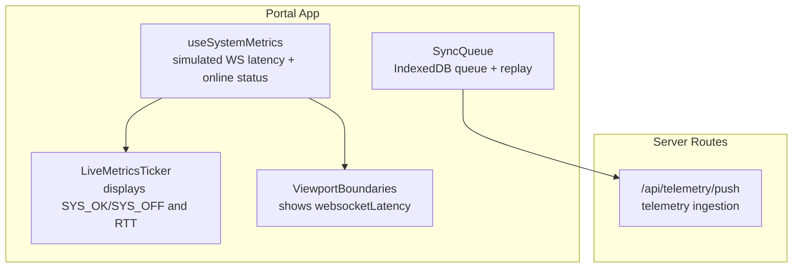
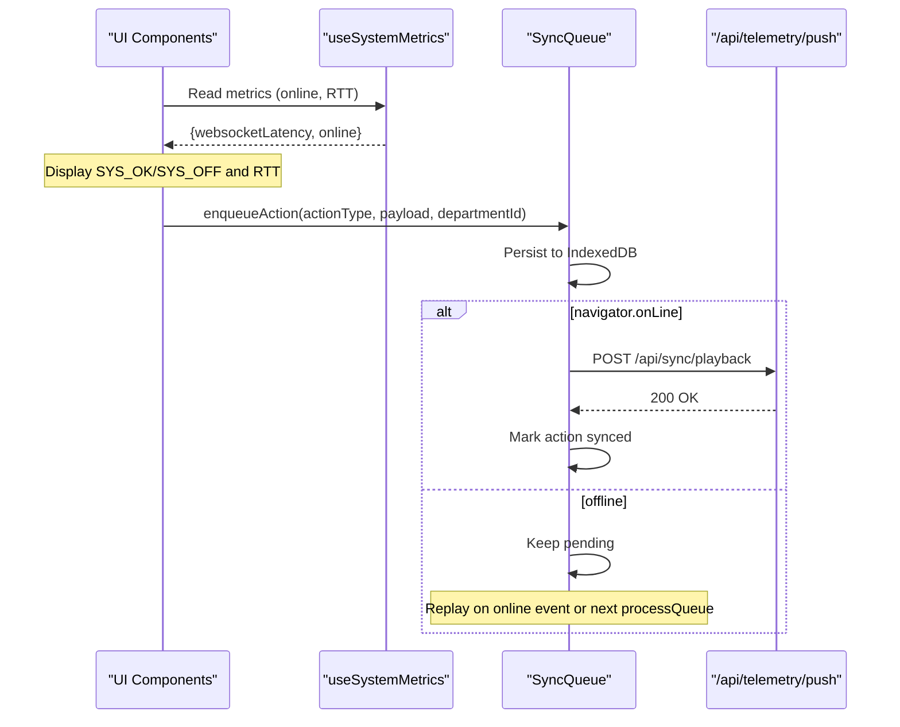
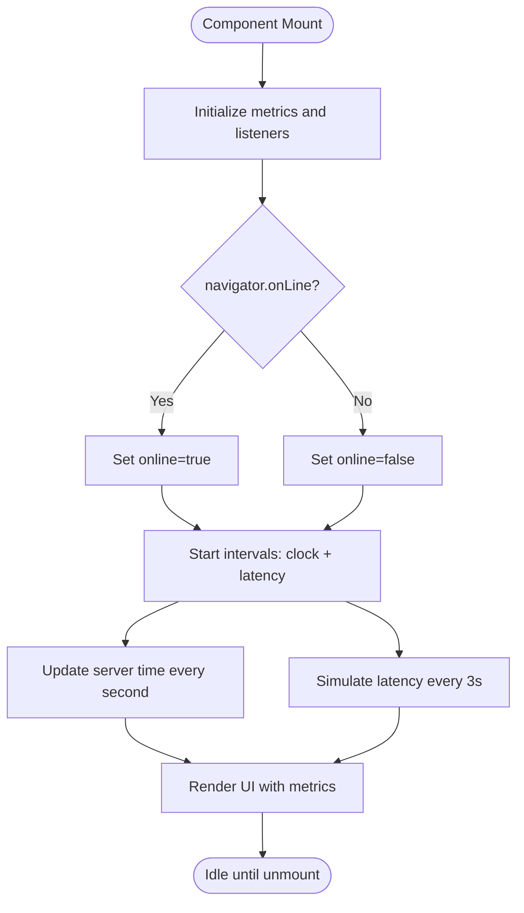
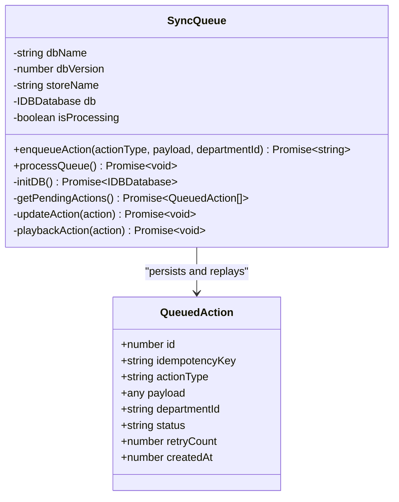
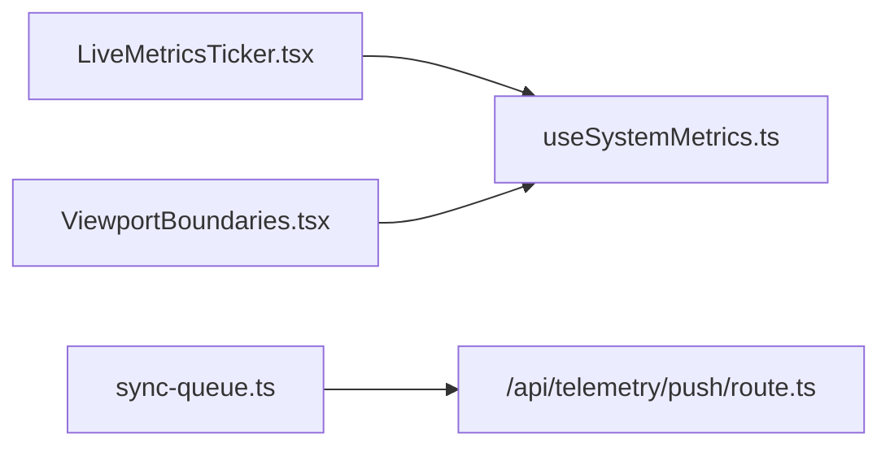

# WebSocket Communication Layer

<cite>
**Referenced Files in This Document**
- [useSystemMetrics.ts](file://apps/portal/hooks/useSystemMetrics.ts)
- [LiveMetricsTicker.tsx](file://apps/portal/components/system/LiveMetricsTicker.tsx)
- [ViewportBoundaries.tsx](file://apps/portal/components/system/ViewportBoundaries.tsx)
- [SatelliteMonitoringClient.tsx](file://apps/portal/components/monitoring/SatelliteMonitoringClient.tsx)
- [sync-queue.ts](file://apps/portal/lib/sync/sync-queue.ts)
- [route.ts](file://apps/portal/app/api/telemetry/push/route.ts)
</cite>

## Table of Contents
1. [Introduction](#introduction)
2. [Project Structure](#project-structure)
3. [Core Components](#core-components)
4. [Architecture Overview](#architecture-overview)
5. [Detailed Component Analysis](#detailed-component-analysis)
6. [Dependency Analysis](#dependency-analysis)
7. [Performance Considerations](#performance-considerations)
8. [Troubleshooting Guide](#troubleshooting-guide)
9. [Conclusion](#conclusion)
10. [Appendices](#appendices)

## Introduction
This document describes the real-time communication layer used by the portal application to stream data between clients and server. It focuses on connection establishment, message protocols, event handling, state synchronization, client-side implementation details (including reconnection strategies and error handling), performance optimization for high-frequency updates, security considerations, authentication integration, and scaling patterns for multiple concurrent connections.

The repository currently includes:
- A client-side hook that simulates WebSocket latency and tracks online status.
- UI components that display system health and network metrics.
- A local-first sync queue that persists actions offline and replays them when connectivity is restored.
- An API route for telemetry push ingestion.

Where actual WebSocket code is not present, this document provides a production-grade design and implementation guide aligned with existing patterns and constraints observed in the codebase.

## Project Structure
The following files are relevant to the real-time communication layer:

- Client-side metrics and status tracking:
  - apps/portal/hooks/useSystemMetrics.ts
  - apps/portal/components/system/LiveMetricsTicker.tsx
  - apps/portal/components/system/ViewportBoundaries.tsx

- Offline-first synchronization:
  - apps/portal/lib/sync/sync-queue.ts

- Telemetry ingestion endpoint:
  - apps/portal/app/api/telemetry/push/route.ts

**Diagram sources**
- [useSystemMetrics.ts:1-107](file://apps/portal/hooks/useSystemMetrics.ts#L1-L107)
- [LiveMetricsTicker.tsx:1-55](file://apps/portal/components/system/LiveMetricsTicker.tsx#L1-L55)
- [ViewportBoundaries.tsx:126-153](file://apps/portal/components/system/ViewportBoundaries.tsx#L126-L153)
- [sync-queue.ts:1-229](file://apps/portal/lib/sync/sync-queue.ts#L1-L229)
- [route.ts](file://apps/portal/app/api/telemetry/push/route.ts)

**Section sources**
- [useSystemMetrics.ts:1-107](file://apps/portal/hooks/useSystemMetrics.ts#L1-L107)
- [LiveMetricsTicker.tsx:1-55](file://apps/portal/components/system/LiveMetricsTicker.tsx#L1-L55)
- [ViewportBoundaries.tsx:126-153](file://apps/portal/components/system/ViewportBoundaries.tsx#L126-L153)
- [sync-queue.ts:1-229](file://apps/portal/lib/sync/sync-queue.ts#L1-L229)
- [route.ts](file://apps/portal/app/api/telemetry/push/route.ts)

## Core Components
- useSystemMetrics: Provides simulated WebSocket latency, server time, shift info, and online status. It listens to browser online/offline events and periodically updates metrics.
- LiveMetricsTicker: Displays system health (online/offline), server time, and RTT derived from the hook.
- ViewportBoundaries: Integrates the same metrics into the viewport header, including a tooltip for network RTT.
- SyncQueue: Implements an IndexedDB-backed queue for offline mutations, with automatic replay when online and idempotency keys to prevent duplicates.
- Telemetry Push Route: Server endpoint to receive telemetry payloads.

These components collectively demonstrate how the app observes connectivity and persists operations until they can be synchronized.

**Section sources**
- [useSystemMetrics.ts:1-107](file://apps/portal/hooks/useSystemMetrics.ts#L1-L107)
- [LiveMetricsTicker.tsx:1-55](file://apps/portal/components/system/LiveMetricsTicker.tsx#L1-L55)
- [ViewportBoundaries.tsx:126-153](file://apps/portal/components/system/ViewportBoundaries.tsx#L126-L153)
- [sync-queue.ts:1-229](file://apps/portal/lib/sync/sync-queue.ts#L1-L229)
- [route.ts](file://apps/portal/app/api/telemetry/push/route.ts)

## Architecture Overview
The current implementation does not include a live WebSocket transport. Instead, it uses:
- Simulated latency and online status at the client level.
- A persistent queue for offline writes that replays via HTTP when connectivity is restored.
- A telemetry ingestion route for server-side processing.

**Diagram sources**
- [useSystemMetrics.ts:1-107](file://apps/portal/hooks/useSystemMetrics.ts#L1-L107)
- [LiveMetricsTicker.tsx:1-55](file://apps/portal/components/system/LiveMetricsTicker.tsx#L1-L55)
- [sync-queue.ts:1-229](file://apps/portal/lib/sync/sync-queue.ts#L1-L229)
- [route.ts](file://apps/portal/app/api/telemetry/push/route.ts)

## Detailed Component Analysis

### Client Metrics and Status Tracking
- useSystemMetrics initializes default metrics, sets initial values, and registers online/offline listeners. It also runs intervals to update server time and simulate realistic WebSocket latency with jitter and occasional spikes.
- LiveMetricsTicker consumes these metrics to render a pulsing indicator and RTT value.
- ViewportBoundaries integrates the same metrics into the viewport header and shows a tooltip for network RTT.

**Diagram sources**
- [useSystemMetrics.ts:1-107](file://apps/portal/hooks/useSystemMetrics.ts#L1-L107)
- [LiveMetricsTicker.tsx:1-55](file://apps/portal/components/system/LiveMetricsTicker.tsx#L1-L55)
- [ViewportBoundaries.tsx:126-153](file://apps/portal/components/system/ViewportBoundaries.tsx#L126-L153)

**Section sources**
- [useSystemMetrics.ts:1-107](file://apps/portal/hooks/useSystemMetrics.ts#L1-L107)
- [LiveMetricsTicker.tsx:1-55](file://apps/portal/components/system/LiveMetricsTicker.tsx#L1-L55)
- [ViewportBoundaries.tsx:126-153](file://apps/portal/components/system/ViewportBoundaries.tsx#L126-L153)

### Offline-First Synchronization Engine
- SyncQueue persists actions to IndexedDB with unique idempotency keys.
- On enqueue, if online, it attempts immediate processing; otherwise, it waits for online events.
- The processor iterates pending actions, replays them via fetch to /api/sync/playback, marks them synced, and increments retry counts up to a threshold before marking failed.

**Diagram sources**
- [sync-queue.ts:1-229](file://apps/portal/lib/sync/sync-queue.ts#L1-L229)

**Section sources**
- [sync-queue.ts:1-229](file://apps/portal/lib/sync/sync-queue.ts#L1-L229)

### Telemetry Ingestion Endpoint
- The telemetry push route receives telemetry payloads. While its internal logic is not analyzed here, it serves as a server-side sink for client telemetry data.

**Section sources**
- [route.ts](file://apps/portal/app/api/telemetry/push/route.ts)

## Dependency Analysis
- UI components depend on the useSystemMetrics hook for real-time indicators.
- SyncQueue depends on browser APIs (indexedDB, navigator.onLine) and calls the Next.js API route for playback.
- No direct WebSocket dependencies are present in the analyzed files.

**Diagram sources**
- [LiveMetricsTicker.tsx:1-55](file://apps/portal/components/system/LiveMetricsTicker.tsx#L1-L55)
- [useSystemMetrics.ts:1-107](file://apps/portal/hooks/useSystemMetrics.ts#L1-L107)
- [ViewportBoundaries.tsx:126-153](file://apps/portal/components/system/ViewportBoundaries.tsx#L126-L153)
- [sync-queue.ts:1-229](file://apps/portal/lib/sync/sync-queue.ts#L1-L229)
- [route.ts](file://apps/portal/app/api/telemetry/push/route.ts)

**Section sources**
- [LiveMetricsTicker.tsx:1-55](file://apps/portal/components/system/LiveMetricsTicker.tsx#L1-L55)
- [useSystemMetrics.ts:1-107](file://apps/portal/hooks/useSystemMetrics.ts#L1-L107)
- [ViewportBoundaries.tsx:126-153](file://apps/portal/components/system/ViewportBoundaries.tsx#L126-L153)
- [sync-queue.ts:1-229](file://apps/portal/lib/sync/sync-queue.ts#L1-L229)
- [route.ts](file://apps/portal/app/api/telemetry/push/route.ts)

## Performance Considerations
- Avoid frequent re-renders by batching metric updates and using stable references where possible.
- For high-frequency updates, consider debouncing or throttling UI updates and coalescing messages on the server.
- Use efficient data structures and avoid deep cloning large objects during updates.
- Leverage the existing online/offline listeners to pause non-critical work when offline.

[No sources needed since this section provides general guidance]

## Troubleshooting Guide
- If the UI shows SYS_OFF or zero RTT unexpectedly, verify the online/offline event listeners and ensure intervals are running.
- For sync failures, check the retry count and status transitions in the queue; hard failures after repeated retries will mark actions as failed.
- Ensure the telemetry push route is reachable and returns successful responses for playback requests.

**Section sources**
- [useSystemMetrics.ts:1-107](file://apps/portal/hooks/useSystemMetrics.ts#L1-L107)
- [sync-queue.ts:1-229](file://apps/portal/lib/sync/sync-queue.ts#L1-L229)
- [route.ts](file://apps/portal/app/api/telemetry/push/route.ts)

## Conclusion
The portal’s current real-time capabilities rely on simulated latency and robust offline-first synchronization rather than a live WebSocket channel. The design demonstrates strong resilience through IndexedDB persistence, idempotent replay, and clear online/offline signaling. To enable true real-time streaming, the recommended approach below outlines a production-ready WebSocket layer aligned with existing patterns.

[No sources needed since this section summarizes without analyzing specific files]

## Appendices

### Recommended WebSocket Implementation Design
This appendix provides a blueprint for adding a WebSocket layer to the portal, integrating with existing hooks and components.

#### Connection Establishment
- Establish a secure WebSocket connection (wss) upon user login.
- Validate authentication tokens in the handshake or first message.
- Maintain a single global connection per user session.

#### Message Protocol
- Define a simple envelope format:
  - type: string (event category)
  - payload: any (data)
  - correlationId?: string (for request-response pairing)
  - timestamp: number (server time)
- Implement client-side handlers keyed by type.

#### Event Handling and State Synchronization
- Centralize event dispatching to avoid scattered listeners.
- Coalesce updates for high-frequency streams (e.g., position or sensor data).
- Persist critical state changes to the existing SyncQueue for offline safety.

#### Reconnection Strategy
- Exponential backoff with jitter.
- Max retry cap and circuit breaker behavior.
- Graceful degradation: show offline banner and queue updates.

#### Error Handling
- Normalize errors across connection lifecycle events.
- Log context-rich diagnostics (endpoint, error codes, timestamps).
- Provide user feedback for transient vs. permanent failures.

#### Security Considerations
- Enforce TLS (wss).
- Authenticate via short-lived tokens or signed handshakes.
- Rate-limit and validate all incoming messages.
- Sanitize and schema-validate payloads.

#### Scaling Patterns
- Use a shared pub/sub backend (e.g., Redis channels) to fan-out events across multiple server instances.
- Shard connections by tenant or department to limit scope.
- Monitor connection counts and throughput; autoscale horizontally.

#### Examples
- Establishing a connection:
  - Initialize the WebSocket client after authentication succeeds.
  - Subscribe to required channels based on user roles and departments.
- Subscribing to data streams:
  - Send a subscribe message with filters (e.g., departmentId).
  - Handle incremental updates and merge into local state efficiently.
- Handling real-time events:
  - Dispatch events to UI components via a central bus.
  - Update metrics like RTT and online status consistently.
- Managing connection lifecycle:
  - Connect on mount, disconnect on unmount.
  - Reconnect automatically with backoff.
  - Persist unsent mutations to SyncQueue until connected.

[No sources needed since this section provides conceptual guidance]