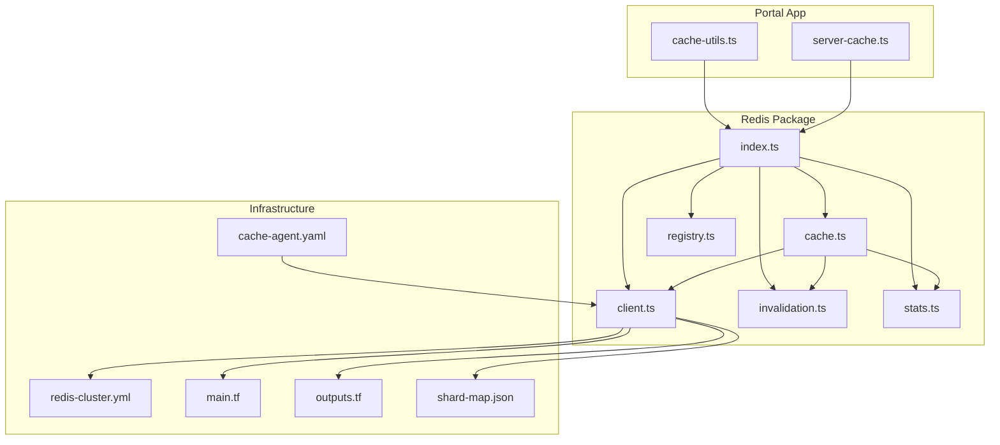
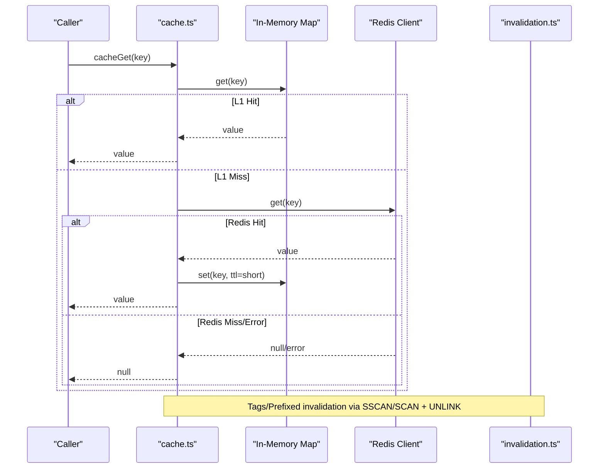
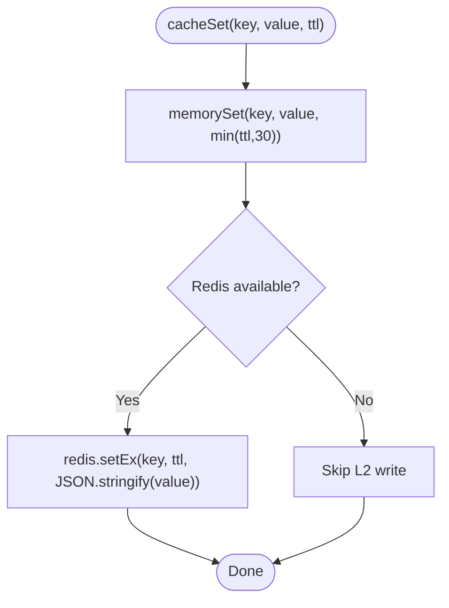
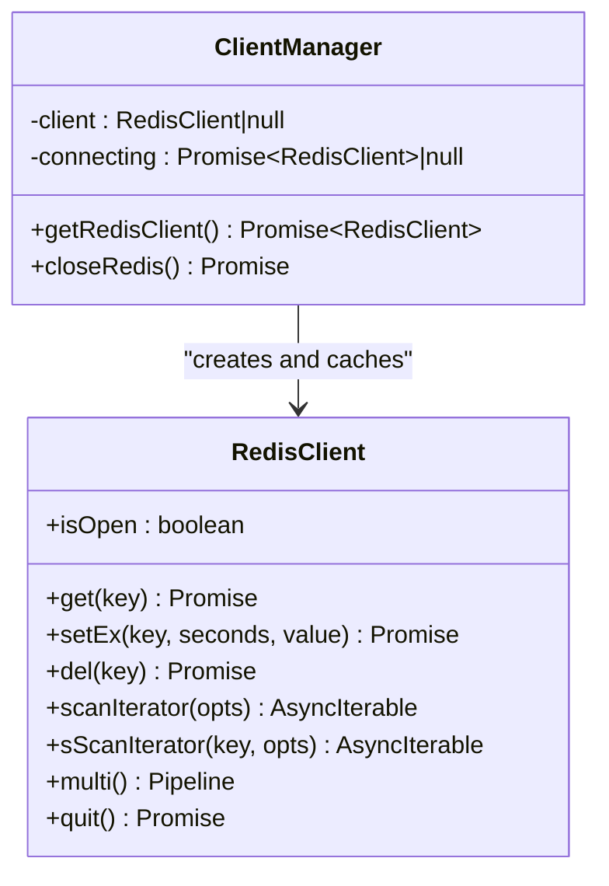
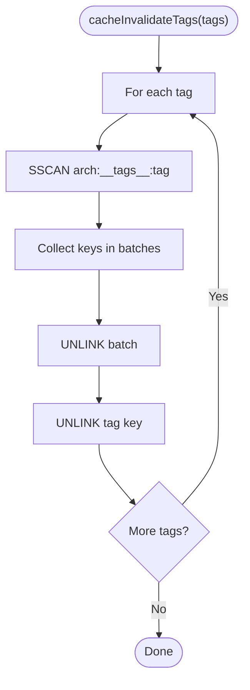
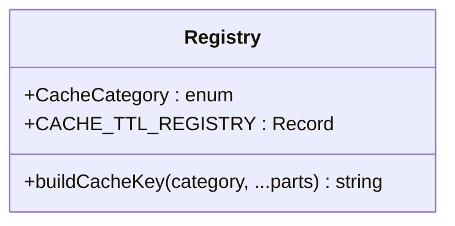
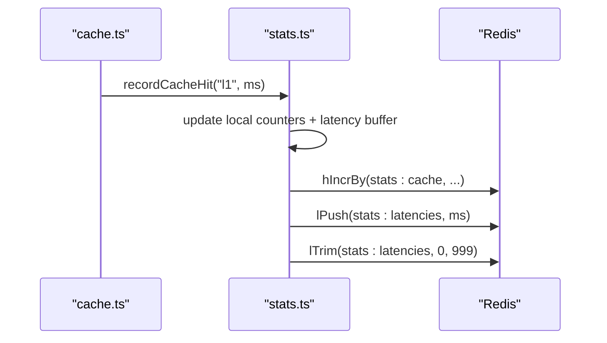
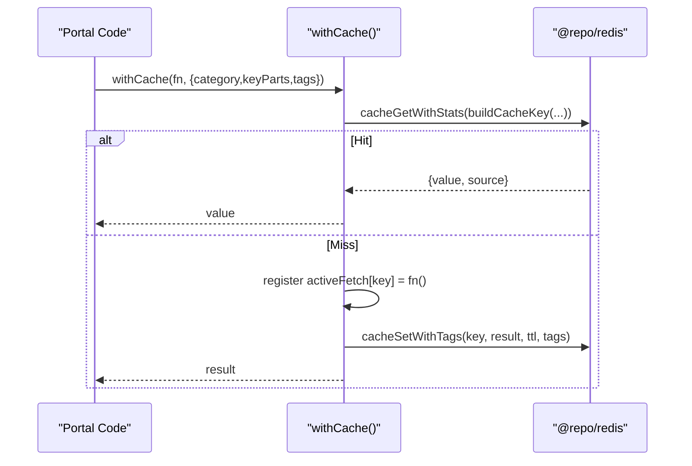
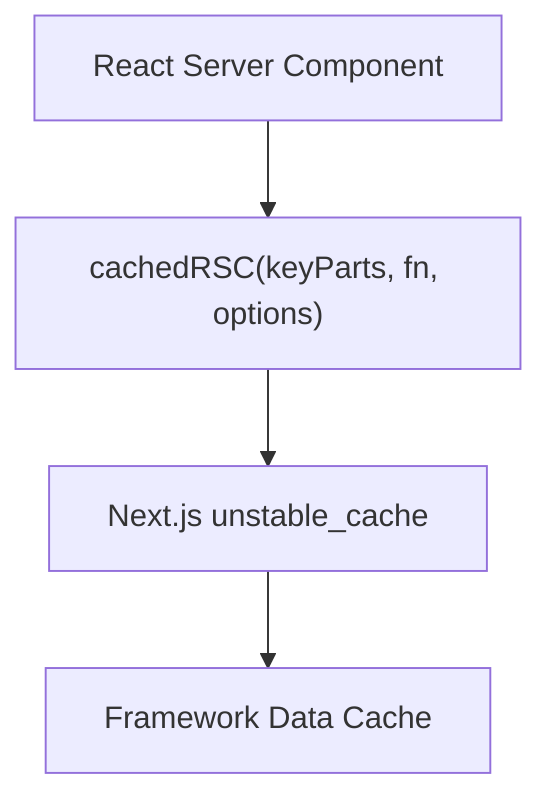
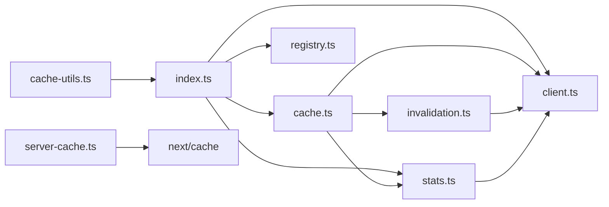

# Caching & Redis Utilities

<cite>
**Referenced Files in This Document**
- [index.ts](file://packages/redis/src/index.ts)
- [cache.ts](file://packages/redis/src/cache.ts)
- [client.ts](file://packages/redis/src/client.ts)
- [invalidation.ts](file://packages/redis/src/invalidation.ts)
- [registry.ts](file://packages/redis/src/registry.ts)
- [stats.ts](file://packages/redis/src/stats.ts)
- [cache-utils.ts](file://apps/portal/lib/cache-utils.ts)
- [server-cache.ts](file://apps/portal/lib/server-cache.ts)
- [cache-dashboard.json](file://infra/observability/grafana-dashboards/cache-dashboard.json)
- [067_cache_events.sql](file://packages/database/migrations/067_cache_events.sql)
- [redis-cluster.yml](file://redis-topology/docker-compose/redis-cluster.yml)
- [main.tf](file://redis-topology/terraform/main.tf)
- [outputs.tf](file://redis-topology/terraform/outputs.tf)
- [shard-map.json](file://redis-topology/config/shard-map.json)
- [cache-agent.yaml](file://infra/k8s/cache-agent.yaml)
</cite>

## Table of Contents
1. Introduction
2. Project Structure
3. Core Components
4. Architecture Overview
5. Detailed Component Analysis
6. Dependency Analysis
7. Performance Considerations
8. Troubleshooting Guide
9. Conclusion
10. Appendices

## Introduction
This document explains the caching utilities and Redis integration across the project. It covers a multi-level caching strategy (in-memory L1 and Redis L2), cache invalidation patterns, performance monitoring, server-side caching for React Server Components, client-side strategies, and cache warming techniques. It also documents Redis connection management, clustering support, disaster recovery procedures, security considerations, serialization formats, and debugging techniques.

## Project Structure
The caching system is implemented as a shared package with clear separation of concerns:
- Client lifecycle and reconnection logic
- Multi-level cache operations (L1 memory + L2 Redis)
- Tag-based and prefix-based invalidation
- TTL registry and key building conventions
- Stats collection and reporting
- Portal-specific wrappers for request coalescing and Next.js RSC caching

**Diagram sources**
- [index.ts:1-27](file://packages/redis/src/index.ts#L1-L27)
- [cache.ts:1-269](file://packages/redis/src/cache.ts#L1-L269)
- [client.ts:1-67](file://packages/redis/src/client.ts#L1-L67)
- [invalidation.ts:1-114](file://packages/redis/src/invalidation.ts#L1-L114)
- [registry.ts:1-34](file://packages/redis/src/registry.ts#L1-L34)
- [stats.ts:1-169](file://packages/redis/src/stats.ts#L1-L169)
- [cache-utils.ts:1-79](file://apps/portal/lib/cache-utils.ts#L1-L79)
- [server-cache.ts:1-27](file://apps/portal/lib/server-cache.ts#L1-L27)
- [redis-cluster.yml:1-36](file://redis-topology/docker-compose/redis-cluster.yml#L1-L36)
- [main.tf:1-26](file://redis-topology/terraform/main.tf#L1-L26)
- [outputs.tf:1-8](file://redis-topology/terraform/outputs.tf#L1-L8)
- [shard-map.json:1-17](file://redis-topology/config/shard-map.json#L1-L17)
- [cache-agent.yaml:1-31](file://infra/k8s/cache-agent.yaml#L1-L31)

**Section sources**
- [index.ts:1-27](file://packages/redis/src/index.ts#L1-L27)
- [cache.ts:1-269](file://packages/redis/src/cache.ts#L1-L269)
- [client.ts:1-67](file://packages/redis/src/client.ts#L1-L67)
- [invalidation.ts:1-114](file://packages/redis/src/invalidation.ts#L1-L114)
- [registry.ts:1-34](file://packages/redis/src/registry.ts#L1-L34)
- [stats.ts:1-169](file://packages/redis/src/stats.ts#L1-L169)
- [cache-utils.ts:1-79](file://apps/portal/lib/cache-utils.ts#L1-L79)
- [server-cache.ts:1-27](file://apps/portal/lib/server-cache.ts#L1-L27)

## Core Components
- Multi-level cache API: read/write/wrap/delete/tagged write/prefix invalidation/L1 eviction/clear
- Redis client singleton with safe access and reconnection handling
- Invalidation engine using tag sets and SCAN-based prefix deletion
- TTL registry and key builder for consistent naming and policy-driven TTLs
- Stats module recording hits/misses/errors and latency percentiles

Key responsibilities:
- cache.ts: Implements L1/L2 reads/writes, single-flight coalescing helpers, and invalidation entry points
- client.ts: Manages Redis client lifecycle, error/end events, and graceful close
- invalidation.ts: Maintains tag indexes and performs non-blocking invalidation by tags or prefixes
- registry.ts: Defines categories, TTL policies, and key construction
- stats.ts: Records metrics locally and to Redis; exposes snapshots and reset
- cache-utils.ts: Portal wrapper with category-aware TTL, single-flight per-request, and fallback behavior
- server-cache.ts: Next.js unstable_cache integration for RSC data caching with tags

**Section sources**
- [cache.ts:1-269](file://packages/redis/src/cache.ts#L1-L269)
- [client.ts:1-67](file://packages/redis/src/client.ts#L1-L67)
- [invalidation.ts:1-114](file://packages/redis/src/invalidation.ts#L1-L114)
- [registry.ts:1-34](file://packages/redis/src/registry.ts#L1-L34)
- [stats.ts:1-169](file://packages/redis/src/stats.ts#L1-L169)
- [cache-utils.ts:1-79](file://apps/portal/lib/cache-utils.ts#L1-L79)
- [server-cache.ts:1-27](file://apps/portal/lib/server-cache.ts#L1-L27)

## Architecture Overview
The system uses a two-tier cache:
- L1: Process-local Map with TTL and simple LRU eviction
- L2: Redis-backed store with setEx for TTL and tag indexing via Sets

Read path checks L1 first, then L2; on L2 hit, it repopulates L1 with a short TTL. Writes are write-through to both layers. Invalidation supports tag-based and prefix-based deletion using SCAN/SSCAN and UNLINK to avoid blocking.

**Diagram sources**
- [cache.ts:80-150](file://packages/redis/src/cache.ts#L80-L150)
- [client.ts:16-54](file://packages/redis/src/client.ts#L16-L54)
- [invalidation.ts:40-113](file://packages/redis/src/invalidation.ts#L40-L113)

## Detailed Component Analysis

### Multi-Level Cache Operations (L1 + L2)
- Reads: L1-first, L2 fallback; L2 hits repopulate L1 with short TTL
- Writes: Write-through to L1 (capped TTL) and L2 (setEx)
- Single-flight: cacheWrap and portal withCache prevent thundering herds
- Deletion: Direct key delete and prefix-based deletion; L1 cleared by prefix scan

**Diagram sources**
- [cache.ts:156-174](file://packages/redis/src/cache.ts#L156-L174)

**Section sources**
- [cache.ts:1-269](file://packages/redis/src/cache.ts#L1-L269)

### Redis Client Management
- Singleton client with deduplicated concurrent connect attempts
- Reconnect strategy with bounded retries and exponential backoff
- Error and end event handlers reset state for retry on next call
- Graceful close utility for shutdown/test cleanup

**Diagram sources**
- [client.ts:1-67](file://packages/redis/src/client.ts#L1-L67)

**Section sources**
- [client.ts:1-67](file://packages/redis/src/client.ts#L1-L67)

### Invalidation Engine (Tags and Prefixes)
- Tags: Keys indexed under arch:__tags__:<tag> using Redis Sets
- Tag invalidation: SSCAN iterator + batched UNLINK to avoid blocking
- Prefix invalidation: SCAN iterator + batched UNLINK
- L1 consistency: L1 entries deleted by matching prefix

**Diagram sources**
- [invalidation.ts:17-72](file://packages/redis/src/invalidation.ts#L17-L72)

**Section sources**
- [invalidation.ts:1-114](file://packages/redis/src/invalidation.ts#L1-L114)
- [cache.ts:243-260](file://packages/redis/src/cache.ts#L243-L260)

### TTL Registry and Key Building
- Categories define TTL policies for L1 and L2
- buildCacheKey enforces consistent naming with namespace prefix
- Portal withCache resolves TTL from registry based on category

**Diagram sources**
- [registry.ts:1-34](file://packages/redis/src/registry.ts#L1-L34)

**Section sources**
- [registry.ts:1-34](file://packages/redis/src/registry.ts#L1-L34)
- [cache-utils.ts:30-56](file://apps/portal/lib/cache-utils.ts#L30-L56)

### Stats and Monitoring
- Local counters and sliding window of latencies
- Fire-and-forget updates to Redis hashes/lists for cross-process visibility
- Snapshot API returns aggregated metrics including p95 latency
- Grafana dashboard configuration references telemetry metrics

**Diagram sources**
- [stats.ts:59-83](file://packages/redis/src/stats.ts#L59-L83)
- [cache.ts:80-113](file://packages/redis/src/cache.ts#L80-L113)

**Section sources**
- [stats.ts:1-169](file://packages/redis/src/stats.ts#L1-L169)
- [cache-dashboard.json:1-21](file://infra/observability/grafana-dashboards/cache-dashboard.json#L1-L21)

### Portal-Specific Caching Wrapper
- Builds keys via registry, fetches TTL from registry
- On miss, executes function once and caches result with tags
- Coalesces concurrent duplicate requests per key
- Handles DatabaseError by not caching and rethrowing
- Falls back to L1 stale value when Redis was unreachable

**Diagram sources**
- [cache-utils.ts:30-78](file://apps/portal/lib/cache-utils.ts#L30-L78)
- [cache.ts:119-150](file://packages/redis/src/cache.ts#L119-L150)

**Section sources**
- [cache-utils.ts:1-79](file://apps/portal/lib/cache-utils.ts#L1-L79)

### Server-Side Caching (Next.js RSC)
- Wraps unstable_cache to integrate with Next.js Data Cache
- Supports revalidate TTL and tags-based revalidation
- Useful for server component reads that should be cached at framework level

**Diagram sources**
- [server-cache.ts:12-26](file://apps/portal/lib/server-cache.ts#L12-L26)

**Section sources**
- [server-cache.ts:1-27](file://apps/portal/lib/server-cache.ts#L1-L27)

## Dependency Analysis
High-level dependencies between modules:
- index.ts re-exports public APIs from cache, client, registry, and stats
- cache.ts depends on client, invalidation, and stats
- invalidation.ts depends on client
- stats.ts depends on client
- registry.ts is standalone and consumed by cache-utils.ts and callers
- cache-utils.ts depends on @repo/redis exports and portal error classes
- server-cache.ts depends on Next.js unstable_cache

**Diagram sources**
- [index.ts:1-27](file://packages/redis/src/index.ts#L1-L27)
- [cache.ts:1-269](file://packages/redis/src/cache.ts#L1-L269)
- [client.ts:1-67](file://packages/redis/src/client.ts#L1-L67)
- [invalidation.ts:1-114](file://packages/redis/src/invalidation.ts#L1-L114)
- [registry.ts:1-34](file://packages/redis/src/registry.ts#L1-L34)
- [stats.ts:1-169](file://packages/redis/src/stats.ts#L1-L169)
- [cache-utils.ts:1-79](file://apps/portal/lib/cache-utils.ts#L1-L79)
- [server-cache.ts:1-27](file://apps/portal/lib/server-cache.ts#L1-L27)

**Section sources**
- [index.ts:1-27](file://packages/redis/src/index.ts#L1-L27)
- [cache.ts:1-269](file://packages/redis/src/cache.ts#L1-L269)
- [client.ts:1-67](file://packages/redis/src/client.ts#L1-L67)
- [invalidation.ts:1-114](file://packages/redis/src/invalidation.ts#L1-L114)
- [registry.ts:1-34](file://packages/redis/src/registry.ts#L1-L34)
- [stats.ts:1-169](file://packages/redis/src/stats.ts#L1-L169)
- [cache-utils.ts:1-79](file://apps/portal/lib/cache-utils.ts#L1-L79)
- [server-cache.ts:1-27](file://apps/portal/lib/server-cache.ts#L1-L27)

## Performance Considerations
- L1 cap and TTL: L1 max entries and capped TTL reduce memory pressure while improving hot-path latency
- Non-blocking invalidation: SCAN/SSCAN and UNLINK avoid long tail latency spikes
- Request coalescing: Single-flight prevents thundering herd on cache misses
- Serialization overhead: JSON.stringify/parse used consistently; keep payload sizes reasonable
- Latency tracking: Sliding window and percentile computation provide actionable insights
- Write amplification: Write-through ensures consistency but increases writes; consider batching where appropriate

[No sources needed since this section provides general guidance]

## Troubleshooting Guide
Common issues and remedies:
- Redis unavailable: Reads degrade gracefully; withCache falls back to L1 if present; ensure REDIS_URL is configured
- High miss rate: Validate TTL policies and key uniqueness; check tag/prefix invalidation correctness
- Memory growth: Monitor L1 size; adjust L1_MAX_ENTRIES or TTL caps if needed
- Slow invalidation: Ensure SCAN/SSCAN usage and batch sizes are appropriate; avoid KEYS/SMEMBERS
- Metrics missing: Verify fire-and-forget Redis ops succeed; inspect stats:cache and stats:latencies

Operational artifacts:
- Grafana dashboard config for cache telemetry
- Database tables for raw cache events and anomalies for deeper analysis

**Section sources**
- [cache-utils.ts:60-78](file://apps/portal/lib/cache-utils.ts#L60-L78)
- [cache.ts:243-260](file://packages/redis/src/cache.ts#L243-L260)
- [stats.ts:120-169](file://packages/redis/src/stats.ts#L120-L169)
- [cache-dashboard.json:1-21](file://infra/observability/grafana-dashboards/cache-dashboard.json#L1-L21)
- [067_cache_events.sql:1-34](file://packages/database/migrations/067_cache_events.sql#L1-L34)

## Conclusion
The caching layer provides a robust, observable, and scalable solution combining fast in-memory reads with durable Redis storage. Tag-based and prefix-based invalidation, combined with request coalescing and Next.js RSC caching, delivers strong performance and freshness guarantees. The infrastructure definitions enable clustered deployments and automated failover, while stats and dashboards support ongoing optimization.

[No sources needed since this section summarizes without analyzing specific files]

## Appendices

### Redis Connection Management and Clustering
- Environment: REDIS_URL controls endpoint; default localhost:6379
- Docker Compose cluster: three nodes with cluster-enabled mode and init job
- Terraform: Elasticache replication group with cluster mode and automatic failover
- Outputs: Configuration endpoint and port for application wiring
- Shard map: Strategy and node lists for namespaces

**Section sources**
- [client.ts:3-35](file://packages/redis/src/client.ts#L3-L35)
- [redis-cluster.yml:1-36](file://redis-topology/docker-compose/redis-cluster.yml#L1-L36)
- [main.tf:10-25](file://redis-topology/terraform/main.tf#L10-L25)
- [outputs.tf:1-8](file://redis-topology/terraform/outputs.tf#L1-L8)
- [shard-map.json:1-17](file://redis-topology/config/shard-map.json#L1-L17)

### Disaster Recovery Procedures
- Automatic failover enabled in Elasticache configuration
- Application-level reconnection handles transient errors and resets state for retry
- Use closeRedis during controlled shutdowns to drain connections
- For cluster topology changes, update REDIS_URL or configuration endpoint accordingly

**Section sources**
- [main.tf:17-22](file://redis-topology/terraform/main.tf#L17-L22)
- [client.ts:37-54](file://packages/redis/src/client.ts#L37-L54)
- [client.ts:60-66](file://packages/redis/src/client.ts#L60-L66)

### Security Considerations
- Transport: Use TLS endpoints in production (configure via REDIS_URL scheme and client options)
- Network: Restrict access via security groups/subnets in Elasticache deployment
- Secrets: Store credentials in environment variables or secret managers; never hardcode
- Data: Avoid storing sensitive payloads in cache unless encrypted at rest and in transit

[No sources needed since this section provides general guidance]

### Serialization Formats
- Values are serialized/deserialized using JSON.stringify/JSON.parse
- Keep payloads small and stable; prefer primitive-friendly structures
- For large objects, consider compression or alternative encodings outside core cache layer

**Section sources**
- [cache.ts:28-44](file://packages/redis/src/cache.ts#L28-L44)
- [cache.ts:98-103](file://packages/redis/src/cache.ts#L98-L103)
- [cache.ts:169-170](file://packages/redis/src/cache.ts#L169-L170)

### Debugging Techniques
- Inspect stats:cache and stats:latencies in Redis for live metrics
- Use getCacheStats/resetCacheStats to snapshot and clear metrics
- Enable logging around cacheGetWithStats and withCache flows for detailed tracing
- Validate tag indexes under arch:__tags__:* and confirm SCAN/SSCAN results

**Section sources**
- [stats.ts:120-169](file://packages/redis/src/stats.ts#L120-L169)
- [invalidation.ts:17-33](file://packages/redis/src/invalidation.ts#L17-L33)

### Custom Cache Provider Implementation
To implement a custom provider:
- Implement a client interface compatible with get/set/del/scan/sScan operations
- Provide a singleton accessor similar to getRedisClient
- Integrate with invalidation by supporting SET membership and SCAN iteration
- Wire into cache.ts by replacing getRedisClientSafe with your implementation

[No sources needed since this section provides general guidance]

### Client-Side Caching Strategies
- Use browser storage (localStorage/sessionStorage) for user-scoped preferences
- Apply service workers for network request caching with cache-busting keys
- Combine with server-side tags to invalidate client caches on content updates

[No sources needed since this section provides general guidance]

### Cache Warming Techniques
- Pre-populate high-value keys after deployment or schedule periodic warmers
- Use background jobs to compute and set keys with appropriate TTLs
- Leverage tags to coordinate warm-up and invalidation cycles

[No sources needed since this section provides general guidance]