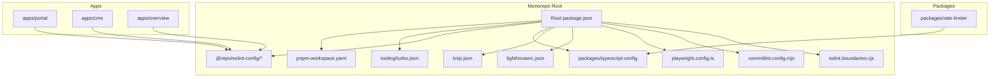
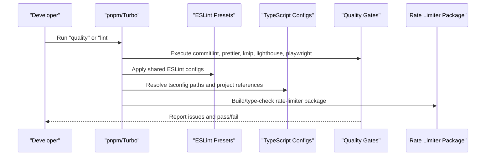
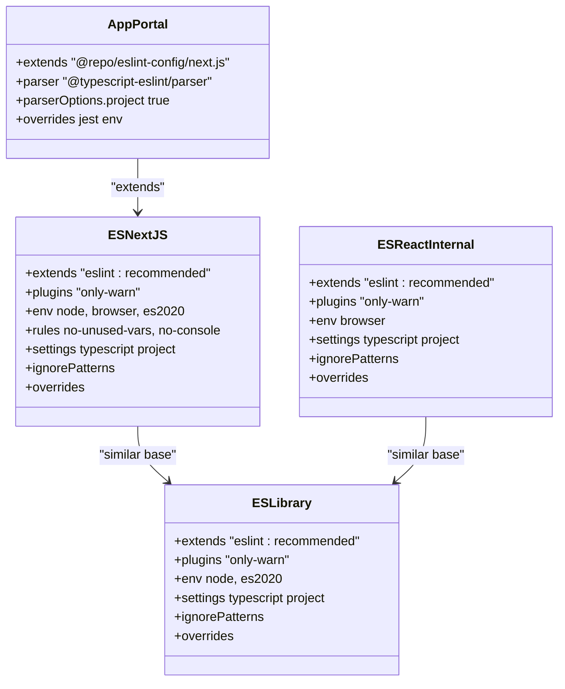
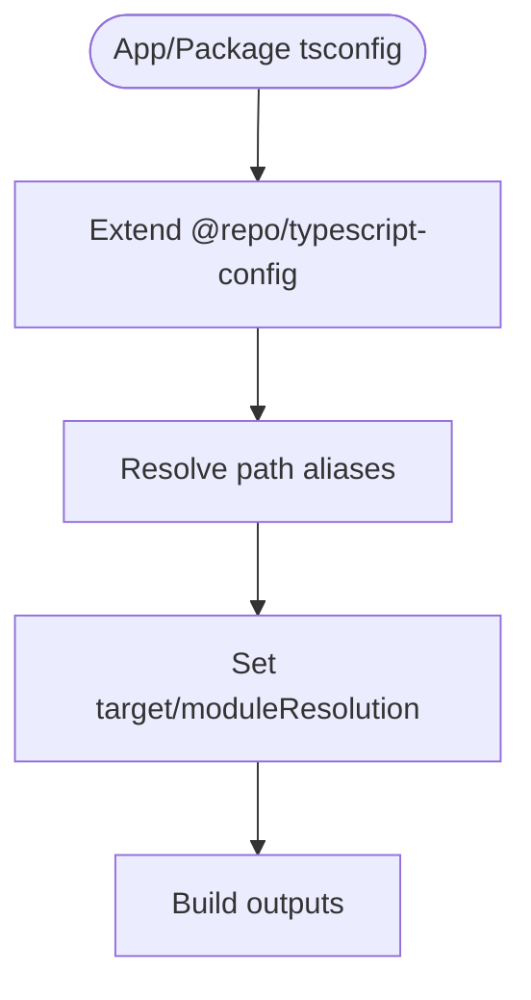
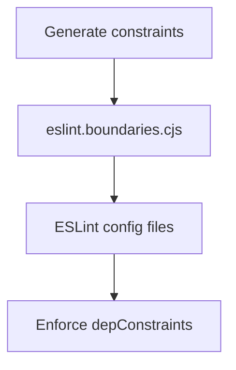
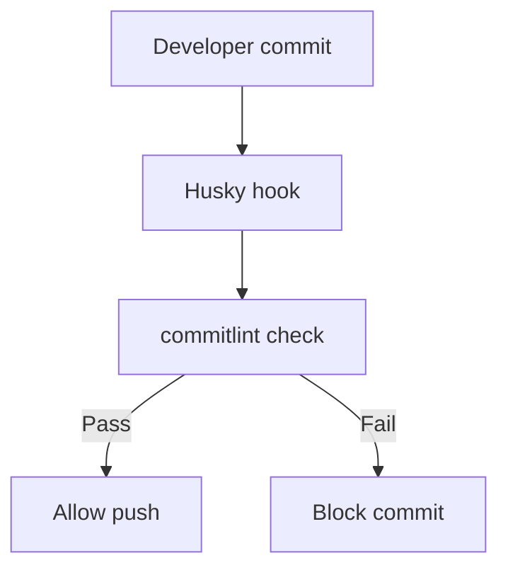
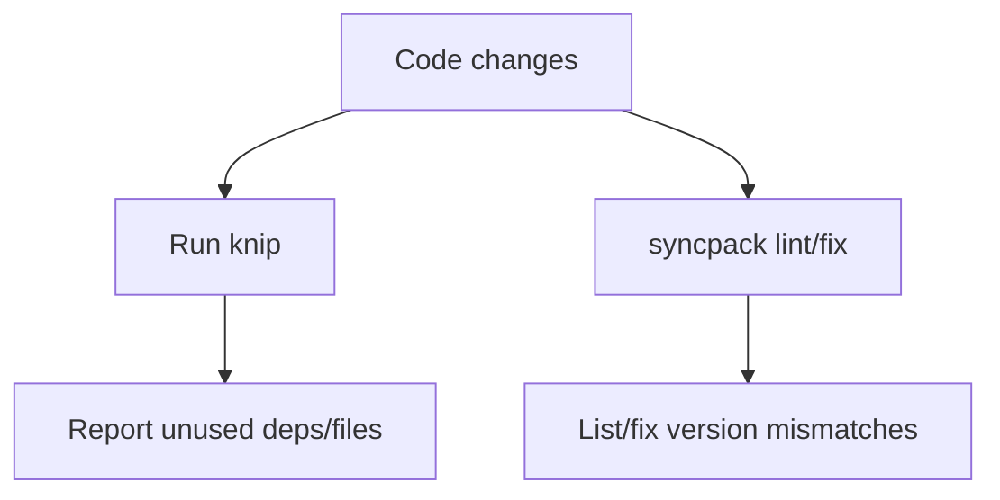
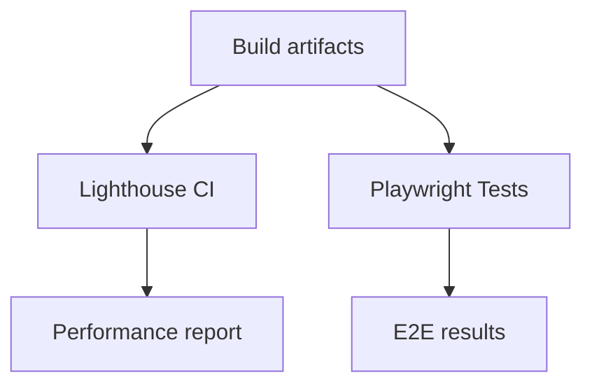
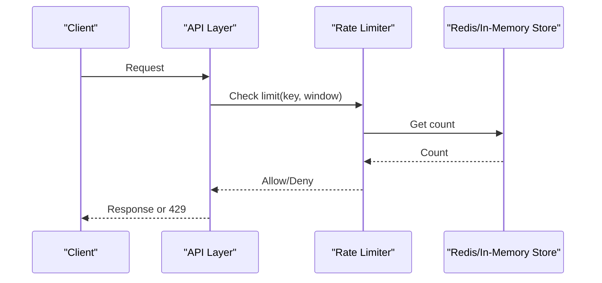
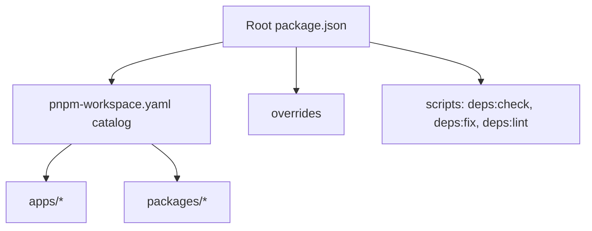

# Development Tools & Configuration

<cite>
**Referenced Files in This Document**
- [package.json](file://package.json)
- [pnpm-workspace.yaml](file://pnpm-workspace.yaml)
- [tooling/turbo.json](file://tooling/turbo.json)
- [packages/eslint-config/package.json](file://packages/eslint-config/package.json)
- [packages/eslint-config/library.js](file://packages/eslint-config/library.js)
- [packages/eslint-config/next.js](file://packages/eslint-config/next.js)
- [packages/eslint-config/react-internal.js](file://packages/eslint-config/react-internal.js)
- [apps/portal/.eslintrc.js](file://apps/portal/.eslintrc.js)
- [eslint.boundaries.cjs](file://eslint.boundaries.cjs)
- [prettier.config.mjs](file://prettier.config.mjs)
- [commitlint.config.mjs](file://commitlint.config.mjs)
- [knip.json](file://knip.json)
- [lighthouserc.json](file://lighthouserc.json)
- [playwright.config.ts](file://playwright.config.ts)
- [nx.json](file://nx.json)
- [packages/rate-limiter/tsconfig.json](file://packages/rate-limiter/tsconfig.json)
</cite>

## Table of Contents
1. [Introduction](#introduction)
2. [Project Structure](#project-structure)
3. [Core Components](#core-components)
4. [Architecture Overview](#architecture-overview)
5. [Detailed Component Analysis](#detailed-component-analysis)
6. [Dependency Analysis](#dependency-analysis)
7. [Performance Considerations](#performance-considerations)
8. [Troubleshooting Guide](#troubleshooting-guide)
9. [Conclusion](#conclusion)
10. [Appendices](#appendices)

## Introduction
This document explains the development tooling, linting configurations, TypeScript configuration sharing, and rate limiting utilities across the monorepo. It covers ESLint rules, shared TypeScript configs, code quality standards, API throttling and resource protection mechanisms, testing utilities, debugging tools, and development environment setup. It also includes guidance for extending configurations, adding new rules, customizing workflows, build optimization, dependency management, and monorepo tooling integration.

## Project Structure
The repository is a pnpm-based monorepo with apps under apps/* and shared packages under packages/*. The root orchestrates tooling via scripts and shared configs:
- Package manager and workspace definitions
- Turborepo pipeline for caching and task orchestration
- Shared ESLint presets for different environments (Next.js, libraries, React internal)
- TypeScript config sharing via a dedicated package
- Quality gates: commit linting, formatting, dead code detection, Lighthouse, Playwright E2E

**Diagram sources**
- [package.json:50-88](file://package.json#L50-L88)
- [pnpm-workspace.yaml:1-33](file://pnpm-workspace.yaml#L1-L33)
- [tooling/turbo.json:1-23](file://tooling/turbo.json#L1-L23)
- [packages/eslint-config/package.json:1-16](file://packages/eslint-config/package.json#L1-L16)
- [packages/typescript-config/package.json:1-7](file://packages/typescript-config/package.json#L1-L7)
- [knip.json](file://knip.json)
- [lighthouserc.json](file://lighthouserc.json)
- [playwright.config.ts](file://playwright.config.ts)
- [commitlint.config.mjs](file://commitlint.config.mjs)
- [eslint.boundaries.cjs:1-20](file://eslint.boundaries.cjs#L1-L20)
- [apps/portal/.eslintrc.js:1-22](file://apps/portal/.eslintrc.js#L1-L22)

**Section sources**
- [package.json:1-96](file://package.json#L1-L96)
- [pnpm-workspace.yaml:1-33](file://pnpm-workspace.yaml#L1-L33)
- [tooling/turbo.json:1-23](file://tooling/turbo.json#L1-L23)

## Core Components
- Monorepo orchestration: pnpm workspaces + Turborepo tasks for build, lint, test, type-check, dev.
- Shared ESLint presets: library, Next.js, React internal.
- TypeScript configuration sharing via @repo/typescript-config.
- Code quality: commitlint, prettier, knip, Lighthouse, Playwright.
- Module boundaries enforcement via generated constraints.
- Rate limiter package for API throttling and resource protection.

**Section sources**
- [package.json:50-88](file://package.json#L50-L88)
- [tooling/turbo.json:1-23](file://tooling/turbo.json#L1-L23)
- [packages/eslint-config/package.json:1-16](file://packages/eslint-config/package.json#L1-L16)
- [packages/typescript-config/package.json:1-7](file://packages/typescript-config/package.json#L1-L7)
- [eslint.boundaries.cjs:1-20](file://eslint.boundaries.cjs#L1-L20)
- [packages/rate-limiter/tsconfig.json](file://packages/rate-limiter/tsconfig.json)

## Architecture Overview
The development toolchain integrates at the root level and is consumed by apps and packages:
- Root scripts invoke Turborepo to run tasks per app/package.
- Apps extend shared ESLint presets and configure TypeScript parser/project references.
- TypeScript configs are centralized and referenced by apps/packages.
- Quality checks include commit hooks, formatting, dead code analysis, performance budgets, and E2E tests.
- Module boundary rules are generated from policy definitions and enforced via ESLint.

**Diagram sources**
- [package.json:50-88](file://package.json#L50-L88)
- [tooling/turbo.json:1-23](file://tooling/turbo.json#L1-L23)
- [packages/eslint-config/package.json:1-16](file://packages/eslint-config/package.json#L1-L16)
- [packages/typescript-config/package.json:1-7](file://packages/typescript-config/package.json#L1-L7)
- [knip.json](file://knip.json)
- [lighthouserc.json](file://lighthouserc.json)
- [playwright.config.ts](file://playwright.config.ts)
- [packages/rate-limiter/tsconfig.json](file://packages/rate-limiter/tsconfig.json)

## Detailed Component Analysis

### ESLint Rules and Shared Configurations
Shared presets provide consistent linting across the monorepo:
- Library preset: Node/ES2020 env, import resolver pointing to local tsconfig, ignore patterns for dotfiles and dist.
- Next.js preset: Adds browser env, stricter unused vars and console warnings, import resolver.
- React internal preset: Browser-only env for bundled React libraries.

Apps extend these presets and add TypeScript parser/project settings. For example, the portal app extends the Next.js preset and configures Jest globals for tests.

**Diagram sources**
- [packages/eslint-config/library.js:1-36](file://packages/eslint-config/library.js#L1-L36)
- [packages/eslint-config/next.js:1-43](file://packages/eslint-config/next.js#L1-L43)
- [packages/eslint-config/react-internal.js:1-40](file://packages/eslint-config/react-internal.js#L1-L40)
- [apps/portal/.eslintrc.js:1-22](file://apps/portal/.eslintrc.js#L1-L22)

**Section sources**
- [packages/eslint-config/library.js:1-36](file://packages/eslint-config/library.js#L1-L36)
- [packages/eslint-config/next.js:1-43](file://packages/eslint-config/next.js#L1-L43)
- [packages/eslint-config/react-internal.js:1-40](file://packages/eslint-config/react-internal.js#L1-L40)
- [apps/portal/.eslintrc.js:1-22](file://apps/portal/.eslintrc.js#L1-L22)

### TypeScript Configuration Sharing
TypeScript configuration is centralized in a dedicated package and referenced by apps and packages. Each app/package maintains its own tsconfig that typically extends the shared base. The rate-limiter package includes its own tsconfig to ensure correct compilation targets and module resolution.

**Diagram sources**
- [packages/typescript-config/package.json:1-7](file://packages/typescript-config/package.json#L1-L7)
- [packages/rate-limiter/tsconfig.json](file://packages/rate-limiter/tsconfig.json)

**Section sources**
- [packages/typescript-config/package.json:1-7](file://packages/typescript-config/package.json#L1-L7)
- [packages/rate-limiter/tsconfig.json](file://packages/rate-limiter/tsconfig.json)

### Module Boundary Enforcement
Module boundaries are enforced via an ESLint plugin using generated constraints. The root file imports generated constraints and exposes them for consumption by ESLint configurations.

**Diagram sources**
- [eslint.boundaries.cjs:1-20](file://eslint.boundaries.cjs#L1-L20)

**Section sources**
- [eslint.boundaries.cjs:1-20](file://eslint.boundaries.cjs#L1-L20)

### Formatting and Commit Standards
- Prettier: Root configuration exports an empty object, allowing apps/packages to override or extend as needed.
- Commitlint: Conventional commits enforced via commitlint configuration.

**Diagram sources**
- [prettier.config.mjs:1-8](file://prettier.config.mjs#L1-L8)
- [commitlint.config.mjs](file://commitlint.config.mjs)

**Section sources**
- [prettier.config.mjs:1-8](file://prettier.config.mjs#L1-L8)
- [commitlint.config.mjs](file://commitlint.config.mjs)

### Dead Code and Dependency Management
- Knip: Detects unused code and dependencies; configured via knip.json.
- Syncpack: Synchronizes dependency versions across the workspace; mismatches can be listed and fixed via root scripts.

**Diagram sources**
- [knip.json](file://knip.json)
- [package.json:62-64](file://package.json#L62-L64)

**Section sources**
- [knip.json](file://knip.json)
- [package.json:62-64](file://package.json#L62-L64)

### Performance Auditing and E2E Testing
- Lighthouse: Performance budgets and audits configured via lighthouserc.json.
- Playwright: End-to-end tests configured via playwright.config.ts.

**Diagram sources**
- [lighthouserc.json](file://lighthouserc.json)
- [playwright.config.ts](file://playwright.config.ts)

**Section sources**
- [lighthouserc.json](file://lighthouserc.json)
- [playwright.config.ts](file://playwright.config.ts)

### Rate Limiter Implementation and API Throttling
The rate-limiter package provides core utilities for API throttling and resource protection. Its TypeScript configuration ensures proper compilation and module resolution. Integration points typically involve middleware or service layers that apply limits based on keys (e.g., IP, user ID) and time windows.

**Diagram sources**
- [packages/rate-limiter/tsconfig.json](file://packages/rate-limiter/tsconfig.json)

**Section sources**
- [packages/rate-limiter/tsconfig.json](file://packages/rate-limiter/tsconfig.json)

## Dependency Analysis
Workspace-level dependency catalogs and overrides ensure consistency and security:
- Workspace catalog pins common versions for packages like eslint, prettier, typescript, react ecosystem, etc.
- Overrides enforce minimum secure versions for vulnerable dependencies.
- Scripts provide commands to list and fix mismatches.

**Diagram sources**
- [package.json:32-47](file://package.json#L32-L47)
- [pnpm-workspace.yaml:5-33](file://pnpm-workspace.yaml#L5-L33)
- [package.json:62-64](file://package.json#L62-L64)

**Section sources**
- [package.json:32-47](file://package.json#L32-L47)
- [pnpm-workspace.yaml:5-33](file://pnpm-workspace.yaml#L5-L33)
- [package.json:62-64](file://package.json#L62-L64)

## Performance Considerations
- Use Turborepo caching for build, lint, test, and type-check tasks to speed up iterative development.
- Keep ESLint rules minimal and targeted to reduce lint times.
- Configure Knip to avoid scanning irrelevant directories.
- Limit Lighthouse runs to CI or specific builds to avoid slowing down local dev.
- Ensure rate limiter store operations are efficient (e.g., Redis with appropriate TTLs).

[No sources needed since this section provides general guidance]

## Troubleshooting Guide
- Linting failures: Verify app-specific .eslintrc extends the correct preset and parser options point to the local tsconfig.
- TypeScript errors: Confirm each app/package tsconfig extends the shared base and resolves path aliases correctly.
- Dependency mismatches: Run syncpack commands to list and fix inconsistencies.
- Dead code: Use knip to identify unused files and dependencies; review reported items before removal.
- E2E failures: Inspect Playwright reports and ensure environment variables and services are available.

**Section sources**
- [apps/portal/.eslintrc.js:1-22](file://apps/portal/.eslintrc.js#L1-L22)
- [packages/typescript-config/package.json:1-7](file://packages/typescript-config/package.json#L1-L7)
- [package.json:62-64](file://package.json#L62-L64)
- [knip.json](file://knip.json)
- [playwright.config.ts](file://playwright.config.ts)

## Conclusion
The monorepo’s development toolchain emphasizes consistency, safety, and performance through shared ESLint presets, centralized TypeScript configuration, strict commit and formatting standards, robust dependency management, and comprehensive testing. The rate limiter package provides essential API throttling capabilities. By following the guidelines here, teams can extend configurations, add new rules, customize workflows, and maintain high code quality across all apps and packages.

[No sources needed since this section summarizes without analyzing specific files]

## Appendices

### How to Extend ESLint Configurations
- Create a new preset under packages/eslint-config if you need a distinct environment.
- In an app or package, extend the desired preset and add overrides for test environments or specific files.
- Ensure parserOptions.project points to the local tsconfig for accurate diagnostics.

**Section sources**
- [packages/eslint-config/next.js:1-43](file://packages/eslint-config/next.js#L1-L43)
- [apps/portal/.eslintrc.js:1-22](file://apps/portal/.eslintrc.js#L1-L22)

### How to Add New Rules
- Add rules within the relevant preset file (library, next, react-internal) to keep them reusable.
- For app-specific rules, add overrides in the app’s .eslintrc.
- Validate with the root lint script to ensure consistency.

**Section sources**
- [packages/eslint-config/next.js:31-41](file://packages/eslint-config/next.js#L31-L41)
- [apps/portal/.eslintrc.js:10-20](file://apps/portal/.eslintrc.js#L10-L20)

### Customizing Development Workflows
- Adjust Turborepo pipeline in tooling/turbo.json to add or modify task dependencies and caching behavior.
- Integrate additional pre-commit hooks via Husky and commitlint.
- Customize Prettier rules per-app if necessary by overriding the root config.

**Section sources**
- [tooling/turbo.json:1-23](file://tooling/turbo.json#L1-L23)
- [prettier.config.mjs:1-8](file://prettier.config.mjs#L1-L8)
- [commitlint.config.mjs](file://commitlint.config.mjs)

### Build Optimization and Monorepo Tooling
- Leverage Turborepo’s cache for faster builds and tests.
- Use pnpm catalogs to unify dependency versions and reduce duplication.
- Apply overrides to patch vulnerable dependencies quickly.

**Section sources**
- [tooling/turbo.json:1-23](file://tooling/turbo.json#L1-L23)
- [pnpm-workspace.yaml:5-33](file://pnpm-workspace.yaml#L5-L33)
- [package.json:32-47](file://package.json#L32-L47)