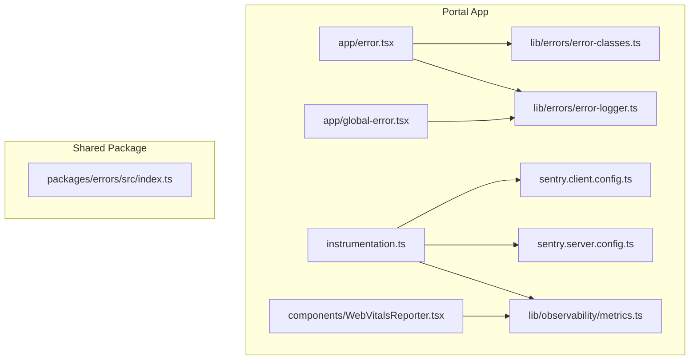
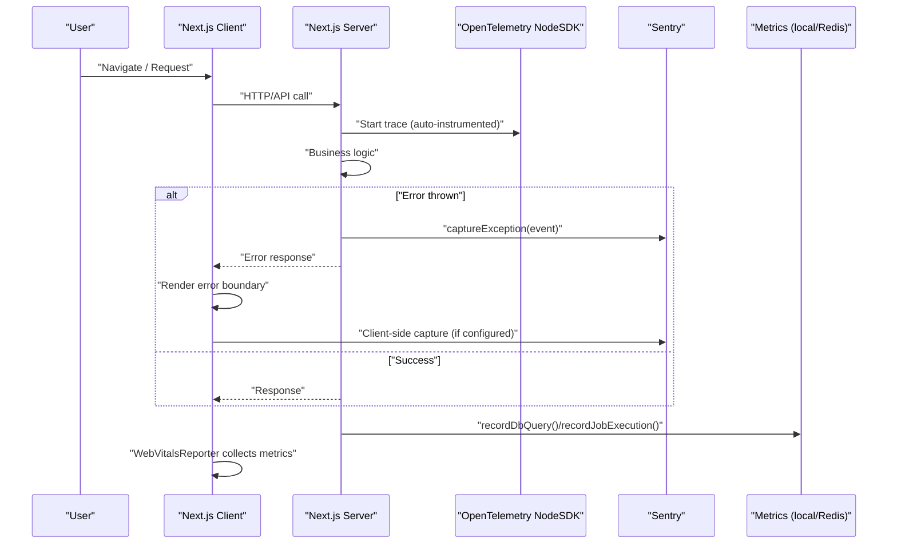
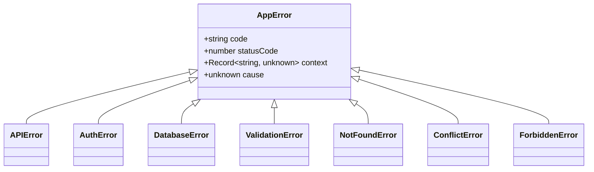
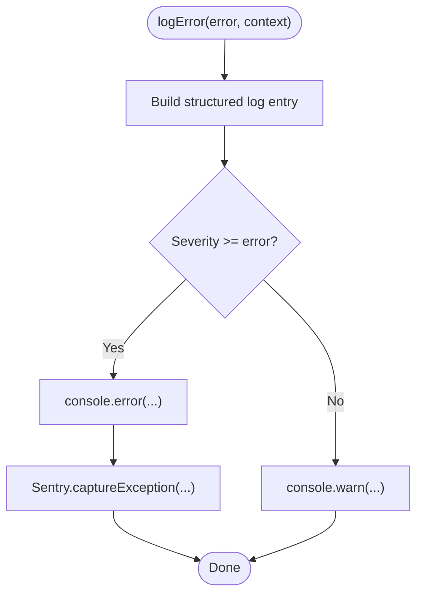
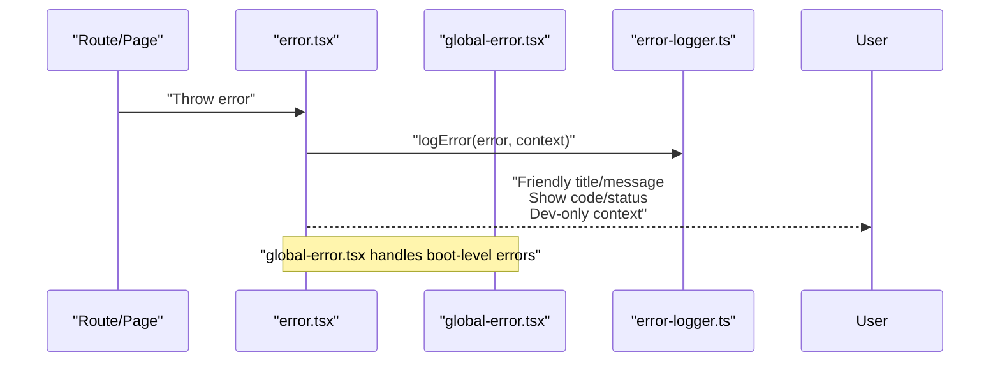
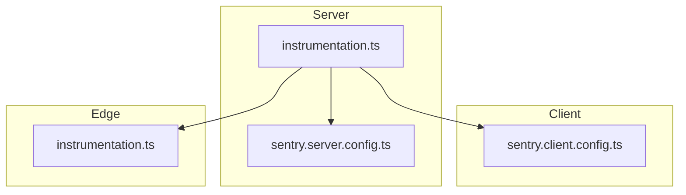
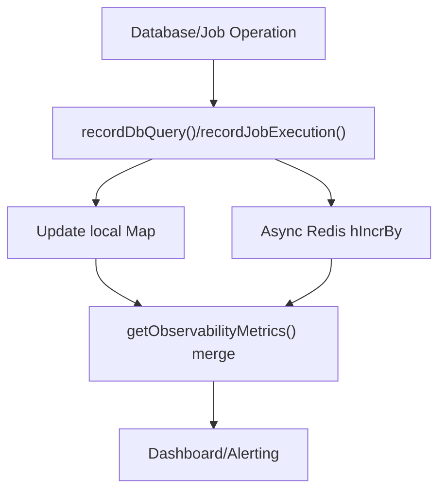
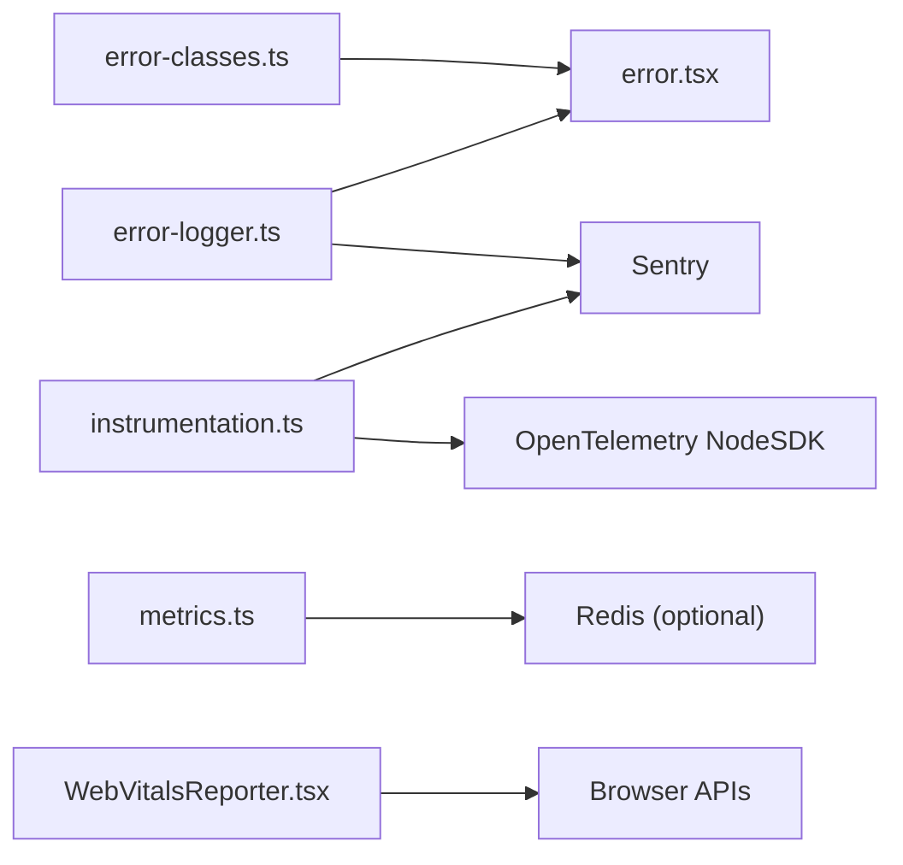

# Error Handling & Monitoring

<cite>
**Referenced Files in This Document**
- [apps/portal/sentry.client.config.ts](file://apps/portal/sentry.client.config.ts)
- [apps/portal/sentry.server.config.ts](file://apps/portal/sentry.server.config.ts)
- [apps/portal/instrumentation.ts](file://apps/portal/instrumentation.ts)
- [apps/portal/app/global-error.tsx](file://apps/portal/app/global-error.tsx)
- [apps/portal/app/error.tsx](file://apps/portal/app/error.tsx)
- [apps/portal/lib/errors/error-classes.ts](file://apps/portal/lib/errors/error-classes.ts)
- [apps/portal/lib/errors/error-logger.ts](file://apps/portal/lib/errors/error-logger.ts)
- [packages/errors/src/index.ts](file://packages/errors/src/index.ts)
- [apps/portal/lib/observability/metrics.ts](file://apps/portal/lib/observability/metrics.ts)
- [apps/portal/components/WebVitalsReporter.tsx](file://apps/portal/components/WebVitalsReporter.tsx)
</cite>

## Table of Contents
1. Introduction
2. Project Structure
3. Core Components
4. Architecture Overview
5. Detailed Component Analysis
6. Dependency Analysis
7. Performance Considerations
8. Troubleshooting Guide
9. Conclusion

## Introduction
This document explains the centralized error handling and monitoring integration across the application. It covers:
- Custom error types and boundaries for user-friendly messages
- Sentry initialization and configuration on client, server, and edge runtimes
- OpenTelemetry tracing setup via instrumentation
- Structured error logging and propagation patterns
- Performance monitoring with Web Vitals and metrics aggregation
- Production monitoring considerations and alerting guidance

The goal is to provide a clear, actionable guide for developers to implement consistent error handling, ensure robust observability, and maintain graceful degradation under failures.

## Project Structure
Error handling and monitoring are implemented primarily within the portal app, with shared error classes also available in a package. Key areas include:
- Error classes and utilities for structured errors and logging
- Next.js error boundaries (root-level and global)
- Sentry initialization for client/server/edge
- OpenTelemetry Node SDK initialization
- Metrics collection and reporting
- Web Vitals reporting component

**Diagram sources**
- [apps/portal/app/error.tsx:1-114](file://apps/portal/app/error.tsx#L1-L114)
- [apps/portal/app/global-error.tsx:1-57](file://apps/portal/app/global-error.tsx#L1-L57)
- [apps/portal/instrumentation.ts:1-61](file://apps/portal/instrumentation.ts#L1-L61)
- [apps/portal/sentry.client.config.ts:1-23](file://apps/portal/sentry.client.config.ts#L1-L23)
- [apps/portal/sentry.server.config.ts:1-25](file://apps/portal/sentry.server.config.ts#L1-L25)
- [apps/portal/lib/errors/error-classes.ts:1-207](file://apps/portal/lib/errors/error-classes.ts#L1-L207)
- [apps/portal/lib/errors/error-logger.ts:1-242](file://apps/portal/lib/errors/error-logger.ts#L1-L242)
- [apps/portal/lib/observability/metrics.ts:1-184](file://apps/portal/lib/observability/metrics.ts#L1-L184)
- [apps/portal/components/WebVitalsReporter.tsx:1-66](file://apps/portal/components/WebVitalsReporter.tsx#L1-L66)
- [packages/errors/src/index.ts:1-335](file://packages/errors/src/index.ts#L1-L335)

**Section sources**
- [apps/portal/app/error.tsx:1-114](file://apps/portal/app/error.tsx#L1-L114)
- [apps/portal/app/global-error.tsx:1-57](file://apps/portal/app/global-error.tsx#L1-L57)
- [apps/portal/instrumentation.ts:1-61](file://apps/portal/instrumentation.ts#L1-L61)
- [apps/portal/sentry.client.config.ts:1-23](file://apps/portal/sentry.client.config.ts#L1-L23)
- [apps/portal/sentry.server.config.ts:1-25](file://apps/portal/sentry.server.config.ts#L1-L25)
- [apps/portal/lib/errors/error-classes.ts:1-207](file://apps/portal/lib/errors/error-classes.ts#L1-L207)
- [apps/portal/lib/errors/error-logger.ts:1-242](file://apps/portal/lib/errors/error-logger.ts#L1-L242)
- [apps/portal/lib/observability/metrics.ts:1-184](file://apps/portal/lib/observability/metrics.ts#L1-L184)
- [apps/portal/components/WebVitalsReporter.tsx:1-66](file://apps/portal/components/WebVitalsReporter.tsx#L1-L66)
- [packages/errors/src/index.ts:1-335](file://packages/errors/src/index.ts#L1-L335)

## Core Components
- Custom error classes: Provide typed, structured errors with codes, status codes, context, and cause. Includes helpers for type guards.
- Error logger: Creates structured log entries, logs to console, and forwards critical errors to Sentry. Provides wrappers for API routes and server actions.
- Error boundaries: Root-level and global error pages render user-friendly messages, show dev-only context, and trigger logging.
- Sentry configuration: Separate client and server configs with sensitive data scrubbing; runtime-specific initialization in instrumentation.
- Observability metrics: In-process metric maps with optional Redis sync for job and database metrics.
- Web Vitals reporter: Collects core web vitals and exposes them for scraping or session storage.

**Section sources**
- [apps/portal/lib/errors/error-classes.ts:1-207](file://apps/portal/lib/errors/error-classes.ts#L1-L207)
- [apps/portal/lib/errors/error-logger.ts:1-242](file://apps/portal/lib/errors/error-logger.ts#L1-L242)
- [apps/portal/app/error.tsx:1-114](file://apps/portal/app/error.tsx#L1-L114)
- [apps/portal/app/global-error.tsx:1-57](file://apps/portal/app/global-error.tsx#L1-L57)
- [apps/portal/sentry.client.config.ts:1-23](file://apps/portal/sentry.client.config.ts#L1-L23)
- [apps/portal/sentry.server.config.ts:1-25](file://apps/portal/sentry.server.config.ts#L1-L25)
- [apps/portal/instrumentation.ts:1-61](file://apps/portal/instrumentation.ts#L1-L61)
- [apps/portal/lib/observability/metrics.ts:1-184](file://apps/portal/lib/observability/metrics.ts#L1-L184)
- [apps/portal/components/WebVitalsReporter.tsx:1-66](file://apps/portal/components/WebVitalsReporter.tsx#L1-L66)

## Architecture Overview
The system integrates three layers:
- Error modeling and boundaries: Centralized error types and UI boundaries for consistent UX and logging.
- Telemetry and tracing: Sentry for error tracking and performance traces; OpenTelemetry Node SDK for request tracing.
- Metrics and performance: Local metric maps with optional Redis aggregation; Web Vitals for frontend performance signals.

**Diagram sources**
- [apps/portal/instrumentation.ts:1-61](file://apps/portal/instrumentation.ts#L1-L61)
- [apps/portal/sentry.client.config.ts:1-23](file://apps/portal/sentry.client.config.ts#L1-L23)
- [apps/portal/sentry.server.config.ts:1-25](file://apps/portal/sentry.server.config.ts#L1-L25)
- [apps/portal/lib/observability/metrics.ts:1-184](file://apps/portal/lib/observability/metrics.ts#L1-L184)
- [apps/portal/components/WebVitalsReporter.tsx:1-66](file://apps/portal/components/WebVitalsReporter.tsx#L1-L66)
- [apps/portal/app/error.tsx:1-114](file://apps/portal/app/error.tsx#L1-L114)

## Detailed Component Analysis

### Custom Error Classes
A hierarchy of domain-specific errors extends a base class, providing:
- Stable error codes and HTTP status codes
- Optional context map for additional debugging info
- Cause chaining for underlying exceptions
- Type guard helpers for safe checks

**Diagram sources**
- [apps/portal/lib/errors/error-classes.ts:1-207](file://apps/portal/lib/errors/error-classes.ts#L1-L207)
- [packages/errors/src/index.ts:1-335](file://packages/errors/src/index.ts#L1-L335)

Key behaviors:
- Default status codes per error type (e.g., validation 400, not found 404, auth 401).
- Context merging from extra constructor arguments for concise call sites.
- Type guards for runtime checks in UI and logging.

**Section sources**
- [apps/portal/lib/errors/error-classes.ts:1-207](file://apps/portal/lib/errors/error-classes.ts#L1-L207)
- [packages/errors/src/index.ts:1-335](file://packages/errors/src/index.ts#L1-L335)

### Error Logger and Propagation Patterns
Structured logging pipeline:
- Create a normalized log entry with timestamp, severity, code, status, message, context, stack, and request metadata.
- Log to console for local debugging.
- Forward only error/fatal severities to Sentry with enriched extra fields.
- Provide wrappers for API routes and server actions that automatically attach request context and rethrow for boundaries.

**Diagram sources**
- [apps/portal/lib/errors/error-logger.ts:1-242](file://apps/portal/lib/errors/error-logger.ts#L1-L242)

Propagation patterns:
- Use withErrorLogging(req, handler) around route handlers to capture URL/method/user/session and rethrow.
- Use withServerActionLogging(handler, actionName) for server actions.
- Error boundaries consume errors and display friendly messages while ensuring logging occurs.

**Section sources**
- [apps/portal/lib/errors/error-logger.ts:1-242](file://apps/portal/lib/errors/error-logger.ts#L1-L242)
- [apps/portal/app/error.tsx:1-114](file://apps/portal/app/error.tsx#L1-L114)

### Error Boundaries and User-Friendly Messages
Root-level and global error pages:
- Detect error types and render appropriate titles/messages.
- Show error codes and status codes for structured errors.
- Display development-only context details.
- Trigger logging before rendering.

**Diagram sources**
- [apps/portal/app/error.tsx:1-114](file://apps/portal/app/error.tsx#L1-L114)
- [apps/portal/app/global-error.tsx:1-57](file://apps/portal/app/global-error.tsx#L1-L57)
- [apps/portal/lib/errors/error-logger.ts:1-242](file://apps/portal/lib/errors/error-logger.ts#L1-L242)

**Section sources**
- [apps/portal/app/error.tsx:1-114](file://apps/portal/app/error.tsx#L1-L114)
- [apps/portal/app/global-error.tsx:1-57](file://apps/portal/app/global-error.tsx#L1-L57)

### Sentry Integration
Initialization points:
- Client config: Sets DSN, environment, sampling rates, and scrubs sensitive values from exception messages.
- Server config: Scrubs sensitive headers like authorization and cookies.
- Instrumentation: Initializes Sentry for nodejs and edge runtimes; sets up OpenTelemetry Node SDK with OTLP exporter when endpoint is configured.

**Diagram sources**
- [apps/portal/sentry.client.config.ts:1-23](file://apps/portal/sentry.client.config.ts#L1-L23)
- [apps/portal/sentry.server.config.ts:1-25](file://apps/portal/sentry.server.config.ts#L1-L25)
- [apps/portal/instrumentation.ts:1-61](file://apps/portal/instrumentation.ts#L1-L61)

Security notes:
- Client-side beforeSend filters out password/token references in exception values.
- Server-side beforeSend redacts sensitive headers.

**Section sources**
- [apps/portal/sentry.client.config.ts:1-23](file://apps/portal/sentry.client.config.ts#L1-L23)
- [apps/portal/sentry.server.config.ts:1-25](file://apps/portal/sentry.server.config.ts#L1-L25)
- [apps/portal/instrumentation.ts:1-61](file://apps/portal/instrumentation.ts#L1-L61)

### OpenTelemetry Tracing
- Dynamically imports Node SDK and auto-instrumentations to avoid bundling native modules.
- Configures OTLP HTTP exporter using an endpoint environment variable.
- Starts the SDK only in nodejs runtime.

Operational guidance:
- Ensure OTEL_EXPORTER_OTLP_ENDPOINT is set in production to enable tracing.
- Service name can be overridden via OTEL_SERVICE_NAME.

**Section sources**
- [apps/portal/instrumentation.ts:1-61](file://apps/portal/instrumentation.ts#L1-L61)

### Metrics and Performance Monitoring
- recordDbQuery and recordJobExecution update in-memory maps and asynchronously increment counters in Redis (fire-and-forget).
- getObservabilityMetrics merges local and Redis data for dashboards.
- WebVitalsReporter attaches metrics to DOM attributes and accumulates in sessionStorage for single-session analysis.

**Diagram sources**
- [apps/portal/lib/observability/metrics.ts:1-184](file://apps/portal/lib/observability/metrics.ts#L1-L184)
- [apps/portal/components/WebVitalsReporter.tsx:1-66](file://apps/portal/components/WebVitalsReporter.tsx#L1-L66)

**Section sources**
- [apps/portal/lib/observability/metrics.ts:1-184](file://apps/portal/lib/observability/metrics.ts#L1-L184)
- [apps/portal/components/WebVitalsReporter.tsx:1-66](file://apps/portal/components/WebVitalsReporter.tsx#L1-L66)

### Graceful Degradation Strategies
- Logging never throws; failures in monitoring are swallowed to avoid impacting app stability.
- Redis writes are fire-and-forget; if unavailable, local metrics remain accurate for the process lifetime.
- Web Vitals attribute setting and sessionStorage updates are wrapped in try/catch to prevent crashes.
- Error boundaries always render a fallback UI even when underlying components fail.

**Section sources**
- [apps/portal/lib/errors/error-logger.ts:1-242](file://apps/portal/lib/errors/error-logger.ts#L1-L242)
- [apps/portal/lib/observability/metrics.ts:1-184](file://apps/portal/lib/observability/metrics.ts#L1-L184)
- [apps/portal/components/WebVitalsReporter.tsx:1-66](file://apps/portal/components/WebVitalsReporter.tsx#L1-L66)
- [apps/portal/app/error.tsx:1-114](file://apps/portal/app/error.tsx#L1-L114)

## Dependency Analysis
- Error boundaries depend on custom error classes and the logger.
- The logger depends on Sentry and uses structured contexts.
- Instrumentation initializes both Sentry and OpenTelemetry based on runtime and environment variables.
- Metrics module optionally depends on Redis for cross-process aggregation.
- Web Vitals reporter is independent but complements overall performance monitoring.

**Diagram sources**
- [apps/portal/lib/errors/error-classes.ts:1-207](file://apps/portal/lib/errors/error-classes.ts#L1-L207)
- [apps/portal/lib/errors/error-logger.ts:1-242](file://apps/portal/lib/errors/error-logger.ts#L1-L242)
- [apps/portal/app/error.tsx:1-114](file://apps/portal/app/error.tsx#L1-L114)
- [apps/portal/instrumentation.ts:1-61](file://apps/portal/instrumentation.ts#L1-L61)
- [apps/portal/lib/observability/metrics.ts:1-184](file://apps/portal/lib/observability/metrics.ts#L1-L184)
- [apps/portal/components/WebVitalsReporter.tsx:1-66](file://apps/portal/components/WebVitalsReporter.tsx#L1-L66)

**Section sources**
- [apps/portal/lib/errors/error-classes.ts:1-207](file://apps/portal/lib/errors/error-classes.ts#L1-L207)
- [apps/portal/lib/errors/error-logger.ts:1-242](file://apps/portal/lib/errors/error-logger.ts#L1-L242)
- [apps/portal/app/error.tsx:1-114](file://apps/portal/app/error.tsx#L1-L114)
- [apps/portal/instrumentation.ts:1-61](file://apps/portal/instrumentation.ts#L1-L61)
- [apps/portal/lib/observability/metrics.ts:1-184](file://apps/portal/lib/observability/metrics.ts#L1-L184)
- [apps/portal/components/WebVitalsReporter.tsx:1-66](file://apps/portal/components/WebVitalsReporter.tsx#L1-L66)

## Performance Considerations
- Sampling rates:
  - Client and server Sentry traces are sampled at reduced rates in production to limit overhead.
  - Development enables full sampling for visibility.
- OpenTelemetry:
  - Auto-instrumentations add minimal overhead; ensure exporter endpoint is configured only where needed.
- Metrics:
  - Prefer async Redis writes to avoid blocking hot paths.
  - For serverless/horizontal deployments, replace global maps with distributed aggregation (e.g., Redis-backed counters).
- Web Vitals:
  - Avoid heavy processing in reporters; DOM attribute updates and sessionStorage are lightweight.

[No sources needed since this section provides general guidance]

## Troubleshooting Guide
Common issues and resolutions:
- Missing Sentry events:
  - Verify DSN and environment variables are set for each runtime.
  - Check beforeSend filters for accidental redaction of relevant data.
- No traces visible:
  - Confirm OTEL_EXPORTER_OTLP_ENDPOINT is configured and reachable.
  - Ensure service name is set for easier filtering.
- High error volume:
  - Adjust tracesSampleRate and replaysOnErrorSampleRate for production.
  - Use error codes and status-based severity to reduce noise.
- Metrics gaps:
  - Validate Redis connectivity; local maps persist until process restart.
  - Use getObservabilityMetrics to inspect merged state.

Operational tips:
- Use error codes and context to correlate logs and traces.
- Leverage dev-only context panels in error boundaries for faster triage.
- Monitor Web Vitals attributes and sessionStorage for performance regressions.

**Section sources**
- [apps/portal/sentry.client.config.ts:1-23](file://apps/portal/sentry.client.config.ts#L1-L23)
- [apps/portal/sentry.server.config.ts:1-25](file://apps/portal/sentry.server.config.ts#L1-L25)
- [apps/portal/instrumentation.ts:1-61](file://apps/portal/instrumentation.ts#L1-L61)
- [apps/portal/lib/observability/metrics.ts:1-184](file://apps/portal/lib/observability/metrics.ts#L1-L184)
- [apps/portal/components/WebVitalsReporter.tsx:1-66](file://apps/portal/components/WebVitalsReporter.tsx#L1-L66)
- [apps/portal/app/error.tsx:1-114](file://apps/portal/app/error.tsx#L1-L114)

## Conclusion
The application implements a cohesive error handling and monitoring strategy:
- Consistent, typed errors with rich context improve diagnostics and UX.
- Centralized logging ensures critical issues reach Sentry without compromising stability.
- Runtime-aware Sentry and OpenTelemetry setups provide comprehensive tracing and error tracking.
- Lightweight metrics and Web Vitals reporting support performance insights and alerting.
Adhering to these patterns will help maintain reliability, observability, and a positive user experience across environments.

[No sources needed since this section summarizes without analyzing specific files]