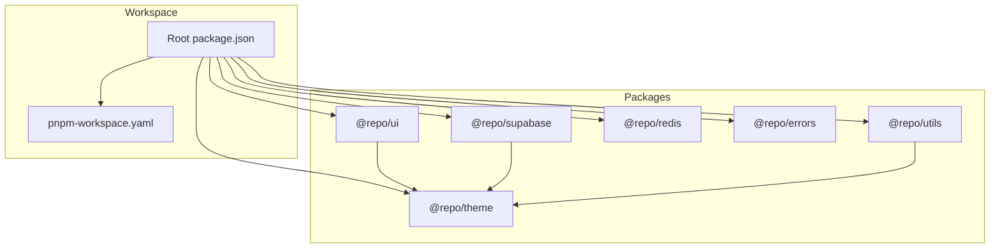
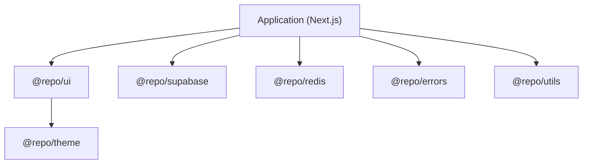
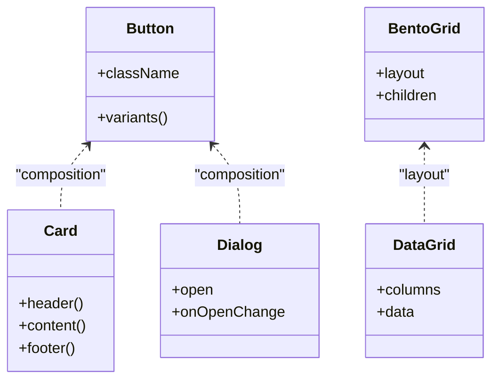
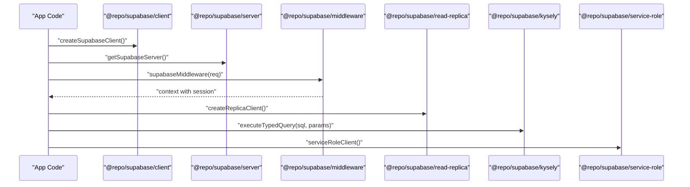
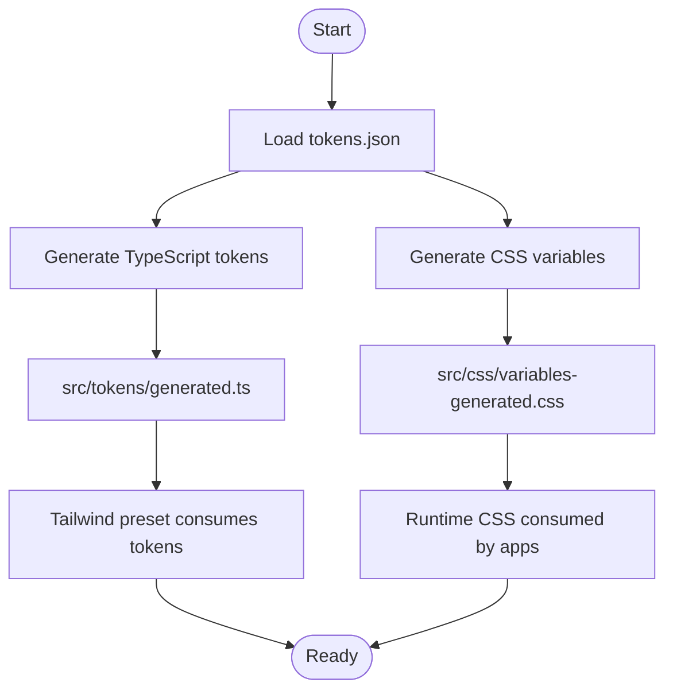
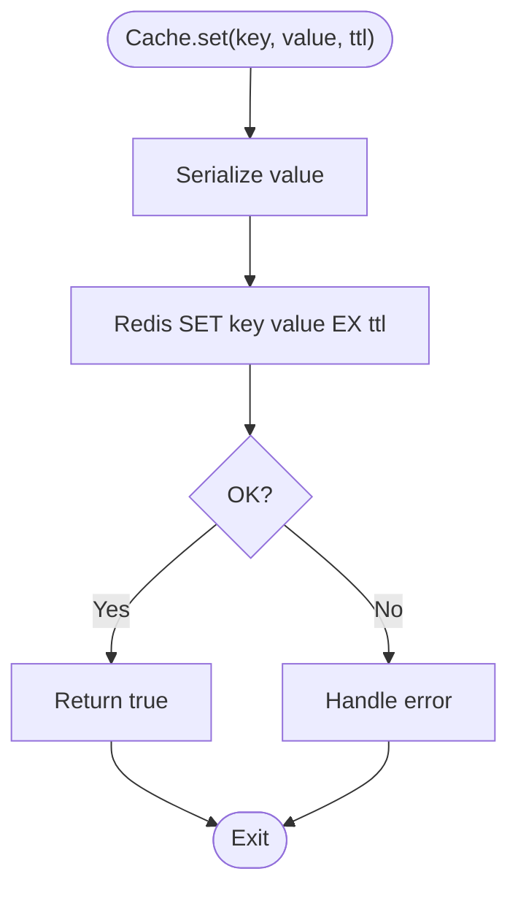
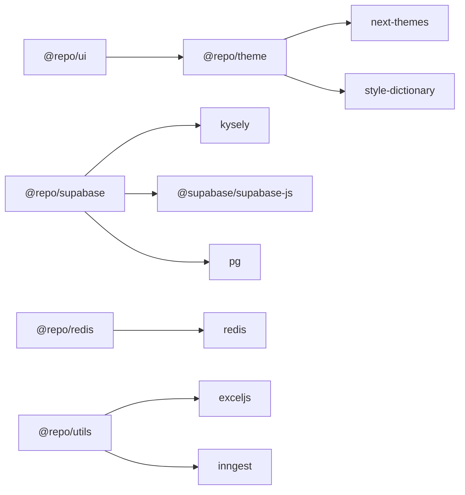

# Shared Packages & Libraries

<cite>
**Referenced Files in This Document**
- [package.json](file://package.json)
- [pnpm-workspace.yaml](file://pnpm-workspace.yaml)
- [packages/ui/package.json](file://packages/ui/package.json)
- [packages/supabase/package.json](file://packages/supabase/package.json)
- [packages/theme/package.json](file://packages/theme/package.json)
- [packages/redis/package.json](file://packages/redis/package.json)
- [packages/errors/package.json](file://packages/errors/package.json)
- [packages/utils/package.json](file://packages/utils/package.json)
- [packages/ui/src/components/ui/button.tsx](file://packages/ui/src/components/ui/button.tsx)
- [packages/ui/src/components/ui/card.tsx](file://packages/ui/src/components/ui/card.tsx)
- [packages/ui/src/components/ui/dialog.tsx](file://packages/ui/src/components/ui/dialog.tsx)
- [packages/ui/src/components/ui/input.tsx](file://packages/ui/src/components/ui/input.tsx)
- [packages/ui/src/components/ui/table.tsx](file://packages/ui/src/components/ui/table.tsx)
- [packages/ui/src/components/ui/tabs.tsx](file://packages/ui/src/components/ui/tabs.tsx)
- [packages/ui/src/components/ui/dropdown-menu.tsx](file://packages/ui/src/components/ui/dropdown-menu.tsx)
- [packages/ui/src/components/ui/bento-grid.tsx](file://packages/ui/src/components/ui/bento-grid.tsx)
- [packages/ui/src/components/ui/data-grid.tsx](file://packages/ui/src/components/ui/data-grid.tsx)
- [packages/ui/src/components/ui/marquee.tsx](file://packages/ui/src/components/ui/marquee.tsx)
- [packages/ui/src/components/ui/animated-number.tsx](file://packages/ui/src/components/ui/animated-number.tsx)
- [packages/ui/src/components/ui/animated-button.tsx](file://packages/ui/src/components/ui/animated-button.tsx)
- [packages/ui/src/components/ui/animated-dialog.tsx](file://packages/ui/src/components/ui/animated-dialog.tsx)
- [packages/ui/src/components/ui/reveal-loader.tsx](file://packages/ui/src/components/ui/reveal-loader.tsx)
- [packages/ui/src/components/ui/dock.tsx](file://packages/ui/src/components/ui/dock.tsx)
- [packages/ui/src/components/ui/hero-video-dialog.tsx](file://packages/ui/src/components/ui/hero-video-dialog.tsx)
- [packages/ui/src/components/GlassCard.tsx](file://packages/ui/src/components/GlassCard.tsx)
- [packages/ui/src/components/PageHeader.tsx](file://packages/ui/src/components/PageHeader.tsx)
- [packages/ui/src/components/KPI.tsx](file://packages/ui/src/components/KPI.tsx)
- [packages/ui/src/components/FormFields.tsx](file://packages/ui/src/components/FormFields.tsx)
- [packages/ui/src/components/WorkflowBuilder.tsx](file://packages/ui/src/components/WorkflowBuilder.tsx)
- [packages/ui/src/components/nodes/PluginNode.tsx](file://packages/ui/src/components/nodes/PluginNode.tsx)
- [packages/ui/src/components/nodes/TriggerNode.tsx](file://packages/ui/src/components/nodes/TriggerNode.tsx)
- [packages/ui/src/components/edges/FlowEdge.tsx](file://packages/ui/src/components/edges/FlowEdge.tsx)
- [packages/ui/src/lib/utils.ts](file://packages/ui/src/lib/utils.ts)
- [packages/ui/src/globals.css](file://packages/ui/src/globals.css)
- [packages/supabase/src/index.ts](file://packages/supabase/src/index.ts)
- [packages/supabase/src/client.ts](file://packages/supabase/src/client.ts)
- [packages/supabase/src/server.ts](file://packages/supabase/src/server.ts)
- [packages/supabase/src/middleware.ts](file://packages/supabase/src/middleware.ts)
- [packages/supabase/src/read-replica.ts](file://packages/supabase/src/read-replica.ts)
- [packages/supabase/src/kysely.ts](file://packages/supabase/src/kysely.ts)
- [packages/supabase/src/service-role.ts](file://packages/supabase/src/service-role.ts)
- [packages/supabase/src/database.types.ts](file://packages/supabase/src/database.types.ts)
- [packages/supabase/src/tracing.ts](file://packages/supabase/src/tracing.ts)
- [packages/theme/src/index.ts](file://packages/theme/src/index.ts)
- [packages/theme/src/react/index.ts](file://packages/theme/src/react/index.ts)
- [packages/theme/src/react/theme-provider.tsx](file://packages/theme/src/react/theme-provider.tsx)
- [packages/theme/src/react/theme-toggle.tsx](file://packages/theme/src/react/theme-toggle.tsx)
- [packages/theme/src/tailwind/preset.ts](file://packages/theme/src/tailwind/preset.ts)
- [packages/theme/src/tokens/index.ts](file://packages/theme/src/tokens/index.ts)
- [packages/theme/src/tokens/generated.ts](file://packages/theme/src/tokens/generated.ts)
- [packages/theme/src/tokens/colors.ts](file://packages/theme/src/tokens/colors.ts)
- [packages/theme/src/tokens/radii.ts](file://packages/theme/src/tokens/radii.ts)
- [packages/theme/src/tokens/shadows.ts](file://packages/theme/src/tokens/shadows.ts)
- [packages/theme/src/tokens/typography.ts](file://packages/theme/src/tokens/typography.ts)
- [packages/theme/src/tokens/motion.ts](file://packages/theme/src/tokens/motion.ts)
- [packages/theme/src/css/index.css](file://packages/theme/src/css/index.css)
- [packages/theme/src/css/variables.css](file://packages/theme/src/css/variables.css)
- [packages/theme/src/css/animations.css](file://packages/theme/src/css/animations.css)
- [packages/theme/src/css/transitions.css](file://packages/theme/src/css/transitions.css)
- [packages/theme/src/css/focus.css](file://packages/theme/src/css/focus.css)
- [packages/theme/src/css/glass.css](file://packages/theme/src/css/glass.css)
- [packages/theme/src/css/reset.css](file://packages/theme/src/css/reset.css)
- [packages/redis/src/index.ts](file://packages/redis/src/index.ts)
- [packages/redis/src/client.ts](file://packages/redis/src/client.ts)
- [packages/redis/src/cache.ts](file://packages/redis/src/cache.ts)
- [packages/redis/src/invalidation.ts](file://packages/redis/src/invalidation.ts)
- [packages/redis/src/registry.ts](file://packages/redis/src/registry.ts)
- [packages/redis/src/stats.ts](file://packages/redis/src/stats.ts)
- [packages/errors/src/index.ts](file://packages/errors/src/index.ts)
- [packages/utils/src/index.ts](file://packages/utils/src/index.ts)
- [packages/utils/src/client.ts](file://packages/utils/src/client.ts)
- [packages/utils/src/inngest.ts](file://packages/utils/src/inngest.ts)
- [packages/utils/src/excel.ts](file://packages/utils/src/excel.ts)
- [packages/utils/src/n8n.ts](file://packages/utils/src/n8n.ts)
</cite>

## Table of Contents
1. [Introduction](#introduction)
2. [Project Structure](#project-structure)
3. [Core Components](#core-components)
4. [Architecture Overview](#architecture-overview)
5. [Detailed Component Analysis](#detailed-component-analysis)
6. [Dependency Analysis](#dependency-analysis)
7. [Performance Considerations](#performance-considerations)
8. [Troubleshooting Guide](#troubleshooting-guide)
9. [Conclusion](#conclusion)
10. [Appendices](#appendices)

## Introduction
This document describes the shared packages and libraries that provide reusable functionality across the monorepo. It focuses on:
- UI component library built on shadcn-style primitives
- Supabase client wrappers with typed database access
- Theme system with design tokens
- Redis caching utilities
- Error handling patterns
- Utility functions

It also covers package dependencies, version management, contribution guidelines, examples of usage, extending existing functionality, creating new shared modules, publishing, dependency resolution, and build optimization strategies.

## Project Structure
The shared packages live under packages/. Each package is a standalone npm module with its own exports, scripts, and types. The root workspace configures pnpm workspaces and catalogs to enforce consistent versions across apps and packages.

**Diagram sources**
- [package.json:1-96](file://package.json#L1-L96)
- [pnpm-workspace.yaml:1-33](file://pnpm-workspace.yaml#L1-L33)
- [packages/ui/package.json:1-91](file://packages/ui/package.json#L1-L91)
- [packages/supabase/package.json:1-41](file://packages/supabase/package.json#L1-L41)
- [packages/theme/package.json:1-46](file://packages/theme/package.json#L1-L46)
- [packages/redis/package.json:1-28](file://packages/redis/package.json#L1-L28)
- [packages/errors/package.json:1-10](file://packages/errors/package.json#L1-L10)
- [packages/utils/package.json:1-25](file://packages/utils/package.json#L1-L25)

**Section sources**
- [package.json:1-96](file://package.json#L1-L96)
- [pnpm-workspace.yaml:1-33](file://pnpm-workspace.yaml#L1-L33)

## Core Components
- @repo/ui: A React component library exposing shadcn-style primitives and higher-level components. Exposes CSS, Tailwind config, PostCSS config, and granular component entry points.
- @repo/supabase: Typed Supabase client wrappers for client, server, middleware, read replicas, Kysely integration, and service role access.
- @repo/theme: Design tokens, React theme provider, Tailwind preset, and generated CSS/TS outputs.
- @repo/redis: Redis client and cache helpers with invalidation and stats.
- @repo/errors: Centralized error types and utilities.
- @repo/utils: Cross-cutting utilities including Excel export, Inngest setup, and N8N helpers.

**Section sources**
- [packages/ui/package.json:1-91](file://packages/ui/package.json#L1-L91)
- [packages/supabase/package.json:1-41](file://packages/supabase/package.json#L1-L41)
- [packages/theme/package.json:1-46](file://packages/theme/package.json#L1-L46)
- [packages/redis/package.json:1-28](file://packages/redis/package.json#L1-L28)
- [packages/errors/package.json:1-10](file://packages/errors/package.json#L1-L10)
- [packages/utils/package.json:1-25](file://packages/utils/package.json#L1-L25)

## Architecture Overview
High-level interactions between shared packages and applications:

[No sources needed since this diagram shows conceptual workflow, not actual code structure]

## Detailed Component Analysis

### UI Component Library (@repo/ui)
Overview:
- Provides shadcn-style primitives and application-specific components.
- Exposes individual components via package exports for tree-shaking and precise imports.
- Integrates with @repo/theme for tokens and styling.
- Uses Radix UI primitives, class-variance-authority, clsx, tailwind-merge, framer-motion, and lucide-react.

Key exported components include:
- Primitives: button, card, dialog, input, table, tabs, dropdown-menu, scroll-area, separator
- Enhanced: bento-grid, data-grid, marquee, animated-number, animated-button, animated-dialog, reveal-loader, dock, hero-video-dialog
- Application-level: GlassCard, PageHeader, KPI, FormFields, WorkflowBuilder, MacMenuBar, MacTitleBar
- Nodes/Edges for flow builders: PluginNode, TriggerNode, FlowEdge

Usage example paths:
- Import a primitive: [button.tsx](file://packages/ui/src/components/ui/button.tsx)
- Import an enhanced component: [data-grid.tsx](file://packages/ui/src/components/ui/data-grid.tsx)
- Import app-level component: [GlassCard.tsx](file://packages/ui/src/components/GlassCard.tsx)

Extending existing components:
- Create a new variant using class-variance-authority and merge classes with tailwind-merge.
- Compose primitives to build higher-order components.
- Add new entries in package.json exports for discoverability.

Creating new shared modules:
- Place source under src/components or src/lib.
- Export from index files and add explicit exports in package.json for stable API surface.
- Ensure peerDependencies are declared (e.g., react).

Build and lint:
- Scripts: lint, type-check, ui (shadcn CLI), lint:css.
- Side effects configured for CSS.

**Diagram sources**
- [packages/ui/src/components/ui/button.tsx](file://packages/ui/src/components/ui/button.tsx)
- [packages/ui/src/components/ui/card.tsx](file://packages/ui/src/components/ui/card.tsx)
- [packages/ui/src/components/ui/dialog.tsx](file://packages/ui/src/components/ui/dialog.tsx)
- [packages/ui/src/components/ui/bento-grid.tsx](file://packages/ui/src/components/ui/bento-grid.tsx)
- [packages/ui/src/components/ui/data-grid.tsx](file://packages/ui/src/components/ui/data-grid.tsx)

**Section sources**
- [packages/ui/package.json:1-91](file://packages/ui/package.json#L1-L91)
- [packages/ui/src/components/ui/button.tsx](file://packages/ui/src/components/ui/button.tsx)
- [packages/ui/src/components/ui/card.tsx](file://packages/ui/src/components/ui/card.tsx)
- [packages/ui/src/components/ui/dialog.tsx](file://packages/ui/src/components/ui/dialog.tsx)
- [packages/ui/src/components/ui/input.tsx](file://packages/ui/src/components/ui/input.tsx)
- [packages/ui/src/components/ui/table.tsx](file://packages/ui/src/components/ui/table.tsx)
- [packages/ui/src/components/ui/tabs.tsx](file://packages/ui/src/components/ui/tabs.tsx)
- [packages/ui/src/components/ui/dropdown-menu.tsx](file://packages/ui/src/components/ui/dropdown-menu.tsx)
- [packages/ui/src/components/ui/bento-grid.tsx](file://packages/ui/src/components/ui/bento-grid.tsx)
- [packages/ui/src/components/ui/data-grid.tsx](file://packages/ui/src/components/ui/data-grid.tsx)
- [packages/ui/src/components/ui/marquee.tsx](file://packages/ui/src/components/ui/marquee.tsx)
- [packages/ui/src/components/ui/animated-number.tsx](file://packages/ui/src/components/ui/animated-number.tsx)
- [packages/ui/src/components/ui/animated-button.tsx](file://packages/ui/src/components/ui/animated-button.tsx)
- [packages/ui/src/components/ui/animated-dialog.tsx](file://packages/ui/src/components/ui/animated-dialog.tsx)
- [packages/ui/src/components/ui/reveal-loader.tsx](file://packages/ui/src/components/ui/reveal-loader.tsx)
- [packages/ui/src/components/ui/dock.tsx](file://packages/ui/src/components/ui/dock.tsx)
- [packages/ui/src/components/ui/hero-video-dialog.tsx](file://packages/ui/src/components/ui/hero-video-dialog.tsx)
- [packages/ui/src/components/GlassCard.tsx](file://packages/ui/src/components/GlassCard.tsx)
- [packages/ui/src/components/PageHeader.tsx](file://packages/ui/src/components/PageHeader.tsx)
- [packages/ui/src/components/KPI.tsx](file://packages/ui/src/components/KPI.tsx)
- [packages/ui/src/components/FormFields.tsx](file://packages/ui/src/components/FormFields.tsx)
- [packages/ui/src/components/WorkflowBuilder.tsx](file://packages/ui/src/components/WorkflowBuilder.tsx)
- [packages/ui/src/components/nodes/PluginNode.tsx](file://packages/ui/src/components/nodes/PluginNode.tsx)
- [packages/ui/src/components/nodes/TriggerNode.tsx](file://packages/ui/src/components/nodes/TriggerNode.tsx)
- [packages/ui/src/components/edges/FlowEdge.tsx](file://packages/ui/src/components/edges/FlowEdge.tsx)
- [packages/ui/src/lib/utils.ts](file://packages/ui/src/lib/utils.ts)
- [packages/ui/src/globals.css](file://packages/ui/src/globals.css)

### Supabase Client Wrappers (@repo/supabase)
Overview:
- Provides typed clients for browser and Node environments.
- Includes middleware helper for Next.js request context.
- Read replica support for scaling reads.
- Kysely integration for strongly-typed SQL queries.
- Service role client for privileged operations.
- OpenTelemetry tracing hooks.

Exports:
- . (index), ./client, ./server, ./middleware, ./read-replica, ./kysely, ./service-role

Typical flows:
- Client initialization in browser vs server contexts
- Middleware injection for authenticated requests
- Kysely schema-driven queries

**Diagram sources**
- [packages/supabase/src/client.ts](file://packages/supabase/src/client.ts)
- [packages/supabase/src/server.ts](file://packages/supabase/src/server.ts)
- [packages/supabase/src/middleware.ts](file://packages/supabase/src/middleware.ts)
- [packages/supabase/src/read-replica.ts](file://packages/supabase/src/read-replica.ts)
- [packages/supabase/src/kysely.ts](file://packages/supabase/src/kysely.ts)
- [packages/supabase/src/service-role.ts](file://packages/supabase/src/service-role.ts)

**Section sources**
- [packages/supabase/package.json:1-41](file://packages/supabase/package.json#L1-L41)
- [packages/supabase/src/index.ts](file://packages/supabase/src/index.ts)
- [packages/supabase/src/client.ts](file://packages/supabase/src/client.ts)
- [packages/supabase/src/server.ts](file://packages/supabase/src/server.ts)
- [packages/supabase/src/middleware.ts](file://packages/supabase/src/middleware.ts)
- [packages/supabase/src/read-replica.ts](file://packages/supabase/src/read-replica.ts)
- [packages/supabase/src/kysely.ts](file://packages/supabase/src/kysely.ts)
- [packages/supabase/src/service-role.ts](file://packages/supabase/src/service-role.ts)
- [packages/supabase/src/database.types.ts](file://packages/supabase/src/database.types.ts)
- [packages/supabase/src/tracing.ts](file://packages/supabase/src/tracing.ts)

### Theme System (@repo/theme)
Overview:
- Centralizes design tokens (colors, radii, shadows, typography, motion).
- Generates TypeScript and CSS outputs for consistent theming.
- Provides React provider and toggle components.
- Exposes a Tailwind preset for seamless integration.

Exports:
- . (index), ./css, ./tokens, ./react, ./tailwind, ./motion

Token generation and validation:
- Build script runs Style Dictionary and token generators.
- Lint and validate commands ensure token integrity.

**Diagram sources**
- [packages/theme/package.json:1-46](file://packages/theme/package.json#L1-L46)
- [packages/theme/src/tokens/index.ts](file://packages/theme/src/tokens/index.ts)
- [packages/theme/src/tokens/generated.ts](file://packages/theme/src/tokens/generated.ts)
- [packages/theme/src/tailwind/preset.ts](file://packages/theme/src/tailwind/preset.ts)
- [packages/theme/src/css/index.css](file://packages/theme/src/css/index.css)
- [packages/theme/src/css/variables.css](file://packages/theme/src/css/variables.css)

**Section sources**
- [packages/theme/package.json:1-46](file://packages/theme/package.json#L1-L46)
- [packages/theme/src/index.ts](file://packages/theme/src/index.ts)
- [packages/theme/src/react/index.ts](file://packages/theme/src/react/index.ts)
- [packages/theme/src/react/theme-provider.tsx](file://packages/theme/src/react/theme-provider.tsx)
- [packages/theme/src/react/theme-toggle.tsx](file://packages/theme/src/react/theme-toggle.tsx)
- [packages/theme/src/tailwind/preset.ts](file://packages/theme/src/tailwind/preset.ts)
- [packages/theme/src/tokens/index.ts](file://packages/theme/src/tokens/index.ts)
- [packages/theme/src/tokens/generated.ts](file://packages/theme/src/tokens/generated.ts)
- [packages/theme/src/tokens/colors.ts](file://packages/theme/src/tokens/colors.ts)
- [packages/theme/src/tokens/radii.ts](file://packages/theme/src/tokens/radii.ts)
- [packages/theme/src/tokens/shadows.ts](file://packages/theme/src/tokens/shadows.ts)
- [packages/theme/src/tokens/typography.ts](file://packages/theme/src/tokens/typography.ts)
- [packages/theme/src/tokens/motion.ts](file://packages/theme/src/tokens/motion.ts)
- [packages/theme/src/css/index.css](file://packages/theme/src/css/index.css)
- [packages/theme/src/css/variables.css](file://packages/theme/src/css/variables.css)
- [packages/theme/src/css/animations.css](file://packages/theme/src/css/animations.css)
- [packages/theme/src/css/transitions.css](file://packages/theme/src/css/transitions.css)
- [packages/theme/src/css/focus.css](file://packages/theme/src/css/focus.css)
- [packages/theme/src/css/glass.css](file://packages/theme/src/css/glass.css)
- [packages/theme/src/css/reset.css](file://packages/theme/src/css/reset.css)

### Redis Caching Utilities (@repo/redis)
Overview:
- Provides a typed Redis client wrapper.
- Cache helpers for get/set with TTL and serialization.
- Invalidation utilities for cache busting.
- Registry for named caches and stats tracking.

Exports:
- . (index), ./client, ./cache

Typical usage:
- Initialize client once per process.
- Use cache.get/set for key-value storage.
- Invalidate keys based on domain events.

**Diagram sources**
- [packages/redis/src/cache.ts](file://packages/redis/src/cache.ts)
- [packages/redis/src/client.ts](file://packages/redis/src/client.ts)

**Section sources**
- [packages/redis/package.json:1-28](file://packages/redis/package.json#L1-L28)
- [packages/redis/src/index.ts](file://packages/redis/src/index.ts)
- [packages/redis/src/client.ts](file://packages/redis/src/client.ts)
- [packages/redis/src/cache.ts](file://packages/redis/src/cache.ts)
- [packages/redis/src/invalidation.ts](file://packages/redis/src/invalidation.ts)
- [packages/redis/src/registry.ts](file://packages/redis/src/registry.ts)
- [packages/redis/src/stats.ts](file://packages/redis/src/stats.ts)

### Error Handling Patterns (@repo/errors)
Overview:
- Centralized error types and utilities for consistent error shapes across packages and apps.
- Designed to integrate with monitoring and logging systems.

Usage:
- Import error constructors and helpers.
- Wrap async operations and throw typed errors.
- Map to user-friendly messages at boundaries.

**Section sources**
- [packages/errors/package.json:1-10](file://packages/errors/package.json#L1-L10)
- [packages/errors/src/index.ts](file://packages/errors/src/index.ts)

### Utility Functions (@repo/utils)
Overview:
- Cross-cutting utilities for common tasks.
- Includes Excel export helpers, Inngest configuration, and N8N integrations.

Exports:
- . (index), ./client, ./inngest, ./excel, ./n8n

Usage:
- Import specific utilities to minimize bundle size.
- Configure Inngest client and handlers centrally.

**Section sources**
- [packages/utils/package.json:1-25](file://packages/utils/package.json#L1-L25)
- [packages/utils/src/index.ts](file://packages/utils/src/index.ts)
- [packages/utils/src/client.ts](file://packages/utils/src/client.ts)
- [packages/utils/src/inngest.ts](file://packages/utils/src/inngest.ts)
- [packages/utils/src/excel.ts](file://packages/utils/src/excel.ts)
- [packages/utils/src/n8n.ts](file://packages/utils/src/n8n.ts)

## Dependency Analysis
Workspace and catalog management:
- pnpm workspaces include apps/* and packages/*.
- Catalog enforces consistent versions for shared dependencies (React, Tailwind, Supabase, Zod, etc.).
- Root overrides pin vulnerable or critical transitive dependencies.

Package interdependencies:
- @repo/ui depends on @repo/theme.
- @repo/supabase depends on @supabase/supabase-js, kysely, pg, and OpenTelemetry API.
- @repo/theme depends on next-themes and style-dictionary.
- @repo/redis depends on redis.
- @repo/utils depends on exceljs and inngest.

**Diagram sources**
- [packages/ui/package.json:1-91](file://packages/ui/package.json#L1-L91)
- [packages/supabase/package.json:1-41](file://packages/supabase/package.json#L1-L41)
- [packages/theme/package.json:1-46](file://packages/theme/package.json#L1-L46)
- [packages/redis/package.json:1-28](file://packages/redis/package.json#L1-L28)
- [packages/utils/package.json:1-25](file://packages/utils/package.json#L1-L25)
- [pnpm-workspace.yaml:1-33](file://pnpm-workspace.yaml#L1-L33)
- [package.json:1-96](file://package.json#L1-L96)

**Section sources**
- [pnpm-workspace.yaml:1-33](file://pnpm-workspace.yaml#L1-L33)
- [package.json:1-96](file://package.json#L1-L96)
- [packages/ui/package.json:1-91](file://packages/ui/package.json#L1-L91)
- [packages/supabase/package.json:1-41](file://packages/supabase/package.json#L1-L41)
- [packages/theme/package.json:1-46](file://packages/theme/package.json#L1-L46)
- [packages/redis/package.json:1-28](file://packages/redis/package.json#L1-L28)
- [packages/utils/package.json:1-25](file://packages/utils/package.json#L1-L25)

## Performance Considerations
- Prefer importing specific components from @repo/ui to enable tree-shaking.
- Use read replicas via @repo/supabase for high-read workloads.
- Apply Redis caching for expensive computations and frequently accessed data; use invalidation to keep consistency.
- Leverage theme tokens to avoid runtime style recalculations.
- Keep peerDependencies aligned with workspace catalogs to prevent duplicate bundles.

[No sources needed since this section provides general guidance]

## Troubleshooting Guide
Common issues and resolutions:
- Missing environment variables for Supabase or Redis: verify env configuration in apps and services.
- Token generation failures in @repo/theme: run linters and validators before committing changes.
- Duplicate React versions: ensure catalogs and peerDependencies match workspace settings.
- Redis connection errors: check network reachability and credentials.

Operational checks:
- Run quality gate: lint, type-check, tests, token validation, knip.
- Use syncpack to detect mismatches and fix them automatically.

**Section sources**
- [package.json:1-96](file://package.json#L1-L96)
- [packages/theme/package.json:1-46](file://packages/theme/package.json#L1-L46)
- [packages/redis/package.json:1-28](file://packages/redis/package.json#L1-L28)

## Conclusion
The shared packages provide a cohesive foundation for UI, data access, theme, caching, errors, and utilities. By following the outlined usage patterns, extending mechanisms, and adhering to workspace policies, teams can maintain consistency, improve performance, and accelerate feature development across the monorepo.

[No sources needed since this section summarizes without analyzing specific files]

## Appendices

### Package Dependencies and Version Management
- Workspace includes apps/* and packages/*.
- Catalog centralizes versions for core libraries (React, Tailwind, Supabase, Zod, Zustand, etc.).
- Root overrides secure or stabilize critical transitive dependencies.
- Use syncpack to audit and align versions.

**Section sources**
- [pnpm-workspace.yaml:1-33](file://pnpm-workspace.yaml#L1-L33)
- [package.json:1-96](file://package.json#L1-L96)

### Contribution Guidelines
- Follow linting and formatting rules enforced by root scripts.
- Validate tokens and CSS in @repo/theme before merging.
- Keep package exports minimal and stable; prefer explicit path exports.
- Update catalog when introducing new shared dependencies.

**Section sources**
- [package.json:1-96](file://package.json#L1-L96)
- [packages/theme/package.json:1-46](file://packages/theme/package.json#L1-L46)

### Examples of Using Shared Packages
- UI: import components directly from @repo/ui exports (e.g., Button, Card, DataGrid).
- Supabase: initialize client/server/middleware and use Kysely for typed queries.
- Theme: wrap app with theme provider and consume tokens via Tailwind preset.
- Redis: set/get cached values and invalidate keys on mutations.
- Utils: use Excel export and Inngest helpers.

**Section sources**
- [packages/ui/package.json:1-91](file://packages/ui/package.json#L1-L91)
- [packages/supabase/src/index.ts](file://packages/supabase/src/index.ts)
- [packages/theme/src/react/index.ts](file://packages/theme/src/react/index.ts)
- [packages/redis/src/index.ts](file://packages/redis/src/index.ts)
- [packages/utils/src/index.ts](file://packages/utils/src/index.ts)

### Extending Existing Functionality
- UI: create new components under src/components and add exports in package.json.
- Supabase: extend Kysely schema and add typed query helpers.
- Theme: update tokens and regenerate outputs; adjust Tailwind preset if needed.
- Redis: add new cache strategies or registry entries.
- Utils: add focused utility modules and export selectively.

**Section sources**
- [packages/ui/package.json:1-91](file://packages/ui/package.json#L1-L91)
- [packages/supabase/src/kysely.ts](file://packages/supabase/src/kysely.ts)
- [packages/theme/src/tailwind/preset.ts](file://packages/theme/src/tailwind/preset.ts)
- [packages/redis/src/registry.ts](file://packages/redis/src/registry.ts)
- [packages/utils/src/index.ts](file://packages/utils/src/index.ts)

### Creating New Shared Modules
- Define clear public API via package.json exports.
- Provide TypeScript definitions and minimal peerDependencies.
- Include scripts for lint/type-check and optional build steps.
- Document usage and examples in package README.

**Section sources**
- [packages/ui/package.json:1-91](file://packages/ui/package.json#L1-L91)
- [packages/supabase/package.json:1-41](file://packages/supabase/package.json#L1-L41)
- [packages/theme/package.json:1-46](file://packages/theme/package.json#L1-L46)
- [packages/redis/package.json:1-28](file://packages/redis/package.json#L1-L28)
- [packages/utils/package.json:1-25](file://packages/utils/package.json#L1-L25)

### Publishing and Dependency Resolution
- Packages are marked private; publish only when explicitly required.
- Use pnpm workspaces for local linking and consistent dependency graphs.
- Align versions via catalogs and syncpack to avoid drift.
- For external publishing, configure appropriate main/types/exports fields and CI steps.

**Section sources**
- [pnpm-workspace.yaml:1-33](file://pnpm-workspace.yaml#L1-L33)
- [package.json:1-96](file://package.json#L1-L96)
- [packages/ui/package.json:1-91](file://packages/ui/package.json#L1-L91)
- [packages/supabase/package.json:1-41](file://packages/supabase/package.json#L1-L41)
- [packages/theme/package.json:1-46](file://packages/theme/package.json#L1-L46)
- [packages/redis/package.json:1-28](file://packages/redis/package.json#L1-L28)
- [packages/utils/package.json:1-25](file://packages/utils/package.json#L1-L25)

### Build Optimization Strategies
- Tree-shake UI components by importing exact paths.
- Avoid bundling heavy utilities unless necessary.
- Use read replicas and caching to reduce DB load.
- Pre-generate theme tokens and CSS to minimize runtime overhead.

[No sources needed since this section provides general guidance]